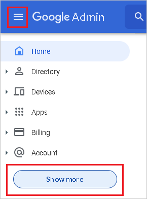
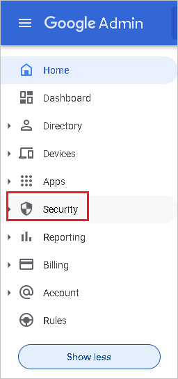
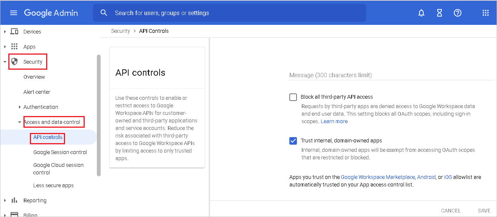
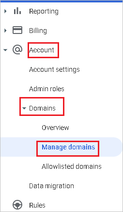
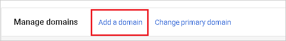
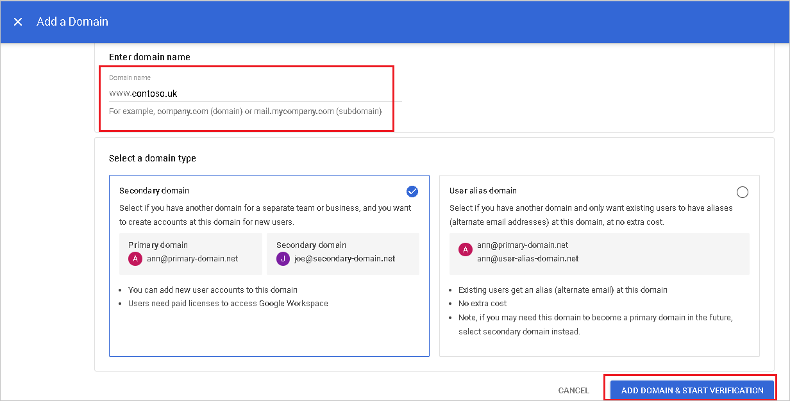
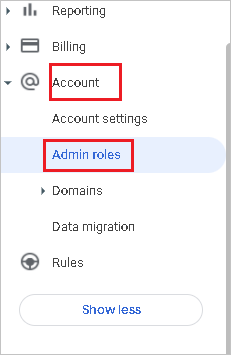
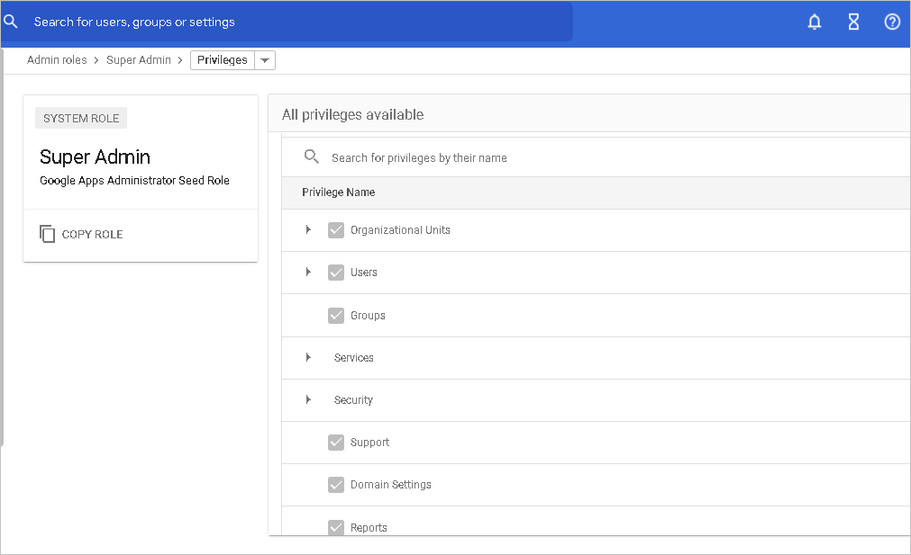

# Tutorial: Configure G Suite for automatic user provisioning

This tutorial describes the steps you need to perform in both G Suite and Azure Active Directory (Azure AD) to configure automatic user provisioning. When configured, Azure AD automatically provisions and deprovisions users and groups to [G Suite](https://gsuite.google.com/) using the Azure AD Provisioning service. For important details on what this service does, how it works, and frequently asked questions, see [Automate user provisioning and deprovisioning to SaaS applications with Azure Active Directory](../app-provisioning/user-provisioning.md). 

> [!NOTE]
> This tutorial describes a connector built on top of the Azure AD User Provisioning Service. For important details on what this service does, how it works, and frequently asked questions, see [Automate user provisioning and deprovisioning to SaaS applications with Azure Active Directory](../app-provisioning/user-provisioning.md).

## Capabilities supported
> [!div class="checklist"]
> * Create users in G Suite
> * Remove users in G Suite when they do not require access anymore (note: removing a user from the sync scope will not result in deletion of the object in GSuite)
> * Keep user attributes synchronized between Azure AD and G Suite
> * Provision groups and group memberships in G Suite
> * [Single sign-on](./google-apps-tutorial.md) to G Suite (recommended)

## Prerequisites

The scenario outlined in this tutorial assumes that you already have the following prerequisites:

* [An Azure AD tenant](../develop/quickstart-create-new-tenant.md) 
* A user account in Azure AD with [permission](../roles/permissions-reference.md) to configure provisioning (for example, Application Administrator, Cloud Application administrator, Application Owner, or Global Administrator). 
* [A G Suite tenant](https://gsuite.google.com/pricing.html)
* A user account on a G Suite with Admin permissions.

## Step 1. Plan your provisioning deployment
1. Learn about [how the provisioning service works](../app-provisioning/user-provisioning.md).
2. Determine who will be in [scope for provisioning](../app-provisioning/define-conditional-rules-for-provisioning-user-accounts.md).
3. Determine what data to [map between Azure AD and G Suite](../app-provisioning/customize-application-attributes.md). 

## Step 2. Configure G Suite to support provisioning with Azure AD

Before configuring G Suite for automatic user provisioning with Azure AD, you need to enable SCIM provisioning on G Suite.

1. Sign in to the [G Suite Admin console](https://admin.google.com/) with your administrator account, then click on **Main menu** and then select **Security**. If you don't see it, it might be hidden under the **Show More** menu.

    
    
    

1. Navigate to **Security -> Access and data control -> API Controls** .Select the check box **Trust internal,domain-owned apps** and then click **SAVE**

    

    > [!IMPORTANT]
    > For every user that you intend to provision to G Suite, their user name in Azure AD **must** be tied to a custom domain. For example, user names that look like bob@contoso.onmicrosoft.com are not accepted by G Suite. On the other hand, bob@contoso.com is accepted. You can change an existing user's domain by following the instructions [here](../fundamentals/add-custom-domain.md).

1. Once you have added and verified your desired custom domains with Azure AD, you must verify them again with G Suite. To verify domains in G Suite, refer to the following steps:

    1. In the [G Suite Admin Console](https://admin.google.com/), navigate to **Account -> Domains -> Manage Domains**.

        

    1. In the Manage Domain page, click on **Add a domain**.

        

    1. In the Add Domain page, type in the name of the domain that you want to add.

        

    1. Select **ADD DOMAIN & START VERIFICATION**. Then follow the steps to verify that you own the domain name. For comprehensive instructions on how to verify your domain with Google, see [Verify your site ownership](https://support.google.com/webmasters/answer/35179).

    1. Repeat the preceding steps for any more domains that you intend to add to G Suite.

1. Next, determine which admin account you want to use to manage user provisioning in G Suite. Navigate to **Account->Admin roles**.

    

1. For the **Admin role** of that account, edit the **Privileges** for that role. Make sure to enable all **Admin API Privileges** so that this account can be used for provisioning.

    

## Step 3. Add G Suite from the Azure AD application gallery

Add G Suite from the Azure AD application gallery to start managing provisioning to G Suite. If you have previously setup G Suite for SSO, you can use the same application. However it's recommended that you create a separate app when testing out the integration initially. Learn more about adding an application from the gallery [here](../manage-apps/add-application-portal.md). 

## Step 4. Define who is in scope for provisioning 

The Azure AD provisioning service allows you to scope who is provisioned based on assignment to the application and or based on attributes of the user / group. If you choose to scope who is provisioned to your app based on assignment, you can use the following [steps](../manage-apps/assign-user-or-group-access-portal.md) to assign users and groups to the application. If you choose to scope who is provisioned based solely on attributes of the user or group, you can use a scoping filter as described [here](../app-provisioning/define-conditional-rules-for-provisioning-user-accounts.md). 

* Start small. Test with a small set of users and groups before rolling out to everyone. When scope for provisioning is set to assigned users and groups, you can control this by assigning one or two users or groups to the app. When scope is set to all users and groups, you can specify an [attribute based scoping filter](../app-provisioning/define-conditional-rules-for-provisioning-user-accounts.md).

* If you need more roles, you can [update the application manifest](../develop/howto-add-app-roles-in-azure-ad-apps.md) to add new roles.

## Step 5. Configure automatic user provisioning to G Suite 

This section guides you through the steps to configure the Azure AD provisioning service to create, update, and disable users and/or groups in TestApp based on user and/or group assignments in Azure AD.

> [!NOTE]
> To learn more about the G Suite Directory API endpoint, refer to the [Directory API reference documentation](https://developers.google.com/admin-sdk/directory).

### To configure automatic user provisioning for G Suite in Azure AD:

1. Sign in to the [Azure portal](https://portal.azure.com). Select **Enterprise Applications**, then select **All applications**. Users will need to log in to `portal.azure.com` and won't be able to use `aad.portal.azure.com`.

	

	

2. In the applications list, select **G Suite**.

	

3. Select the **Provisioning** tab. Click on **Get started**.

	

      

4. Set the **Provisioning Mode** to **Automatic**.

	

5. Under the **Admin Credentials** section, click on **Authorize**. You'll be redirected to a Google authorization dialog box in a new browser window.

      

6. Confirm that you want to give Azure AD permissions to make changes to your G Suite tenant. Select **Accept**.

     

7. In the Azure portal, click **Test Connection** to ensure Azure AD can connect to G Suite. If the connection fails, ensure your G Suite account has Admin permissions and try again. Then try the **Authorize** step again.

6. In the **Notification Email** field, enter the email address of a person or group who should receive the provisioning error notifications and select the **Send an email notification when a failure occurs** check box.

	

7. Select **Save**.

8. Under the **Mappings** section, select **Provision Azure Active Directory Users**.

9. Review the user attributes that are synchronized from Azure AD to G Suite in the **Attribute-Mapping** section. Select the **Save** button to commit any changes.

> [!NOTE]
> GSuite Provisioning currently only supports the use of primaryEmail as the matching attribute. 

   |Attribute|Type|
   |---|---|
   |primaryEmail|String|
   |relations.[type eq "manager"].value|String|
   |name.familyName|String|
   |name.givenName|String|
   |suspended|String|
   |externalIds.[type eq "custom"].value|String|
   |externalIds.[type eq "organization"].value|String|
   |addresses.[type eq "work"].country|String|
   |addresses.[type eq "work"].streetAddress|String|
   |addresses.[type eq "work"].region|String|
   |addresses.[type eq "work"].locality|String|
   |addresses.[type eq "work"].postalCode|String|
   |emails.[type eq "work"].address|String|
   |organizations.[type eq "work"].department|String|
   |organizations.[type eq "work"].title|String|
   |phoneNumbers.[type eq "work"].value|String|
   |phoneNumbers.[type eq "mobile"].value|String|
   |phoneNumbers.[type eq "work_fax"].value|String|
   |emails.[type eq "work"].address|String|
   |organizations.[type eq "work"].department|String|
   |organizations.[type eq "work"].title|String|
   |addresses.[type eq "home"].country|String|
   |addresses.[type eq "home"].formatted|String|
   |addresses.[type eq "home"].locality|String|
   |addresses.[type eq "home"].postalCode|String|
   |addresses.[type eq "home"].region|String|
   |addresses.[type eq "home"].streetAddress|String|
   |addresses.[type eq "other"].country|String|
   |addresses.[type eq "other"].formatted|String|
   |addresses.[type eq "other"].locality|String|
   |addresses.[type eq "other"].postalCode|String|
   |addresses.[type eq "other"].region|String|
   |addresses.[type eq "other"].streetAddress|String|
   |addresses.[type eq "work"].formatted|String|
   |changePasswordAtNextLogin|String|
   |emails.[type eq "home"].address|String|
   |emails.[type eq "other"].address|String|
   |externalIds.[type eq "account"].value|String|
   |externalIds.[type eq "custom"].customType|String|
   |externalIds.[type eq "customer"].value|String|
   |externalIds.[type eq "login_id"].value|String|
   |externalIds.[type eq "network"].value|String|
   |gender.type|String|
   |GeneratedImmutableId|String|
   |Identifier|String|
   |ims.[type eq "home"].protocol|String|
   |ims.[type eq "other"].protocol|String|
   |ims.[type eq "work"].protocol|String|
   |includeInGlobalAddressList|String|
   |ipWhitelisted|String|
   |organizations.[type eq "school"].costCenter|String|
   |organizations.[type eq "school"].department|String|
   |organizations.[type eq "school"].domain|String|
   |organizations.[type eq "school"].fullTimeEquivalent|String|
   |organizations.[type eq "school"].location|String|
   |organizations.[type eq "school"].name|String|
   |organizations.[type eq "school"].symbol|String|
   |organizations.[type eq "school"].title|String|
   |organizations.[type eq "work"].costCenter|String|
   |organizations.[type eq "work"].domain|String|
   |organizations.[type eq "work"].fullTimeEquivalent|String|
   |organizations.[type eq "work"].location|String|
   |organizations.[type eq "work"].name|String|
   |organizations.[type eq "work"].symbol|String|
   |OrgUnitPath|String|
   |phoneNumbers.[type eq "home"].value|String|
   |phoneNumbers.[type eq "other"].value|String|
   |websites.[type eq "home"].value|String|
   |websites.[type eq "other"].value|String|
   |websites.[type eq "work"].value|String|
   

10. Under the **Mappings** section, select **Provision Azure Active Directory Groups**.

11. Review the group attributes that are synchronized from Azure AD to G Suite in the **Attribute-Mapping** section. The attributes selected as **Matching** properties are used to match the groups in G Suite for update operations. Select the **Save** button to commit any changes.

      |Attribute|Type|
      |---|---|
      |email|String|
      |Members|String|
      |name|String|
      |description|String|

12. To configure scoping filters, refer to the following instructions provided in the [Scoping filter tutorial](../app-provisioning/define-conditional-rules-for-provisioning-user-accounts.md).

13. To enable the Azure AD provisioning service for G Suite, change the **Provisioning Status** to **On** in the **Settings** section.

	

14. Define the users and/or groups that you would like to provision to G Suite by choosing the desired values in **Scope** in the **Settings** section.

	

15. When you're ready to provision, click **Save**.

	

This operation starts the initial synchronization cycle of all users and groups defined in **Scope** in the **Settings** section. The initial cycle takes longer to perform than subsequent cycles, which occur approximately every 40 minutes as long as the Azure AD provisioning service is running.

> [!NOTE]
> If the users already have an existing personal/consumer account using the email address of the Azure AD user, then it may cause some issue which could be resolved by using the Google Transfer Tool prior to performing the directory sync.

## Step 6. Monitor your deployment
Once you've configured provisioning, use the following resources to monitor your deployment:

1. Use the [provisioning logs](../reports-monitoring/concept-provisioning-logs.md) to determine which users have been provisioned successfully or unsuccessfully
2. Check the [progress bar](../app-provisioning/application-provisioning-when-will-provisioning-finish-specific-user.md) to see the status of the provisioning cycle and how close it's to completion
3. If the provisioning configuration seems to be in an unhealthy state, the application goes into quarantine. Learn more about quarantine states [here](../app-provisioning/application-provisioning-quarantine-status.md).  

## Troubleshooting Tips
* Removing a user from the sync scope disables them in GSuite but won't result in deletion of the user in G Suite

## Just-in-time (JIT) application access with PIM for groups (preview)
With PIM for Groups, you can provide just-in-time access to groups in Google Cloud / Google Workspace and reduce the number of users that have permanent access to privileged groups in Google Cloud / Google Workspace. 

**Configure your enterprise application for SSO and provisioning**
1. Add Google Cloud / Google Workspace to your tenant, configure it for provisioning as described in the tutorial above, and start provisioning. 
1. Configure [single sign-on](google-apps-tutorial.md) for Google Cloud / Google Workspace.
1. Create a [group](/azure/active-directory/fundamentals/how-to-manage-groups) that provides all users access to the application.
1. Assign the group to the Google Cloud / Google Workspace application.
1. Assign your test user as a direct member of the group created in the previous step, or provide them access to the group through an access package. This group can be used for persistent, nonadmin access in Google Cloud / Google Workspace.

**Enable PIM for groups**
1. Create a second group in Azure AD. This group provides access to admin permissions in Google Cloud / Google Workspace. 
1. Bring the group under [management in Azure AD PIM](/azure/active-directory/privileged-identity-management/groups-discover-groups).
1. Assign your test user as [eligible for the group in PIM](/azure/active-directory/privileged-identity-management/groups-assign-member-owner) with the role set to member.
1. Assign the second group to the Google Cloud / Google Workspace application.
1. Use on-demand provisioning to create the group in Google Cloud / Google Workspace.
1. Sign-in to Google Cloud / Google Workspace and assign the second group the necessary permissions to perform admin tasks.  

Now any end user that was made eligible for the group in PIM can get JIT access to the group in Google Cloud / Google Workspace by [activating their group membership](/azure/active-directory/privileged-identity-management/groups-activate-roles#activate-a-role). 

> [!IMPORTANT]
> The group membership is provisioned roughly a minute after the activation is complete. Please wait before attempting to sign-in to Google Cloud / Google Workspace. If the user is unable to access the necessary group in Google Cloud / Google Workspace, please review the provisioning logs to ensure that the user was successfully provisioned. 

## Change log

* 10/17/2020 - Added support for more G Suite user and group attributes.
* 10/17/2020 - Updated G Suite target attribute names to match what is defined [here](https://developers.google.com/admin-sdk/directory).
* 10/17/2020 - Updated default attribute mappings.

## More resources

* [Managing user account provisioning for Enterprise Apps](../app-provisioning/configure-automatic-user-provisioning-portal.md)
* [What is application access and single sign-on with Azure Active Directory?](../manage-apps/what-is-single-sign-on.md)

## Next steps

* [Learn how to review logs and get reports on provisioning activity](../app-provisioning/check-status-user-account-provisioning.md)
