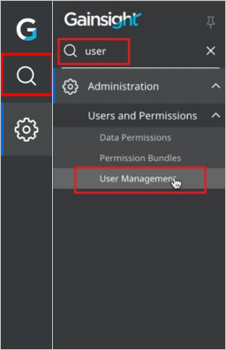
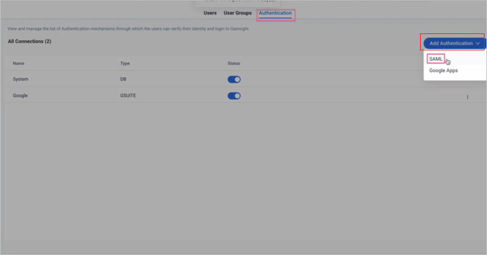
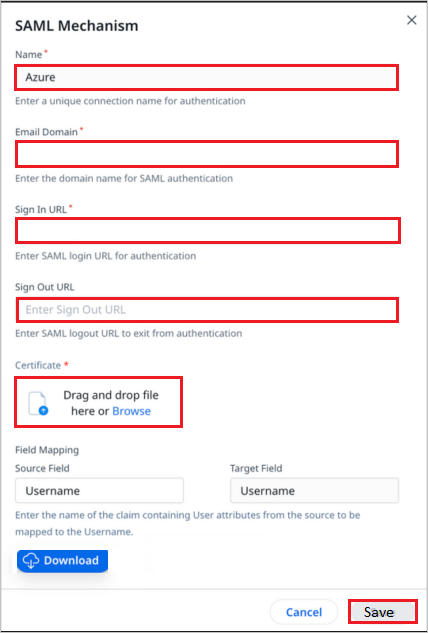
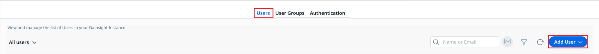

# Azure Active Directory SSO integration with Gainsight

In this article, you'll learn how to integrate Gainsight with Azure Active Directory (Azure AD). Use Azure AD to manage user access and enable single sign-on with Gainsight. Requires an existing Gainsight subscription. When you integrate Gainsight with Azure AD, you can:

* Control in Azure AD who has access to Gainsight.
* Enable your users to be automatically signed-in to Gainsight with their Azure AD accounts.
* Manage your accounts in one central location - the Azure portal.

You'll configure and test Azure AD single sign-on for Gainsight in a test environment. Gainsight supports both **SP** and **IDP** initiated single sign-on.

## Prerequisites

To integrate Azure Active Directory with Gainsight, you need:

* An Azure AD user account. If you don't already have one, you can [Create an account for free](https://azure.microsoft.com/free/?WT.mc_id=A261C142F).
* One of the following roles: Global Administrator, Cloud Application Administrator, Application Administrator, or owner of the service principal.
* An Azure AD subscription. If you don't have a subscription, you can get a [free account](https://azure.microsoft.com/free/).
* Gainsight single sign-on (SSO) enabled subscription.

## Add application and assign a test user

Before you begin the process of configuring single sign-on, you need to add the Gainsight application from the Azure AD gallery. You need a test user account to assign to the application and test the single sign-on configuration.

### Add Gainsight from the Azure AD gallery

Add Gainsight from the Azure AD application gallery to configure single sign-on with Gainsight. For more information on how to add application from the gallery, see the [Quickstart: Add application from the gallery](../manage-apps/add-application-portal.md).

### Create and assign Azure AD test user

Follow the guidelines in the [create and assign a user account](../manage-apps/add-application-portal-assign-users.md) article to create a test user account in the Azure portal called B.Simon.

Alternatively, you can also use the [Enterprise App Configuration Wizard](https://portal.office.com/AdminPortal/home?Q=Docs#/azureadappintegration). In this wizard, you can add an application to your tenant, add users/groups to the app, and assign roles. The wizard also provides a link to the single sign-on configuration pane in the Azure portal. [Learn more about Microsoft 365 wizards.](/microsoft-365/admin/misc/azure-ad-setup-guides).

## Configure Azure AD SSO

Complete the following steps to enable Azure AD single sign-on in the Azure portal.

1. In the Azure portal, on the **Gainsight** application integration page, find the **Manage** section and select **single sign-on**.
1. On the **Select a single sign-on method** page, select **SAML**.
1. On the **Set up single sign-on with SAML** page, select the pencil icon for **Basic SAML Configuration** to edit the settings.

   

1. On the **Basic SAML Configuration** section, perform the following steps:

	a. In the **Identifier** textbox, type a value using one of the following patterns:

	| **Identifier**  |
    | ------------- |
    | `urn:auth0:gainsight:<ID>`  |
    | `urn:auth0:gainsight-eu:<ID>`  |
	
    b. In the **Reply URL** textbox, type a URL using one of the following patterns:
    
	| **Reply URL**  |
    | ------------- |
    | `https://secured.gainsightcloud.com/login/callback connection=<ID>` |
    | `https://secured.eu.gainsightcloud.com/login/callback?connection=<ID>` |

1. Perform the following step, if you wish to configure the application in **SP** initiated mode:

	In the **Sign on URL** textbox, type a URL using one of the following patterns:

	| **Sign on URL** |
	|------------|
	| `https://secured.gainsightcloud.com/samlp/<ID>` |
	| `https://secured.eu.gainsightcloud.com/samlp/<ID>` |

	> [!NOTE]
    > These values are not real. Update these values with the actual Identifier, Reply URL and Sign on URL. Contact [Gainsight support team](mailto:support@gainsight.com) to get these values. You can also refer to the patterns shown in the **Basic SAML Configuration** section in the Azure portal.

1. On the **Set-up single sign-on with SAML** page, in the **SAML Signing Certificate** section, find **Certificate (Base64)** and select **Download** to download the certificate and save it on your computer.

   

1. On the **Set up Gainsight SAML** section, copy the appropriate URL(s) based on your requirement.

   

## Setup SAML 2.0 Authentication in Gainsight

> [!NOTE]
> SAML 2.0 Authentication allows the users to login to Gainsight via Azure AD. Once Gainsight is configured to authenticate via SAML 2.0, users who want to access Gainsight will no longer be prompted to enter a username or password. Instead, an exchange between Gainsight and Azure AD occurs that grants Gainsight access to the users.

**To configure SAML 2.0 Authentication:**

1. Log in to your **Gainsight** company site as an administrator.

1. Click **search bar** on the left side menu and select **User Management**.

    

1. In the **User Management** page, navigate to **Authentication** tab and click **Add Authentication** > **SAML**.

    

1. In the **SAML Mechanism** page, perform the following steps:

   

    1. Enter a unique connection **Name** in the textbox.
    1. Enter a valid **Email Domain** in the textbox.
    1. In the **Sign In URL** textbox, paste the **Login URL** value, which you have copied from the Azure portal.
    1. In the **Sign Out URL** textbox, paste the **Logout URL** value, which you have copied from the Azure portal.
    1. Open the downloaded **Certificate (Base64)** from the Azure portal and upload it into the **Certificate** by clicking **Browse** option.
    1. Click **Save**.

    > [!Note]
    > For more information on SAML creation, please refer [GAINSIGHT SAML](https://support.gainsight.com/Gainsight_NXT/01Onboarding_and_Implementation/Onboarding_for_Gainsight_NXT/Login_and_Permissions/03Gainsight_Authentication).

## Create Gainsight test user

1. In a different web browser window, sign in to your Gainsight website as an administrator.

1. In the **User Management** page, navigate to **Users** > **Add User**.
    
    

1. Fill required fields and click **Save**. Users must be created and activated before you use single sign-on.

## Test SSO

In this section, you test your Azure AD single sign-on configuration with following options.

#### SP initiated:

* Click on **Test this application** in Azure portal. This will redirect to Gainsight Sign-on URL where you can initiate the login flow. 

* Go to Gainsight Sign-on URL directly and initiate the login flow from there.

#### IDP initiated:

* Click on **Test this application** in Azure portal and you should be automatically signed in to the Gainsight for which you set up the SSO.

You can also use Microsoft My Apps to test the application in any mode. When you click the Gainsight tile in the My Apps, if configured in SP mode you would be redirected to the application sign-on page for initiating the login flow and if configured in IDP mode, you should be automatically signed in to the Gainsight for which you set up the SSO. For more information about the My Apps, see [Introduction to the My Apps](../user-help/my-apps-portal-end-user-access.md).

## Additional resources

* [What is single sign-on with Azure Active Directory?](../manage-apps/what-is-single-sign-on.md)
* [Plan a single sign-on deployment](../manage-apps/plan-sso-deployment.md).

## Next steps

Once you configure Gainsight you can enforce session control, which protects exfiltration and infiltration of your organization’s sensitive data in real time. Session control extends from Conditional Access. [Learn how to enforce session control with Microsoft Cloud App Security](/cloud-app-security/proxy-deployment-aad).