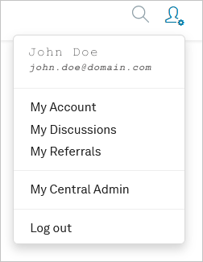
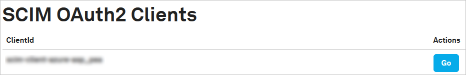
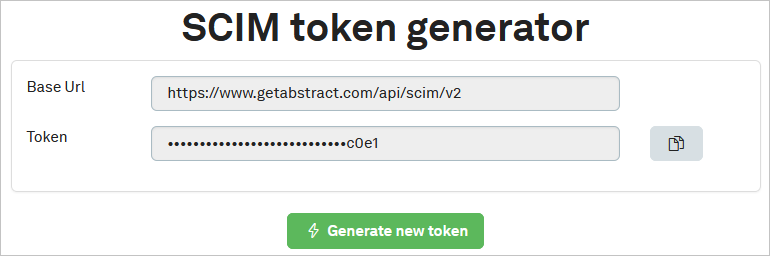
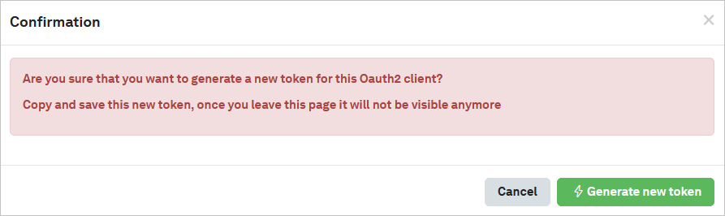
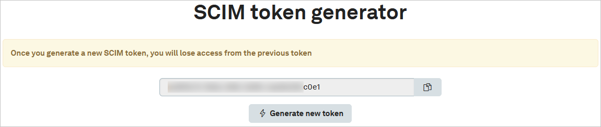

# Tutorial: Configure getAbstract for automatic user provisioning

This tutorial describes the steps you need to perform in both getAbstract and Microsoft Entra ID to configure automatic user provisioning. When configured, Microsoft Entra ID automatically provisions and deprovisions users and groups to [getAbstract](https://www.getabstract.com) by using the Microsoft Entra provisioning service. For important details on what this service does, how it works, and frequently asked questions, see [Automate user provisioning and deprovisioning to software as a service (SaaS) applications with Microsoft Entra ID](../app-provisioning/user-provisioning.md).

## Capabilities supported

> [!div class="checklist"]
> * Create users in getAbstract.
> * Remove users in getAbstract when they don't require access anymore.
> * Keep user attributes synchronized between Microsoft Entra ID and getAbstract.
> * Provision groups and group memberships in getAbstract.
> * Enable [single sign-on (SSO)](getabstract-tutorial.md) to getAbstract (recommended).

## Prerequisites

The scenario outlined in this tutorial assumes that you already have the following prerequisites:

* [A Microsoft Entra tenant](../develop/quickstart-create-new-tenant.md).
* A user account in Microsoft Entra ID with [permission](../roles/permissions-reference.md) to configure provisioning. Examples are Application Administrator, Cloud Application Administrator, Application Owner, or Global Administrator.
* A getAbstract tenant (getAbstract corporate license).
* SSO enabled on Microsoft Entra tenant and getAbstract tenant.
* Approval and System for Cross-domain Identity Management (SCIM) enabling for getAbstract. (Send email to b2b.itsupport@getabstract.com.)

## Step 1: Plan your provisioning deployment

1. Learn about [how the provisioning service works](../app-provisioning/user-provisioning.md).
1. Determine who will be in [scope for provisioning](../app-provisioning/define-conditional-rules-for-provisioning-user-accounts.md).
1. Determine what data to [map between Microsoft Entra ID and getAbstract](../app-provisioning/customize-application-attributes.md).

## Step 2: Configure getAbstract to support provisioning with Microsoft Entra ID

1. Sign in to getAbstract.
1. Select the settings icon located in the upper-right corner, and select the **My Central Admin** option.

	

1. Locate and select the **SCIM Admin** option.

	

1. Select **Go**.

	

1. Select **Generate new token**.

	

1. If you're sure, select **Generate new token**. Otherwise, select **Cancel**.

	

1. Either select the copy-to-clipboard icon or select the whole token and copy it. Also make a note that the Tenant/Base URL is `https://www.getabstract.com/api/scim/v2`. These values will be entered in the **Secret Token** and **Tenant URL** boxes on the **Provisioning** tab of your getAbstract application.

	

## Step 3: Add getAbstract from the Microsoft Entra application gallery

Add getAbstract from the Microsoft Entra application gallery to start managing provisioning to getAbstract. If you've previously set up getAbstract for SSO, you can use the same application. We recommend that you create a separate app when you test out the integration initially. To learn more about how to add an application from the gallery, see [this quickstart](../manage-apps/add-application-portal.md).

## Step 4: Define who will be in scope for provisioning

You can use the Microsoft Entra provisioning service to scope who will be provisioned based on assignment to the application or based on attributes of the user or group. If you choose to scope who will be provisioned to your app based on assignment, you can use the following [steps](../manage-apps/assign-user-or-group-access-portal.md) to assign users and groups to the application. If you choose to scope who will be provisioned based solely on attributes of the user or group, you can use a scoping filter as described in [Provision apps with scoping filters](../app-provisioning/define-conditional-rules-for-provisioning-user-accounts.md).

* When you assign users and groups to getAbstract, you must select a role other than **Default Access**. Users with the default access role are excluded from provisioning and will be marked as not effectively entitled in the provisioning logs. If the only role available on the application is the default access role, you can [update the application manifest](../develop/howto-add-app-roles-in-azure-ad-apps.md) to add more roles.

* Start small. Test with a small set of users and groups before you roll out to everyone. When scope for provisioning is set to assigned users and groups, you can control this option by assigning one or two users or groups to the app. When scope is set to all users and groups, you can specify an [attribute-based scoping filter](../app-provisioning/define-conditional-rules-for-provisioning-user-accounts.md).

## Step 5: Configure automatic user provisioning to getAbstract

This section guides you through the steps to configure the Microsoft Entra provisioning service to create, update, and disable users or groups in TestApp based on user or group assignments in Microsoft Entra ID.

### Configure automatic user provisioning for getAbstract in Microsoft Entra ID

1. Sign in to the [Microsoft Entra admin center](https://entra.microsoft.com) as at least a [Cloud Application Administrator](../roles/permissions-reference.md#cloud-application-administrator).
1. Browse to **Identity** > **Applications** > **Enterprise applications**.

	

1. In the list of applications, select **getAbstract**.

	

1. Select the **Provisioning** tab.

	

1. Set **Provisioning Mode** to **Automatic**.

	

1. In the **Admin Credentials** section, enter your getAbstract **Tenant URL** and **Secret token** information. Select **Test Connection** to ensure that Microsoft Entra ID can connect to getAbstract. If the connection fails, ensure that your getAbstract account has admin permissions and try again.

 	

1. In the **Notification Email** box, enter the email address of a person or group who should receive the provisioning error notifications. Select the **Send an email notification when a failure occurs** check box.

	

1. Select **Save**.

1. In the **Mappings** section, select **Synchronize Microsoft Entra users to getAbstract**.

1. Review the user attributes that are synchronized from Microsoft Entra ID to getAbstract in the **Attribute Mapping** section. The attributes selected as **Matching** properties are used to match the user accounts in getAbstract for update operations. If you change the [matching target attribute](../app-provisioning/customize-application-attributes.md), you'll need to ensure that the getAbstract API supports filtering users based on that attribute. Select **Save** to commit any changes.

   |Attribute|Type|Supported for filtering|
   |---|---|---|
   |userName|String|&check;|
   |active|Boolean|
   |emails[type eq "work"].value|String|
   |name.givenName|String|
   |name.familyName|String|
   |externalId|String|
   |preferredLanguage|String|

1. Under the **Mappings** section, select **Synchronize Microsoft Entra groups to getAbstract**.

1. Review the group attributes that are synchronized from Microsoft Entra ID to getAbstract in the **Attribute Mapping** section. The attributes selected as **Matching** properties are used to match the groups in getAbstract for update operations. Select **Save** to commit any changes.

    |Attribute|Type|Supported for filtering|
    |---|---|---|
    |displayName|String|&check;|
    |externalId|String|
    |members|Reference|

1. To configure scoping filters, see the instructions provided in the [Scoping filter tutorial](../app-provisioning/define-conditional-rules-for-provisioning-user-accounts.md).

1. To enable the Microsoft Entra provisioning service for getAbstract, change **Provisioning Status** to **On** in the **Settings** section.

	

1. Define the users or groups that you want to provision to getAbstract by selecting the desired values in **Scope** in the **Settings** section.

	

1. When you're ready to provision, select **Save**.

	

This operation starts the initial synchronization cycle of all users and groups defined in **Scope** in the **Settings** section. The initial cycle takes longer to perform than subsequent cycles, which occur about every 40 minutes as long as the Microsoft Entra provisioning service is running.

## Step 6: Monitor your deployment

After you've configured provisioning, use the following resources to monitor your deployment:

* Use the [provisioning logs](../reports-monitoring/concept-provisioning-logs.md) to determine which users were provisioned successfully or unsuccessfully.
* Check the [progress bar](../app-provisioning/application-provisioning-when-will-provisioning-finish-specific-user.md) to see the status of the provisioning cycle and how close it is to completion.
* If the provisioning configuration seems to be in an unhealthy state, the application will go into quarantine. To learn more about quarantine states, see [Application provisioning status of quarantine](../app-provisioning/application-provisioning-quarantine-status.md).

## Additional resources

* [Managing user account provisioning for enterprise apps](../app-provisioning/configure-automatic-user-provisioning-portal.md)
* [What is application access and single sign-on with Microsoft Entra ID?](../manage-apps/what-is-single-sign-on.md)

## Next steps

* [Learn how to review logs and get reports on provisioning activity](../app-provisioning/check-status-user-account-provisioning.md)
