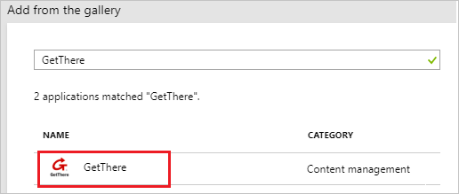
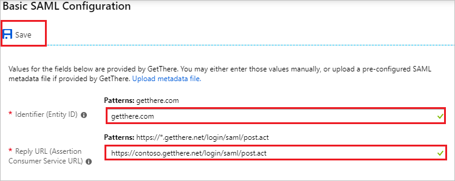
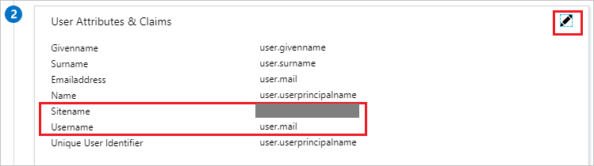
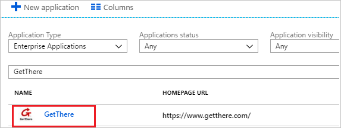

# Tutorial: Azure Active Directory integration with GetThere

In this tutorial, you learn how to integrate GetThere with Azure Active Directory (Azure AD).

Integrating GetThere with Azure AD provides you with the following benefits:

- You can control in Azure AD who has access to GetThere.
- You can enable your users to automatically get signed-on to GetThere (Single Sign-On) with their Azure AD accounts.
- You can manage your accounts in one central location - the Azure portal.

If you want to know more details about SaaS app integration with Azure AD, see [what is application access and single sign-on with Azure Active Directory](../manage-apps/what-is-single-sign-on.md).

## Prerequisites

To configure Azure AD integration with GetThere, you need the following items:

- An Azure AD subscription
- A GetThere single sign-on enabled subscription

> [!NOTE]
> To test the steps in this tutorial, we do not recommend using a production environment.

To test the steps in this tutorial, you should follow these recommendations:

- Do not use your production environment, unless it is necessary.
- If you don't have an Azure AD trial environment, you can [get a one-month trial](https://azure.microsoft.com/pricing/free-trial/).

## Scenario description
In this tutorial, you test Azure AD single sign-on in a test environment. 
The scenario outlined in this tutorial consists of two main building blocks:

1. Adding GetThere from the gallery
2. Configuring and testing Azure AD single sign-on

## Adding GetThere from the gallery
To configure the integration of GetThere into Azure AD, you need to add GetThere from the gallery to your list of managed SaaS apps.

**To add GetThere from the gallery, perform the following steps:**

1. In the **[Azure portal](https://portal.azure.com)**, on the left navigation panel, click **Azure Active Directory** icon. 

	

2. Navigate to **Enterprise applications**. Then go to **All applications**.

	
	
3. To add new application, click **New application** button on the top of dialog.

	

4. In the search box, type **GetThere**, select **GetThere** from result panel then click **Add** button to add the application.

	 

## Configure and test Azure AD single sign-on

In this section, you configure and test Azure AD single sign-on with GetThere based on a test user called "Britta Simon".

For single sign-on to work, Azure AD needs to know what the counterpart user in GetThere is to a user in Azure AD. In other words, a link relationship between an Azure AD user and the related user in GetThere needs to be established.

To configure and test Azure AD single sign-on with GetThere, you need to complete the following building blocks:

1. **[Configure Azure AD Single Sign-On](#configure-azure-ad-single-sign-on)** - to enable your users to use this feature.
2. **[Create an Azure AD test user](#create-an-azure-ad-test-user)** - to test Azure AD single sign-on with Britta Simon.
3. **[Create a GetThere test user](#create-a-getthere-test-user)** - to have a counterpart of Britta Simon in GetThere that is linked to the Azure AD representation of user.
4. **[Assign the Azure AD test user](#assign-the-azure-ad-test-user)** - to enable Britta Simon to use Azure AD single sign-on.
5. **[Test single sign-on](#test-single-sign-on)** - to verify whether the configuration works.

### Configure Azure AD single sign-on

In this section, you enable Azure AD single sign-on in the Azure portal and configure single sign-on in your GetThere application.

**To configure Azure AD single sign-on with GetThere, perform the following steps:**

1. In the [Azure portal](https://portal.azure.com/), on the **GetThere** application integration page, select **Single sign-on**.

    

2. On the **Select a Single sign-on method** dialog, select **SAML** mode to enable single sign-on.

    

3. On the **Set up Single Sign-On with SAML** page, click **Edit** button to open **Basic SAML Configuration** dialog.

	

4. On the **Basic SAML Configuration** section, perform the following steps:

    

    a. In the **Identifier** text box, type any one of the below URLs:
	| |
	|--|
	| `getthere.com` |
	| `http://idp.getthere.com` |

    b. In the **Reply URL** text box, type any one of the below URLs:
	| |
	|--|
	| `https://wx1.getthere.net/login/saml/post.act` |
	| `https://gtx2-gcte2.getthere.net/login/saml/post.act` |
	| `https://gtx2-gcte2.getthere.net/login/saml/ssoaasvalidate.act` |
	| `https://wx1.getthere.net/login/saml/ssoaavalidate.act` |
	
5. GetThere application expects the unique **Username** value in the username claim. Customer can map the correct value for the Username claim. In below example, we have mapped the **Username** to **user.mail**, but you can change the mapping according to your organization settings. On the **Set up Single Sign-On with SAML** page, click **Edit** button to open **User Attributes** dialog.

	

6. In the **User Claims** section on the **User Attributes** dialog, configure SAML token attribute as shown in the image above and perform the following steps:
    
	| Name |  Source Attribute |  Namespace |
	| ---------------| --------------- | --------------- |
	| Sitename | "Provide the value as per your Org" | http://schemas.xmlsoap.org/ws/2005/05/identity/claims/sitename |
	| Username |  user.mail | http://schemas.xmlsoap.org/ws/2005/05/identity/claims/username |
	
	a. Click **Add new claim** to open the **Manage user claims** dialog.

	

	

	b. In the **Name** textbox, type the attribute name shown for that row.

	c. In the **Namespace** textbox, type the attribute namespace shown for that row.

	d. Select Source as **Attribute**.

	e. From the **Source attribute** list, type the attribute value shown for that row.

	f. Click **Save**.

7. On the **Set up Single Sign-On with SAML** page, in the **SAML Signing Certificate** section, click **Download** to download the **Certificate (Base64)** and save it on your computer.

	 

8. On the **Set up GetThere** section, copy the appropriate URL as per your requirement.

	Note that the URL may say the following:

	a. Login URL

	b. Azure Ad Identifier

	c. Logout URL

	 

9. To configure single sign-on on **GetThere** side, you need to send the downloaded **Certificate (Base64)** and copied **Login URL, Azure Ad Identifier, Logout URL** to [GetThere Client support team](mailto:dataintegration@sabre.com). They set this setting to have the SAML SSO connection set properly on both sides.

### Create an Azure AD test user

The objective of this section is to create a test user in the Azure portal called Britta Simon.

1. In the Azure portal, in the left pane, select **Azure Active Directory**, select **Users**, and then select **All users**.

    

2. Select **New user** at the top of the screen.

    

3. In the User properties, perform the following steps.

    

    a. In the **Name** field, enter **BrittaSimon**.
  
    b. In the **User name** field type **brittasimon@yourcompanydomain.extension**  
    For example, BrittaSimon@contoso.com

    c. Select **Properties**, select the **Show password** check box, and then write down the value that's displayed in the Password box.

    d. Select **Create**.
 
### Create a GetThere test user

In this section, you create a user called Britta Simon in GetThere. Work with [GetThere Client support team](mailto:dataintegration@sabre.com) to add the users in the GetThere platform. Users must be created and activated before you use single sign-on.

### Assign the Azure AD test user

In this section, you enable Britta Simon to use Azure single sign-on by granting access to GetThere.

1. In the Azure portal, select **Enterprise Applications**, select **All applications**.

	

2. In the applications list, select **GetThere**.

	

3. In the menu on the left, select **Users and groups**.

    

4. Select the **Add** button, then select **Users and groups** in the **Add Assignment** dialog.

    

4. In the **Users and groups** dialog select **Britta Simon** in the Users list, then click the **Select** button at the bottom of the screen.

5. In the **Add Assignment** dialog select the **Assign** button.
	
### Test single sign-on

In this section, you test your Azure AD single sign-on configuration using the Access Panel.

When you click the GetThere tile in the Access Panel, you should get automatically signed-on to your GetThere application.
For more information about the Access Panel, see [Introduction to the Access Panel](../active-directory-saas-access-panel-introduction.md). 

## Additional resources

* [List of Tutorials on How to Integrate SaaS Apps with Azure Active Directory](tutorial-list.md)
* [What is application access and single sign-on with Azure Active Directory?](../manage-apps/what-is-single-sign-on.md)
