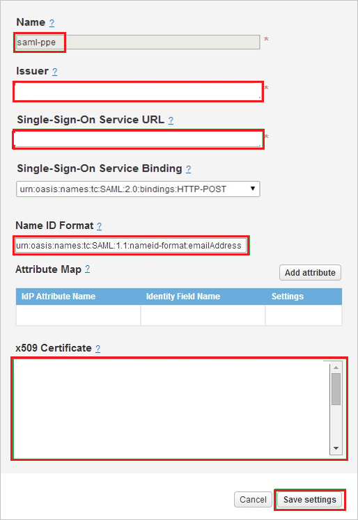

# Tutorial: Azure Active Directory integration with Gigya

In this tutorial, you'll learn how to integrate Gigya with Azure Active Directory (Azure AD). When you integrate Gigya with Azure AD, you can:

* Control in Azure AD who has access to Gigya.
* Enable your users to be automatically signed-in to Gigya with their Azure AD accounts.
* Manage your accounts in one central location - the Azure portal.

## Prerequisites

To get started, you need the following items:

* An Azure AD subscription. If you don't have a subscription, you can get a [free account](https://azure.microsoft.com/free/).
* Gigya single sign-on (SSO) enabled subscription.

## Scenario description

In this tutorial, you configure and test Azure AD single sign-on in a test environment.

* Gigya supports **SP** initiated SSO.

## Add Gigya from the gallery

To configure the integration of Gigya into Azure AD, you need to add Gigya from the gallery to your list of managed SaaS apps.

1. Sign in to the Azure portal using either a work or school account, or a personal Microsoft account.
1. On the left navigation pane, select the **Azure Active Directory** service.
1. Navigate to **Enterprise Applications** and then select **All Applications**.
1. To add new application, select **New application**.
1. In the **Add from the gallery** section, type **Gigya** in the search box.
1. Select **Gigya** from results panel and then add the app. Wait a few seconds while the app is added to your tenant.

## Configure and test Azure AD SSO for Gigya

Configure and test Azure AD SSO with Gigya using a test user called **B.Simon**. For SSO to work, you need to establish a link relationship between an Azure AD user and the related user in Gigya.

To configure and test Azure AD SSO with Gigya, perform the following steps:

1. **[Configure Azure AD SSO](#configure-azure-ad-sso)** - to enable your users to use this feature.
    1. **[Create an Azure AD test user](#create-an-azure-ad-test-user)** - to test Azure AD single sign-on with B.Simon.
    1. **[Assign the Azure AD test user](#assign-the-azure-ad-test-user)** - to enable B.Simon to use Azure AD single sign-on.
1. **[Configure Gigya SSO](#configure-gigya-sso)** - to configure the single sign-on settings on application side.
    1. **[Create Gigya test user](#create-gigya-test-user)** - to have a counterpart of B.Simon in Gigya that is linked to the Azure AD representation of user.
1. **[Test SSO](#test-sso)** - to verify whether the configuration works.

## Configure Azure AD SSO

Follow these steps to enable Azure AD SSO in the Azure portal.

1. In the Azure portal, on the **Gigya** application integration page, find the **Manage** section and select **single sign-on**.
1. On the **Select a single sign-on method** page, select **SAML**.
1. On the **Set up single sign-on with SAML** page, click the pencil icon for **Basic SAML Configuration** to edit the settings.

   

4. On the **Basic SAML Configuration** section, perform the following steps:

	a. In the **Sign on URL** text box, type a URL using the following pattern:
    `http://<companyname>.gigya.com`

    b. In the **Identifier (Entity ID)** text box, type a URL using the following pattern:
    `https://fidm.gigya.com/saml/v2.0/<companyname>`

	> [!NOTE]
	> These values are not real. Update these values with the actual Sign on URL and Identifier. Contact [Gigya Client support team](https://developers.gigya.com/display/GD/Opening+A+Support+Incident) to get these values. You can also refer to the patterns shown in the **Basic SAML Configuration** section in the Azure portal.

5. On the **Set up Single Sign-On with SAML** page, in the **SAML Signing Certificate** section, click **Download** to download the **Certificate (Base64)** from the given options as per your requirement and save it on your computer.

	

6. On the **Set up Gigya** section, copy the appropriate URL(s) as per your requirement.

	

### Create an Azure AD test user 

In this section, you'll create a test user in the Azure portal called B.Simon.

1. From the left pane in the Azure portal, select **Azure Active Directory**, select **Users**, and then select **All users**.
1. Select **New user** at the top of the screen.
1. In the **User** properties, follow these steps:
   1. In the **Name** field, enter `B.Simon`.  
   1. In the **User name** field, enter the username@companydomain.extension. For example, `B.Simon@contoso.com`.
   1. Select the **Show password** check box, and then write down the value that's displayed in the **Password** box.
   1. Click **Create**.

### Assign the Azure AD test user

In this section, you'll enable B.Simon to use Azure single sign-on by granting access to Gigya.

1. In the Azure portal, select **Enterprise Applications**, and then select **All applications**.
1. In the applications list, select **Gigya**.
1. In the app's overview page, find the **Manage** section and select **Users and groups**.
1. Select **Add user**, then select **Users and groups** in the **Add Assignment** dialog.
1. In the **Users and groups** dialog, select **B.Simon** from the Users list, then click the **Select** button at the bottom of the screen.
1. If you are expecting a role to be assigned to the users, you can select it from the **Select a role** dropdown. If no role has been set up for this app, you see "Default Access" role selected.
1. In the **Add Assignment** dialog, click the **Assign** button.

## Configure Gigya SSO

1. In a different web browser window, log into your Gigya company site as an administrator.

2. Go to **Settings \> SAML Login**, and then click the **Add** button.
   
    

3. In the **SAML Login** section, perform the following steps:
   
    
   
    a. In the **Name** textbox, type a name for your configuration.
   
    b. In **Issuer** textbox, paste the value of **Azure Ad Identifier** which you have copied from Azure portal. 
   
    c. In **Single Sign-On Service URL** textbox, paste the value of **Login URL** which you have copied from Azure portal.
   
    d. In **Name ID Format** textbox, paste the value of **Name Identifier Format** which you have copied from Azure portal.
   
    e. Open your base-64 encoded certificate in notepad downloaded from Azure portal, copy the content of it into your clipboard, and then paste it to the **X.509 Certificate** textbox.
   
    f. Click **Save Settings**.

## Create Gigya test user

In order to enable Azure AD users to log into Gigya, they must be provisioned into Gigya. In the case of Gigya, provisioning is a manual task.

### To provision a user accounts, perform the following steps:

1. Log in to your **Gigya** company site as an administrator.

2. Go to **Admin \> Manage Users**, and then click **Invite Users**.
   
    

3. On the Invite Users dialog, perform the following steps:
   
    
   
    a. In the **Email** textbox, type the email alias of a valid Azure Active Directory account you want to provision.
    
    b. Click **Invite User**.
      
    > [!NOTE]
    > The Azure Active Directory account holder will receive an email that includes a link to confirm the account before it becomes active.
    > 

## Test SSO

In this section, you test your Azure AD single sign-on configuration with following options. 

* Click on **Test this application** in Azure portal. This will redirect to Gigya Sign-on URL where you can initiate the login flow. 

* Go to Gigya Sign-on URL directly and initiate the login flow from there.

* You can use Microsoft My Apps. When you click the Gigya tile in the My Apps, this will redirect to Gigya Sign-on URL. For more information about the My Apps, see [Introduction to the My Apps](https://docs.microsoft.com/azure/active-directory/active-directory-saas-access-panel-introduction).

## Next steps

Once you configure Gigya you can enforce session control, which protects exfiltration and infiltration of your organization’s sensitive data in real time. Session control extends from Conditional Access. [Learn how to enforce session control with Microsoft Cloud App Security](https://docs.microsoft.com/cloud-app-security/proxy-deployment-any-app).
