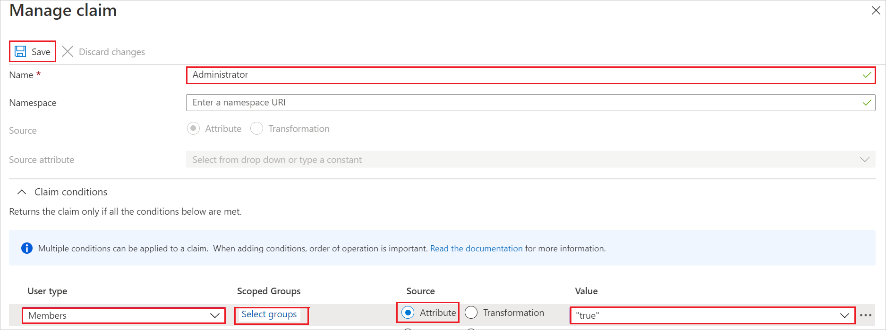

# Tutorial: Azure AD SSO integration with GitHub Enterprise Server

In this tutorial, you'll learn how to integrate GitHub Enterprise Server with Azure Active Directory (Azure AD). When you integrate GitHub Enterprise Server with Azure AD, you can:

* Control in Azure AD who has access to GitHub Enterprise Server.
* Enable your users to be automatically signed-in to GitHub Enterprise Server with their Azure AD accounts.
* Manage your accounts in one central location - the Azure portal.

## Prerequisites

To get started, you need the following items:

* An Azure AD subscription. If you don't have a subscription, you can get a [free account](https://azure.microsoft.com/free/).
* GitHub Enterprise Server, ready for [initialization](https://docs.github.com/github-ae@latest/admin/configuration/initializing-github-ae).
* Along with Cloud Application Administrator, Application Administrator can also add or manage applications in Azure AD.
For more information, see [Azure built-in roles](../roles/permissions-reference.md).

## Scenario description

In this tutorial, you configure and test Azure AD SSO in a test environment.

* GitHub Enterprise Server supports **SP** and **IDP** initiated SSO.
* GitHub Enterprise Server supports **Just In Time** user provisioning.
* GitHub Enterprise Server supports [Automated user provisioning](github-ae-provisioning-tutorial.md).

## Adding GitHub Enterprise Server from the gallery

To configure the integration of GitHub Enterprise Server into Azure AD, you need to add GitHub Enterprise Server from the gallery to your list of managed SaaS apps.

1. Sign in to the Azure portal using either a work or school account, or a personal Microsoft account.
1. On the left navigation pane, select the **Azure Active Directory** service.
1. Navigate to **Enterprise Applications** and then select **All Applications**.
1. To add new application, select **New application**.
1. In the **Add from the gallery** section, type **GitHub Enterprise Server** in the search box.
1. Select **GitHub Enterprise Server** from results panel and then add the app. Wait a few seconds while the app is added to your tenant.

 Alternatively, you can also use the [Enterprise App Configuration Wizard](https://portal.office.com/AdminPortal/home?Q=Docs#/azureadappintegration). In this wizard, you can add an application to your tenant, add users/groups to the app, assign roles, as well as walk through the SSO configuration as well. [Learn more about Microsoft 365 wizards.](/microsoft-365/admin/misc/azure-ad-setup-guides)

## Configure and test Azure AD SSO for GitHub Enterprise Server

Configure and test Azure AD SSO with GitHub Enterprise Server using a test user called **B.Simon**. For SSO to work, you need to establish a link relationship between an Azure AD user and the related user in GitHub Enterprise Server.

To configure and test Azure AD SSO with GitHub Enterprise Server, perform the following steps:

1. **[Configure Azure AD SSO](#configure-azure-ad-sso)** - to enable your users to use this feature.
    1. **[Create an Azure AD test user](#create-an-azure-ad-test-user)** - to test Azure AD single sign-on with B.Simon.
    1. **[Assign the Azure AD test user](#assign-the-azure-ad-test-user)** - to enable B.Simon to use Azure AD single sign-on.
1. **[Configure GitHub Enterprise Server SSO](#configure-github-enterprise-server-sso)** - to configure the single sign-on settings on application side.
    1. **[Create GitHub Enterprise Server test user](#create-github-enterprise-server-test-user)** - to have a counterpart of B.Simon in GitHub Enterprise Server that is linked to the Azure AD representation of user.
1. **[Test SSO](#test-sso)** - to verify whether the configuration works.

## Configure Azure AD SSO

Follow these steps to enable Azure AD SSO in the Azure portal.

1. In the Azure portal, on the **GitHub Enterprise Server** application integration page, find the **Manage** section and select **single sign-on**.
1. On the **Select a single sign-on method** page, select **SAML**.
1. On the **Set up single sign-on with SAML** page, click the pencil icon for **Basic SAML Configuration** to edit the settings.

   

1. On the **Basic SAML Configuration** section, if you wish to configure the application in **IDP** initiated mode, perform the following steps:

    a. In the **Identifier (Entity ID)** text box, type a URL using the following pattern:
    `https://<YOUR-GITHUB-ENTERPRISE-SERVER-HOSTNAME>`

    b. In the **Reply URL** text box, type a URL using the following pattern:
    `https://<YOUR-GITHUB-ENTERPRISE-SERVER-HOSTNAME>/saml/consume`

1. Click **Set additional URLs** and perform the following step if you wish to configure the application in **SP** initiated mode:

     In the **Sign on URL** text box, type a URL using the following pattern:
    `https://<YOUR-GITHUB-ENTERPRISE-SERVER-HOSTNAME>/sso`

	> [!NOTE]
	> These values are not real. Update these values with the actual Identifier, Reply URL and Sign on URL. Contact [GitHub Enterprise Server Client support team](mailto:support@github.com) to get these values. You can also refer to the patterns shown in the **Basic SAML Configuration** section in the Azure portal.

1. GitHub Enterprise Server application expects the SAML assertions in a specific format, which requires you to add custom attribute mappings to your SAML token attributes configuration. The following screenshot shows the list of default attributes.

	

1. Edit **User Attributes & Claims**.

1. Click **Add new claim** and enter the name as **administrator** in the textbox (the **administrator** value is case-sensitive).

1. Expand **Claim conditions** and select **Members** from **User type**.

1. Click on **Select groups** and search for the **Group** you want to include this claim, where its members should be administrators for GHES.

1. Select **Attribute** for **Source** and enter **true** (without quotes) for the **Value**. 

1. Click **Save**.

    

    > [!NOTE]
    > To know the instructions on how to add a claim, please follow the [link](https://docs.github.com/en/github-ae@latest/admin/authentication/configuring-authentication-and-provisioning-for-your-enterprise-using-azure-ad).

1. On the **Set up single sign-on with SAML** page, in the **SAML Signing Certificate** section,  find **Certificate (Base64)** and select **Download** to download the certificate and save it on your computer.

	

1. On the **Set up GitHub Enterprise Server** section, copy the appropriate URL(s) based on your requirement.

	

### Create an Azure AD test user

In this section, you'll create a test user in the Azure portal called B.Simon.

1. From the left pane in the Azure portal, select **Azure Active Directory**, select **Users**, and then select **All users**.
1. Select **New user** at the top of the screen.
1. In the **User** properties, follow these steps:
   1. In the **Name** field, enter `B.Simon`.  
   1. In the **User name** field, enter the username@companydomain.extension. For example, `B.Simon@contoso.com`.
   1. Select the **Show password** check box, and then write down the value that's displayed in the **Password** box.
   1. Click **Create**.

### Assign the Azure AD test user

In this section, you'll enable B.Simon to use Azure single sign-on by granting access to GitHub Enterprise Server.

1. In the Azure portal, select **Enterprise Applications**, and then select **All applications**.
1. In the applications list, select **GitHub Enterprise Server**.
1. In the app's overview page, find the **Manage** section and select **Users and groups**.
1. Select **Add user**, then select **Users and groups** in the **Add Assignment** dialog.
1. In the **Users and groups** dialog, select **B.Simon** from the Users list, then click the **Select** button at the bottom of the screen.
1. If you are expecting a role to be assigned to the users, you can select it from the **Select a role** dropdown. If no role has been set up for this app, you see "Default Access" role selected.
1. In the **Add Assignment** dialog, click the **Assign** button.

## Configure GitHub Enterprise Server SSO

To configure SSO on GitHub Enterprise Server side, you need to follow the instructions mentioned [here](https://docs.github.com/github-ae@latest/admin/authentication/configuring-saml-single-sign-on-for-your-enterprise#enabling-saml-sso).

### Create GitHub Enterprise Server test user

In this section, a user called B.Simon is created in GitHub Enterprise Server. GitHub Enterprise Server supports just-in-time user provisioning, which is enabled by default. There is no action item for you in this section. If a user doesn't already exist in GitHub Enterprise Server, a new one is created after authentication.

GitHub Enterprise Server also supports automatic user provisioning, you can find more details [here](./github-ae-provisioning-tutorial.md) on how to configure automatic user provisioning.

## Test SSO 

In this section, you test your Azure AD single sign-on configuration with following options. 

#### SP initiated:

* Click on **Test this application** in Azure portal. This will redirect to GitHub Enterprise Server Sign-on URL where you can initiate the login flow.  

* Go to GitHub Enterprise Server Sign-on URL directly and initiate the login flow from there.

#### IDP initiated:

* Click on **Test this application** in Azure portal and you should be automatically signed in to the GitHub Enterprise Server for which you set up the SSO. 

You can also use Microsoft My Apps to test the application in any mode. When you click the GitHub Enterprise Server tile in the My Apps, if configured in SP mode you would be redirected to the application sign-on page for initiating the login flow and if configured in IDP mode, you should be automatically signed in to the GitHub Enterprise Server for which you set up the SSO. For more information about the My Apps, see [Introduction to the My Apps](../user-help/my-apps-portal-end-user-access.md).

## Next steps

* [Configuring user provisioning for your enterprise](https://docs.github.com/github-ae@latest/admin/authentication/configuring-user-provisioning-for-your-enterprise).

* Once you configure GitHub Enterprise Server you can enforce session control, which protects exfiltration and infiltration of your organization’s sensitive data in real time. Session control extends from Conditional Access. [Learn how to enforce session control with Microsoft Defender for Cloud Apps](/cloud-app-security/proxy-deployment-any-app).