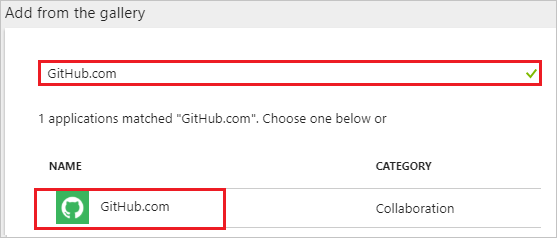
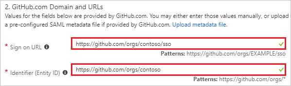
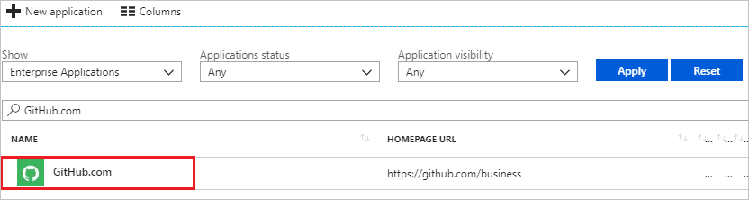

# Tutorial: Azure Active Directory integration with GitHub

In this tutorial, you learn how to integrate GitHub with Azure Active Directory (Azure AD).

Integrating GitHub with Azure AD provides you with the following benefits:

- You can control in Azure AD who has access to GitHub.
- You can enable your users to automatically get signed-on to GitHub (Single Sign-On) with their Azure AD accounts.
- You can manage your accounts in one central location - the Azure portal.

If you want to know more details about SaaS app integration with Azure AD, see [what is application access and single sign-on with Azure Active Directory](../manage-apps/what-is-single-sign-on.md).

## Prerequisites

To configure Azure AD integration with GitHub, you need the following items:

- An Azure AD subscription
- A GitHub single sign-on enabled subscription

> [!NOTE]
> To test the steps in this tutorial, we do not recommend using a production environment.

To test the steps in this tutorial, you should follow these recommendations:

- Do not use your production environment, unless it is necessary.
- If you don't have an Azure AD trial environment, you can [get a one-month trial](https://azure.microsoft.com/pricing/free-trial/).

## Scenario description
In this tutorial, you test Azure AD single sign-on in a test environment. 
The scenario outlined in this tutorial consists of two main building blocks:

1. Adding GitHub from the gallery
2. Configuring and testing Azure AD single sign-on

## Adding GitHub from the gallery
To configure the integration of GitHub into Azure AD, you need to add GitHub from the gallery to your list of managed SaaS apps.

**To add GitHub from the gallery, perform the following steps:**

1. In the **[Azure portal](https://portal.azure.com)**, on the left navigation panel, click **Azure Active Directory** icon. 

	

2. Navigate to **Enterprise applications**. Then go to **All applications**.

	
	
3. To add new application, click **New application** button on the top of dialog.

	

4. In the search box, type **GitHub**, select **GitHub** from result panel then click **Add** button to add the application.

	 

## Configure and test Azure AD single sign-on

In this section, you configure and test Azure AD single sign-on with GitHub based on a test user called "Britta Simon".

For single sign-on to work, Azure AD needs to know what the counterpart user in GitHub is to a user in Azure AD. In other words, a link relationship between an Azure AD user and the related user in GitHub needs to be established.

To configure and test Azure AD single sign-on with GitHub, you need to complete the following building blocks:

1. **[Configure Azure AD Single Sign-On](#configure-azure-ad-single-sign-on)** - to enable your users to use this feature.
2. **[Create an Azure AD test user](#create-an-azure-ad-test-user)** - to test Azure AD single sign-on with Britta Simon.
3. **[Create a GitHub test user](#create-a-github-test-user)** - to have a counterpart of Britta Simon in GitHub that is linked to the Azure AD representation of user.
4. **[Assign the Azure AD test user](#assign-the-azure-ad-test-user)** - to enable Britta Simon to use Azure AD single sign-on.
5. **[Test single sign-on](#test-single-sign-on)** - to verify whether the configuration works.

### Configure Azure AD single sign-on

In this section, you enable Azure AD single sign-on in the Azure portal and configure single sign-on in your GitHub application.

**To configure Azure AD single sign-on with GitHub, perform the following steps:**

1. In the [Azure portal](https://portal.azure.com/), on the **GitHub** application integration page, select **Single sign-on**.

    

2. On the **Select a Single sign-on method** dialog, Click **Select** for **SAML** mode to enable single sign-on.

    

3. On the **Set up Single Sign-On with SAML** page, click **Edit** button to open **Basic SAML Configuration** dialog.

	

4. On the **Basic SAML Configuration** section, perform the following steps:

	 

	a. In the **Sign on URL** textbox, type a URL using the following pattern: `https://github.com/orgs/<entity-id>/sso`

	b. In the **Identifier (Entity ID)** textbox, type a URL using the following pattern: `https://github.com/orgs/<entity-id>`

	> [!NOTE]
	> Please note that these are not the real values. You have to update these values with the actual Sign on URL and Identifier. Here we suggest you to use the unique value of string in the Identifier. Go to GitHub Admin section to retrieve these values.

5. GitHub application expects the SAML assertions in a specific format. Configure the following claims for this application. You can manage the values of these attributes from the **User Attributes** section on application integration page. Click **Edit** button to open **User Attributes** dialog.

	

6. In the **User Claims** section on the **User Attributes** dialog, configure SAML token attribute as shown in the image above and perform the following steps:
    
	a. Click **Edit** button to open the **Manage user claims** dialog.

	

	

	b. From the **Source attribute** list, select the attribute value.

	c. Click **Save**.
 
7. In the **SAML Signing Certificate** section, click **Download** to download the **Certificate (Base64)** and save it on your computer.

	

8. On the **Set up GitHub** section, copy the appropriate URL as per your requirement.

	a. Login URL

	b. Azure AD Identifier

	c. Logout URL

	 

9. In a different web browser window, log into your GitHub organization site as an administrator.

10. Navigate to **Settings** and click **Security**

	

11. Check the **Enable SAML authentication** box, revealing the Single Sign-on configuration fields. Then, use the single sign-on URL value to update the Single sign-on URL on Azure AD configuration.

	

12. Configure the following fields:

	

	a. In the **Sign on URL** textbox, paste **Login URL** value which you have copied from the Azure portal.

	b. In the **Issuer** textbox, paste **Azure AD Identifier** value which you have copied from the Azure portal.

	c. Open the downloaded certificate from Azure portal in notepad, paste the content into the **Public Certificate** textbox.

	d. Click on **Edit** icon to edit the **Signature Method** and **Digest Method** from **RSA-SHA1** and **SHA1** to **RSA-SHA256** and **SHA256** as shown below.

	 
	
13. Click on **Test SAML configuration** to confirm that no validation failures or errors during SSO.

	

14. Click **Save**

> [!NOTE]
> Single sign-on in GitHub authenticates to a specific organization in GitHub and does not replace the authentication of GitHub itself. Therefore, if the user's GitHub.com session has expired, you may be asked to authenticate with GitHub's ID/password during the single sign-on process.

### Create an Azure AD test user

The objective of this section is to create a test user in the Azure portal called Britta Simon.

1. In the Azure portal, in the left pane, select **Azure Active Directory**, select **Users**, and then select **All users**.

    

2. Select **New user** at the top of the screen.

    

3. In the User properties, perform the following steps.

    

    a. In the **Name** field enter **BrittaSimon**.
  
    b. In the **User name** field type **brittasimon@yourcompanydomain.extension**  
    For example, BrittaSimon@contoso.com

    c. Select **Properties**, select the **Show password** check box, and then write down the value that's displayed in the Password box.

    d. Select **Create**.
 
### Create a GitHub test user

The objective of this section is to create a user called Britta Simon in GitHub. GitHub supports automatic user provisioning, which is by default enabled. You can find more details [here](github-provisioning-tutorial.md) on how to configure automatic user provisioning.

**If you need to create user manually, perform following steps:**

1. Log in to your GitHub company site as an administrator.

2. Click **People**.

    

3. Click **Invite member**.

	

4. On the **Invite member** dialog page, perform the following steps:

	a. In the **Email** textbox, type the email address of Britta Simon account.

	

    b. Click **Send Invitation**.

	

	> [!NOTE]
    > The Azure Active Directory account holder will receive an email and follow a link to confirm their account before it becomes active.

### Assign the Azure AD test user

In this section, you enable Britta Simon to use Azure single sign-on by granting access to GitHub.

1. In the Azure portal, select **Enterprise Applications**, select **All applications**.

	

2. In the applications list, select **GitHub**.

	

3. In the menu on the left, select **Users and groups**.

    

4. Select the **Add** button, then select **Users and groups** in the **Add Assignment** dialog.

    

4. In the **Users and groups** dialog select **Britta Simon** in the Users list, then click the **Select** button at the bottom of the screen.

5. In the **Add Assignment** dialog select the **Assign** button.
	
### Test single sign-on

In this section, you test your Azure AD single sign-on configuration using the Access Panel.

When you click the GitHub tile in the Access Panel, you should get automatically signed-on to your GitHub application.
For more information about the Access Panel, see [Introduction to the Access Panel](../active-directory-saas-access-panel-introduction.md). 

## Additional resources

* [List of Tutorials on How to Integrate SaaS Apps with Azure Active Directory](tutorial-list.md)
* [What is application access and single sign-on with Azure Active Directory?](../manage-apps/what-is-single-sign-on.md)

