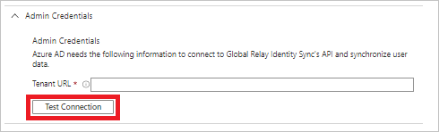

# Tutorial: Configure Global Relay Identity Sync for automatic user provisioning

This tutorial describes the steps you need to perform in both Global Relay Identity Sync and Microsoft Entra ID to configure automatic user provisioning. When configured, Microsoft Entra ID automatically provisions and de-provisions users and groups to Global Relay Identity Sync using the Microsoft Entra provisioning service. For important details on what this service does, how it works, and frequently asked questions, see [Automate user provisioning and deprovisioning to SaaS applications with Microsoft Entra ID](../app-provisioning/user-provisioning.md). 

## Capabilities supported
> [!div class="checklist"]
> * Create users in Global Relay Identity Sync
> * Remove users in Global Relay Identity Sync when they do not require access anymore
> * Keep user attributes synchronized between Microsoft Entra ID and Global Relay Identity Sync
> * Provision groups and group memberships in Global Relay Identity Sync

> [!NOTE]
> Global Relay Identity Sync provisioning connector utilizes a SCIM authorization method that is no longer supported due to security concerns. Efforts are underway with Global Relay to switch to a more secure authorization method.

## Prerequisites

The scenario outlined in this tutorial assumes that you already have the following prerequisites:

* [A Microsoft Entra tenant](../develop/quickstart-create-new-tenant.md) 
* A user account in Microsoft Entra ID with [permission](../roles/permissions-reference.md) to configure provisioning (for example, Application Administrator, Cloud Application administrator, Application Owner, or Global Administrator).

## Step 1: Plan your provisioning deployment
1. Learn about [how the provisioning service works](../app-provisioning/user-provisioning.md).
2. Determine who will be in [scope for provisioning](../app-provisioning/define-conditional-rules-for-provisioning-user-accounts.md).
3. Determine what data to [map between Microsoft Entra ID and Global Relay Identity Sync](../app-provisioning/customize-application-attributes.md). 

## Step 2: Configure Global Relay Identity Sync to support provisioning with Microsoft Entra ID

Contact your Global Relay Identity Sync representative to receive the Tenant URL. This value will be entered in the **Tenant URL** field in the Provisioning tab of your Global Relay Identity Sync application.

## Step 3: Add Global Relay Identity Sync from the Microsoft Entra application gallery

Add Global Relay Identity Sync from the Microsoft Entra application gallery to start managing provisioning to Global Relay Identity Sync. Learn more about adding an application from the gallery [here](../manage-apps/add-application-portal.md). 

## Step 4: Define who will be in scope for provisioning 

The Microsoft Entra provisioning service allows you to scope who will be provisioned based on assignment to the application and or based on attributes of the user / group. If you choose to scope who will be provisioned to your app based on assignment, you can use the following [steps](../manage-apps/assign-user-or-group-access-portal.md) to assign users and groups to the application. If you choose to scope who will be provisioned based solely on attributes of the user or group, you can use a scoping filter as described [here](../app-provisioning/define-conditional-rules-for-provisioning-user-accounts.md). 

* If you need additional roles, you can [update the application manifest](../develop/howto-add-app-roles-in-azure-ad-apps.md) to add new roles.

## Step 5: Configure automatic user provisioning to Global Relay Identity Sync 

This section guides you through the steps to configure the Microsoft Entra provisioning service to create, update, and disable users and/or groups in Global Relay Identity Sync app based on user and/or group assignments in Microsoft Entra ID.

### To configure automatic user provisioning for Global Relay Identity Sync in Microsoft Entra ID:

1. Sign in to the [Microsoft Entra admin center](https://entra.microsoft.com) as at least a [Cloud Application Administrator](../roles/permissions-reference.md#cloud-application-administrator).
1. Browse to **Identity** > **Applications** > **Enterprise applications**

	

1. In the applications list, select **Global Relay Identity Sync**.

	

3. Select the **Provisioning** tab.

	

4. Set the **Provisioning Mode** to **Automatic**.

	

5. Under the **Admin Credentials** section, input your Global Relay Identity Sync **Tenant url**. Click **Test Connection** to ensure Microsoft Entra ID can connect to Global Relay Identity Sync. If the connection fails, ensure your Global Relay Identity Sync account has Admin permissions and contact your Global Relay representative to resolve the issue.

	

6. In the **Notification Email** field, enter the email address of a person or group who should receive the provisioning error notifications and select the **Send an email notification when a failure occurs** check box.

	

7. Select **Save**.

8. Under the **Mappings** section, select **Synchronize Microsoft Entra users to Global Relay Identity Sync**.

9. Review the user attributes that are synchronized from Microsoft Entra ID to Global Relay Identity Sync in the **Attribute-Mapping** section. The attributes selected as **Matching** properties are used to match the user accounts in Global Relay Identity Sync for update operations. If you choose to change the [matching target attribute](../app-provisioning/customize-application-attributes.md), you will need to ensure that the Global Relay Identity Sync API supports filtering users based on that attribute. Select the **Save** button to commit any changes.

   |Attribute|Type|
   |---|---|
   |userName|String|
   |active|Boolean|
   |displayName|String|
   |title|String|
   |preferredLanguage|String|
   |name.givenName|String|
   |name.familyName|String|
   |name.formatted|String|
   |addresses[type eq "work"].formatted|String|
   |addresses[type eq "work"].streetAddress|String|
   |emails[type eq "work"].value|String|
   |addresses[type eq "work"].locality|String|
   |addresses[type eq "work"].region|String|
   |addresses[type eq "work"].postalCode|String|
   |addresses[type eq "work"].country|String|
   |addresses[type eq "other"].formatted|String|
   |phoneNumbers[type eq "work"].value|String|
   |phoneNumbers[type eq "mobile"].value|String|
   |phoneNumbers[type eq "fax"].value|String|
   |externalId|String|
   |name.honorificPrefix|String|
   |name.honorificSuffix|String|
   |nickName|String|
   |userType|String|
   |locale|String|
   |timezone|String|
   |emails[type eq "home"].value|String|
   |emails[type eq "other"].value|String|
   |phoneNumbers[type eq "home"].value|String|
   |phoneNumbers[type eq "other"].value|String|
   |phoneNumbers[type eq "pager"].value|String|
   |addresses[type eq "home"].streetAddress|String|
   |addresses[type eq "home"].locality|String|
   |addresses[type eq "home"].region|String|
   |addresses[type eq "home"].postalCode|String|
   |addresses[type eq "home"].country|String|
   |addresses[type eq "home"].formatted|String|
   |addresses[type eq "other"].streetAddress|String|
   |addresses[type eq "other"].locality|String|
   |addresses[type eq "other"].region|String|
   |addresses[type eq "other"].postalCode|String|
   |addresses[type eq "other"].country|String|
   |roles[primary eq "True"].display|String|
   |roles[primary eq "True"].type|String|
   |roles[primary eq "True"].value|String|
   |urn:ietf:params:scim:schemas:extension:enterprise:2.0:User:employeeNumber|String|
   |urn:ietf:params:scim:schemas:extension:enterprise:2.0:User:costCenter|String|
   |urn:ietf:params:scim:schemas:extension:enterprise:2.0:User:organization|String|
   |urn:ietf:params:scim:schemas:extension:enterprise:2.0:User:division|String|
   |urn:ietf:params:scim:schemas:extension:enterprise:2.0:User:department|String|
   |urn:ietf:params:scim:schemas:extension:enterprise:2.0:User:manager|Reference|
   |urn:ietf:params:scim:schemas:extension:GlobalRelay:2.0:User:proxyAddresses|String|
   |urn:ietf:params:scim:schemas:extension:GlobalRelay:2.0:User:extensionAttribute1|String|
   |urn:ietf:params:scim:schemas:extension:GlobalRelay:2.0:User:extensionAttribute2|String|
   |urn:ietf:params:scim:schemas:extension:GlobalRelay:2.0:User:extensionAttribute3|String|
   |urn:ietf:params:scim:schemas:extension:GlobalRelay:2.0:User:extensionAttribute4|String|
   |urn:ietf:params:scim:schemas:extension:GlobalRelay:2.0:User:extensionAttribute5|String|
   |urn:ietf:params:scim:schemas:extension:GlobalRelay:2.0:User:extensionAttribute6|String|
   |urn:ietf:params:scim:schemas:extension:GlobalRelay:2.0:User:extensionAttribute7|String|
   |urn:ietf:params:scim:schemas:extension:GlobalRelay:2.0:User:extensionAttribute8|String|
   |urn:ietf:params:scim:schemas:extension:GlobalRelay:2.0:User:extensionAttribute9|String|
   |urn:ietf:params:scim:schemas:extension:GlobalRelay:2.0:User:extensionAttribute10|String|
   |urn:ietf:params:scim:schemas:extension:GlobalRelay:2.0:User:extensionAttribute11|String|
   |urn:ietf:params:scim:schemas:extension:GlobalRelay:2.0:User:extensionAttribute12|String|
   |urn:ietf:params:scim:schemas:extension:GlobalRelay:2.0:User:extensionAttribute13|String|
   |urn:ietf:params:scim:schemas:extension:GlobalRelay:2.0:User:extensionAttribute14|String|
   |urn:ietf:params:scim:schemas:extension:GlobalRelay:2.0:User:extensionAttribute15|String|

10. Under the **Mappings** section, select **Synchronize Microsoft Entra groups to Global Relay Identity Sync**.

11. Review the group attributes that are synchronized from Microsoft Entra ID to Global Relay Identity Sync in the **Attribute-Mapping** section. The attributes selected as **Matching** properties are used to match the groups in Global Relay Identity Sync for update operations. Select the **Save** button to commit any changes.

      |Attribute|Type|
      |---|---|
      |displayName|String|
      |members|Reference|

12. To configure scoping filters, refer to the following instructions provided in the [Scoping filter tutorial](../app-provisioning/define-conditional-rules-for-provisioning-user-accounts.md).

13. To enable the Microsoft Entra provisioning service for Global Relay Identity Sync, change the **Provisioning Status** to **On** in the **Settings** section.

	

14. Define the users and/or groups that you would like to provision to Global Relay Identity Sync by choosing the desired values in **Scope** in the **Settings** section.

	

15. When you are ready to provision, click **Save**.

	

This operation starts the initial synchronization cycle of all users and groups defined in **Scope** in the **Settings** section. The initial cycle takes longer to perform than subsequent cycles, which occur approximately every 40 minutes as long as the Microsoft Entra provisioning service is running. 

## Step 6: Monitor your deployment
Once you've configured provisioning, use the following resources to monitor your deployment:

1. Use the [provisioning logs](../reports-monitoring/concept-provisioning-logs.md) to determine which users have been provisioned successfully or unsuccessfully
2. Check the [progress bar](../app-provisioning/application-provisioning-when-will-provisioning-finish-specific-user.md) to see the status of the provisioning cycle and how close it is to completion
3. If the provisioning configuration seems to be in an unhealthy state, the application will go into quarantine. Learn more about quarantine states [here](../app-provisioning/application-provisioning-quarantine-status.md).  

## Additional resources

* [Managing user account provisioning for Enterprise Apps](../app-provisioning/configure-automatic-user-provisioning-portal.md)
* [What is application access and single sign-on with Microsoft Entra ID?](../manage-apps/what-is-single-sign-on.md)

## Next steps

* [Learn how to review logs and get reports on provisioning activity](../app-provisioning/check-status-user-account-provisioning.md)
