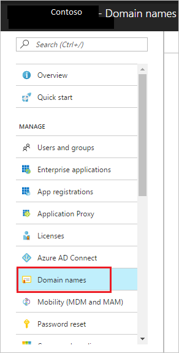
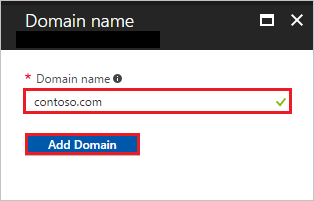
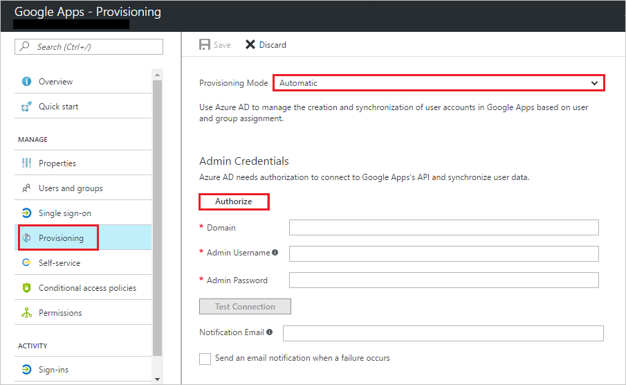

# Tutorial: Configure G Suite for automatic user provisioning

The objective of this tutorial is to show you how to automatically provision and de-provision user accounts from Azure Active Directory (Azure AD) to G Suite.

> [!NOTE]
> This tutorial describes a connector built on top of the Azure AD User Provisioning Service. For important details on what this service does, how it works, and frequently asked questions, see [Automate user provisioning and deprovisioning to SaaS applications with Azure Active Directory](../manage-apps/user-provisioning.md).

## Prerequisites

To configure Azure AD integration with G Suite, you need the following items:

- An Azure AD subscription
- A G Suite single sign-on enabled subscription
- A Google Apps subscription or Google Cloud Platform subscription.

> [!NOTE]
> To test the steps in this tutorial, we do not recommend using a production environment.

To test the steps in this tutorial, you should follow these recommendations:

- Do not use your production environment, unless it is necessary.
- If you don't have an Azure AD trial environment, you can [get a one-month trial](https://azure.microsoft.com/pricing/free-trial/).

## Assign users to G Suite

Azure Active Directory uses a concept called "assignments" to determine which users should receive access to selected apps. In the context of automatic user account provisioning, only the users and groups that have been "assigned" to an application in Azure AD are synchronized.

Before you configure and enable the provisioning service, you need to decide which users or groups in Azure AD need access to your app. After you've made this decision, you can assign these users to your app by following the instructions in
[Assign a user or group to an enterprise app](https://docs.microsoft.com/azure/active-directory/active-directory-coreapps-assign-user-azure-portal).

> [!IMPORTANT]
> We recommend  that a single Azure AD user be assigned to G Suite to test the provisioning configuration. You can assign additional users and groups later.

> When you assign a user to G Suite, select the **User** or **Group** role in the assignment dialog box. The **Default Access** role doesn't work for provisioning.

## Enable automated user provisioning

This section guides you through the process of connecting your Azure AD to the user account provisioning API of G Suite. It also helps you configure the provisioning service to create, update, and disable assigned user accounts in G Suite based on user and group assignment in Azure AD.

>[!TIP]
>You might also choose to enable SAML-based single sign-on for G Suites, by following the instructions in the [Azure portal](https://portal.azure.com). Single sign-on can be configured independently of automatic provisioning, though these two features compliment each other.

### Configure automatic user account provisioning

> [!NOTE]
> Another viable option for automating user provisioning to G Suite is to use [Google Apps Directory Sync (GADS)](https://support.google.com/a/answer/106368?hl=en). GADS provisions your on-premises Active Directory identities to G Suite. In contrast, the solution in this tutorial provisions your Azure Active Directory (cloud) users and email-enabled groups to G Suite. 

1. Sign in to the [Google Apps Admin console](http://admin.google.com/) with your administrator account, and then select **Security**. If you don't see the link, it might be hidden under the **More Controls** menu at the bottom of the screen.
   
    ![Select security.][10]

1. On the **Security** page, select **API Reference**.
   
    ![Select API Reference.][15]

1. Select **Enable API access**.
   
    ![Select API Reference.][16]

    > [!IMPORTANT]
    > For every user that you intend to provision to G Suite, their user name in Azure Active Directory *must* be tied to a custom domain. For example, user names that look like bob@contoso.onmicrosoft.com are not accepted by G Suite. On the other hand, bob@contoso.com is accepted. You can change an existing user's domain by editing their properties in Azure AD. We've included instructions for how to set a custom domain for both Azure Active Directory and G Suite in the following steps.
      
1. If you haven't added a custom domain name to your Azure Active Directory yet, then take the following steps:
  
    a. In the [Azure portal](https://portal.azure.com), on the left navigation pane, select **Active Directory**. In the directory list, select your directory. 

    b. Select **Domain name** on the left navigation pane, and then select **Add**.
     
     

     

    c. Type your domain name into the **Domain name** field. This domain name should be the same domain name that you intend to use for G Suite. Then select the **Add Domain** button.
     
     

    d. Select **Next** to go to the verification page. To verify that you own this domain, edit the domain's DNS records according to the values that are provided on this page. You might choose to verify by using either **MX records** or **TXT records**, depending on what you select for the **Record Type** option. 
    
    For more comprehensive instructions on how to verify domain names with Azure AD, see [Add your own domain name to Azure AD](https://go.microsoft.com/fwLink/?LinkID=278919&clcid=0x409).
     
     

    e. Repeat the preceding steps for all the domains that you intend to add to your directory.

	> [!NOTE]
	For user provisioning, the custom domain must match the domain name of the source Azure AD. If they do not match, you may be able to solve the problem by implementing attribute mapping customization.

1. Now that you have verified all your domains with Azure AD, you must verify them again with Google Apps. For each domain that isn't already registered with Google, take the following steps:
   
    a. In the [Google Apps Admin Console](http://admin.google.com/), select **Domains**.
     
     ![Select Domains][20]

    b. Select **Add a domain or a domain alias**.
     
     ![Add a new domain][21]

    c. Select **Add another domain**, and then type in the name of the domain that you want to add.
     
     ![Type in your domain name][22]

    d. Select **Continue and verify domain ownership**. Then follow the steps to verify that you own the domain name. For comprehensive instructions on how to verify your domain with Google, see [Verify your site ownership with Google Apps](https://support.google.com/webmasters/answer/35179).

    e. Repeat the preceding steps for any additional domains that you intend to add to Google Apps.
     
     > [!WARNING]
     > If you change the primary domain for your G Suite tenant, and if you have already configured single sign-on with Azure AD, then you have to repeat step #3 under [Step 2: Enable single sign-on](#step-two-enable-single-sign-on).
       
1. In the [Google Apps Admin console](http://admin.google.com/), select **Admin Roles**.
   
     ![Select Google Apps][26]

1. Determine which admin account you want to use to manage user provisioning. For the **admin role** of that account, edit the **Privileges** for that role. Make sure to enable all **Admin API Privileges** so that this account can be used for provisioning.
   
     ![Select Google Apps][27]
   
    > [!NOTE]
    > If you are configuring a production environment, the best practice is to create an admin account in G Suite specifically for this step. These accounts must have an admin role associated with them that has the necessary API privileges.
     
1. In the [Azure portal](https://portal.azure.com), browse to the **Azure Active Directory** > **Enterprise Apps** > **All applications** section.

1. If you have already configured G Suite for single sign-on, search for your instance of G Suite by using the search field. Otherwise, select **Add**, and then search for **G Suite** or **Google Apps** in the application gallery. Select your app from the search results, and then add it to your list of applications.

1. Select your instance of G Suite, and then select the **Provisioning** tab.

1. Set the **Provisioning Mode** to **Automatic**. 

     

1. Under the **Admin Credentials** section, select **Authorize**. It opens a Google authorization dialog box in a new browser window.

1. Confirm that you want to give Azure Active Directory permission to make changes to your G Suite tenant. Select **Accept**.
    
     ![Confirm permissions.][28]

1. In the Azure portal, select **Test Connection** to ensure that Azure AD can connect to your app. If the connection fails, ensure that your G Suite account has Team Admin permissions. Then try the **Authorize** step again.

1. Enter the email address of a person or group who should receive provisioning error notifications in the **Notification Email** field. Then select the check box.

1. Select **Save.**

1. Under the **Mappings** section, select **Synchronize Azure Active Directory Users to Google Apps**.

1. In the **Attribute Mappings** section, review the user attributes that are synchronized from Azure AD to G Suite. The attributes that are **Matching** properties are used to match the user accounts in G Suite for update operations. Select **Save** to commit any changes.

1. To enable the Azure AD provisioning service for G Suite, change the **Provisioning Status** to **On** in **Settings**.

1. Select **Save**.

This process starts the initial synchronization of any users or groups that are assigned to G Suite in the Users and Groups section. The initial sync takes longer to perform than subsequent syncs, which occur approximately every 40 minutes while the service is running. You can use the **Synchronization Details** section to monitor progress and follow links to provisioning activity logs. These logs describe all actions that are performed by the provisioning service  on your app.

For more information on how to read the Azure AD provisioning logs, see [Reporting on automatic user account provisioning](../manage-apps/check-status-user-account-provisioning.md).

## Additional resources

* [Managing user account provisioning for Enterprise Apps](tutorial-list.md)
* [What is application access and single sign-on with Azure Active Directory?](../manage-apps/what-is-single-sign-on.md)
* [Configure single sign-on](google-apps-tutorial.md)

<!--Image references-->

[10]: ./media/google-apps-provisioning-tutorial/gapps-security.png
[15]: ./media/google-apps-provisioning-tutorial/gapps-api.png
[16]: ./media/google-apps-provisioning-tutorial/gapps-api-enabled.png
[20]: ./media/google-apps-provisioning-tutorial/gapps-domains.png
[21]: ./media/google-apps-provisioning-tutorial/gapps-add-domain.png
[22]: ./media/google-apps-provisioning-tutorial/gapps-add-another.png
[24]: ./media/google-apps-provisioning-tutorial/gapps-provisioning.png
[25]: ./media/google-apps-provisioning-tutorial/gapps-provisioning-auth.png
[26]: ./media/google-apps-provisioning-tutorial/gapps-admin.png
[27]: ./media/google-apps-provisioning-tutorial/gapps-admin-privileges.png
[28]: ./media/google-apps-provisioning-tutorial/gapps-auth.png
