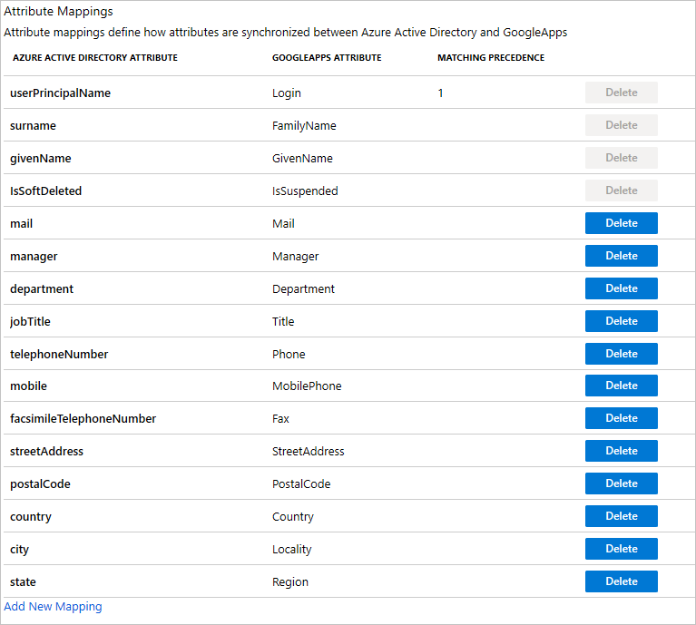
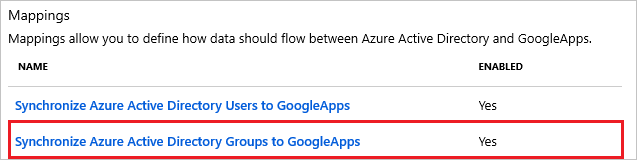

# Tutorial: Configure G Suite for automatic user provisioning

The objective of this tutorial is to demonstrate the steps to be performed in G Suite and Azure Active Directory (Azure AD) to configure Azure AD to automatically provision and de-provision users and/or groups to G Suite.

> [!NOTE]
> This tutorial describes a connector built on top of the Azure AD User Provisioning Service. For important details on what this service does, how it works, and frequently asked questions, see [Automate user provisioning and deprovisioning to SaaS applications with Azure Active Directory](../app-provisioning/user-provisioning.md).

> [!NOTE]
> The G Suite connector was recently updated on October 2019. Changes made to the G Suite connector include:
> - Added support for additional G Suite user and group attributes. 
> - Updated G Suite target attribute names to match what is defined [here](https://developers.google.com/admin-sdk/directory).
> - Updated default attribute mappings.

## Prerequisites

To configure Azure AD integration with G Suite, you need the following items:

- An Azure AD tenant
- [A G Suite tenant](https://gsuite.google.com/pricing.html)
- A user account on a G Suite with Admin permissions.

## Assign users to G Suite

Azure Active Directory uses a concept called assignments to determine which users should receive access to selected apps. In the context of automatic user provisioning, only the users and/or groups that have been assigned to an application in Azure AD are synchronized.

Before configuring and enabling automatic user provisioning, you should decide which users and/or groups in Azure AD need access to G Suite. Once decided, you can assign these users and/or groups to G Suite by following the instructions here:

* [Assign a user or group to an enterprise app](../manage-apps/assign-user-or-group-access-portal.md)

### Important tips for assigning users to G Suite

* It is recommended that a single Azure AD user is assigned to G Suite to test the automatic user provisioning configuration. Additional users and/or groups may be assigned later.

* When assigning a user to G Suite, you must select any valid application-specific role (if available) in the assignment dialog. Users with the **Default Access** role are excluded from provisioning.

## Setup G Suite for provisioning

Before configuring G Suite for automatic user provisioning with Azure AD, you will need to enable SCIM provisioning on G Suite.

1. Sign in to the [G Suite Admin console](https://admin.google.com/) with your administrator account, and then select **Security**. If you don't see the link, it might be hidden under the **More Controls** menu at the bottom of the screen.

    ![Select security.][10]

1. On the **Security** page, select **API Reference**.

    ![Select API Reference.][15]

1. Select **Enable API access**.

    ![Select API Reference.][16]

   > [!IMPORTANT]
   > For every user that you intend to provision to G Suite, their user name in Azure AD **must** be tied to a custom domain. For example, user names that look like bob@contoso.onmicrosoft.com are not accepted by G Suite. On the other hand, bob@contoso.com is accepted. You can change an existing user's domain by following the instructions [here](https://docs.microsoft.com/azure/active-directory/fundamentals/add-custom-domain).

1. Once you have added and verified your desired custom domains with Azure AD, you must verify them again with G Suite. To verify domains in G Suite, refer to the following steps:

    a. In the [G Suite Admin Console](https://admin.google.com/), select **Domains**.

    ![Select Domains][20]

    b. Select **Add a domain or a domain alias**.

    ![Add a new domain][21]

    c. Select **Add another domain**, and then type in the name of the domain that you want to add.

    ![Type in your domain name][22]

    d. Select **Continue and verify domain ownership**. Then follow the steps to verify that you own the domain name. For comprehensive instructions on how to verify your domain with Google, see [Verify your site ownership](https://support.google.com/webmasters/answer/35179).

    e. Repeat the preceding steps for any additional domains that you intend to add to G Suite.

1. Next, determine which admin account you want to use to manage user provisioning in G Suite. Navigate to **Admin Roles**.

    ![Select Google Apps][26]

1. For the **Admin role** of that account, edit the **Privileges** for that role. Make sure to enable all **Admin API Privileges** so that this account can be used for provisioning.

    ![Select Google Apps][27]

## Add G Suite from the gallery

To configure G Suite for automatic user provisioning with Azure AD, you will need to add G Suite from the Azure AD application gallery to your list of managed SaaS applications. 

1. In the **[Azure portal](https://portal.azure.com)**, in the left navigation panel, select **Azure Active Directory**.

	

1. Go to **Enterprise applications**, and then select **All applications**.

	

1. To add a new application, select the **New application** button at the top of the pane.

	

1. In the search box, enter **G Suite**, select **G Suite** in the results panel, and then click the **Add** button to add the application.

	

## Configuring automatic user provisioning to G Suite 

This section guides you through the steps to configure the Azure AD provisioning service to create, update, and disable users and/or groups in G Suite based on user and/or group assignments in Azure AD.

> [!TIP]
> You may also choose to enable SAML-based single sign-on for G Suite , following the instructions provided in the [G Suite Single sign-on tutorial](https://docs.microsoft.com/azure/active-directory/saas-apps/google-apps-tutorial). Single sign-on can be configured independently of automatic user provisioning, though these two features compliment each other.

> [!NOTE]
> To learn more about G Suite's Directory API endpoint, refer to [Directory API](https://developers.google.com/admin-sdk/directory).

### To configure automatic user provisioning for G Suite in Azure AD:

1. Sign in to the [Azure portal](https://portal.azure.com). Select **Enterprise Applications**, then select **All applications**.

	

1. In the applications list, select **G Suite**.

	

1. Select the **Provisioning** tab.

	

1. Set the **Provisioning Mode** to **Automatic**.

	

1. Under the **Admin Credentials** section, select **Authorize**. It opens a Google authorization dialog box in a new browser window.

    

1. Confirm that you want to give Azure AD permissions to make changes to your G Suite tenant. Select **Accept**.

    ![Confirm permissions.][28]

1. In the Azure portal, select **Test Connection** to ensure that Azure AD can connect to your app. If the connection fails, ensure that your G Suite account has Team Admin permissions. Then try the **Authorize** step again.

1. In the **Notification Email** field, enter the email address of a person or group who should receive the provisioning error notifications and check the checkbox - **Send an email notification when a failure occurs**.

	

1. Click **Save**.

1. Under the **Mappings** section, select **Synchronize Azure Active Directory Users to G Suite**.

	

1. Review the user attributes that are synchronized from Azure AD to G Suite in the **Attribute Mapping** section. The attributes selected as **Matching** properties are used to match the user accounts in G Suite for update operations. Select the **Save** button to commit any changes.

	

1. Under the **Mappings** section, select **Synchronize Azure Active Directory Groups to G Suite**.

	

1. Review the group attributes that are synchronized from Azure AD to G Suite in the **Attribute Mapping** section. The attributes selected as **Matching** properties are used to match the groups in G Suite for update operations. Select the **Save** button to commit any changes. The UI displays the default set of attribute mappings between Azure AD and G Suite. You can choose to add additional attributes such as Org Unit by clicking add new mapping.

    

1. To configure scoping filters, refer to the following instructions provided in the [Scoping filter tutorial](../app-provisioning/define-conditional-rules-for-provisioning-user-accounts.md).

1. To enable the Azure AD provisioning service for G Suite, change the **Provisioning Status** to **On** in the **Settings** section.

	

1. Define the users and/or groups that you would like to provision to G Suite by choosing the desired values in **Scope** in the **Settings** section.

	

1. When you are ready to provision, click **Save**.

	

This operation starts the initial synchronization of all users and/or groups defined in **Scope** in the **Settings** section. The initial sync takes longer to perform than subsequent syncs, which occur approximately every 40 minutes as long as the Azure AD provisioning service is running. You can use the **Synchronization Details** section to monitor progress and follow links to provisioning activity report, which describes all actions performed by the Azure AD provisioning service on G Suite.

> [!NOTE]
> If the users already have an existing personal/consumer account using the email address of the Azure AD user, then it may cause some issue which could be resolved by using the Google Transfer Tool prior to performing the directory sync.

For more information on how to read the Azure AD provisioning logs, see [Reporting on automatic user account provisioning](../app-provisioning/check-status-user-account-provisioning.md).

## Additional resources

* [Managing user account provisioning for Enterprise Apps](../app-provisioning/configure-automatic-user-provisioning-portal.md)
* [What is application access and single sign-on with Azure Active Directory?](../manage-apps/what-is-single-sign-on.md)

## Common issues
* Authorization failures can occur when the account used to establish a connection is not for an administrator in GSuite. Ensure that the account used to authorize access has admin permissions over **all domains** that users need to be provisioned with. 
* Azure AD supports disabling users in GSuite so that they cannot access the application, but it does not delete users in GSuite.

## Next steps

* [Learn how to review logs and get reports on provisioning activity](../app-provisioning/check-status-user-account-provisioning.md)

<!--Image references-->

[10]: ./media/google-apps-provisioning-tutorial/gapps-security.png
[15]: ./media/google-apps-provisioning-tutorial/gapps-api.png
[16]: ./media/google-apps-provisioning-tutorial/gapps-api-enabled.png
[20]: ./media/google-apps-provisioning-tutorial/gapps-domains.png
[21]: ./media/google-apps-provisioning-tutorial/gapps-add-domain.png
[22]: ./media/google-apps-provisioning-tutorial/gapps-add-another.png
[24]: ./media/google-apps-provisioning-tutorial/gapps-provisioning.png
[25]: ./media/google-apps-provisioning-tutorial/gapps-provisioning-auth.png
[26]: ./media/google-apps-provisioning-tutorial/gapps-admin.png
[27]: ./media/google-apps-provisioning-tutorial/gapps-admin-privileges.png
[28]: ./media/google-apps-provisioning-tutorial/gapps-auth.png
