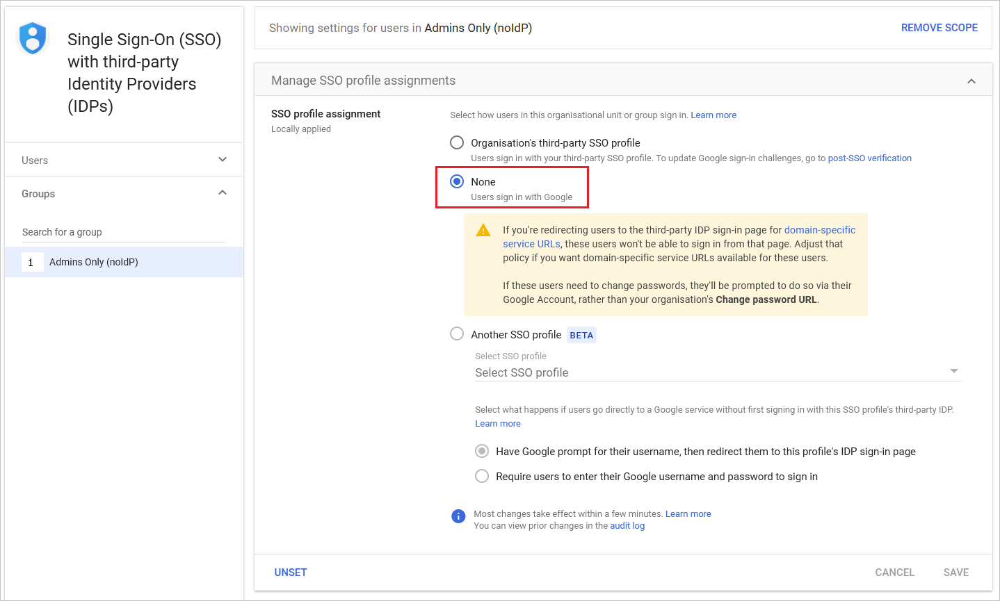
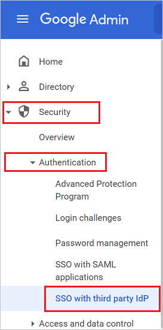
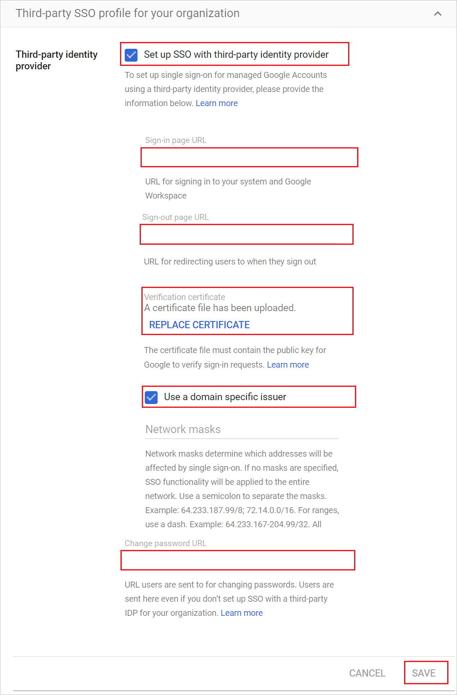

# Tutorial: Microsoft Entra SSO integration with Google Cloud / G Suite Connector by Microsoft

In this tutorial, you'll learn how to integrate Google Cloud / G Suite Connector by Microsoft with Microsoft Entra ID. When you integrate Google Cloud / G Suite Connector by Microsoft with Microsoft Entra ID, you can:

* Control in Microsoft Entra ID who has access to Google Cloud / G Suite Connector by Microsoft.
* Enable your users to be automatically signed-in to Google Cloud / G Suite Connector by Microsoft with their Microsoft Entra accounts.
* Manage your accounts in one central location.

## Prerequisites

To get started, you need the following items:

* A Microsoft Entra subscription.
* Google Cloud / G Suite Connector by Microsoft single sign-on (SSO) enabled subscription.
* A Google Apps subscription or Google Cloud Platform subscription.

> [!NOTE]
> To test the steps in this tutorial, we do not recommend using a production environment. This document was created using the new user Single-Sign-on experience. If you are still using the old one, the setup will look different. You can enable the new experience in the Single Sign-on settings of G-Suite application. Go to **Microsoft Entra ID** > **Enterprise applications**, select **Google Cloud / G Suite Connector by Microsoft**, select **Single Sign-on** and then click on **Try out our new experience**.

To test the steps in this tutorial, you should follow these recommendations:

* Do not use your production environment, unless it is necessary.
* If you don't have a subscription, you can get a [free account](https://azure.microsoft.com/free/).

## Frequently Asked Questions

1. **Q: Does this integration support Google Cloud Platform SSO integration with Microsoft Entra ID?**

	A: Yes. Google Cloud Platform and Google Apps share the same authentication platform. So to do the GCP integration you need to configure the SSO with Google Apps.

2. **Q: Are Chromebooks and other Chrome devices compatible with Microsoft Entra single sign-on?**
  
    A: Yes, users are able to sign into their Chromebook devices using their Microsoft Entra credentials. See this [Google Cloud / G Suite Connector by Microsoft support article](https://support.google.com/chrome/a/answer/6060880) for information on why users may get prompted for credentials twice.

3. **Q: If I enable single sign-on, will users be able to use their Microsoft Entra credentials to sign into any Google product, such as Google Classroom, GMail, Google Drive, YouTube, and so on?**

    A: Yes, depending on [which Google Cloud / G Suite Connector by Microsoft](https://support.google.com/a/answer/182442?hl=en&ref_topic=1227583) you choose to enable or disable for your organization.

4. **Q: Can I enable single sign-on for only a subset of my Google Cloud / G Suite Connector by Microsoft users?**

    A: Yes, the SSO profiles can be selected per User, Organizational Unit or Group in the Google Workspace.

    

    Select the SSO profile as "none" for the Google Workspace group. This prevents members of this (Google Workspace group) from being redirected to Microsoft Entra ID for logon.

5. **Q: If a user is signed in through Windows, are they automatically authenticate to Google Cloud / G Suite Connector by Microsoft without getting prompted for a password?**

    A: There are two options for enabling this scenario. First, users could sign into Windows 10 devices via [Microsoft Entra join](../devices/overview.md). Alternatively, users could sign into Windows devices that are domain-joined to an on-premises Active Directory that has been enabled for single sign-on to Microsoft Entra ID via an [Active Directory Federation Services (AD FS)](../hybrid/plan-connect-user-signin.md) deployment. Both options require you to perform the steps in the following tutorial to enable single sign-on between Microsoft Entra ID and Google Cloud / G Suite Connector by Microsoft.

6. **Q: What should I do when I get an "invalid email" error message?**

	A: For this setup, the email attribute is required for the users to be able to sign-in. This attribute cannot be set manually.

	The email attribute is autopopulated for any user with a valid Exchange license. If user is not email-enabled, this error will be received as the application needs to get this attribute to give access.

	You can go to portal.office.com with an Admin account, then click in the Admin center, billing, subscriptions, select your Microsoft 365 Subscription and then click on assign to users, select the users you want to check their subscription and in the right pane, click on edit licenses.

	Once the Microsoft 365 license is assigned, it may take some minutes to be applied. After that, the user.mail attribute will be autopopulated and the issue should be resolved.

## Scenario description

In this tutorial, you configure and test Microsoft Entra SSO in a test environment.

* Google Cloud / G Suite Connector by Microsoft supports **SP** initiated SSO.

* Google Cloud / G Suite Connector by Microsoft supports [**Automated** user provisioning](./g-suite-provisioning-tutorial.md).

## Adding Google Cloud / G Suite Connector by Microsoft from the gallery

To configure the integration of Google Cloud / G Suite Connector by Microsoft into Microsoft Entra ID, you need to add Google Cloud / G Suite Connector by Microsoft from the gallery to your list of managed SaaS apps.

1. Sign in to the [Microsoft Entra admin center](https://entra.microsoft.com) as at least a [Cloud Application Administrator](../roles/permissions-reference.md#cloud-application-administrator).
1. Browse to **Identity** > **Applications** > **Enterprise applications** > **New application**.
1. In the **Add from the gallery** section, type **Google Cloud / G Suite Connector by Microsoft** in the search box.
1. Select **Google Cloud / G Suite Connector by Microsoft** from results panel and then add the app. Wait a few seconds while the app is added to your tenant.

 Alternatively, you can also use the [Enterprise App Configuration Wizard](https://portal.office.com/AdminPortal/home?Q=Docs#/azureadappintegration). In this wizard, you can add an application to your tenant, add users/groups to the app, assign roles, as well as walk through the SSO configuration as well. [Learn more about Microsoft 365 wizards.](/microsoft-365/admin/misc/azure-ad-setup-guides)

<a name='configure-and-test-azure-ad-single-sign-on-for-google-cloud--g-suite-connector-by-microsoft'></a>

## Configure and test Microsoft Entra single sign-on for Google Cloud / G Suite Connector by Microsoft

Configure and test Microsoft Entra SSO with Google Cloud / G Suite Connector by Microsoft using a test user called **B.Simon**. For SSO to work, you need to establish a link relationship between a Microsoft Entra user and the related user in Google Cloud / G Suite Connector by Microsoft.

To configure and test Microsoft Entra SSO with Google Cloud / G Suite Connector by Microsoft, perform the following steps:

1. **[Configure Microsoft Entra SSO](#configure-azure-ad-sso)** - to enable your users to use this feature.
    1. **[Create a Microsoft Entra test user](#create-an-azure-ad-test-user)** - to test Microsoft Entra single sign-on with B.Simon.
    1. **[Assign the Microsoft Entra test user](#assign-the-azure-ad-test-user)** - to enable B.Simon to use Microsoft Entra single sign-on.
1. **[Configure Google Cloud/G Suite Connector by Microsoft SSO](#configure-google-cloudg-suite-connector-by-microsoft-sso)** - to configure the single sign-on settings on application side.
    1. **[Create Google Cloud/G Suite Connector by Microsoft test user](#create-google-cloudg-suite-connector-by-microsoft-test-user)** - to have a counterpart of B.Simon in Google Cloud / G Suite Connector by Microsoft that is linked to the Microsoft Entra representation of user.
1. **[Test SSO](#test-sso)** - to verify whether the configuration works.

<a name='configure-azure-ad-sso'></a>

## Configure Microsoft Entra SSO

Follow these steps to enable Microsoft Entra SSO.

1. Sign in to the [Microsoft Entra admin center](https://entra.microsoft.com) as at least a [Cloud Application Administrator](../roles/permissions-reference.md#cloud-application-administrator).
1. Browse to **Identity** > **Applications** > **Enterprise applications** > **Google Cloud / G Suite Connector by Microsoft** > **Single sign-on**.
1. On the **Select a single sign-on method** page, select **SAML**.
1. On the **Set up single sign-on with SAML** page, click the pencil icon for **Basic SAML Configuration** to edit the settings.

   

1. On the **Basic SAML Configuration** section, if you want to configure for the **Gmail** perform the following steps:

    a. In the **Identifier** textbox, type a URL using one of the following patterns:

    | **Identifier** |
    |----|
    | `google.com/a/<yourdomain.com>` |
    | `google.com` |
    | `https://google.com` | 
    | `https://google.com/a/<yourdomain.com>` |

    b. In the **Reply URL** textbox, type a URL using one of the following patterns: 

    | **Reply URL** |
    |-----|
    | `https://www.google.com` |
    | `https://www.google.com/a/<yourdomain.com>` |
    
    c. In the **Sign on URL** textbox, type a URL using the following pattern: 
    `https://www.google.com/a/<yourdomain.com>/ServiceLogin?continue=https://mail.google.com`

1. On the **Basic SAML Configuration** section, if you want to configure for the **Google Cloud Platform** perform the following steps:

    a. In the **Identifier** textbox, type a URL using one of the following patterns:
	
    | **Identifier** |
    |-----|
    | `google.com/a/<yourdomain.com>` |
    | `google.com` |
    | `https://google.com` |
    | `https://google.com/a/<yourdomain.com>` |
    
    b. In the **Reply URL** textbox, type a URL using one of the following patterns: 
    
    | **Reply URL** |
    |-----|
    | `https://www.google.com/acs` |
    | `https://www.google.com/a/<yourdomain.com>/acs` |
    
    c. In the **Sign on URL** textbox, type a URL using the following pattern:
    `https://www.google.com/a/<yourdomain.com>/ServiceLogin?continue=https://console.cloud.google.com`

    > [!NOTE]
	> These values are not real. Update these values with the actual Identifier,Reply URL and Sign on URL. Google Cloud / G Suite Connector by Microsoft doesn't provide Entity ID/Identifier value on Single Sign On configuration so when you uncheck the **domain specific issuer** option the Identifier value will be `google.com`. If you check the **domain specific issuer** option it will be `google.com/a/<yourdomainname.com>`. To check/uncheck the **domain specific issuer** option you need to go to the **Configure Google Cloud / G Suite Connector by Microsoft SSO** section which is explained later in the tutorial. For more information contact [Google Cloud / G Suite Connector by Microsoft Client support team](https://www.google.com/contact/).

1. Your Google Cloud / G Suite Connector by Microsoft application expects the SAML assertions in a specific format, which requires you to add custom attribute mappings to your SAML token attributes configuration. The following screenshot shows an example for this. The default value of **Unique User Identifier** is **user.userprincipalname** but Google Cloud / G Suite Connector by Microsoft expects this to be mapped with the user's email address. For that you can use **user.mail** attribute from the list or use the appropriate attribute value based on your organization configuration.

	

    > [!NOTE]
    > Ensure that the the SAML Response doesn't include any non-standard ASCII characters in the DisplayName and Surname attributes.

1. On the **Set up single sign-on with SAML** page, in the **SAML Signing Certificate** section,  find **Certificate (Base64)** and select **Download** to download the certificate and save it on your computer.

	

1. On the **Set up Google Cloud / G Suite Connector by Microsoft** section, copy the appropriate URL(s) based on your requirement.

	

    ```Logout URL
    https://login.microsoftonline.com/common/wsfederation?wa=wsignout1.0
    ```

<a name='create-an-azure-ad-test-user'></a>

### Create a Microsoft Entra test user

In this section, you'll create a test user called B.Simon.

1. Sign in to the [Microsoft Entra admin center](https://entra.microsoft.com) as at least a [User Administrator](../roles/permissions-reference.md#user-administrator).
1. Browse to **Identity** > **Users** > **All users**.
1. Select **New user** > **Create new user**, at the top of the screen.
1. In the **User** properties, follow these steps:
   1. In the **Display name** field, enter `B.Simon`.  
   1. In the **User principal name** field, enter the username@companydomain.extension. For example, `B.Simon@contoso.com`.
   1. Select the **Show password** check box, and then write down the value that's displayed in the **Password** box.
   1. Select **Review + create**.
1. Select **Create**.

<a name='assign-the-azure-ad-test-user'></a>

### Assign the Microsoft Entra test user

In this section, you'll enable B.Simon to use single sign-on by granting access to Google Cloud / G Suite Connector by Microsoft.

1. Sign in to the [Microsoft Entra admin center](https://entra.microsoft.com) as at least a [Cloud Application Administrator](../roles/permissions-reference.md#cloud-application-administrator).
1. Browse to **Identity** > **Applications** > **Enterprise applications** > **Google Cloud / G Suite Connector by Microsoft**.
1. In the app's overview page, select **Users and groups**.
1. Select **Add user/group**, then select **Users and groups** in the **Add Assignment** dialog.
   1. In the **Users and groups** dialog, select **B.Simon** from the Users list, then click the **Select** button at the bottom of the screen.
   1. If you are expecting a role to be assigned to the users, you can select it from the **Select a role** dropdown. If no role has been set up for this app, you see "Default Access" role selected.
   1. In the **Add Assignment** dialog, click the **Assign** button.

## Configure Google Cloud/G Suite Connector by Microsoft SSO

1. Open a new tab in your browser, and sign into the [Google Cloud / G Suite Connector by Microsoft Admin Console](https://admin.google.com/) using your administrator account.

1. Go to the **Menu -> Security -> Authentication -> SSO with third party IDP**.

    

4. Perform the following configuration changes in the **Third-party SSO profile for your organization** tab:

    

    a. Turn ON the **SSO profile for your organization**.

    b. In the **Sign-in page URL** field in Google Cloud / G Suite Connector by Microsoft, paste the value of **Login URL**..

    c. In the **Sign-out page URL** field in Google Cloud / G Suite Connector by Microsoft, paste the value of **Logout URL**..

    d. In Google Cloud / G Suite Connector by Microsoft, for the **Verification certificate**, upload the certificate that you have downloaded previously.   

    e. Check/Uncheck the **Use a domain specific issuer** option as per the note mentioned in the above **Basic SAML Configuration** section in the Microsoft Entra ID.

	f. In the **Change password URL** field in Google Cloud / G Suite Connector by Microsoft, enter the value as `https://account.activedirectory.windowsazure.com/changepassword.aspx`

    g. Click **Save**.

### Create Google Cloud/G Suite Connector by Microsoft test user

The objective of this section is to [create a user in Google Cloud / G Suite Connector by Microsoft](https://support.google.com/a/answer/33310?hl=en) called B.Simon. After the user has manually been created in Google Cloud / G Suite Connector by Microsoft, the user will now be able to sign in using their Microsoft 365 login credentials.

Google Cloud / G Suite Connector by Microsoft also supports automatic user provisioning. To configure automatic user provisioning, you must first [configure Google Cloud / G Suite Connector by Microsoft for automatic user provisioning](./g-suite-provisioning-tutorial.md).

> [!NOTE]
> Make sure that your user already exists in Google Cloud / G Suite Connector by Microsoft if provisioning in Microsoft Entra ID has not been turned on before testing Single Sign-on.

> [!NOTE]
> If you need to create a user manually, contact the [Google support team](https://www.google.com/contact/).

## Test SSO 

In this section, you test your Microsoft Entra single sign-on configuration with following options. 

* Click on **Test this application**, this will redirect to Google Cloud / G Suite Connector by Microsoft Sign-on URL where you can initiate the login flow. 

* Go to Google Cloud / G Suite Connector by Microsoft Sign-on URL directly and initiate the login flow from there.

* You can use Microsoft My Apps. When you click the Google Cloud / G Suite Connector by Microsoft tile in the My Apps, this will redirect to Google Cloud / G Suite Connector by Microsoft Sign-on URL. For more information about the My Apps, see [Introduction to the My Apps](https://support.microsoft.com/account-billing/sign-in-and-start-apps-from-the-my-apps-portal-2f3b1bae-0e5a-4a86-a33e-876fbd2a4510).

## Next steps

Once you configure Google Cloud / G Suite Connector by Microsoft you can enforce Session Control, which protects exfiltration and infiltration of your organization’s sensitive data in real time. Session Control extends from Conditional Access. [Learn how to enforce session control with Microsoft Defender for Cloud Apps](/cloud-app-security/proxy-deployment-aad).
