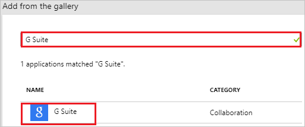
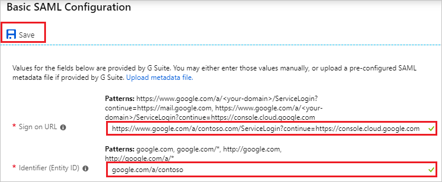
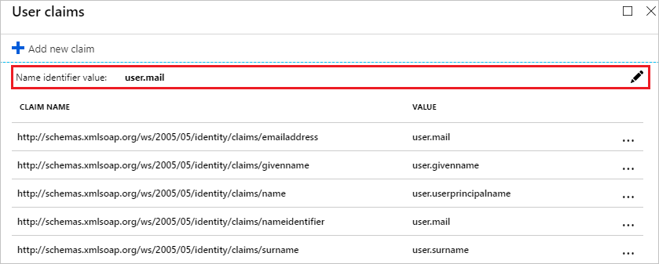
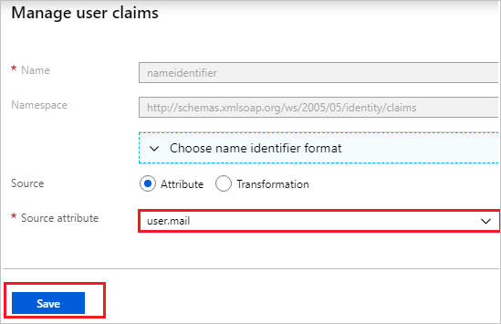

# Tutorial: Azure Active Directory integration with G Suite

In this tutorial, you learn how to integrate G Suite with Azure Active Directory (Azure AD).

Integrating G Suite with Azure AD provides you with the following benefits:

- You can control in Azure AD who has access to G Suite.
- You can enable your users to automatically get signed-on to G Suite (Single Sign-On) with their Azure AD accounts.
- You can manage your accounts in one central location - the Azure portal.

If you want to know more details about SaaS app integration with Azure AD, see [what is application access and single sign-on with Azure Active Directory](../manage-apps/what-is-single-sign-on.md)

## Prerequisites

To configure Azure AD integration with G Suite, you need the following items:

- An Azure AD subscription
- A G Suite single sign-on enabled subscription
- A Google Apps subscription or Google Cloud Platform subscription.

> [!NOTE]
> To test the steps in this tutorial, we do not recommend using a production environment. This document was created using the new user Single-Sign-on experience. If you are still using the old one, the setup will look diferent. You can enable the new experience in the Single Sign-on settings of G-Suite application. Go to **Azure AD, Enterprise applications**, select **G Suite**, select **Single Sign-on** and then click on **Try out our new experience**.

To test the steps in this tutorial, you should follow these recommendations:

- Do not use your production environment, unless it is necessary.
- If you don't have an Azure AD trial environment, you can [get a one-month trial](https://azure.microsoft.com/pricing/free-trial/).

## Frequently Asked Questions

1. **Q: Does this integration support Google Cloud Platform SSO integration with Azure AD?**

	A: Yes. Google Cloud Platform and Google Apps share the same authentication platform. So to do the GCP integration you need to configure the SSO with Google Apps.

2. **Q: Are Chromebooks and other Chrome devices compatible with Azure AD single sign-on?**
  
    A: Yes, users are able to sign into their Chromebook devices using their Azure AD credentials. See this [G Suite support article](https://support.google.com/chrome/a/answer/6060880) for information on why users may get prompted for credentials twice.

3. **Q: If I enable single sign-on, will users be able to use their Azure AD credentials to sign into any Google product, such as Google Classroom, GMail, Google Drive, YouTube, and so on?**

    A: Yes, depending on [which G Suite](https://support.google.com/a/answer/182442?hl=en&ref_topic=1227583) you choose to enable or disable for your organization.

4. **Q: Can I enable single sign-on for only a subset of my G Suite users?**

    A: No, turning on single sign-on immediately requires all your G Suite users to authenticate with their Azure AD credentials. Because G Suite doesn't support having multiple identity providers, the identity provider for your G Suite environment can either be Azure AD or Google -- but not both at the same time.

5. **Q: If a user is signed in through Windows, are they automatically authenticate to G Suite without getting prompted for a password?**

    A: There are two options for enabling this scenario. First, users could sign into Windows 10 devices via [Azure Active Directory Join](../device-management-introduction.md). Alternatively, users could sign into Windows devices that are domain-joined to an on-premises Active Directory that has been enabled for single sign-on to Azure AD via an [Active Directory Federation Services (AD FS)](../hybrid/plan-connect-user-signin.md) deployment. Both options require you to perform the steps in the following tutorial to enable single sign-on between Azure AD and G Suite.

6. **Error: Invalid Email**

	For this setup, the email attribute is required for the users to be able to sign-in. This attribute cannot be set manually.

	The email attribute is autopopulated for any user with a valid Exchange license. If user is not email-enabled, this error will be received as the application needs to get this attribute to give access.

	You can go to portal.office.com with an Admin account, then click in the Admin center, billing, subscriptions, select your Office 365 Subscription and then click on assign to users, select the users you want to check their subscription and in the right pane, click on edit licenses.

	Once the O365 license is assigned, it may take some minutes to be applied. After that, the user.mail attribute will be autopopulated and the issue should be resolved.

## Scenario description

In this tutorial, you test Azure AD single sign-on in a test environment. 
The scenario outlined in this tutorial consists of two main building blocks:

1. Adding G Suite from the gallery
2. Configuring and testing Azure AD single sign-on

## Adding G Suite from the gallery

To configure the integration of G Suite into Azure AD, you need to add G Suite from the gallery to your list of managed SaaS apps.

**To add G Suite from the gallery, perform the following steps:**

1. In the **[Azure portal](https://portal.azure.com)**, on the left navigation panel, click **Azure Active Directory** icon. 

	![The Azure Active Directory button][1]

2. Navigate to **Enterprise applications**. Then go to **All applications**.

	![The Enterprise applications blade][2]

3. To add new application, click **New application** button on the top of dialog.

	![The New application button][3]

4. In the search box, type **G Suite**, select **G Suite** from result panel then click **Add** button to add the application.

	

## Configure and test Azure AD single sign-on

In this section, you configure and test Azure AD single sign-on with G Suite based on a test user called "Britta Simon".

For single sign-on to work, Azure AD needs to know what the counterpart user in G Suite is to a user in Azure AD. In other words, a link relationship between an Azure AD user and the related user in G Suite needs to be established.

To configure and test Azure AD single sign-on with G Suite, you need to complete the following building blocks:

1. **[Configuring Azure AD Single Sign-On](#configuring-azure-ad-single-sign-on)** - to enable your users to use this feature.
2. **[Creating an Azure AD test user](#creating-an-azure-ad-test-user)** - to test Azure AD single sign-on with Britta Simon.
3. **[Creating a G Suite test user](#creating-a-g-suite-test-user)** - to have a counterpart of Britta Simon in G Suite that is linked to the Azure AD representation of user.
4. **[Assigning the Azure AD test user](#assigning-the-azure-ad-test-user)** - to enable Britta Simon to use Azure AD single sign-on.
5. **[Testing single sign-on](#testing-single-sign-on)** - to verify whether the configuration works.

### Configuring Azure AD single sign-on

In this section, you enable Azure AD single sign-on in the Azure portal and configure single sign-on in your G Suite application.

**To configure Azure AD single sign-on with G Suite, perform the following steps:**

1. In the Azure portal, on the **G Suite** application integration page, click **Single sign-on**.

	![Configure single sign-on link][4]

2. On the **Select a Single sign-on method** dialog, Click **Select** for **SAML** mode to enable single sign-on.

    

3. On the **Set up Single Sign-On with SAML** page, click **Edit** icon to open **Basic SAML Configuration** dialog.

	

4. On the **Basic SAML Configuration** section, perform the following steps:

	

	a. In the **Sign-on URL** textbox, type a URL using the following pattern: `https://www.google.com/a/<yourdomain.com>/ServiceLogin?continue=https://mail.google.com`

    b. In the **Identifier** textbox, type a URL using the following pattern:
	| |
	|--|
	| `google.com/a/<yourdomain.com>` |
	| `google.com` |
	| `https://google.com` |
	| `https://google.com/a/<yourdomain.com>` |

	> [!NOTE]
	> These values are not real. Update these values with the actual Sign-On URL and Identifier. Contact [G Suite Client support team](https://www.google.com/contact/) to get these values.

5. G Suite application expects the SAML assertions in a specific format. Configure the following claims for this application. You can manage the values of these attributes from the **User Attributes** section on application integration page. On the **Set up Single Sign-On with SAML** page, click **Edit** button to open **User Attributes** dialog.

	

6. In the **User Claims** section on the **User Attributes** dialog, configure SAML token attribute as shown in the image above and perform the following steps:

	a. Click **Edit** button to open the **Manage user claims** dialog.

	

	

	b. From the **Source attribute** list, selelct the attribute value.

	c. Click **Save**.

5. On the **SAML Signing Certificate** page, in the **SAML Signing Certificate** section, click **Download** to download **Certificate (Base64)** and then save certificate file on your computer.

	 

6. On the **Set up G Suite** section, copy the appropriate URL as per your requirement.

	a. Login URL

	b. Azure AD Identifier

	c. Logout URL

	

9. Open a new tab in your browser, and sign into the [G Suite Admin Console](https://admin.google.com/) using your administrator account.

10. Click **Security**. If you don't see the link, it may be hidden under the **More Controls** menu at the bottom of the screen.

    ![Click Security.][10]

11. On the **Security** page, click **Set up single sign-on (SSO).**

    ![Click SSO.][11]

12. Perform the following configuration changes:

    ![Configure SSO][12]

    a. Select **Setup SSO with third-party identity provider**.

    b. In the **Sign-in page URL** field in G Suite, paste the value of **Login URL** which you have copied from Azure portal.

    c. In the **Sign-out page URL** field in G Suite, paste the value of **Logout URL** which you have copied from Azure portal.

    d. In the **Change password URL** field in G Suite, paste the value of **Change password URL** which you have copied from Azure portal.

    e. In G Suite, for the **Verification certificate**, upload the certificate that you have downloaded from Azure portal.

	f. Select **Use a domain specific issuer**.

    g. Click **Save Changes**.

### Creating an Azure AD test user

The objective of this section is to create a test user in the Azure portal called Britta Simon.

1. In the Azure portal, in the left pane, select **Azure Active Directory**, select **Users**, and then select **All users**.

	![Create Azure AD User][100]

2. Select **New user** at the top of the screen.

	 

3. In the User properties, perform the following steps.

	

    a. In the **Name** field, enter **BrittaSimon**.
  
    b. In the **User name** field, type **brittasimon@yourcompanydomain.extension**  
    For example, BrittaSimon@contoso.com

    c. Select **Properties**, select the **Show password** check box, and then write down the value that's displayed in the Password box.

    d. Select **Create**.

### Creating a G Suite test user

The objective of this section is to create a user called Britta Simon in G Suite Software. G Suite supports auto provisioning, which is by default enabled. There is no action for you in this section. If a user doesn't already exist in G Suite Software, a new one is created when you attempt to access G Suite Software.

> [!NOTE]
> Make sure that your user already exists in G Suite if provisioning in Azure AD has not been turned on before testing Single Sign-on.

> [!NOTE]
> If you need to create a user manually, contact the [Google support team](https://www.google.com/contact/).

### Assigning the Azure AD test user

In this section, you enable Britta Simon to use Azure single sign-on by granting access to G Suite.

1. In the Azure portal, select **Enterprise Applications**, select **All applications**.

	![Assign User][201]

2. In the applications list, select **G Suite**.

	

3. In the menu on the left, click **Users and groups**.

	![Assign User][202]

4. Click **Add** button. Then select **Users and groups** on **Add Assignment** dialog.

	![Assign User][203]

5. In the **Users and groups** dialog select **Britta Simon** in the Users list, then click the **Select** button at the bottom of the screen.

6. In the **Add Assignment** dialog select the **Assign** button.

### Testing single sign-on

In this section, you test your Azure AD single sign-on configuration using the Access Panel.

When you click the G Suite tile in the Access Panel, you should get automatically signed-on to your G Suite application.
For more information about the Access Panel, see [Introduction to the Access Panel](../user-help/active-directory-saas-access-panel-introduction.md).

## Additional resources

* [List of Tutorials on How to Integrate SaaS Apps with Azure Active Directory](tutorial-list.md)
* [What is application access and single sign-on with Azure Active Directory?](../manage-apps/what-is-single-sign-on.md)

<!--Image references-->

[1]: common/tutorial_general_01.png
[2]: common/tutorial_general_02.png
[3]: common/tutorial_general_03.png
[4]: common/tutorial_general_04.png

[100]: common/tutorial_general_100.png

[201]: common/tutorial_general_201.png
[202]: common/tutorial_general_202.png
[203]: common/tutorial_general_203.png
<!--Image references-->

[10]: ./media/google-apps-tutorial/gapps-security.png
[11]: ./media/google-apps-tutorial/security-gapps.png
[12]: ./media/google-apps-tutorial/gapps-sso-config.png