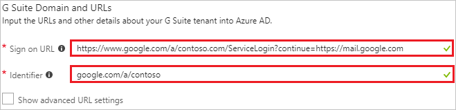
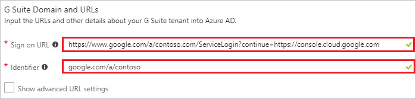
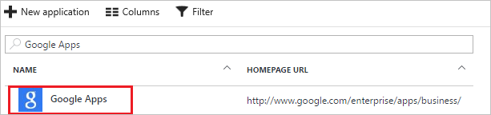

# Tutorial: Azure Active Directory integration with G Suite

In this tutorial, you learn how to integrate G Suite with Azure Active Directory (Azure AD).

Integrating G Suite with Azure AD provides you with the following benefits:

- You can control in Azure AD who has access to G Suite.
- You can enable your users to automatically get signed-on to G Suite (Single Sign-On) with their Azure AD accounts.
- You can manage your accounts in one central location - the Azure portal.

If you want to know more details about SaaS app integration with Azure AD, see [what is application access and single sign-on with Azure Active Directory](../manage-apps/what-is-single-sign-on.md).

## Prerequisites

To configure Azure AD integration with G Suite, you need the following items:

- An Azure AD subscription
- A G Suite single sign-on enabled subscription
- A Google Apps subscription or Google Cloud Platform subscription.

> [!NOTE]
> To test the steps in this tutorial, we do not recommend using a production environment.

To test the steps in this tutorial, you should follow these recommendations:

- Do not use your production environment, unless it is necessary.
- If you don't have an Azure AD trial environment, you can [get a one-month trial](https://azure.microsoft.com/pricing/free-trial/).

## Frequently Asked Questions
1.	**Q: Does this integration support Google Cloud Platform SSO integration with Azure AD?**
	
	A: Yes. Google Cloud Platform and Google Apps share the same authentication platform. So to do the GCP integration you need to configure the SSO with Google Apps.

1. **Q: Are Chromebooks and other Chrome devices compatible with Azure AD single sign-on?**
   
    A: Yes, users are able to sign into their Chromebook devices using their Azure AD credentials. See this [G Suite support article](https://support.google.com/chrome/a/answer/6060880) for information on why users may get prompted for credentials twice.

1. **Q: If I enable single sign-on, will users be able to use their Azure AD credentials to sign into any Google product, such as Google Classroom, GMail, Google Drive, YouTube, and so on?**
   
    A: Yes, depending on [which G Suite](https://support.google.com/a/answer/182442?hl=en&ref_topic=1227583) you choose to enable or disable for your organization.

1. **Q: Can I enable single sign-on for only a subset of my G Suite users?**
   
    A: No, turning on single sign-on immediately requires all your G Suite users to authenticate with their Azure AD credentials. Because G Suite doesn't support having multiple identity providers, the identity provider for your G Suite environment can either be Azure AD or Google -- but not both at the same time.

1. **Q: If a user is signed in through Windows, are they automatically authenticate to G Suite without getting prompted for a password?**
   
    A: There are two options for enabling this scenario. First, users could sign into Windows 10 devices via [Azure Active Directory Join](../device-management-introduction.md). Alternatively, users could sign into Windows devices that are domain-joined to an on-premises Active Directory that has been enabled for single sign-on to Azure AD via an [Active Directory Federation Services (AD FS)](../hybrid/plan-connect-user-signin.md) deployment. Both options require you to perform the steps in the following tutorial to enable single sign-on between Azure AD and G Suite.

## Scenario description
In this tutorial, you test Azure AD single sign-on in a test environment. 
The scenario outlined in this tutorial consists of two main building blocks:

1. Adding G Suite from the gallery
1. Configuring and testing Azure AD single sign-on

## Adding G Suite from the gallery
To configure the integration of G Suite into Azure AD, you need to add G Suite from the gallery to your list of managed SaaS apps.

**To add G Suite from the gallery, perform the following steps:**

1. In the **[Azure portal](https://portal.azure.com)**, on the left navigation panel, click **Azure Active Directory** icon. 

	![The Azure Active Directory button][1]

1. Navigate to **Enterprise applications**. Then go to **All applications**.

	![The Enterprise applications blade][2]
	
1. To add new application, click **New application** button on the top of dialog.

	![The New application button][3]

1. In the search box, type **G Suite**, select **G Suite** from result panel then click **Add** button to add the application.

	

## Configure and test Azure AD single sign-on

In this section, you configure and test Azure AD single sign-on with G Suite based on a test user called "Britta Simon".

For single sign-on to work, Azure AD needs to know what the counterpart user in G Suite is to a user in Azure AD. In other words, a link relationship between an Azure AD user and the related user in G Suite needs to be established.

In G Suite, assign the value of the **user name** in Azure AD as the value of the **Username** to establish the link relationship.

To configure and test Azure AD single sign-on with G Suite, you need to complete the following building blocks:

1. **[Configure Azure AD Single Sign-On](#configure-azure-ad-single-sign-on)** - to enable your users to use this feature.
1. **[Create an Azure AD test user](#create-an-azure-ad-test-user)** - to test Azure AD single sign-on with Britta Simon.
1. **[Create a G Suite test user](#create-a-g-suite-test-user)** - to have a counterpart of Britta Simon in G Suite that is linked to the Azure AD representation of user.
1. **[Assign the Azure AD test user](#assign-the-azure-ad-test-user)** - to enable Britta Simon to use Azure AD single sign-on.
1. **[Test single sign-on](#test-single-sign-on)** - to verify whether the configuration works.

### Configure Azure AD single sign-on

In this section, you enable Azure AD single sign-on in the Azure portal and configure single sign-on in your G Suite application.

**To configure Azure AD single sign-on with G Suite, perform the following steps:**

1. In the Azure portal, on the **G Suite** application integration page, click **Single sign-on**.

    ![Configure single sign-on link][4]

1. On the **Single sign-on** dialog, select **Mode** as **SAML-based Sign-on** to enable single sign-on.

    

1. On the **G Suite Domain and URLs** section, if you want to configure for the **Gmail** perform the following steps:

    

    a. In the **Sign-on URL** textbox, type a URL using the following pattern: `https://www.google.com/a/<yourdomain.com>/ServiceLogin?continue=https://mail.google.com`

    b. In the **Identifier** textbox, type a URL using the following pattern: 
	| |
	|--|
	| `google.com/a/<yourdomain.com>` |
	| `google.com` |
	| `http://google.com` |
	| `http://google.com/a/<yourdomain.com>` |
 
    > [!NOTE] 
	> These values are not real. Update these values with the actual Sign-On URL and Identifier. Contact [G Suite Client support team](https://www.google.com/contact/) to get these values.

1. On the **G Suite Domain and URLs** section, if you want to configure for the **Google Cloud Platform** perform the following steps:

    

    a. In the **Sign-on URL** textbox, type a URL using the following pattern: `https://www.google.com/a/<yourdomain.com>/ServiceLogin?continue=https://console.cloud.google.com `

    b. In the **Identifier** textbox, type a URL using the following pattern: 
	| |
	|--|
	| `google.com/a/<yourdomain.com>` |
	| `google.com` |
	| `http://google.com` |
	| `http://google.com/a/<yourdomain.com>` |
    
    > [!NOTE] 
	> These values are not real. Update these values with the actual Sign-On URL and Identifier. Contact [G Suite Client support team](https://www.google.com/contact/) to get these values. 

1. On the **SAML Signing Certificate** section, click **Certificate** and then save the certificate file on your computer.

	 

1. Click **Save** button.

	

1. On the **G Suite Configuration** section, click **Configure G Suite** to open **Configure sign-on** window. Copy the **Sign-Out URL, SAML Single Sign-On Service URL and Change password URL** from the **Quick Reference section.**

	 

1. Open a new tab in your browser, and sign into the [G Suite Admin Console](http://admin.google.com/) using your administrator account.

1. Click **Security**. If you don't see the link, it may be hidden under the **More Controls** menu at the bottom of the screen.
   
    ![Click Security.][10]

1. On the **Security** page, click **Set up single sign-on (SSO).**
   
    ![Click SSO.][11]

1. Perform the following configuration changes:
   
    ![Configure SSO][12]
   
    a. Select **Setup SSO with third-party identity provider**.

    b. In the **Sign-in page URL** field in G Suite, paste the value of **Single Sign-On Service URL** which you have copied from Azure portal.

    c. In the **Sign-out page URL** field in G Suite, paste the value of **Sign-Out URL** which you have copied from Azure portal. 

    d. In the **Change password URL** field in G Suite, paste the value of **Change password URL** which you have copied from Azure portal. 

    e. In G Suite, for the **Verification certificate**, upload the certificate that you have downloaded from Azure portal.

	f. Select **Use a domain specific issuer**.

    g. Click **Save Changes**.

> [!TIP]
> You can now read a concise version of these instructions inside the [Azure portal](https://portal.azure.com), while you are setting up the app!  After adding this app from the **Active Directory > Enterprise Applications** section, simply click the **Single Sign-On** tab and access the embedded documentation through the **Configuration** section at the bottom. You can read more about the embedded documentation feature here: [Azure AD embedded documentation]( https://go.microsoft.com/fwlink/?linkid=845985)
> 

### Create an Azure AD test user

The objective of this section is to create a test user in the Azure portal called Britta Simon.

   ![Create an Azure AD test user][100]

**To create a test user in Azure AD, perform the following steps:**

1. In the Azure portal, in the left pane, click the **Azure Active Directory** button.

    

1. To display the list of users, go to **Users and groups**, and then click **All users**.

    

1. To open the **User** dialog box, click **Add** at the top of the **All Users** dialog box.

    

1. In the **User** dialog box, perform the following steps:

    

    a. In the **Name** box, type **BrittaSimon**.

    b. In the **User name** box, type the email address of user Britta Simon.

    c. Select the **Show Password** check box, and then write down the value that's displayed in the **Password** box.

    d. Click **Create**.
 
### Create a G Suite test user

The objective of this section is to create a user called Britta Simon in G Suite Software. G Suite supports auto provisioning, which is by default enabled. There is no action for you in this section. If a user doesn't already exist in G Suite Software, a new one is created when you attempt to access G Suite Software.

>[!NOTE] 
>If you need to create a user manually, contact the [Google support team](https://www.google.com/contact/).

### Assign the Azure AD test user

In this section, you enable Britta Simon to use Azure single sign-on by granting access to G Suite.

![Assign the user role][200] 

**To assign Britta Simon to G Suite, perform the following steps:**

1. In the Azure portal, open the applications view, and then navigate to the directory view and go to **Enterprise applications** then click **All applications**.

	![Assign User][201] 

1. In the applications list, select **G Suite**.

      

1. In the menu on the left, click **Users and groups**.

	![The "Users and groups" link][202]

1. Click **Add** button. Then select **Users and groups** on **Add Assignment** dialog.

	![The Add Assignment pane][203]

1. On **Users and groups** dialog, select **Britta Simon** in the Users list.

1. Click **Select** button on **Users and groups** dialog.

1. Click **Assign** button on **Add Assignment** dialog.
	
### Test single sign-on

In this section, you test your Azure AD single sign-on configuration using the Access Panel.

When you click the G Suite tile in the Access Panel, you should get automatically signed-on to your G Suite application.
For more information about the Access Panel, see [Introduction to the Access Panel](../user-help/active-directory-saas-access-panel-introduction.md). 

## Additional resources

* [List of Tutorials on How to Integrate SaaS Apps with Azure Active Directory](tutorial-list.md)
* [What is application access and single sign-on with Azure Active Directory?](../manage-apps/what-is-single-sign-on.md)

<!--Image references-->

[1]: ./media/googleapps-tutorial/tutorial_general_01.png
[2]: ./media/googleapps-tutorial/tutorial_general_02.png
[3]: ./media/googleapps-tutorial/tutorial_general_03.png
[4]: ./media/googleapps-tutorial/tutorial_general_04.png

[100]: ./media/googleapps-tutorial/tutorial_general_100.png

[200]: ./media/googleapps-tutorial/tutorial_general_200.png
[201]: ./media/googleapps-tutorial/tutorial_general_201.png
[202]: ./media/googleapps-tutorial/tutorial_general_202.png
[203]: ./media/googleapps-tutorial/tutorial_general_203.png
[10]: ./media/googleapps-tutorial/gapps-security.png
[11]: ./media/googleapps-tutorial/security-gapps.png
[12]: ./media/googleapps-tutorial/gapps-sso-config.png

