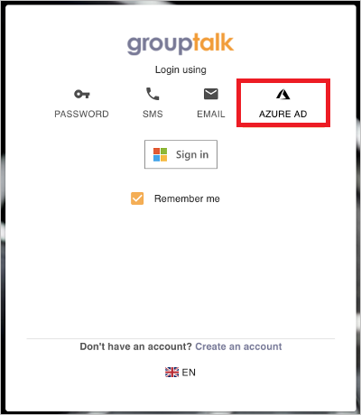

# Tutorial: Configure GroupTalk for automatic user provisioning

This tutorial describes the steps you need to perform in both GroupTalk and Microsoft Entra ID to configure automatic user provisioning. When configured, Microsoft Entra ID automatically provisions and de-provisions users and groups to [GroupTalk](https://www.grouptalk.com/) using the Microsoft Entra provisioning service. For important details on what this service does, how it works, and frequently asked questions, see [Automate user provisioning and deprovisioning to SaaS applications with Microsoft Entra ID](../app-provisioning/user-provisioning.md). 

## Capabilities Supported
> [!div class="checklist"]
> * Create users in GroupTalk
> * Remove users in GroupTalk when they do not require access anymore
> * Keep user attributes synchronized between Microsoft Entra ID and GroupTalk
> * Provision groups and group memberships in GroupTalk

## Prerequisites

The scenario outlined in this tutorial assumes that you already have the following prerequisites:

* [A Microsoft Entra tenant](../develop/quickstart-create-new-tenant.md) 
* A user account in Microsoft Entra ID with [permission](../roles/permissions-reference.md) to configure provisioning (for example, Application Administrator, Cloud Application administrator, Application Owner, or Global Administrator). 
* A user account in GroupTalk with Admin permissions.

## Step 1: Plan your provisioning deployment
1. Learn about [how the provisioning service works](../app-provisioning/user-provisioning.md).
2. Determine who will be in [scope for provisioning](../app-provisioning/define-conditional-rules-for-provisioning-user-accounts.md).
3. Determine what data to [map between Microsoft Entra ID and GroupTalk](../app-provisioning/customize-application-attributes.md). 

## Step 2: Configure GroupTalk to support provisioning with Microsoft Entra ID

1. Reach out to GroupTalk Support at support@grouptalk.com with the **Tenant name** and **ID** you would like to integrate with  Microsoft Entra ID.
2. When you've been notified that the necessary setup for your Microsoft Entra integration is ready, login to GroupTalk Admin and navigate to your Organization view. 
3. A Microsoft Entra Integration configuration item should be visible. Click on it to verify the **Tenant name** and **ID**  to obtain a **JWT (Secret Token)**. 
4. The GroupTalk Tenant URL is `https://api.grouptalk.com/api/scim/`. The **Tenant URL** and the **Secret Token** retrieved in the previous step will be entered in the Provisioning tab of your GroupTalk application. 

## Step 3: Add GroupTalk from the Microsoft Entra application gallery

Add **GroupTalk** from the Microsoft Entra application gallery to start managing provisioning to GroupTalk.

1. Click the **Sign up for GroupTalk** button, which will route you to the GroupTalk administrative application.
2. If you're already logged in to GroupTalk, logout to get to the login screen. Select the Microsoft Entra ID tab, and click the **Sign in** button.

	

3. Login with your AD Administrative account, and accept the GroupTalk application's access rights. You will get an error message after this is done indicating the user isn't present. This is expected since your user isn't provisioned to GroupTalk yet but you have now added GroupTalk to your tenant.
4. Go back to the Azure portal and verify that **GroupTalk** is now added to your Enterprise Applications.

Learn more about adding an application from the gallery [here](../manage-apps/add-application-portal.md). 

## Step 4: Define who will be in scope for provisioning 

The Microsoft Entra provisioning service allows you to scope who will be provisioned based on assignment to the application and or based on attributes of the user / group. If you choose to scope who will be provisioned to your app based on assignment, you can use the following [steps](../manage-apps/assign-user-or-group-access-portal.md) to assign users and groups to the application. If you choose to scope who will be provisioned based solely on attributes of the user or group, you can use a scoping filter as described [here](../app-provisioning/define-conditional-rules-for-provisioning-user-accounts.md). 

* Start small. Test with a small set of users and groups before rolling out to everyone. When scope for provisioning is set to assigned users and groups, you can control this by assigning one or two users or groups to the app. When scope is set to all users and groups, you can specify an [attribute based scoping filter](../app-provisioning/define-conditional-rules-for-provisioning-user-accounts.md).

* If you need additional roles, you can [update the application manifest](../develop/howto-add-app-roles-in-azure-ad-apps.md) to add new roles.

## Step 5: Configure automatic user provisioning to GroupTalk 

This section guides you through the steps to configure the Microsoft Entra provisioning service to create, update, and disable users and/or groups in TestApp based on user and/or group assignments in Microsoft Entra ID.

### To configure automatic user provisioning for GroupTalk in Microsoft Entra ID:

1. Sign in to the [Microsoft Entra admin center](https://entra.microsoft.com) as at least a [Cloud Application Administrator](../roles/permissions-reference.md#cloud-application-administrator).
1. Browse to **Identity** > **Applications** > **Enterprise applications**

	

1. In the applications list, select **GroupTalk**.

	

3. Select the **Provisioning** tab.

	

4. Set the **Provisioning Mode** to **Automatic**.

	

5. Under the **Admin Credentials** section, input your GroupTalk Tenant URL and Secret Token retrieved earlier from Step 2. Click **Test Connection** to ensure Microsoft Entra ID can connect to GroupTalk. If the connection fails, ensure your GroupTalk account has Admin permissions and try again. You can always obtain a new Secret Token as described in Step 2.

 	

6. In the **Notification Email** field, enter the email address of a person or group who should receive the provisioning error notifications and select the **Send an email notification when a failure occurs** check box.

	

7. Select **Save**.

8. Under the **Mappings** section, select **Synchronize Microsoft Entra users to GroupTalk**.

9. Review the user attributes that are synchronized from Microsoft Entra ID to GroupTalk in the **Attribute-Mapping** section. The attributes selected as **Matching** properties are used to match the user accounts in GroupTalk for update operations. If you choose to change the [matching target attribute](../app-provisioning/customize-application-attributes.md), you will need to ensure that the GroupTalk API supports filtering users based on that attribute. Select the **Save** button to commit any changes.

   |Attribute|Type|Supported for filtering|
   |---|---|---|
   |userName|String|&check;|
   |phoneNumbers[type eq "mobile"].value|String|&check;|
   |emails[type eq "work"].value|String|&check;|
   |active|Boolean|
   |name.givenName|String|
   |name.familyName|String|
   |externalId|String|
   |urn:ietf:params:scim:schemas:extension:enterprise:2.0:User:costCenter|String|
   |urn:ietf:params:scim:schemas:extension:enterprise:2.0:User:organization|String|
   |urn:ietf:params:scim:schemas:extension:grouptalk:2.0:User:label1|String|
   |urn:ietf:params:scim:schemas:extension:grouptalk:2.0:User:label2|String|
   |urn:ietf:params:scim:schemas:extension:grouptalk:2.0:User:label3|String|
   |urn:ietf:params:scim:schemas:extension:grouptalk:2.0:User:label4|String|
   |urn:ietf:params:scim:schemas:extension:grouptalk:2.0:User:label5|String|

10. Under the **Mappings** section, select **Synchronize Microsoft Entra groups to GroupTalk**.

11. Review the group attributes that are synchronized from Microsoft Entra ID to GroupTalk in the **Attribute-Mapping** section. The attributes selected as **Matching** properties are used to match the groups in GroupTalk for update operations. Select the **Save** button to commit any changes.

      |Attribute|Type|Supported for filtering|
      |---|---|---|
      |displayName|String|&check;|
      |members|Reference|
      |externalId|String|      
      |urn:ietf:params:scim:schemas:extension:grouptalk:2.0:Group:description|String|

12. To configure scoping filters, refer to the following instructions provided in the [Scoping filter tutorial](../app-provisioning/define-conditional-rules-for-provisioning-user-accounts.md).

13. To enable the Microsoft Entra provisioning service for GroupTalk, change the **Provisioning Status** to **On** in the **Settings** section.

	

14. Define the users and/or groups that you would like to provision to GroupTalk by choosing the desired values in **Scope** in the **Settings** section.

	

15. When you are ready to provision, click **Save**.

	

This operation starts the initial synchronization cycle of all users and groups defined in **Scope** in the **Settings** section. The initial cycle takes longer to perform than subsequent cycles, which occur approximately every 40 minutes as long as the Microsoft Entra provisioning service is running. 

## Step 6: Monitor your deployment
Once you've configured provisioning, use the following resources to monitor your deployment:

1. Use the [provisioning logs](../reports-monitoring/concept-provisioning-logs.md) to determine which users have been provisioned successfully or unsuccessfully
2. Check the [progress bar](../app-provisioning/application-provisioning-when-will-provisioning-finish-specific-user.md) to see the status of the provisioning cycle and how close it is to completion
3. If the provisioning configuration seems to be in an unhealthy state, the application will go into quarantine. Learn more about quarantine states [here](../app-provisioning/application-provisioning-quarantine-status.md).
4. You can contact GroupTalk Support for additional provisioning logs set up as custom reports inside GroupTalk Admin. These may give additional hints why users and groups fail to provision properly.

## Additional resources

* [Managing user account provisioning for Enterprise Apps](../app-provisioning/configure-automatic-user-provisioning-portal.md)
* [What is application access and single sign-on with Microsoft Entra ID?](../manage-apps/what-is-single-sign-on.md)

## Next steps

* [Learn how to review logs and get reports on provisioning activity](../app-provisioning/check-status-user-account-provisioning.md)
