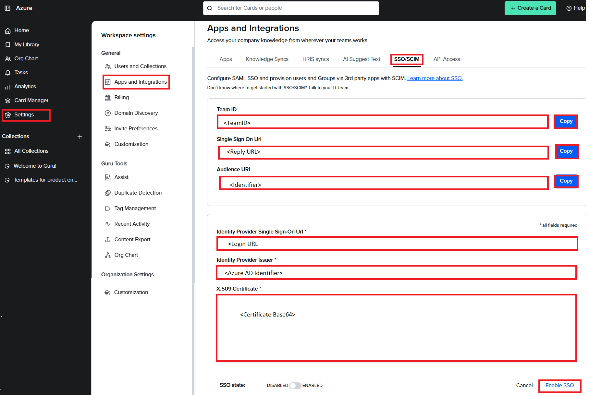

# Azure Active Directory SSO integration with Guru

In this article, you learn how to integrate Guru with Azure Active Directory (Azure AD). Guru is the AI-powered solution that gives teams a single source of truth for company information. When you integrate Guru with Azure AD, you can:

* Control in Azure AD who has access to Guru.
* Enable your users to be automatically signed-in to Guru with their Azure AD accounts
* Manage your accounts in one central location - the Azure portal.

You'll configure and test Azure AD single sign-on for Guru in a test environment. Guru supports **IDP** initiated single sign-on and also **Just In Time** user provisioning.

## Prerequisites

To integrate Azure Active Directory with Guru, you need:

* An Azure AD user account. If you don't already have one, you can [Create an account for free](https://azure.microsoft.com/free/?WT.mc_id=A261C142F).
* One of the following roles: Global Administrator, Cloud Application Administrator, Application Administrator, or owner of the service principal.
* An Azure AD subscription. If you don't have a subscription, you can get a [free account](https://azure.microsoft.com/free/).
* Guru single sign-on (SSO) enabled subscription.

## Add application and assign a test user

Before you begin the process of configuring single sign-on, you need to add the Guru application from the Azure AD gallery. You need a test user account to assign to the application and test the single sign-on configuration.

### Add Guru from the Azure AD gallery

Add Guru from the Azure AD application gallery to configure single sign-on with Guru. For more information on how to add application from the gallery, see the [Quickstart: Add application from the gallery](../manage-apps/add-application-portal.md).

### Create and assign Azure AD test user

Follow the guidelines in the [create and assign a user account](../manage-apps/add-application-portal-assign-users.md) article to create a test user account in the Azure portal called B.Simon.

Alternatively, you can also use the [Enterprise App Configuration Wizard](https://portal.office.com/AdminPortal/home?Q=Docs#/azureadappintegration). In this wizard, you can add an application to your tenant, add users/groups to the app, and assign roles. The wizard also provides a link to the single sign-on configuration pane in the Azure portal. [Learn more about Microsoft 365 wizards.](/microsoft-365/admin/misc/azure-ad-setup-guides). 

## Configure Azure AD SSO

Complete the following steps to enable Azure AD single sign-on in the Azure portal.

1. In the Azure portal, on the **Guru** application integration page, find the **Manage** section and select **single sign-on**.
1. On the **Select a single sign-on method** page, select **SAML**.
1. On the **Set up single sign-on with SAML** page, select the pencil icon for **Basic SAML Configuration** to edit the settings.

   

1. On the **Basic SAML Configuration** section, perform the following steps:

    a. In the **Identifier** textbox, type a value using the following pattern:
    `getguru.com/<TeamID>`

    b. In the **Reply URL** textbox, type a URL using the following pattern:
    `https://api.getguru.com/samlsso/<TeamID>`

    > [!NOTE]
    > These values are not real. Update these values with the actual Identifier and Reply URL. You can get `TeamID` from **[Configure Guru SSO](#configure-guru-sso)** section. If you have any queries, please contact [Guru support team](mailto:support@getguru.com). You can also refer to the patterns shown in the **Basic SAML Configuration** section in the Azure portal.

1. Guru application expects the SAML assertions in a specific format, which requires you to add custom attribute mappings to your SAML token attributes configuration. The following screenshot shows the list of default attributes.

	

1. In addition to above, Guru application expects few more attributes to be passed back in SAML response, which are shown below. These attributes are also pre populated but you can review them as per your requirements.

	| Name |  Source Attribute|
	| ---------------|  --------- |
	| firstName | user.givenname |
	| lastName | user.surname |

1. On the **Set up single sign-on with SAML** page, in the **SAML Signing Certificate** section, find **Certificate (Base64)** and select **Download** to download the certificate and save it on your computer.

    

1. On the **Set up Guru** section, copy the appropriate URL(s) based on your requirement.

	

## Configure Guru SSO

1. Log in to your Guru company site as an administrator.

1. Go to **Settings** > **Apps and Integrations** and click **SSO/SCIM**.

1. In the **SSO/SCIM** section, perform the following steps:

    

    1. Copy **Team ID** and save it to your computer.

    1. Copy **Single Sign On Url**, paste this value into the **Reply URL** text box in the **Basic SAML Configuration** section in the Azure portal.

    1. Copy **Audience URI**, paste this value into the **Identifier** text box in the **Basic SAML Configuration** section in the Azure portal.

    1. In the **Identity Provider Single Sign-On Url** textbox, paste the **Login URL** value, which you have copied from the Azure portal.

    1. In the **Identity Provider Issuer** textbox, paste the **Azure AD Identifier** value, which you have copied from the Azure portal.

    1. Open the downloaded **Certificate (Base64)** from the Azure portal into Notepad and paste the content into the  **X.509 Certificate** textbox.

    1. Click **Enable SSO**.

### Create Guru test user

In this section, a user called B.Simon is created in Guru SSO. Guru SSO supports just-in-time user provisioning, which is enabled by default. There's no action item for you in this section. If a user doesn't already exist in Guru SSO, a new one is created after authentication.

## Test SSO 

In this section, you test your Azure AD single sign-on configuration with following options.

* Click on Test this application in Azure portal and you should be automatically signed in to the Guru for which you set up the SSO.

* You can use Microsoft My Apps. When you click the Guru tile in the My Apps, you should be automatically signed in to the Guru for which you set up the SSO. For more information about the My Apps, see [Introduction to the My Apps](../user-help/my-apps-portal-end-user-access.md).

## Additional resources

* [What is single sign-on with Azure Active Directory?](../manage-apps/what-is-single-sign-on.md)
* [Plan a single sign-on deployment](../manage-apps/plan-sso-deployment.md).

## Next steps

Once you configure Guru you can enforce session control, which protects exfiltration and infiltration of your organization’s sensitive data in real time. Session control extends from Conditional Access. [Learn how to enforce session control with Microsoft Cloud App Security](/cloud-app-security/proxy-deployment-aad).