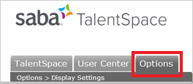
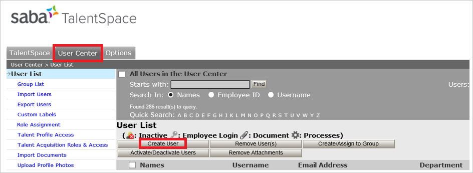
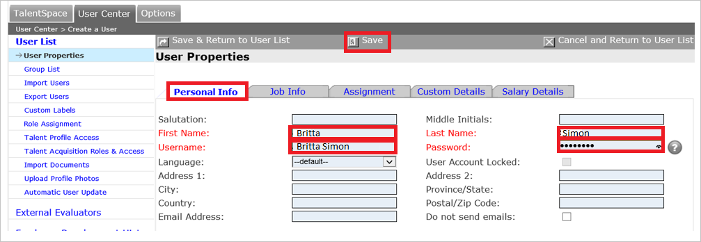

# Tutorial: Azure Active Directory single sign-on (SSO) integration with Saba TalentSpace

In this tutorial, you'll learn how to integrate Saba TalentSpace with Azure Active Directory (Azure AD). When you integrate Saba TalentSpace with Azure AD, you can:

* Control in Azure AD who has access to Saba TalentSpace.
* Enable your users to be automatically signed-in to Saba TalentSpace with their Azure AD accounts.
* Manage your accounts in one central location - the Azure portal.

To learn more about SaaS app integration with Azure AD, see [What is application access and single sign-on with Azure Active Directory](https://docs.microsoft.com/azure/active-directory/manage-apps/what-is-single-sign-on).

## Prerequisites

To get started, you need the following items:

* An Azure AD subscription. If you don't have a subscription, you can get a [free account](https://azure.microsoft.com/free/).
* Saba TalentSpace single sign-on (SSO) enabled subscription.

## Scenario description

In this tutorial, you configure and test Azure AD SSO in a test environment.

* Saba TalentSpace supports **SP** initiated SSO
* Once you configure Saba TalentSpace you can enforce session control, which protect exfiltration and infiltration of your organization’s sensitive data in real-time. Session control extend from Conditional Access. [Learn how to enforce session control with Microsoft Cloud App Security](https://docs.microsoft.com/cloud-app-security/proxy-deployment-any-app).

## Adding Saba TalentSpace from the gallery

To configure the integration of Saba TalentSpace into Azure AD, you need to add Saba TalentSpace from the gallery to your list of managed SaaS apps.

1. Sign in to the [Azure portal](https://portal.azure.com) using either a work or school account, or a personal Microsoft account.
1. On the left navigation pane, select the **Azure Active Directory** service.
1. Navigate to **Enterprise Applications** and then select **All Applications**.
1. To add new application, select **New application**.
1. In the **Add from the gallery** section, type **Saba TalentSpace** in the search box.
1. Select **Saba TalentSpace** from results panel and then add the app. Wait a few seconds while the app is added to your tenant.

## Configure and test Azure AD single sign-on for Saba TalentSpace

Configure and test Azure AD SSO with Saba TalentSpace using a test user called **B.Simon**. For SSO to work, you need to establish a link relationship between an Azure AD user and the related user in Saba TalentSpace.

To configure and test Azure AD SSO with Saba TalentSpace, complete the following building blocks:

1. **[Configure Azure AD SSO](#configure-azure-ad-sso)** - to enable your users to use this feature.
    * **[Create an Azure AD test user](#create-an-azure-ad-test-user)** - to test Azure AD single sign-on with B.Simon.
    * **[Assign the Azure AD test user](#assign-the-azure-ad-test-user)** - to enable B.Simon to use Azure AD single sign-on.
1. **[Configure Saba TalentSpace SSO](#configure-saba-talentspace-sso)** - to configure the single sign-on settings on application side.
    * **[Create Saba TalentSpace test user](#create-saba-talentspace-test-user)** - to have a counterpart of B.Simon in Saba TalentSpace that is linked to the Azure AD representation of user.
1. **[Test SSO](#test-sso)** - to verify whether the configuration works.

## Configure Azure AD SSO

Follow these steps to enable Azure AD SSO in the Azure portal.

1. In the [Azure portal](https://portal.azure.com/), on the **Saba TalentSpace** application integration page, find the **Manage** section and select **single sign-on**.
1. On the **Select a single sign-on method** page, select **SAML**.
1. On the **Set up single sign-on with SAML** page, click the edit/pen icon for **Basic SAML Configuration** to edit the settings.

   

1. On the **Basic SAML Configuration** section, perform the following steps:

    a. In the **Sign on URL** text box, type a URL using the following pattern:
    `https://global.hgncloud.com/[companyname]/saml/login`

	b. In the **Identifier (Entity ID)** text box, type a URL using the following pattern:
    `https://global.hgncloud.com/[companyname]/saml/metadata`

    c. In the **Reply URL (Assertion Consumer Service URL)** text box, type a URL using the following pattern:
    `https://global.hgncloud.com/[companyname]/saml/SSO`

	> [!NOTE]
	> These values are not real. Update these values with the actual Sign on URL and Identifier. Contact [Saba TalentSpace Client support team](https://support.saba.com/) to get these values. You can also refer to the patterns shown in the **Basic SAML Configuration** section in the Azure portal.

1. On the **Set up Single Sign-On with SAML** page, in the **SAML Signing Certificate** section, click **Download** to download the **Federation Metadata XML** from the given options as per your requirement and save it on your computer.

	

1. On the **Set up Saba TalentSpace** section, copy the appropriate URL(s) based on your requirement.

	

### Create an Azure AD test user

In this section, you'll create a test user in the Azure portal called B.Simon.

1. From the left pane in the Azure portal, select **Azure Active Directory**, select **Users**, and then select **All users**.
1. Select **New user** at the top of the screen.
1. In the **User** properties, follow these steps:
   1. In the **Name** field, enter `B.Simon`.  
   1. In the **User name** field, enter the username@companydomain.extension. For example, `B.Simon@contoso.com`.
   1. Select the **Show password** check box, and then write down the value that's displayed in the **Password** box.
   1. Click **Create**.

### Assign the Azure AD test user

In this section, you'll enable B.Simon to use Azure single sign-on by granting access to Saba TalentSpace.

1. In the Azure portal, select **Enterprise Applications**, and then select **All applications**.
1. In the applications list, select **Saba TalentSpace**.
1. In the app's overview page, find the **Manage** section and select **Users and groups**.

   

1. Select **Add user**, then select **Users and groups** in the **Add Assignment** dialog.

	

1. In the **Users and groups** dialog, select **B.Simon** from the Users list, then click the **Select** button at the bottom of the screen.
1. If you're expecting any role value in the SAML assertion, in the **Select Role** dialog, select the appropriate role for the user from the list and then click the **Select** button at the bottom of the screen.
1. In the **Add Assignment** dialog, click the **Assign** button.

## Configure Saba TalentSpace SSO

1. In a different browser window, sign-on to your **Saba TalentSpace** application as an administrator.

2. Click the **Options** tab.
  
    

3. In the left navigation pane, click **SAML Configuration**.
  
    

4. On the **SAML Configuration** page, perform the following steps:

    

    a. As **Unique Identifier**, select **NameID**.

    b. As **Unique Identifier Maps To**, select **Username**.
  
    c. To upload your downloaded metadata file, click **Browse** to select the file, and then **Upload File**.

    d. To test the configuration, click **Run Test**.

    > [!NOTE]
    > You need to wait for the message "*The SAML test is complete. Please close this window*". Then, close the opened browser window. The **Enable SAML** checkbox is only enabled if the test has been completed.

    e. Select **Enable SAML**.

    f. Click **Save Changes**.

### Create Saba TalentSpace test user

The objective of this section is to create a user called Britta Simon in Saba TalentSpace.

**To create a user called Britta Simon in Saba TalentSpace, perform the following steps:**

1. Sign on to your **Saba TalentSpace** application as an administrator.

2. Click the **User Center** tab, and then click **Create User**.

      

3. On the **New User** dialog page, perform the following steps:

    

    a. In the **First Name** textbox, type first name of the user like **B**.

    b. In the **Last Name** textbox, type last name of the user like **Simon**.

    c. In the **Username** textbox, type **B.Simon**, the user name as in the Azure portal.

    d. In the **Password** textbox, type a password for B.Simon.

    e. Click **Save**.

## Test SSO

In this section, you test your Azure AD single sign-on configuration using the Access Panel.

When you click the Saba TalentSpace tile in the Access Panel, you should be automatically signed in to the Saba TalentSpace for which you set up SSO. For more information about the Access Panel, see [Introduction to the Access Panel](https://docs.microsoft.com/azure/active-directory/active-directory-saas-access-panel-introduction).

## Additional resources

- [ List of Tutorials on How to Integrate SaaS Apps with Azure Active Directory ](https://docs.microsoft.com/azure/active-directory/active-directory-saas-tutorial-list)

- [What is application access and single sign-on with Azure Active Directory? ](https://docs.microsoft.com/azure/active-directory/manage-apps/what-is-single-sign-on)

- [What is conditional access in Azure Active Directory?](https://docs.microsoft.com/azure/active-directory/conditional-access/overview)

- [Try Saba TalentSpace with Azure AD](https://aad.portal.azure.com/)

- [What is session control in Microsoft Cloud App Security?](https://docs.microsoft.com/cloud-app-security/proxy-intro-aad)