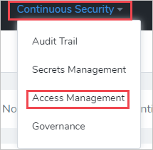
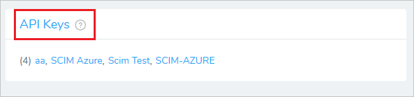
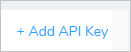
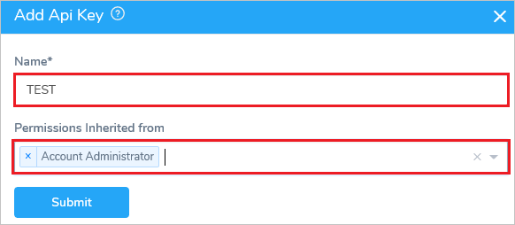
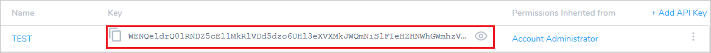
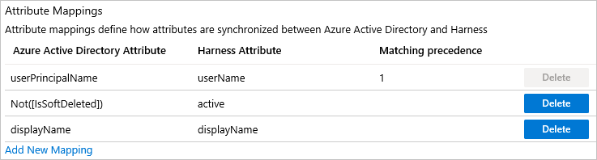
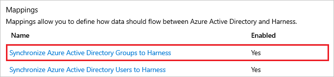
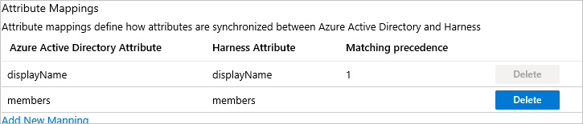

# Tutorial: Configure Harness for automatic user provisioning

In this article, you learn how to configure Microsoft Entra ID to automatically provision and deprovision users or groups to Harness.

> [!NOTE]
> This article describes a connector that's built on top of the Microsoft Entra user provisioning service. For important information about this service and answers to frequently asked questions, see [Automate user provisioning and deprovisioning to SaaS applications with Microsoft Entra ID](../app-provisioning/user-provisioning.md).
>
> This connector is currently in preview. For more information about previews, see [Universal License Terms For Online Services](https://www.microsoft.com/licensing/terms/product/ForOnlineServices/all).

## Prerequisites

The scenario outlined in this article assumes that you already have the following prerequisites:

* A Microsoft Entra tenant
* [A Harness tenant](https://harness.io/pricing/)
* A user account in Harness with *Admin* permissions

## Assign users to Harness

Microsoft Entra ID uses a concept called *assignments* to determine which users should receive access to selected apps. In the context of automatic user provisioning, only the users or groups that have been assigned to an application in Microsoft Entra ID are synchronized.

Before you configure and enable automatic user provisioning, decide which users or groups in Microsoft Entra ID need access to Harness. You can then assign these users or groups to Harness by following the instructions in [Assign a user or group to an enterprise app](../manage-apps/assign-user-or-group-access-portal.md).

## Important tips for assigning users to Harness

* We recommended that you assign a single Microsoft Entra user to Harness to test the automatic user provisioning configuration. Additional users or groups can be assigned later.

* When you assign a user to Harness, you must select any valid application-specific role (if available) in the **Assignment** dialog box. Users with the *Default Access* role are excluded from provisioning.
* If you currently have a Harness FirstGen App Integration setup in Microsoft Entra ID and are now trying to set up one for Harness NextGen, make sure the user information is also included in the FirstGen App Integration before attempting to log into Harness NextGen through SSO.

## Set up Harness for provisioning

1. Sign in to your [Harness Admin Console](https://app.harness.io/auth/#/signin), and then go to **Continuous Security** > **Access Management**.

	

1. Select **API Keys**.

	

1. Select **Add API Key**. 

	

1. In the **Add Api Key** pane, do the following:

	
   
   a. In the **Name** box, provide a name for the key.  
   b. In the **Permissions Inherited from** drop-down list, select an option. 
   
1. Select **Submit**.

1. Copy the **Key** for later use in this tutorial.

	

## Add Harness from the gallery

Before you configure Harness for automatic user provisioning with Microsoft Entra ID, you need to add Harness from the Microsoft Entra application gallery to your list of managed SaaS applications.

1. Sign in to the [Microsoft Entra admin center](https://entra.microsoft.com) as at least a [Cloud Application Administrator](../roles/permissions-reference.md#cloud-application-administrator).
1. Browse to **Identity** > **Applications** > **Enterprise applications**.

	

1. To add a new application, select the **New application** button at the top of the pane.

	

1. In the search box, enter **Harness**, select **Harness** in the results list, and then select the **Add** button to add the application.

	

## Configure automatic user provisioning to Harness 

This section guides you through the steps to configure the Microsoft Entra provisioning service to create, update, and disable users or groups in Harness based on user or group assignments in Microsoft Entra ID.

> [!TIP]
> You may also choose to enable SAML-based single sign-on for Harness by following the instructions in the [Harness single sign-on tutorial](./harness-tutorial.md). You can configure single sign-on independent of automatic user provisioning, although these two features complement each other.

> [!NOTE]
> To learn more about the Harness SCIM endpoint, see the Harness [API Keys](https://docs.harness.io/article/smloyragsm-api-keys) article.

To configure automatic user provisioning for Harness in Microsoft Entra ID, do the following:

1. Sign in to the [Microsoft Entra admin center](https://entra.microsoft.com) as at least a [Cloud Application Administrator](../roles/permissions-reference.md#cloud-application-administrator).
1. Browse to **Identity** > **Applications** > **Enterprise applications**.

	

1. In the applications list, select **Harness**.

	

1. Select **Provisioning**.

	

1. In the **Provisioning Mode** drop-down list, select **Automatic**.

	

1. Under **Admin Credentials**, do the following:

	
 
   a. In the **Tenant URL** box, enter **`https://app.harness.io/gateway/api/scim/account/<your_harness_account_ID>`**. You can obtain your Harness account ID from the URL in your browser when you are logged into Harness.
   b. In the **Secret Token** box, enter the SCIM Authentication Token value that you saved in step 6 of the "Set up Harness for provisioning" section.  
   c. Select **Test Connection** to ensure that Microsoft Entra ID can connect to Harness. If the connection fails, ensure that your Harness account has *Admin* permissions, and then try again.

1. In the **Notification Email** box, enter the email address of a person or group that should receive the provisioning error notifications, and then select the **Send an email notification when a failure occurs** check box.

	

1. Select **Save**.

1. Under **Mappings**, select **Synchronize Microsoft Entra users to Harness**.

	

1. Under **Attribute Mappings**, review the user attributes that are synchronized from Microsoft Entra ID to Harness. The attributes selected as *Matching* are used to match the user accounts in Harness for update operations. Select **Save** to commit any changes.

	

1. Under **Mappings**, select **Synchronize Microsoft Entra groups to Harness**.

	

1. Under **Attribute Mappings**, review the group attributes that are synchronized from Microsoft Entra ID to Harness. The attributes selected as *Matching* properties are used to match the groups in Harness for update operations. Select **Save** to commit any changes.

	

1. To configure scoping filters, see [Attribute-based application provisioning with scoping filters](../app-provisioning/define-conditional-rules-for-provisioning-user-accounts.md).

1. Under **Settings**, to enable the Microsoft Entra provisioning service for Harness, toggle the **Provisioning Status** switch to **On**.

	

1. Under **Settings**, in the **Scope** drop-down list, select how you want to sync the users or groups that you're provisioning to Harness.

	

1. When you're ready to provision, select **Save**.

	

This operation starts the initial sync of the users or groups you're provisioning. The initial sync takes longer to perform than later ones. Syncs occur approximately every 40 minutes, as long as the Microsoft Entra provisioning service is running. To monitor progress, go to the **Synchronization Details** section. You can also follow links to a provisioning activity report, which describes all actions performed by the Microsoft Entra provisioning service on Harness.

For more information about how to read the Microsoft Entra provisioning logs, see [Report on automatic user account provisioning](../app-provisioning/check-status-user-account-provisioning.md).

## Additional resources

* [Manage user account provisioning for enterprise apps](../app-provisioning/configure-automatic-user-provisioning-portal.md)
* [What is application access and single sign-on with Microsoft Entra ID?](../manage-apps/what-is-single-sign-on.md)

## Next steps

* [Learn how to review logs and get reports on provisioning activity](../app-provisioning/check-status-user-account-provisioning.md)
