# Tutorial: Microsoft Entra single sign-on integration with Citrix ADC (header-based authentication)

In this tutorial, you'll learn how to integrate Citrix ADC with Microsoft Entra ID. When you integrate Citrix ADC with Microsoft Entra ID, you can:

* Control in Microsoft Entra ID who has access to Citrix ADC.
* Enable your users to be automatically signed-in to Citrix ADC with their Microsoft Entra accounts.
* Manage your accounts in one central location.

## Prerequisites

To get started, you need the following items:

* A Microsoft Entra subscription. If you don't have a subscription, you can get a [free account](https://azure.microsoft.com/free/).
* Citrix ADC single sign-on (SSO) enabled subscription.

## Scenario description

In this tutorial, you configure and test Microsoft Entra SSO in a test environment. The tutorial includes these scenarios:

* **SP-initiated** SSO for Citrix ADC

* **Just in time** user provisioning for Citrix ADC

* [Header-based authentication for Citrix ADC](#publish-the-web-server)

* [Kerberos-based authentication for Citrix ADC](citrix-netscaler-tutorial.md#publish-the-web-server)

## Add Citrix ADC from the gallery

To integrate Citrix ADC with Microsoft Entra ID, first add Citrix ADC to your list of managed SaaS apps from the gallery:

1. Sign in to the [Microsoft Entra admin center](https://entra.microsoft.com) as at least a [Cloud Application Administrator](../roles/permissions-reference.md#cloud-application-administrator).
1. Browse to **Identity** > **Applications** > **Enterprise applications** > **New application**.

1. In the **Add from the gallery** section, enter **Citrix ADC** in the search box.

1. In the results, select **Citrix ADC**, and then add the app. Wait a few seconds while the app is added to your tenant.

 Alternatively, you can also use the [Enterprise App Configuration Wizard](https://portal.office.com/AdminPortal/home?Q=Docs#/azureadappintegration). In this wizard, you can add an application to your tenant, add users/groups to the app, assign roles, as well as walk through the SSO configuration as well. [Learn more about Microsoft 365 wizards.](/microsoft-365/admin/misc/azure-ad-setup-guides)

## Configure and test Microsoft Entra SSO for Citrix ADC

Configure and test Microsoft Entra SSO with Citrix ADC by using a test user called **B.Simon**. For SSO to work, you need to establish a link relationship between a Microsoft Entra user and the related user in Citrix ADC.

To configure and test Microsoft Entra SSO with Citrix ADC, perform the following steps:

1. [Configure Microsoft Entra SSO](#configure-azure-ad-sso) - to enable your users to use this feature.

    1. [Create a Microsoft Entra test user](#create-an-azure-ad-test-user) - to test Microsoft Entra SSO with B.Simon.

    1. [Assign the Microsoft Entra test user](#assign-the-azure-ad-test-user) - to enable B.Simon to use Microsoft Entra SSO.

1. [Configure Citrix ADC SSO](#configure-citrix-adc-sso) - to configure the SSO settings on the application side.

    * [Create a Citrix ADC test user](#create-a-citrix-adc-test-user) - to have a counterpart of B.Simon in Citrix ADC that is linked to the Microsoft Entra representation of the user.

1. [Test SSO](#test-sso) - to verify whether the configuration works.

## Configure Microsoft Entra SSO

To enable Microsoft Entra SSO by using the Azure portal, complete these steps:

1. Sign in to the [Microsoft Entra admin center](https://entra.microsoft.com) as at least a [Cloud Application Administrator](../roles/permissions-reference.md#cloud-application-administrator).
1. Browse to **Identity** > **Applications** > **Enterprise applications** > **Citrix ADC** application integration pane, under **Manage**, select **Single sign-on**.

1. On the **Select a single sign-on method** pane, select **SAML**.

1. On the **Set up Single Sign-On with SAML** pane, select the pen **Edit** icon for **Basic SAML Configuration** to edit the settings.

   

1. In the **Basic SAML Configuration** section, to configure the application in **IDP-initiated** mode:

    1. In the **Identifier** text box, enter a URL that has the following pattern:
    `https://<Your FQDN>`

    1. In the **Reply URL** text box, enter a URL that has the following pattern:
    `https://<Your FQDN>/CitrixAuthService/AuthService.asmx`

1. To configure the application in **SP-initiated** mode, select **Set additional URLs** and complete the following step:

    * In the **Sign-on URL** text box, enter a URL that has the following pattern:
    `https://<Your FQDN>/CitrixAuthService/AuthService.asmx`

	> [!NOTE]
	> * The URLs that are used in this section aren't real values. Update these values with the actual values for Identifier, Reply URL, and Sign-on URL. Contact the [Citrix ADC client support team](https://www.citrix.com/contact/technical-support.html) to get these values. You can also refer to the patterns shown in the **Basic SAML Configuration** section.
    > * To set up SSO, the URLs must be accessible from public websites. You must enable the firewall or other security settings on the Citrix ADC side to enable Microsoft Entra ID to post the token at the configured URL.

1. On the **Set up Single Sign-On with SAML** pane, in the **SAML Signing Certificate** section, for **App Federation Metadata Url**, copy the URL and save it in Notepad.

	

1. The Citrix ADC application expects SAML assertions to be in a specific format, which requires you to add custom attribute mappings to your SAML token attributes configuration. The following screenshot shows the list of default attributes. Select the **Edit** icon and change the attribute mappings.

	

1. The Citrix ADC application also expects a few more attributes to be passed back in the SAML response. In the **User Attributes** dialog box, under **User Claims**, complete the following steps to add the SAML token attributes as shown in the table:

	| Name | Source attribute|
	| ---------------| --------------- |
	| mySecretID  | user.userprincipalname |
    
    1. Select **Add new claim** to open the **Manage user claims** dialog box.

	1. In the **Name** text box, enter the attribute name that's shown for that row.

	1. Leave the **Namespace** blank.

	1. For **Attribute**, select **Source**.

	1. In the **Source attribute** list, enter the attribute value that's shown for that row.

	1. Select **OK**.

	1. Select **Save**.

1. In the **Set up Citrix ADC** section, copy the relevant URLs based on your requirements.

	

### Create a Microsoft Entra test user

In this section, you'll create a test user called B.Simon.

1. Sign in to the [Microsoft Entra admin center](https://entra.microsoft.com) as at least a [User Administrator](../roles/permissions-reference.md#user-administrator).
1. Browse to **Identity** > **Users** > **All users**.
1. Select **New user** > **Create new user**, at the top of the screen.
1. In the **User** properties, follow these steps:
   1. In the **Display name** field, enter `B.Simon`.  
   1. In the **User principal name** field, enter the username@companydomain.extension. For example, `B.Simon@contoso.com`.
   1. Select the **Show password** check box, and then write down the value that's displayed in the **Password** box.
   1. Select **Review + create**.
1. Select **Create**.

### Assign the Microsoft Entra test user

In this section, you enable the user B.Simon to use Azure SSO by granting the user access to Citrix ADC.

1. Browse to **Identity** > **Applications** > **Enterprise applications**.

1. In the applications list, select **Citrix ADC**.

1. On the app overview, under **Manage**, select **Users and groups**.
1. Select **Add user**. Then, in the **Add Assignment** dialog box, select **Users and groups**.
1. In the **Users and groups** dialog box, select **B.Simon** from the **Users** list. Choose **Select**.
1. If you are expecting a role to be assigned to the users, you can select it from the **Select a role** dropdown. If no role has been set up for this app, you see "Default Access" role selected.
1. In the **Add Assignment** dialog box, select **Assign**.

## Configure Citrix ADC SSO

Select a link for steps for the kind of authentication you want to configure:

- [Configure Citrix ADC SSO for header-based authentication](#publish-the-web-server)

- [Configure Citrix ADC SSO for Kerberos-based authentication](citrix-netscaler-tutorial.md#publish-the-web-server)

### Publish the web server 

To create a virtual server:

1. Select **Traffic Management** > **Load Balancing** > **Services**.
    
1. Select **Add**.

    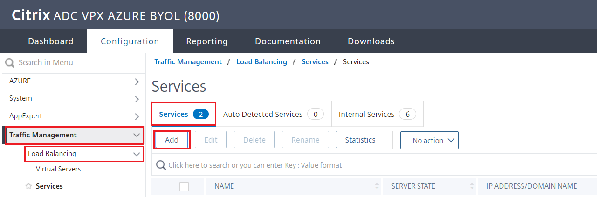

1. Set the following values for the web server that's running the applications:

   * **Service Name**
   * **Server IP/ Existing Server**
   * **Protocol**
   * **Port**

     

### Configure the load balancer

To configure the load balancer:

1. Go to **Traffic Management** > **Load Balancing** > **Virtual Servers**.

1. Select **Add**.

1. Set the following values as described in the following screenshot:

    * **Name**
    * **Protocol**
    * **IP Address**
    * **Port**

1. Select **OK**.

    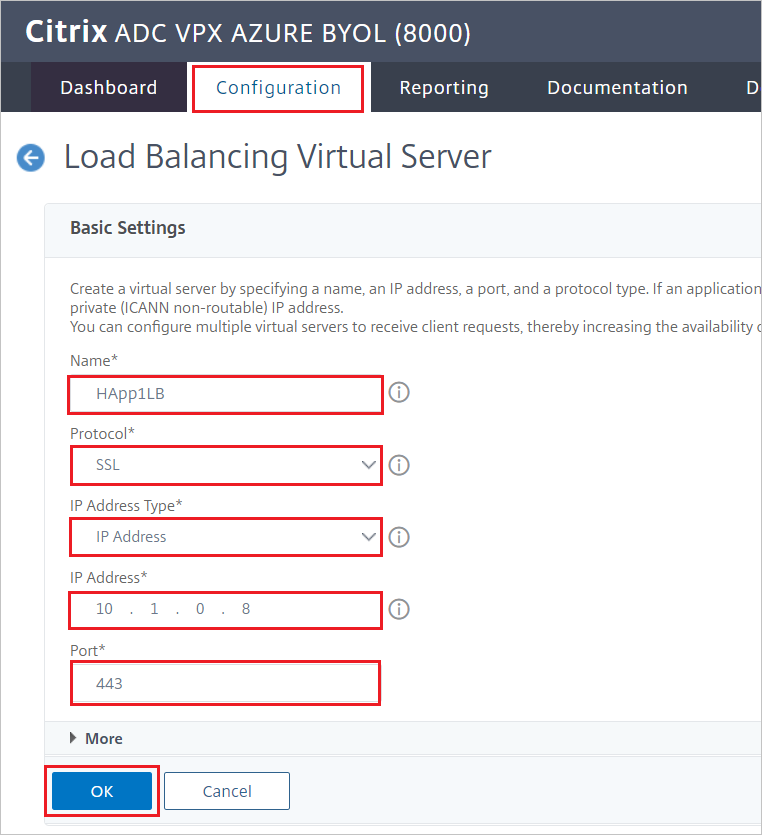

### Bind the virtual server

To bind the load balancer with the virtual server:

1. In the **Services and Service Groups** pane, select **No Load Balancing Virtual Server Service Binding**.

   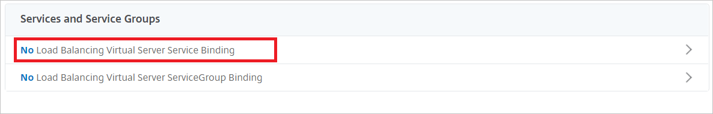

1. Verify the settings as shown in the following screenshot, and then select **Close**.

   

### Bind the certificate

To publish this service as TLS, bind the server certificate, and then test your application:

1. Under **Certificate**, select **No Server Certificate**.

   

1. Verify the settings as shown in the following screenshot, and then select **Close**.

   

## Citrix ADC SAML profile

To configure the Citrix ADC SAML profile, complete the following sections:

### Create an authentication policy

To create an authentication policy:

1. Go to **Security** > **AAA – Application Traffic** > **Policies** > **Authentication** > **Authentication Policies**.

1. Select **Add**.

1. On the **Create Authentication Policy** pane, enter or select the following values:

    * **Name**: Enter a name for your authentication policy.
    * **Action**: Enter **SAML**, and then select **Add**.
    * **Expression**:  Enter **true**.     
    
    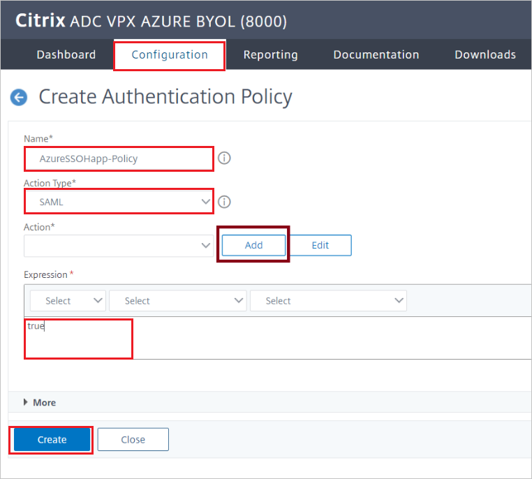

1. Select **Create**.

### Create an authentication SAML server

To create an authentication SAML server, go to the **Create Authentication SAML Server** pane, and then complete the following steps:

1. For **Name**, enter a name for the authentication SAML server.

1. Under **Export SAML Metadata**:

   1. Select the **Import Metadata** check box.

   1. Enter the federation metadata URL from the Azure SAML UI that you copied earlier.
    
1. For **Issuer Name**, enter the relevant URL.

1. Select **Create**.

### Create an authentication virtual server

To create an authentication virtual server:

1.	Go to **Security** > **AAA - Application Traffic** > **Policies** > **Authentication** > **Authentication Virtual Servers**.

1.	Select **Add**, and then complete the following steps:

    1. For **Name**, enter a name for the authentication virtual server.

    1. Select the **Non-Addressable** check box.

    1. For **Protocol**, select **SSL**.

    1. Select **OK**.

    
    

### Configure the authentication virtual server to use Microsoft Entra ID

Modify two sections for the authentication virtual server:

1.	On the **Advanced Authentication Policies** pane, select **No Authentication Policy**.

    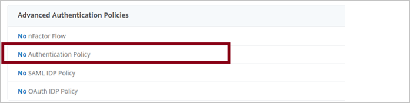

1. On the **Policy Binding** pane, select the authentication policy, and then select **Bind**.

    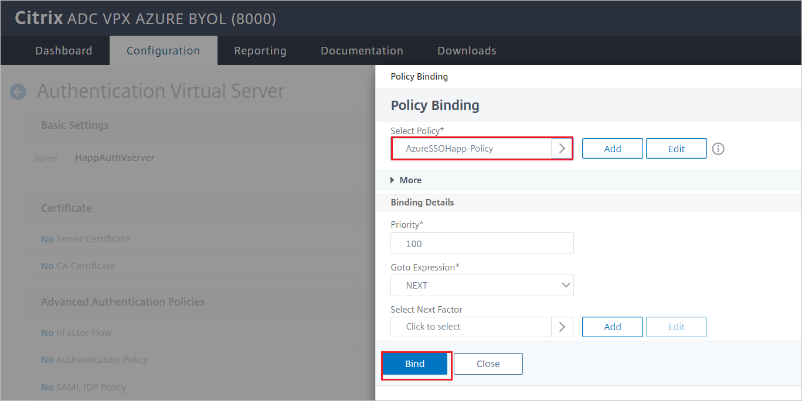

1. On the **Form Based Virtual Servers** pane, select **No Load Balancing Virtual Server**.

    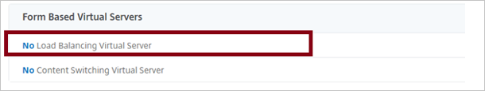

1. For **Authentication FQDN**, enter a fully qualified domain name (FQDN) (required).

1. Select the load balancing virtual server that you want to protect with Microsoft Entra authentication.

1. Select **Bind**.

    

    > [!NOTE]
    > Be sure to select **Done** on the **Authentication Virtual Server Configuration** pane.

1. To verify your changes, in a browser, go to the application URL. You should see your tenant sign-in page instead of the unauthenticated access that you would have seen previously.

    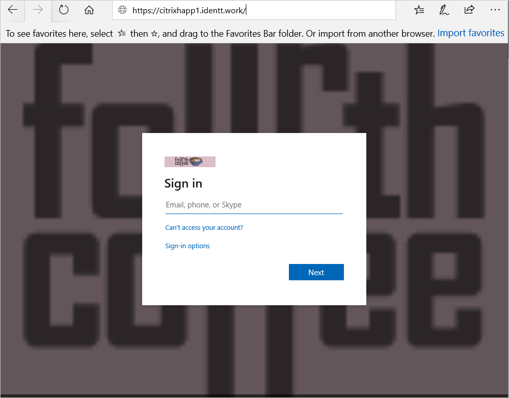

## Configure Citrix ADC SSO for header-based authentication

### Configure Citrix ADC

To configure Citrix ADC for header-based authentication, complete the following sections.

#### Create a rewrite action

1. Go to **AppExpert** > **Rewrite** > **Rewrite Actions**.
 
    

1.	Select **Add**, and then complete the following steps:

    1. For **Name**, enter a name for the rewrite action.

    1. For **Type**, enter **INSERT_HTTP_HEADER**.

    1. For **Header Name**, enter a header name (in this example, we use _SecretID_).

    1. For **Expression**, enter **aaa.USER.ATTRIBUTE("mySecretID")**, where **mySecretID** is the Microsoft Entra SAML claim that was sent to Citrix ADC.

    1. Select **Create**.

    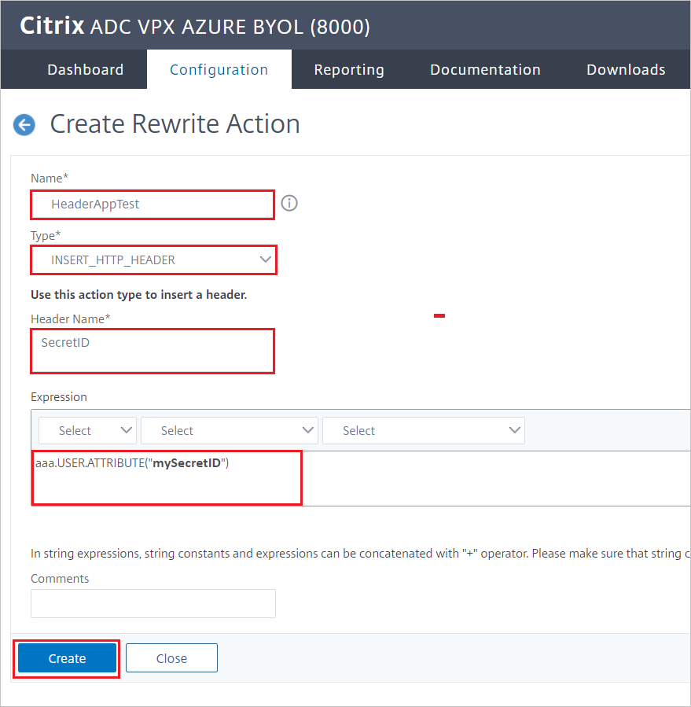
 
#### Create a rewrite policy

1.	Go to  **AppExpert** > **Rewrite** > **Rewrite Policies**.
 
    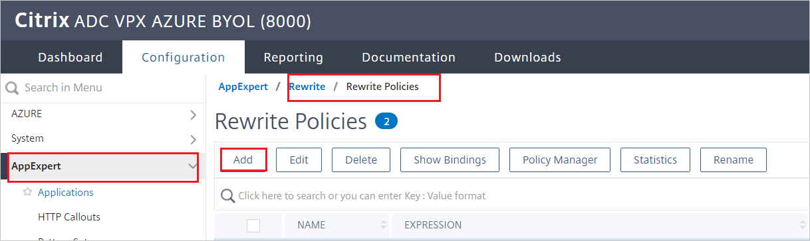

1.	Select **Add**, and then complete the following steps:

    1. For **Name**, enter a name for the rewrite policy.

    1. For **Action**, select the rewrite action you created in the preceding section.

    1. For **Expression**, enter **true**.

    1. Select **Create**.

    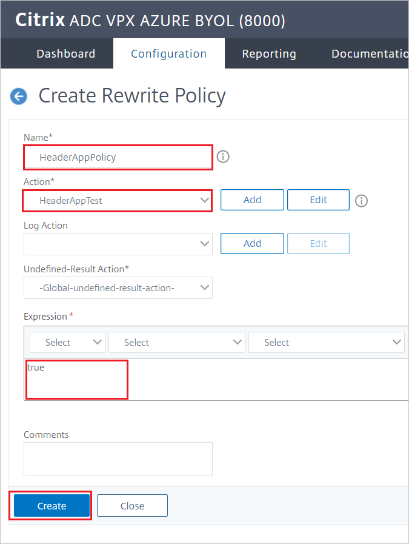

### Bind a rewrite policy to a virtual server

To bind a rewrite policy to a virtual server by using the GUI:

1. Go to **Traffic Management** > **Load Balancing** > **Virtual Servers**.

1. In the list of virtual servers, select the virtual server to which you want to bind the rewrite policy, and then select **Open**.

1. On the **Load Balancing Virtual Server** pane, under **Advanced Settings**, select **Policies**. All policies that are configured for your NetScaler instance appear in the list.
 
    

    

1.	Select the check box next to the name of the policy you want to bind to this virtual server.
 
    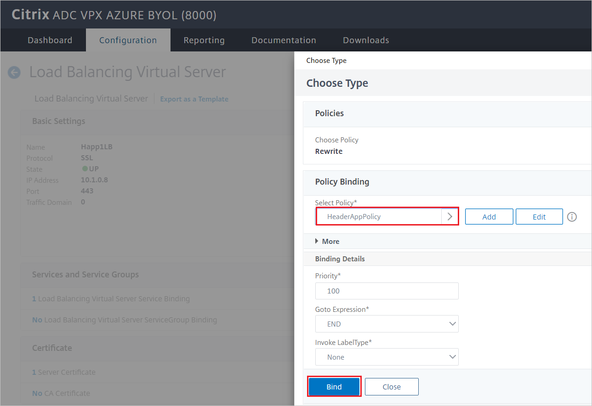

1. In the **Choose Type** dialog box:

    1. For **Choose Policy**, select **Traffic**.

    1. For **Choose Type**, select **Request**.

    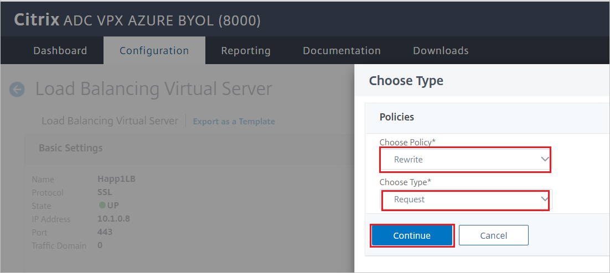

1.	Select **OK**. A message in the status bar indicates that the policy has been configured successfully.

### Modify the SAML server to extract attributes from a claim

1.	Go to **Security** > **AAA - Application Traffic** > **Policies** > **Authentication** > **Advanced Policies** > **Actions** > **Servers**.

1.	Select the appropriate authentication SAML server for the application.
 
    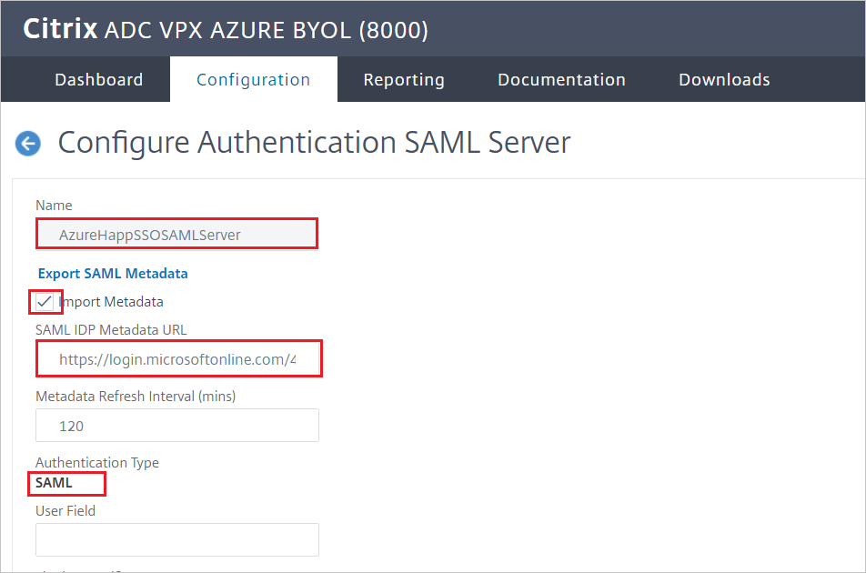

1. In the **Attributes** pain, enter the SAML attributes that you want to extract, separated by commas. In our example, we enter the attribute `mySecretID`.
 
    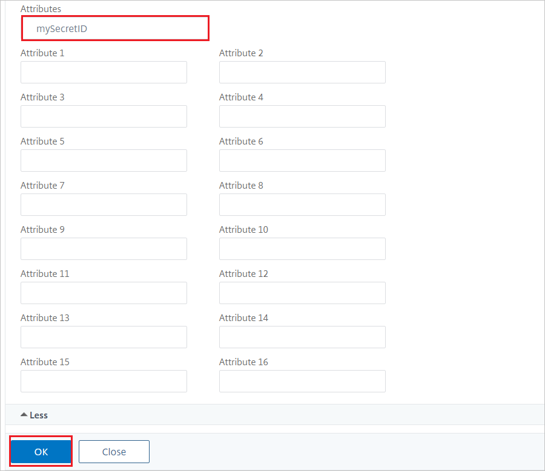

1. To verify access, at the URL in a browser, look for the SAML attribute under **Headers Collection**.

    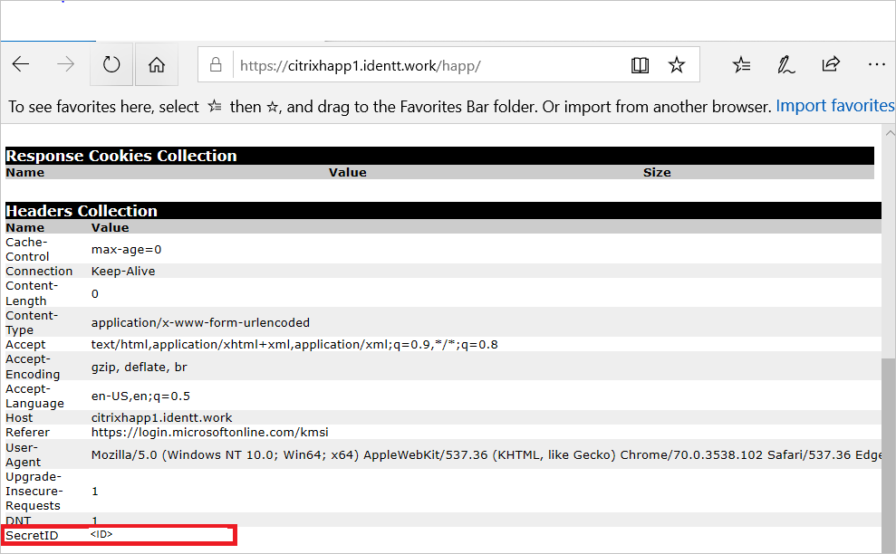

### Create a Citrix ADC test user

In this section, a user called B.Simon is created in Citrix ADC. Citrix ADC supports just-in-time user provisioning, which is enabled by default. There is no action for you to take in this section. If a user doesn't already exist in Citrix ADC, a new one is created after authentication.

> [!NOTE]
> If you need to create a user manually, contact the [Citrix ADC client support team](https://www.citrix.com/contact/technical-support.html).

## Test SSO 

In this section, you test your Microsoft Entra single sign-on configuration with following options. 

* Click on **Test this application**, this will redirect to Citrix ADC Sign-on URL where you can initiate the login flow. 

* Go to Citrix ADC Sign-on URL directly and initiate the login flow from there.

* You can use Microsoft My Apps. When you click the Citrix ADC tile in the My Apps, this will redirect to Citrix ADC Sign-on URL. For more information about the My Apps, see [Introduction to the My Apps](https://support.microsoft.com/account-billing/sign-in-and-start-apps-from-the-my-apps-portal-2f3b1bae-0e5a-4a86-a33e-876fbd2a4510).

## Next steps

Once you configure Citrix ADC you can enforce session control, which protects exfiltration and infiltration of your organization’s sensitive data in real time. Session control extends from Conditional Access. [Learn how to enforce session control with Microsoft Defender for Cloud Apps](/cloud-app-security/proxy-deployment-any-app).
