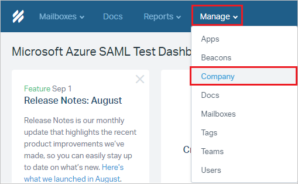
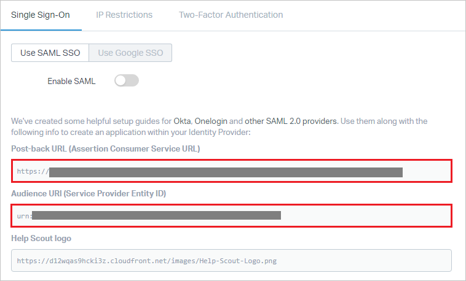

# Tutorial: Azure Active Directory integration with Help Scout

In this tutorial, you learn how to integrate Help Scout with Azure Active Directory (Azure AD).
Integrating Help Scout with Azure AD provides you with the following benefits:

* You can control in Azure AD who has access to Help Scout.
* You can enable your users to be automatically signed-in to Help Scout (Single Sign-On) with their Azure AD accounts.
* You can manage your accounts in one central location - the Azure portal.

If you want to know more details about SaaS app integration with Azure AD, see [What is application access and single sign-on with Azure Active Directory](https://docs.microsoft.com/azure/active-directory/active-directory-appssoaccess-whatis).
If you don't have an Azure subscription, [create a free account](https://azure.microsoft.com/free/) before you begin.

## Prerequisites

To configure Azure AD integration with Help Scout, you need the following items:

* An Azure AD subscription. If you don't have an Azure AD environment, you can get one-month trial [here](https://azure.microsoft.com/pricing/free-trial/)
* Help Scout single sign-on enabled subscription

## Scenario description

In this tutorial, you configure and test Azure AD single sign-on in a test environment.

* Help Scout supports **SP and IDP** initiated SSO
* Help Scout supports **Just In Time** user provisioning

## Adding Help Scout from the gallery

To configure the integration of Help Scout into Azure AD, you need to add Help Scout from the gallery to your list of managed SaaS apps.

**To add Help Scout from the gallery, perform the following steps:**

1. In the **[Azure portal](https://portal.azure.com)**, on the left navigation panel, click **Azure Active Directory** icon.

	

2. Navigate to **Enterprise Applications** and then select the **All Applications** option.

	

3. To add new application, click **New application** button on the top of dialog.

	

4. In the search box, type **Help Scout**, select **Help Scout** from result panel then click **Add** button to add the application.

	 

## Configure and test Azure AD single sign-on

In this section, you configure and test Azure AD single sign-on with Help Scout based on a test user called **Britta Simon**.
For single sign-on to work, a link relationship between an Azure AD user and the related user in Help Scout needs to be established.

To configure and test Azure AD single sign-on with Help Scout, you need to complete the following building blocks:

1. **[Configure Azure AD Single Sign-On](#configure-azure-ad-single-sign-on)** - to enable your users to use this feature.
2. **[Configure Help Scout Single Sign-On](#configure-help-scout-single-sign-on)** - to configure the Single Sign-On settings on application side.
3. **[Create an Azure AD test user](#create-an-azure-ad-test-user)** - to test Azure AD single sign-on with Britta Simon.
4. **[Assign the Azure AD test user](#assign-the-azure-ad-test-user)** - to enable Britta Simon to use Azure AD single sign-on.
5. **[Create Help Scout test user](#create-help-scout-test-user)** - to have a counterpart of Britta Simon in Help Scout that is linked to the Azure AD representation of user.
6. **[Test single sign-on](#test-single-sign-on)** - to verify whether the configuration works.

### Configure Azure AD single sign-on

In this section, you enable Azure AD single sign-on in the Azure portal.

To configure Azure AD single sign-on with Help Scout, perform the following steps:

1. In the [Azure portal](https://portal.azure.com/), on the **Help Scout** application integration page, select **Single sign-on**.

    

2. On the **Select a Single sign-on method** dialog, select **SAML/WS-Fed** mode to enable single sign-on.

    

3. On the **Set up Single Sign-On with SAML** page, click **Edit** icon to open **Basic SAML Configuration** dialog.

	

4. On the **Basic SAML Configuration** section, If you wish to configure the application in **IDP** initiated mode, perform the following steps:

    

    a. **Identifier** is the **Audience URI (Service Provider Entity ID)** from Help Scout, starts with `urn:`

	b. **Reply URL** is the **Post-back URL (Assertion Consumer Service URL)** from Help Scout, starts with `https://` 

	> [!NOTE]
	> The values in these URLs are for demonstration only. You need to update these values from actual Reply URL and Identifier. You get these values from the **Single Sign-On** tab under Authentication section, which is explained later in the tutorial.

5. Click **Set additional URLs** and perform the following step if you wish to configure the application in **SP** initiated mode:

    

    In the **Sign-on URL** textbox, type a URL as: `https://secure.helpscout.net/members/login/`

6. On the **Set up Single Sign-On with SAML** page, in the **SAML Signing Certificate** section, click **Download** to download the **Certificate (Base64)** from the given options as per your requirement and save it on your computer.

	

7. On the **Set up Help Scout** section, copy the appropriate URL(s) as per your requirement.

	

	a. Login URL

	b. Azure Ad Identifier

	c. Logout URL

### Configure Help Scout Single Sign-On

1. In a different web browser window, log in to your Help Scout company site as an administrator.

2. Click on **Manage** from the top menu and then select **Company** from the dropdown menu.

	

3. Select **Authentication** from the left navigation pane.

	

4. This takes you to the SAML settings section and perform the following steps:

	

	a. Copy the **Post-back URL (Assertion Consumer Service URL)** value and paste the value in the **Reply URL** text box in the **Basic SAML Configuration** section in the Azure portal.

	b. Copy the **Audience URI (Service Provider Entity ID)** value and paste the value in the **Identifier** text box in the **Basic SAML Configuration** section in the Azure portal.

5. Toggle **Enable SAML** on and perform the following steps:

	

	a. In **Single Sign-On URL** textbox, paste the value of **Login URL**, which you have copied from Azure portal.

	b. Click **Upload Certificate** to upload the **Certificate(Base64)** downloaded from Azure portal.

	c. Enter your organization's email domain(s) e.x.- `contoso.com` in the **Email Domains** textbox. You can separate multiple domains with a comma. Anytime a Help Scout User or Administrator who enters that specific domain on the [Help Scout log-in page](https://secure.helpscout.net/members/login/) will be routed to Identity Provider to authenticate with their credentials.

	d. Lastly, you can toggle **Force SAML Sign-on** if you want Users to only log in to Help Scout via through this method. If you'd still like to leave the option for them to sign in with their Help Scout credentials, you can leave it toggled off. Even if this is enabled, an Account Owner will always be able to log in to Help Scout with their account password.

	e. Click **Save**.

### Create an Azure AD test user

The objective of this section is to create a test user in the Azure portal called Britta Simon.

1. In the Azure portal, in the left pane, select **Azure Active Directory**, select **Users**, and then select **All users**.

    

2. Select **New user** at the top of the screen.

    

3. In the User properties, perform the following steps.

    

    a. In the **Name** field enter **BrittaSimon**.
  
    b. In the **User name** field type **brittasimon\@yourcompanydomain.extension**  
    For example, BrittaSimon@contoso.com

    c. Select **Show password** check box, and then write down the value that's displayed in the Password box.

    d. Click **Create**.

### Assign the Azure AD test user

In this section, you enable Britta Simon to use Azure single sign-on by granting access to Help Scout.

1. In the Azure portal, select **Enterprise Applications**, select **All applications**, then select **Help Scout**.

	

2. In the applications list, select **Help Scout**.

	

3. In the menu on the left, select **Users and groups**.

    

4. Click the **Add user** button, then select **Users and groups** in the **Add Assignment** dialog.

    

5. In the **Users and groups** dialog select **Britta Simon** in the Users list, then click the **Select** button at the bottom of the screen.

6. If you are expecting any role value in the SAML assertion then in the **Select Role** dialog select the appropriate role for the user from the list, then click the **Select** button at the bottom of the screen.

7. In the **Add Assignment** dialog click the **Assign** button.

### Create Help Scout test user

In this section, a user called Britta Simon is created in Help Scout. Help Scout supports just-in-time user provisioning, which is enabled by default. There is no action item for you in this section. If a user doesn't already exist in Help Scout, a new one is created after authentication.

### Test single sign-on

In this section, you test your Azure AD single sign-on configuration using the Access Panel.

When you click the Help Scout tile in the Access Panel, you should be automatically signed in to the Help Scout for which you set up SSO. For more information about the Access Panel, see [Introduction to the Access Panel](https://docs.microsoft.com/azure/active-directory/active-directory-saas-access-panel-introduction).

## Additional Resources

- [List of Tutorials on How to Integrate SaaS Apps with Azure Active Directory](https://docs.microsoft.com/azure/active-directory/active-directory-saas-tutorial-list)

- [What is application access and single sign-on with Azure Active Directory?](https://docs.microsoft.com/azure/active-directory/active-directory-appssoaccess-whatis)

- [What is Conditional Access in Azure Active Directory?](https://docs.microsoft.com/azure/active-directory/conditional-access/overview)