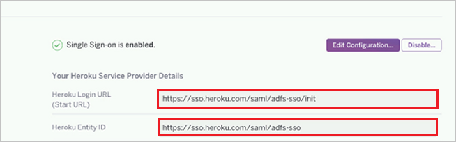

# Tutorial: Azure Active Directory integration with Heroku

In this tutorial, you learn how to integrate Heroku with Azure Active Directory (Azure AD).
Integrating Heroku with Azure AD provides you with the following benefits:

* You can control in Azure AD who has access to Heroku.
* You can enable your users to be automatically signed-in to Heroku (Single Sign-On) with their Azure AD accounts.
* You can manage your accounts in one central location - the Azure portal.

If you want to know more details about SaaS app integration with Azure AD, see [What is application access and single sign-on with Azure Active Directory](https://docs.microsoft.com/azure/active-directory/active-directory-appssoaccess-whatis).
If you don't have an Azure subscription, [create a free account](https://azure.microsoft.com/free/) before you begin.

## Prerequisites

To configure Azure AD integration with Heroku, you need the following items:

* An Azure AD subscription. If you don't have an Azure AD environment, you can get one-month trial [here](https://azure.microsoft.com/pricing/free-trial/)
* Heroku single sign-on enabled subscription

## Scenario description

In this tutorial, you configure and test Azure AD single sign-on in a test environment.

* Heroku supports **SP** initiated SSO
* Heroku supports **Just In Time** user provisioning

## Adding Heroku from the gallery

To configure the integration of Heroku into Azure AD, you need to add Heroku from the gallery to your list of managed SaaS apps.

**To add Heroku from the gallery, perform the following steps:**

1. In the **[Azure portal](https://portal.azure.com)**, on the left navigation panel, click **Azure Active Directory** icon.

	

2. Navigate to **Enterprise Applications** and then select the **All Applications** option.

	

3. To add new application, click **New application** button on the top of dialog.

	

4. In the search box, type **Heroku**, select **Heroku** from result panel then click **Add** button to add the application.

	 

## Configure and test Azure AD single sign-on

In this section, you configure and test Azure AD single sign-on with Heroku based on a test user called **Britta Simon**.
For single sign-on to work, a link relationship between an Azure AD user and the related user in Heroku needs to be established.

To configure and test Azure AD single sign-on with Heroku, you need to complete the following building blocks:

1. **[Configure Azure AD Single Sign-On](#configure-azure-ad-single-sign-on)** - to enable your users to use this feature.
2. **[Configure Heroku Single Sign-On](#configure-heroku-single-sign-on)** - to configure the Single Sign-On settings on application side.
3. **[Create an Azure AD test user](#create-an-azure-ad-test-user)** - to test Azure AD single sign-on with Britta Simon.
4. **[Assign the Azure AD test user](#assign-the-azure-ad-test-user)** - to enable Britta Simon to use Azure AD single sign-on.
5. **[Create Heroku test user](#create-heroku-test-user)** - to have a counterpart of Britta Simon in Heroku that is linked to the Azure AD representation of user.
6. **[Test single sign-on](#test-single-sign-on)** - to verify whether the configuration works.

### Configure Azure AD single sign-on

In this section, you enable Azure AD single sign-on in the Azure portal.

To configure Azure AD single sign-on with Heroku, perform the following steps:

1. In the [Azure portal](https://portal.azure.com/), on the **Heroku** application integration page, select **Single sign-on**.

    

2. On the **Select a Single sign-on method** dialog, select **SAML/WS-Fed** mode to enable single sign-on.

    

3. On the **Set up Single Sign-On with SAML** page, click **Edit** icon to open **Basic SAML Configuration** dialog.

	

4. On the **Basic SAML Configuration** section, perform the following steps:

    

	a. In the **Sign on URL** text box, type a URL using the following pattern:
    `https://sso.heroku.com/saml/<company-name>/init`

    b. In the **Identifier (Entity ID)** text box, type a URL using the following pattern:
    `https://sso.heroku.com/saml/<company-name>`

	> [!NOTE]
	> These values are not real. Update these values with the actual Sign-On URL and Identifier. You get these values from Heroku team, which is described in later sections of this article.

5. On the **Set up Single Sign-On with SAML** page, in the **SAML Signing Certificate** section, click **Download** to download the **Federation Metadata XML** from the given options as per your requirement and save it on your computer.

	

6. On the **Set up Heroku** section, copy the appropriate URL(s) as per your requirement.

	

	a. Login URL

	b. Azure Ad Identifier

	c. Logout URL

### Configure Heroku Single Sign-On

1. In a different web browser window, sign-on to your Heroku tenant as an administrator.

2. Click the **Settings** tab.

3. On the **Single Sign On Page**, click **Upload Metadata**.

4. Upload the metadata file, which you have downloaded from the Azure portal.

5. When the setup is successful, administrators see a confirmation dialog and the URL of the SSO Login for end users is displayed.

6. Copy the **Heroku Login URL** and **Heroku Entity ID** values and go back to **Basic SAML Configuration** section in Azure portal and paste these values into the **Sign-On Url** and **Identifier (Entity ID)** textboxes respectively.

	

7. Click **Next**.

### Create an Azure AD test user

The objective of this section is to create a test user in the Azure portal called Britta Simon.

1. In the Azure portal, in the left pane, select **Azure Active Directory**, select **Users**, and then select **All users**.

    

2. Select **New user** at the top of the screen.

    

3. In the User properties, perform the following steps.

    

    a. In the **Name** field enter **BrittaSimon**.
  
    b. In the **User name** field type **brittasimon\@yourcompanydomain.extension**  
    For example, BrittaSimon@contoso.com

    c. Select **Show password** check box, and then write down the value that's displayed in the Password box.

    d. Click **Create**.

### Assign the Azure AD test user

In this section, you enable Britta Simon to use Azure single sign-on by granting access to Heroku.

1. In the Azure portal, select **Enterprise Applications**, select **All applications**, then select **Heroku**.

	

2. In the applications list, select **Heroku**.

	

3. In the menu on the left, select **Users and groups**.

    

4. Click the **Add user** button, then select **Users and groups** in the **Add Assignment** dialog.

    

5. In the **Users and groups** dialog select **Britta Simon** in the Users list, then click the **Select** button at the bottom of the screen.

6. If you are expecting any role value in the SAML assertion then in the **Select Role** dialog select the appropriate role for the user from the list, then click the **Select** button at the bottom of the screen.

7. In the **Add Assignment** dialog click the **Assign** button.

### Create Heroku test user

In this section, you create a user called Britta Simon in Heroku. Heroku supports just-in-time provisioning, which is enabled by default.

There is no action item for you in this section. A new user is created when accessing Heroku if the user doesn't exist yet. 
After the account is provisioned, the end user receives a verification email and needs to click the acknowledgement link.

> [!NOTE]
> If you need to create a user manually, you need to contact the [Heroku Client support team](https://www.heroku.com/support).

### Test single sign-on

In this section, you test your Azure AD single sign-on configuration using the Access Panel.

When you click the Heroku tile in the Access Panel, you should be automatically signed in to the Heroku for which you set up SSO. For more information about the Access Panel, see [Introduction to the Access Panel](https://docs.microsoft.com/azure/active-directory/active-directory-saas-access-panel-introduction).

## Additional Resources

- [List of Tutorials on How to Integrate SaaS Apps with Azure Active Directory](https://docs.microsoft.com/azure/active-directory/active-directory-saas-tutorial-list)

- [What is application access and single sign-on with Azure Active Directory?](https://docs.microsoft.com/azure/active-directory/active-directory-appssoaccess-whatis)

- [What is Conditional Access in Azure Active Directory?](https://docs.microsoft.com/azure/active-directory/conditional-access/overview)

