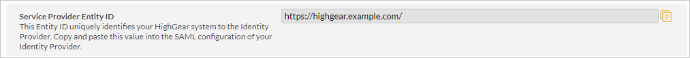
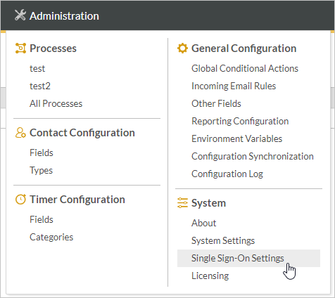
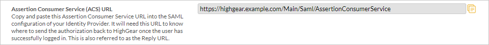
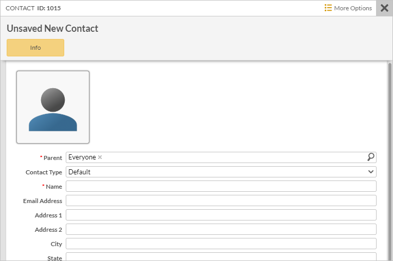
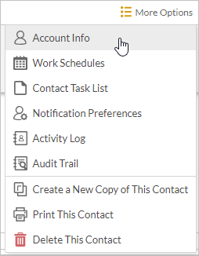
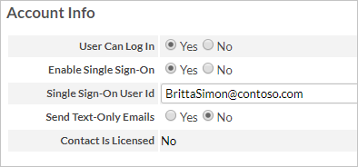

# Tutorial: Azure Active Directory integration with HighGear

In this tutorial, you can learn how to integrate HighGear with Azure Active Directory (Azure AD).
Integrating HighGear with Azure AD provides you with the following benefits:

* You can control in Azure AD who has access to HighGear.
* You can enable your users to be automatically signed-in to HighGear (Single Sign-On) with their Azure AD accounts.
* You can manage your accounts in one central location - the Azure portal.

If you want to know more details about SaaS app integration with Azure AD, see [What is application access and single sign-on with Azure Active Directory](https://docs.microsoft.com/azure/active-directory/active-directory-appssoaccess-whatis).
If you don't have an Azure subscription, [create a free account](https://azure.microsoft.com/free/) before you begin.

## Prerequisites

To configure Azure AD integration with HighGear, you need the following items:

* An Azure AD subscription. If you don't have an Azure AD environment, you can get a one-month trial [here](https://azure.microsoft.com/pricing/free-trial/)
* A HighGear system with an Enterprise or Unlimited license

## Scenario description

In this tutorial, you can learn how to configure and test Azure AD single sign-on in a test environment.

* HighGear supports **SP and IdP** initiated SSO

## Adding HighGear from the gallery

To configure the integration of HighGear into Azure AD, you need to add HighGear from the gallery to your list of managed SaaS apps.

**To add HighGear from the gallery, perform the following steps:**

1. In the **[Azure portal](https://portal.azure.com)**, on the left navigation panel, click the **Azure Active Directory** icon.

	

2. Navigate to **Enterprise Applications** and then select the **All Applications** option.

	

3. To add a new application, click the **New application** button on the top of the dialog.

	

4. In the search box, type **HighGear**, select **HighGear** from result panel, and then click the **Add** button to add the application.

	 

## Configure and test Azure AD single sign-on

In this section, you can learn how to configure and test Azure AD single sign-on with your HighGear system based on a test user called **Britta Simon**.
For single sign-on to work, a link relationship between an Azure AD user and the related user in your HighGear system needs to be established.

To configure and test Azure AD single sign-on with your HighGear system, you need to complete the following building blocks:

1. **[Configure Azure AD Single Sign-On](#configure-azure-ad-single-sign-on)** - to enable your users to use this feature.
2. **[Configure HighGear Single Sign-On](#configure-highgear-single-sign-on)** - to configure the Single Sign-On settings on the HighGear application side.
3. **[Create an Azure AD test user](#create-an-azure-ad-test-user)** - to test Azure AD single sign-on with Britta Simon.
4. **[Assign the Azure AD test user](#assign-the-azure-ad-test-user)** - to enable Britta Simon to use Azure AD single sign-on.
5. **[Create HighGear test user](#create-highgear-test-user)** - to have a counterpart of Britta Simon in HighGear that is linked to the Azure AD representation of the user. 
6. **[Test single sign-on](#test-single-sign-on)** - to verify whether the configuration works.

### Configure Azure AD single sign-on

In this section, you can learn how to enable Azure AD single sign-on in the Azure portal.

To configure Azure AD single sign-on with your HighGear system, perform the following steps:

1. In the [Azure portal](https://portal.azure.com/), on the **HighGear** application integration page, select **Single sign-on**.

    

2. On the **Select a Single sign-on method** dialog, select **SAML/WS-Fed** mode to enable single sign-on.

    

3. On the **Set up Single Sign-On with SAML** page, click the **Edit** icon to open the **Basic SAML Configuration** dialog.

	

4. On the **Basic SAML Configuration** section, perform the following steps:

    

    a. In the **Identifier** text box, paste the value of the **Service Provider Entity ID** field that is on the Single Sign-On Settings page in your HighGear system.

    
    
	> [!NOTE]
    > You will need to log in to your HighGear system to access the Single Sign-On Settings page. Once you're logged in, move your mouse over the Administration tab in HighGear and click the Single Sign-On Settings menu item.
    
    

    b. In the **Reply URL** text box, paste the value of the **Assertion Consumer Service (ACS) URL** from the Single Sign-On Settings page in your HighGear system.

    

    c. Click **Set additional URLs** and perform the following step if you wish to configure the application in **SP** initiated mode:

	 

     In the **Sign-on URL** text box, paste the value of the **Service Provider Entity ID** field that is on the Single Sign-On Settings page in your HighGear system. (This Entity ID is also the base URL of the HighGear system that is to be used for SP-initiated sign-on.)

    

	> [!NOTE]
	> These values are not real. Update these values with the actual Identifier, Reply URL and Sign-on URL from the **Single Sign-On Settings** page in your HighGear system. If you need help, please contact the [HighGear Support Team](mailto:support@highgear.com).

4. On the **Set up Single Sign-On with SAML** page, in the **SAML Signing Certificate** section, click **Download** to download the **Certificate (Base64)** and save it on your computer. You'll need it in a later step of the Single Sign-On configuration.

	

6. On the **Set up HighGear** section, note the location of the following URLs.

	

	a. Login URL. You will need this value in Step #2 under **Configure HighGear Single Sign-On** below.

	b. Azure AD Identifier. You will need this value in Step #3 under **Configure HighGear Single Sign-On** below.

	c. Logout URL. You will need this value in Step #4 under **Configure HighGear Single Sign-On** below.

### Configure HighGear Single Sign-On

To configure HighGear for Single Sign-On, please log in to your HighGear system. Once you're logged in, move your mouse over the Administration tab in HighGear and click the Single Sign-On Settings menu item.

1. In the **Identity Provider Name**, type a short description that will appear in HighGear's Single Sign-On button on the Login page. For example: Azure AD

2. In the **Single Sign-On (SSO) URL** field in HighGear, paste the value from the **Login URL** field that is in the **Set up HighGear** section in Azure.

3. In the **Identity Provider Entity ID** field in HighGear, paste the value from the **Azure AD Identifier** field that is in the **Set up HighGear** section in Azure.

4. In the **Single Logout (SLO) URL** field in HighGear, paste the value from the **Logout URL** field that is in the **Set up HighGear** section in Azure.

5. Use Notepad to open the certificate that you downloaded from the **SAML Signing Certificate** section in Azure. You should have downloaded the **Certificate (Base64)** format. Copy the contents of the certificate from Notepad and paste it into the **Identity Provider Certificate** field in HighGear.

6. Email the [HighGear Support Team](mailto:support@highgear.com) to request your HighGear Certificate. Follow the instructions you receive from them to fill out the **HighGear Certificate** and **HighGear Certificate Password** fields.

7. Click the **Save** button to save your HighGear Single Sign-On configuration.

### Create an Azure AD test user 

The objective of this section is to create a test user in the Azure portal called Britta Simon.

1. In the Azure portal, in the left pane, select **Azure Active Directory**, select **Users**, and then select **All users**.

    

2. Select **New user** at the top of the screen.

    

3. In the User properties, perform the following steps.

    

    a. In the **Name** field enter **BrittaSimon**.
  
    b. In the **User name** field type **brittasimon\@yourcompanydomain.extension**  
    For example, BrittaSimon@contoso.com

    c. Select the **Show password** check box, and then write down the value that's displayed in the Password box.

    d. Click **Create**.

### Assign the Azure AD test user

In this section, you enable Britta Simon to use Azure single sign-on by granting access to HighGear.

1. In the Azure portal, select **Enterprise Applications**, select **All applications**, and then select **HighGear**.

	

2. In the applications list, select **HighGear**.

	

3. In the menu on the left, select **Users and groups**.

    

4. Click the **Add user** button, then select **Users and groups** in the **Add Assignment** dialog.

    

5. In the **Users and groups** dialog select **Britta Simon** in the Users list, then click the **Select** button at the bottom of the screen.

6. If you are expecting any role value in the SAML assertion then in the **Select Role** dialog select the appropriate role for the user from the list, then click the **Select** button at the bottom of the screen.

7. In the **Add Assignment** dialog click the **Assign** button.

### Create HighGear test user

To create a HighGear test user to test your Single Sign-On configuration, please log in to your HighGear system.

1. Click the **Create New Contact** button.

    

    A menu will appear allowing you to choose the kind of contact you want to create.

2. Click the **Individual** menu item to create a HighGear user.

    A pane will slide out on the right so that you can type in the information for the new user.  
    

3. In the **Name** field, type a name for the contact. For example: Britta Simon

4. Click the **More Options** menu and select the **Account Info** menu item.

    

5. Set the **Can Log In** field to Yes.

    The **Enable Single Sign-On** field will automatically be set to Yes as well.

6. In the **Single Sign-On User Id** field, type the id of the user. For example: BrittaSimon@contoso.com

    The Account Info section should now look something like this:  
    

7. To save the contact, click the **Save** button at the bottom of the pane.

### Test single sign-on 

In this section, you test your Azure AD single sign-on configuration using the Access Panel.

When you click the HighGear tile in the Access Panel, you should be automatically signed in to the HighGear for which you set up SSO. For more information about the Access Panel, see [Introduction to the Access Panel](https://docs.microsoft.com/azure/active-directory/active-directory-saas-access-panel-introduction).

## Additional Resources

- [List of Tutorials on How to Integrate SaaS Apps with Azure Active Directory](https://docs.microsoft.com/azure/active-directory/active-directory-saas-tutorial-list)

- [What is application access and single sign-on with Azure Active Directory?](https://docs.microsoft.com/azure/active-directory/active-directory-appssoaccess-whatis)

- [What is Conditional Access in Azure Active Directory?](https://docs.microsoft.com/azure/active-directory/conditional-access/overview)

