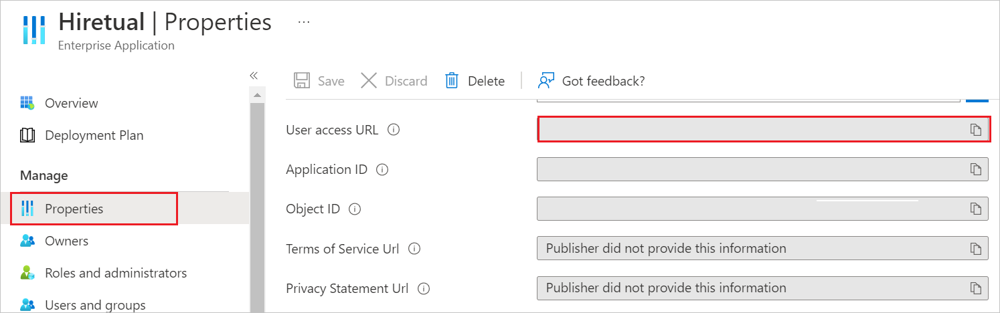
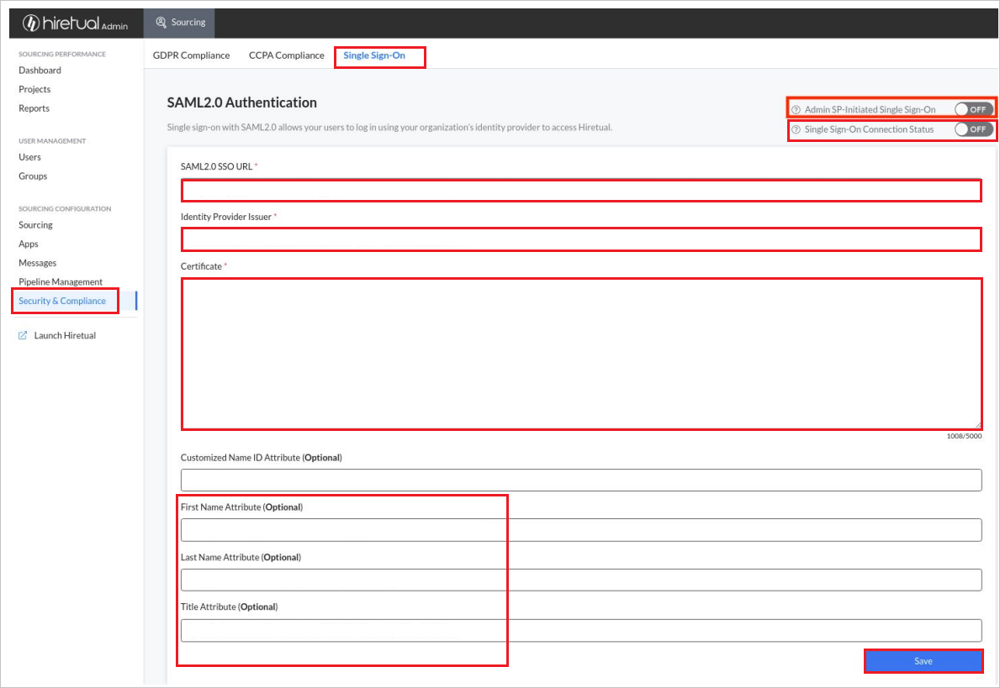

# Tutorial: Microsoft Entra SSO integration with hireEZ-SSO

In this tutorial, you'll learn how to integrate hireEZ-SSO with Microsoft Entra ID. When you integrate hireEZ-SSO with Microsoft Entra ID, you can:

* Control in Microsoft Entra ID who has access to hireEZ-SSO.
* Enable your users to be automatically signed-in to hireEZ-SSO with their Microsoft Entra accounts.
* Manage your accounts in one central location.

## Prerequisites

To get started, you need the following items:

* A Microsoft Entra subscription. If you don't have a subscription, you can get a [free account](https://azure.microsoft.com/free/).
* hireEZ-SSO single sign-on (SSO) enabled subscription.

## Scenario description

In this tutorial, you configure and test Microsoft Entra SSO in a test environment.

* hireEZ-SSO supports **SP and IDP** initiated SSO.

> [!NOTE]
> Identifier of this application is a fixed string value so only one instance can be configured in one tenant.

## Add hireEZ-SSO from the gallery

To configure the integration of hireEZ-SSO into Microsoft Entra ID, you need to add hireEZ-SSO from the gallery to your list of managed SaaS apps.

1. Sign in to the [Microsoft Entra admin center](https://entra.microsoft.com) as at least a [Cloud Application Administrator](../roles/permissions-reference.md#cloud-application-administrator).
1. Browse to **Identity** > **Applications** > **Enterprise applications** > **New application**.
1. In the **Add from the gallery** section, type **hireEZ-SSO** in the search box.
1. Select **hireEZ-SSO** from results panel and then add the app. Wait a few seconds while the app is added to your tenant.

 Alternatively, you can also use the [Enterprise App Configuration Wizard](https://portal.office.com/AdminPortal/home?Q=Docs#/azureadappintegration). In this wizard, you can add an application to your tenant, add users/groups to the app, assign roles, as well as walk through the SSO configuration as well. [Learn more about Microsoft 365 wizards.](/microsoft-365/admin/misc/azure-ad-setup-guides)

## Configure and test Microsoft Entra SSO for hireEZ-SSO

Configure and test Microsoft Entra SSO with hireEZ-SSO using a test user called **B.Simon**. For SSO to work, you need to establish a link relationship between a Microsoft Entra user and the related user in hireEZ-SSO.

To configure and test Microsoft Entra SSO with hireEZ-SSO, perform the following steps:

1. **[Configure Microsoft Entra SSO](#configure-azure-ad-sso)** - to enable your users to use this feature.
    1. **[Create a Microsoft Entra test user](#create-an-azure-ad-test-user)** - to test Microsoft Entra single sign-on with B.Simon.
    1. **[Assign the Microsoft Entra test user](#assign-the-azure-ad-test-user)** - to enable B.Simon to use Microsoft Entra single sign-on.
1. **[Configure hireEZ-SSO](#configure-hireez-sso)** - to configure the single sign-on settings on application side.
    1. **[Create hireEZ-SSO test user](#create-hireez-sso-test-user)** - to have a counterpart of B.Simon in hireEZ-SSO that is linked to the Microsoft Entra representation of user.
1. **[Test SSO](#test-sso)** - to verify whether the configuration works.

## Configure Microsoft Entra SSO

Follow these steps to enable Microsoft Entra SSO.

1. Sign in to the [Microsoft Entra admin center](https://entra.microsoft.com) as at least a [Cloud Application Administrator](../roles/permissions-reference.md#cloud-application-administrator).
1. Browse to **Identity** > **Applications** > **Enterprise applications** > **hireEZ-SSO** > **Single sign-on**.
1. On the **Select a single sign-on method** page, select **SAML**.
1. On the **Set up single sign-on with SAML** page, click the pencil icon for **Basic SAML Configuration** to edit the settings.

   

1. On the **Basic SAML Configuration** section, if you wish to configure the application in **IDP** initiated mode, perform the following step:

    a. In the **Identifier** text box, type the URL:
    `https://app.hireez.com/`
    
    b. In the **Reply URL** text box, type a URL using the following pattern:
    `https://api.hireez.com/v1/users/saml/login/<teamId>`

	> [!NOTE]
	> The Reply URL value is not real. Update this value with the actual Reply URL. Contact [hireEZ-SSO Client support team](mailto:support@hiretual.com) to get these values. You can also refer to the patterns shown in the **Basic SAML Configuration** section.

1. Click the **Properties** tab on the left menu bar, copy the value of **User access URL**,and save it on your computer.

    

1. On the **Set up single sign-on with SAML** page, In the **SAML Signing Certificate** section, click copy button to copy **App Federation Metadata Url** and save it on your computer.

	

### Create a Microsoft Entra test user

In this section, you'll create a test user called B.Simon.

1. Sign in to the [Microsoft Entra admin center](https://entra.microsoft.com) as at least a [User Administrator](../roles/permissions-reference.md#user-administrator).
1. Browse to **Identity** > **Users** > **All users**.
1. Select **New user** > **Create new user**, at the top of the screen.
1. In the **User** properties, follow these steps:
   1. In the **Display name** field, enter `B.Simon`.  
   1. In the **User principal name** field, enter the username@companydomain.extension. For example, `B.Simon@contoso.com`.
   1. Select the **Show password** check box, and then write down the value that's displayed in the **Password** box.
   1. Select **Review + create**.
1. Select **Create**.

### Assign the Microsoft Entra test user

In this section, you'll enable B.Simon to use single sign-on by granting access to hireEZ-SSO.

1. Sign in to the [Microsoft Entra admin center](https://entra.microsoft.com) as at least a [Cloud Application Administrator](../roles/permissions-reference.md#cloud-application-administrator).
1. Browse to **Identity** > **Applications** > **Enterprise applications** > **hireEZ-SSO**.
1. In the app's overview page, select **Users and groups**.
1. Select **Add user/group**, then select **Users and groups** in the **Add Assignment** dialog.
   1. In the **Users and groups** dialog, select **B.Simon** from the Users list, then click the **Select** button at the bottom of the screen.
   1. If you are expecting a role to be assigned to the users, you can select it from the **Select a role** dropdown. If no role has been set up for this app, you see "Default Access" role selected.
   1. In the **Add Assignment** dialog, click the **Assign** button.

## Configure hireEZ-SSO

1. Log in to your hireEZ-SSO company site as an administrator.

1. Go to **Security & Compliance** > **Single Sign-On**.

1. In the **SAML2.0 Authentication** page, perform the following steps:

    

    1. In the **SAML2.O SSO URL** textbox, paste the **User access URL** which you copied previously.

    1. Copy **Entity ID** value from the metadata file and paste in the **Identity Provider Issuer** textbox.

    1. Copy **X509 Certificate** from the metadata file and paste the content in the **Certificate** textbox.

    1. Enable **Single Sign-On Connection Status** button.

    1. Test your Single Sign-On integration first and then enable **Admin SP-Initiated Single Sign-On** button. 

    > [!NOTE]
    > If your Single Sign-On configuration has any errors or you have trouble to login to hireEZ-SSO Web App/Extension after you connected Admin SP-Initiated Single Sign-On, please contact [hireEZ-SSO support team](mailto:support@hiretual.com).
    
### Create hireEZ-SSO test user

In this section, you create a user called Britta Simon in hireEZ-SSO. Work with [hireEZ-SSO support team](mailto:support@hiretual.com) to add the users in the hireEZ-SSO platform. Users must be created and activated before you use single sign-on.

## Test SSO 

In this section, you test your Microsoft Entra single sign-on configuration with following options. 

#### SP initiated:

* Click on **Test this application**, this will redirect to hireEZ-SSO Sign on URL where you can initiate the login flow.  

* Go to hireEZ-SSO Sign-on URL directly and initiate the login flow from there.

#### IDP initiated:

* Click on **Test this application**, and you should be automatically signed in to the hireEZ-SSO for which you set up the SSO. 

You can also use Microsoft My Apps to test the application in any mode. When you click the hireEZ-SSO tile in the My Apps, if configured in SP mode you would be redirected to the application sign on page for initiating the login flow and if configured in IDP mode, you should be automatically signed in to the hireEZ-SSO for which you set up the SSO. For more information, see [Microsoft Entra My Apps](/azure/active-directory/manage-apps/end-user-experiences#azure-ad-my-apps).

## Next steps

Once you configure hireEZ-SSO you can enforce session control, which protects exfiltration and infiltration of your organization’s sensitive data in real time. Session control extends from Conditional Access. [Learn how to enforce session control with Microsoft Defender for Cloud Apps](/cloud-app-security/proxy-deployment-aad).
