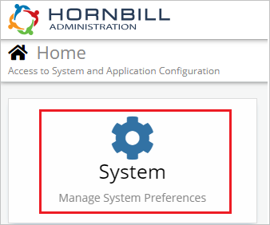
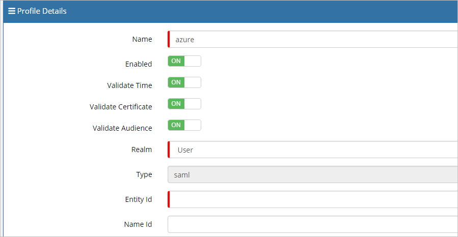
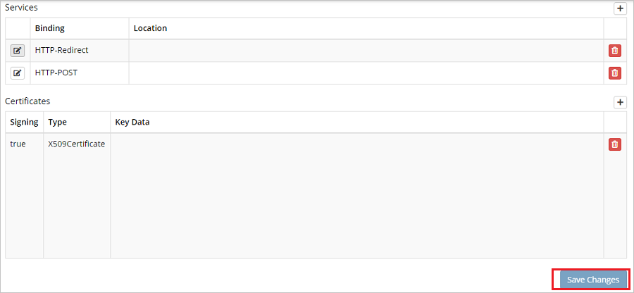

# Tutorial: Azure Active Directory integration with Hornbill

In this tutorial, you'll learn how to integrate Hornbill with Azure Active Directory (Azure AD). When you integrate Hornbill with Azure AD, you can:

* Control in Azure AD who has access to Hornbill.
* Enable your users to be automatically signed-in to Hornbill with their Azure AD accounts.
* Manage your accounts in one central location - the Azure portal.

## Prerequisites

To get started, you need the following items:

* An Azure AD subscription. If you don't have a subscription, you can get a [free account](https://azure.microsoft.com/free/).
* Hornbill single sign-on (SSO) enabled subscription.

> [!NOTE]
> This integration is also available to use from Azure AD US Government Cloud environment. You can find this application in the Azure AD US Government Cloud Application Gallery and configure it in the same way as you do from public cloud.

## Scenario description

In this tutorial, you configure and test Azure AD single sign-on in a test environment.

* Hornbill supports **SP** initiated SSO.
* Hornbill supports **Just In Time** user provisioning.

## Add Hornbill from the gallery

To configure the integration of Hornbill into Azure AD, you need to add Hornbill from the gallery to your list of managed SaaS apps.

1. Sign in to the Azure portal using either a work or school account, or a personal Microsoft account.
1. On the left navigation pane, select the **Azure Active Directory** service.
1. Navigate to **Enterprise Applications** and then select **All Applications**.
1. To add new application, select **New application**.
1. In the **Add from the gallery** section, type **Hornbill** in the search box.
1. Select **Hornbill** from results panel and then add the app. Wait a few seconds while the app is added to your tenant.

## Configure and test Azure AD SSO for Hornbill

Configure and test Azure AD SSO with Hornbill using a test user called **B.Simon**. For SSO to work, you need to establish a link relationship between an Azure AD user and the related user in Hornbill.

To configure and test Azure AD SSO with Hornbill, perform the following steps:

1. **[Configure Azure AD SSO](#configure-azure-ad-sso)** - to enable your users to use this feature.
    1. **[Create an Azure AD test user](#create-an-azure-ad-test-user)** - to test Azure AD single sign-on with B.Simon.
    1. **[Assign the Azure AD test user](#assign-the-azure-ad-test-user)** - to enable B.Simon to use Azure AD single sign-on.
1. **[Configure Hornbill SSO](#configure-hornbill-sso)** - to configure the single sign-on settings on application side.
    1. **[Create Hornbill test user](#create-hornbill-test-user)** - to have a counterpart of B.Simon in Hornbill that is linked to the Azure AD representation of user.
1. **[Test SSO](#test-sso)** - to verify whether the configuration works.

## Configure Azure AD SSO

Follow these steps to enable Azure AD SSO in the Azure portal.

1. In the Azure portal, on the **Hornbill** application integration page, find the **Manage** section and select **single sign-on**.
1. On the **Select a single sign-on method** page, select **SAML**.
1. On the **Set up single sign-on with SAML** page, click the pencil icon for **Basic SAML Configuration** to edit the settings.

   

4. On the **Basic SAML Configuration** section, perform the following steps:

	a. In the **Identifier (Entity ID)** text box, type a URL using the following pattern:
    `https://<SUBDOMAIN>.hornbill.com/<INSTANCE_NAME>/lib/saml/auth/simplesaml/module.php/saml/sp/metadata.php/saml`

	b. In the **Sign on URL** text box, type a URL using the following pattern:
    `https://<SUBDOMAIN>.hornbill.com/<INSTANCE_NAME>/`

	> [!NOTE]
	> These values are not real. Update these values with the actual Identifier and Sign on URL. Contact [Hornbill Client support team](https://www.hornbill.com/support/?request/) to get these values. You can also refer to the patterns shown in the **Basic SAML Configuration** section in the Azure portal.

5. On the **Set up Single Sign-On with SAML** page, In the **SAML Signing Certificate** section, click copy button to copy **App Federation Metadata Url** and save it on your computer.

	

### Create an Azure AD test user

In this section, you'll create a test user in the Azure portal called B.Simon.

1. From the left pane in the Azure portal, select **Azure Active Directory**, select **Users**, and then select **All users**.
1. Select **New user** at the top of the screen.
1. In the **User** properties, follow these steps:
   1. In the **Name** field, enter `B.Simon`.  
   1. In the **User name** field, enter the username@companydomain.extension. For example, `B.Simon@contoso.com`.
   1. Select the **Show password** check box, and then write down the value that's displayed in the **Password** box.
   1. Click **Create**.

### Assign the Azure AD test user

In this section, you'll enable B.Simon to use Azure single sign-on by granting access to Hornbill.

1. In the Azure portal, select **Enterprise Applications**, and then select **All applications**.
1. In the applications list, select **Hornbill**.
1. In the app's overview page, find the **Manage** section and select **Users and groups**.
1. Select **Add user**, then select **Users and groups** in the **Add Assignment** dialog.
1. In the **Users and groups** dialog, select **B.Simon** from the Users list, then click the **Select** button at the bottom of the screen.
1. If you are expecting a role to be assigned to the users, you can select it from the **Select a role** dropdown. If no role has been set up for this app, you see "Default Access" role selected.
1. In the **Add Assignment** dialog, click the **Assign** button.

## Configure Hornbill SSO

1. In a different web browser window, log in to Hornbill as a Security Administrator.

2. On the Home page, click **System**.

	

3. Navigate to **Security**.

	

4. Click **SSO Profiles**.

	

5. On the right side of the page, click on **Add logo**.

	

6. On the **Profile Details** bar, click on **Import SAML Meta logo**.

	

7. On the Pop-up page in the **URL** text box, paste the **App Federation Metadata Url**, which you have copied from Azure portal and click **Process**.

	

8. After clicking process the values get auto populated automatically under **Profile Details** section.

	

	

	

9. Click **Save Changes**.

### Create Hornbill test user

In this section, a user called Britta Simon is created in Hornbill. Hornbill supports just-in-time user provisioning, which is enabled by default. There is no action item for you in this section. If a user doesn't already exist in Hornbill, a new one is created after authentication.

> [!Note]
> If you need to create a user manually, contact [Hornbill Client support team](https://www.hornbill.com/support/?request/).

## Test SSO

In this section, you test your Azure AD single sign-on configuration with following options. 

* Click on **Test this application** in Azure portal. This will redirect to Hornbill Sign-on URL where you can initiate the login flow. 

* Go to Hornbill Sign-on URL directly and initiate the login flow from there.

* You can use Microsoft My Apps. When you click the Hornbill tile in the My Apps, this will redirect to Hornbill Sign-on URL. For more information about the My Apps, see [Introduction to the My Apps](../user-help/my-apps-portal-end-user-access.md).

## Next steps

Once you configure Hornbill you can enforce session control, which protects exfiltration and infiltration of your organization’s sensitive data in real time. Session control extends from Conditional Access. [Learn how to enforce session control with Microsoft Cloud App Security](/cloud-app-security/proxy-deployment-aad).