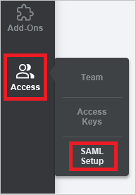
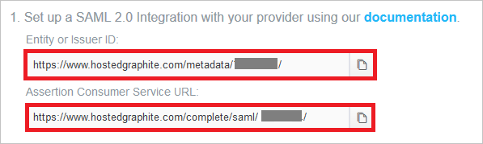
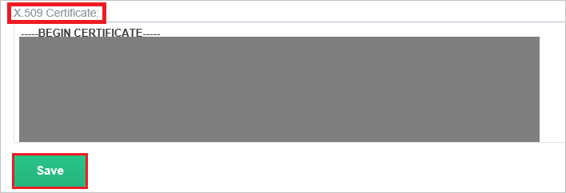

# Tutorial: Azure Active Directory integration with Hosted Graphite

In this tutorial, you learn how to integrate Hosted Graphite with Azure Active Directory (Azure AD).
Integrating Hosted Graphite with Azure AD provides you with the following benefits:

* You can control in Azure AD who has access to Hosted Graphite.
* You can enable your users to be automatically signed-in to Hosted Graphite (Single Sign-On) with their Azure AD accounts.
* You can manage your accounts in one central location - the Azure portal.

If you want to know more details about SaaS app integration with Azure AD, see [What is application access and single sign-on with Azure Active Directory](https://docs.microsoft.com/azure/active-directory/active-directory-appssoaccess-whatis).
If you don't have an Azure subscription, [create a free account](https://azure.microsoft.com/free/) before you begin.

## Prerequisites

To configure Azure AD integration with Hosted Graphite, you need the following items:

* An Azure AD subscription. If you don't have an Azure AD environment, you can get one-month trial [here](https://azure.microsoft.com/pricing/free-trial/)
* Hosted Graphite single sign-on enabled subscription

## Scenario description

In this tutorial, you configure and test Azure AD single sign-on in a test environment.

* Hosted Graphite supports **SP and IDP** initiated SSO
* Hosted Graphite supports **Just In Time** user provisioning

## Adding Hosted Graphite from the gallery

To configure the integration of Hosted Graphite into Azure AD, you need to add Hosted Graphite from the gallery to your list of managed SaaS apps.

**To add Hosted Graphite from the gallery, perform the following steps:**

1. In the **[Azure portal](https://portal.azure.com)**, on the left navigation panel, click **Azure Active Directory** icon.

	

2. Navigate to **Enterprise Applications** and then select the **All Applications** option.

	

3. To add new application, click **New application** button on the top of dialog.

	

4. In the search box, type **Hosted Graphite**, select **Hosted Graphite** from result panel then click **Add** button to add the application.

	 

## Configure and test Azure AD single sign-on

In this section, you configure and test Azure AD single sign-on with Hosted Graphite based on a test user called **Britta Simon**.
For single sign-on to work, a link relationship between an Azure AD user and the related user in Hosted Graphite needs to be established.

To configure and test Azure AD single sign-on with Hosted Graphite, you need to complete the following building blocks:

1. **[Configure Azure AD Single Sign-On](#configure-azure-ad-single-sign-on)** - to enable your users to use this feature.
2. **[Configure Hosted Graphite Single Sign-On](#configure-hosted-graphite-single-sign-on)** - to configure the Single Sign-On settings on application side.
3. **[Create an Azure AD test user](#create-an-azure-ad-test-user)** - to test Azure AD single sign-on with Britta Simon.
4. **[Assign the Azure AD test user](#assign-the-azure-ad-test-user)** - to enable Britta Simon to use Azure AD single sign-on.
5. **[Create Hosted Graphite test user](#create-hosted-graphite-test-user)** - to have a counterpart of Britta Simon in Hosted Graphite that is linked to the Azure AD representation of user.
6. **[Test single sign-on](#test-single-sign-on)** - to verify whether the configuration works.

### Configure Azure AD single sign-on

In this section, you enable Azure AD single sign-on in the Azure portal.

To configure Azure AD single sign-on with Hosted Graphite, perform the following steps:

1. In the [Azure portal](https://portal.azure.com/), on the **Hosted Graphite** application integration page, select **Single sign-on**.

    

2. On the **Select a Single sign-on method** dialog, select **SAML/WS-Fed** mode to enable single sign-on.

    

3. On the **Set up Single Sign-On with SAML** page, click **Edit** icon to open **Basic SAML Configuration** dialog.

	

4. On the **Basic SAML Configuration** section, If you wish to configure the application in **IDP** initiated mode, perform the following steps:

    

    a. In the **Identifier** text box, type a URL using the following pattern:
    `https://www.hostedgraphite.com/metadata/<user id>`

    b. In the **Reply URL** text box, type a URL using the following pattern:
    `https://www.hostedgraphite.com/complete/saml/<user id>`

5. Click **Set additional URLs** and perform the following step if you wish to configure the application in **SP** initiated mode:

    

    In the **Sign-on URL** text box, type a URL using the following pattern:
    `https://www.hostedgraphite.com/login/saml/<user id>/`

    > [!NOTE]
    > Please note that these are not the real values. You have to update these values with the actual Identifier, Reply URL and Sign On URL. To get these values, you can go to Access->SAML setup on your Application side or Contact [Hosted Graphite support team](mailto:help@hostedgraphite.com).

6. On the **Set up Single Sign-On with SAML** page, in the **SAML Signing Certificate** section, click **Download** to download the **Certificate (Base64)** from the given options as per your requirement and save it on your computer.

	

7. On the **Set up Hosted Graphite** section, copy the appropriate URL(s) as per your requirement.

	

	a. Login URL

	b. Azure Ad Identifier

	c. Logout URL

### Configure Hosted Graphite Single Sign-On

1. Sign-on to your Hosted Graphite tenant as an administrator.

2. Go to the **SAML Setup page** in the sidebar (**Access -> SAML Setup**).

    

3. Confirm these URls match your configuration done on the **Basic SAML Configuration** section of the Azure portal.

    

4. In  **Entity or Issuer ID** and **SSO Login URL** textboxes, paste the value of **Azure Ad Identifier** and **Login URL** which you have copied from Azure portal.

    

5. Select **Read-only** as **Default User Role**.

    

6. Open your base-64 encoded certificate in notepad downloaded from Azure portal, copy the content of it into your clipboard, and then paste it to the **X.509 Certificate** textbox.

    

7. Click **Save** button.

### Create an Azure AD test user

The objective of this section is to create a test user in the Azure portal called Britta Simon.

1. In the Azure portal, in the left pane, select **Azure Active Directory**, select **Users**, and then select **All users**.

    

2. Select **New user** at the top of the screen.

    

3. In the User properties, perform the following steps.

    

    a. In the **Name** field enter **BrittaSimon**.
  
    b. In the **User name** field type **brittasimon\@yourcompanydomain.extension**  
    For example, BrittaSimon@contoso.com

    c. Select **Show password** check box, and then write down the value that's displayed in the Password box.

    d. Click **Create**.

### Assign the Azure AD test user

In this section, you enable Britta Simon to use Azure single sign-on by granting access to Hosted Graphite.

1. In the Azure portal, select **Enterprise Applications**, select **All applications**, then select **Hosted Graphite**.

	

2. In the applications list, select **Hosted Graphite**.

	

3. In the menu on the left, select **Users and groups**.

    

4. Click the **Add user** button, then select **Users and groups** in the **Add Assignment** dialog.

    

5. In the **Users and groups** dialog select **Britta Simon** in the Users list, then click the **Select** button at the bottom of the screen.

6. If you are expecting any role value in the SAML assertion then in the **Select Role** dialog select the appropriate role for the user from the list, then click the **Select** button at the bottom of the screen.

7. In the **Add Assignment** dialog click the **Assign** button.

### Create Hosted Graphite test user

In this section, a user called Britta Simon is created in Hosted Graphite. Hosted Graphite supports just-in-time user provisioning, which is enabled by default. There is no action item for you in this section. If a user doesn't already exist in Hosted Graphite, a new one is created after authentication.

> [!NOTE]
> If you need to create a user manually, you need to contact the Hosted Graphite support team via <mailto:help@hostedgraphite.com>.

### Test single sign-on

In this section, you test your Azure AD single sign-on configuration using the Access Panel.

When you click the Hosted Graphite tile in the Access Panel, you should be automatically signed in to the Hosted Graphite for which you set up SSO. For more information about the Access Panel, see [Introduction to the Access Panel](https://docs.microsoft.com/azure/active-directory/active-directory-saas-access-panel-introduction).

## Additional Resources

- [List of Tutorials on How to Integrate SaaS Apps with Azure Active Directory](https://docs.microsoft.com/azure/active-directory/active-directory-saas-tutorial-list)

- [What is application access and single sign-on with Azure Active Directory?](https://docs.microsoft.com/azure/active-directory/active-directory-appssoaccess-whatis)

- [What is Conditional Access in Azure Active Directory?](https://docs.microsoft.com/azure/active-directory/conditional-access/overview)

