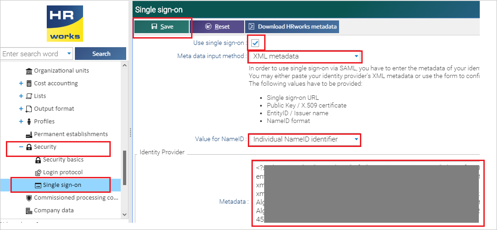
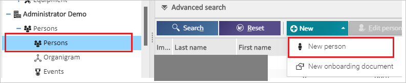
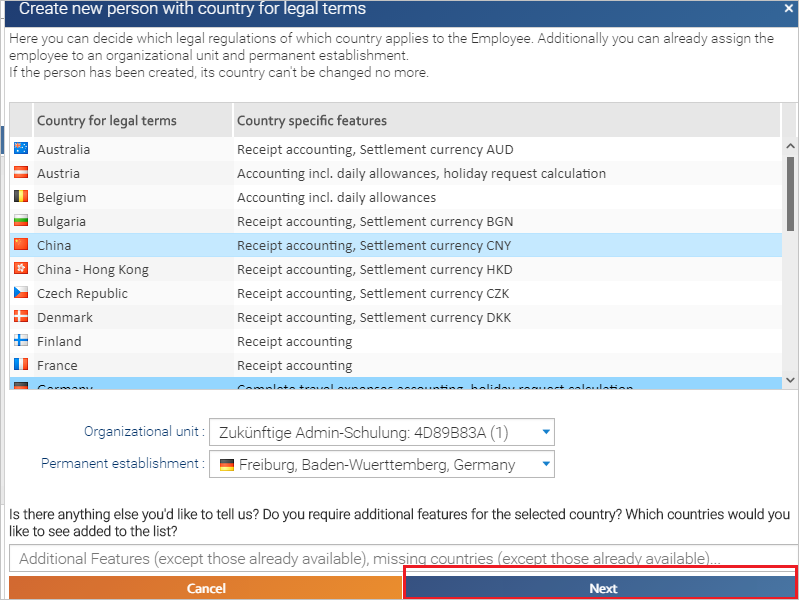
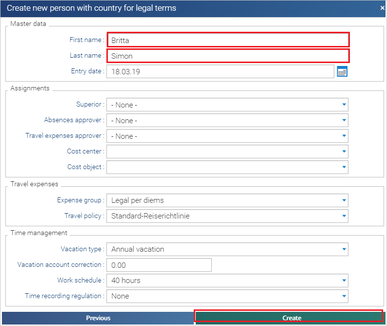

# Tutorial: Azure Active Directory single sign-on (SSO) integration with HRworks Single Sign-On

In this tutorial, you'll learn how to integrate HRworks Single Sign-On with Azure Active Directory (Azure AD). When you integrate HRworks Single Sign-On with Azure AD, you can:

* Control in Azure AD who has access to HRworks Single Sign-On.
* Enable your users to be automatically signed-in to HRworks Single Sign-On with their Azure AD accounts.
* Manage your accounts in one central location - the Azure portal.

To learn more about SaaS app integration with Azure AD, see [What is application access and single sign-on with Azure Active Directory](https://docs.microsoft.com/azure/active-directory/active-directory-appssoaccess-whatis).

## Prerequisites

To get started, you need the following items:

* An Azure AD subscription. If you don't have a subscription, you can get a [free account](https://azure.microsoft.com/free/).
* HRworks Single Sign-On single sign-on (SSO) enabled subscription.

## Scenario description

In this tutorial, you configure and test Azure AD SSO in a test environment.

* HRworks Single Sign-On supports **SP** initiated SSO

## Adding HRworks Single Sign-On from the gallery

To configure the integration of HRworks Single Sign-On into Azure AD, you need to add HRworks Single Sign-On from the gallery to your list of managed SaaS apps.

1. Sign in to the [Azure portal](https://portal.azure.com) using either a work or school account, or a personal Microsoft account.
1. On the left navigation pane, select the **Azure Active Directory** service.
1. Navigate to **Enterprise Applications** and then select **All Applications**.
1. To add new application, select **New application**.
1. In the **Add from the gallery** section, type **HRworks Single Sign-On** in the search box.
1. Select **HRworks Single Sign-On** from results panel and then add the app. Wait a few seconds while the app is added to your tenant.

## Configure and test Azure AD single sign-on for HRworks Single Sign-On

Configure and test Azure AD SSO with HRworks Single Sign-On using a test user called **B.Simon**. For SSO to work, you need to establish a link relationship between an Azure AD user and the related user in HRworks Single Sign-On.

To configure and test Azure AD SSO with HRworks Single Sign-On, complete the following building blocks:

1. **[Configure Azure AD SSO](#configure-azure-ad-sso)** - to enable your users to use this feature.
    * **[Create an Azure AD test user](#create-an-azure-ad-test-user)** - to test Azure AD single sign-on with B.Simon.
    * **[Assign the Azure AD test user](#assign-the-azure-ad-test-user)** - to enable B.Simon to use Azure AD single sign-on.
1. **[Configure HRworks Single Sign-On SSO](#configure-hrworks-single-sign-on-sso)** - to configure the single sign-on settings on application side.
    * **[Create HRworks Single Sign-On test user](#create-hrworks-single-sign-on-test-user)** - to have a counterpart of B.Simon in HRworks Single Sign-On that is linked to the Azure AD representation of user.
1. **[Test SSO](#test-sso)** - to verify whether the configuration works.

## Configure Azure AD SSO

Follow these steps to enable Azure AD SSO in the Azure portal.

1. In the [Azure portal](https://portal.azure.com/), on the **HRworks Single Sign-On** application integration page, find the **Manage** section and select **single sign-on**.
1. On the **Select a single sign-on method** page, select **SAML**.
1. On the **Set up single sign-on with SAML** page, click the edit/pen icon for **Basic SAML Configuration** to edit the settings.

   

1. On the **Basic SAML Configuration** section, enter the values for the following fields:

    In the **Sign-on URL** text box, type a URL using the following pattern:
    `https://login.hrworks.de/?companyId=<companyId>&directssologin=true`

	> [!NOTE]
	> The value is not real. Update the value with the actual Sign-On URL. Contact [HRworks Single Sign-On Client support team](mailto:nadja.sommerfeld@hrworks.de) to get the value. You can also refer to the patterns shown in the **Basic SAML Configuration** section in the Azure portal.

1. On the **Set up single sign-on with SAML** page, in the **SAML Signing Certificate** section,  find **Federation Metadata XML** and select **Download** to download the certificate and save it on your computer.

	

1. On the **Set up HRworks Single Sign-On** section, copy the appropriate URL(s) based on your requirement.

	

### Create an Azure AD test user

In this section, you'll create a test user in the Azure portal called B.Simon.

1. From the left pane in the Azure portal, select **Azure Active Directory**, select **Users**, and then select **All users**.
1. Select **New user** at the top of the screen.
1. In the **User** properties, follow these steps:
   1. In the **Name** field, enter `B.Simon`.  
   1. In the **User name** field, enter the username@companydomain.extension. For example, `B.Simon@contoso.com`.
   1. Select the **Show password** check box, and then write down the value that's displayed in the **Password** box.
   1. Click **Create**.

### Assign the Azure AD test user

In this section, you'll enable B.Simon to use Azure single sign-on by granting access to HRworks Single Sign-On.

1. In the Azure portal, select **Enterprise Applications**, and then select **All applications**.
1. In the applications list, select **HRworks Single Sign-On**.
1. In the app's overview page, find the **Manage** section and select **Users and groups**.

   

1. Select **Add user**, then select **Users and groups** in the **Add Assignment** dialog.

	

1. In the **Users and groups** dialog, select **B.Simon** from the Users list, then click the **Select** button at the bottom of the screen.
1. If you're expecting any role value in the SAML assertion, in the **Select Role** dialog, select the appropriate role for the user from the list and then click the **Select** button at the bottom of the screen.
1. In the **Add Assignment** dialog, click the **Assign** button.

## Configure HRworks Single Sign-On SSO

1. To automate the configuration within HRworks Single Sign-On, you need to install **My Apps Secure Sign-in browser extension** by clicking **Install the extension**.

	

1. After adding extension to the browser, click on **Set up HRworks Single Sign-On** will direct you to the HRworks Single Sign-On application. From there, provide the admin credentials to sign into HRworks Single Sign-On. The browser extension will automatically configure the application for you and automate steps 3-4.

	

1. If you want to setup HRworks Single Sign-On manually, open a new web browser window and sign into your HRworks Single Sign-On company site as an administrator and perform the following steps:

1. Click on **Administrator** > **Basics** > **Security** > **Single Sign-on** from the left side of menu bar and perform the following steps:

    

	a. Check the **Use Single Sign-on** box.

	b. Select **XML Metadata** as **Meta data input method**.

	c. Select **Individual NameID identifier** as **Value for NameID**.

	d. In Notepad, open the Metadata XML that you downloaded from the Azure portal, copy its content, and then paste it into the **Metadata** textbox.

	e. Click **Save**.

### Create HRworks Single Sign-On test user

To enable Azure AD users, sign in to HRworks Single Sign-On, they must be provisioned into HRworks Single Sign-On. In HRworks Single Sign-On, provisioning is a manual task.

**To provision a user account, perform the following steps:**

1. Sign in to HRworks Single Sign-On as an Administrator.

1. Click on **Administrator** > **Persons** > **Persons** > **New person** from the left side of menu bar.

	 

1. On the Pop-up, click **Next**.

	

1. On the **Create new person with country for legal terms** pop-up, fill the respective details like **First name**, **Last name** and click **Create**.

	

## Test SSO

In this section, you test your Azure AD single sign-on configuration using the Access Panel.

When you click the HRworks Single Sign-On tile in the Access Panel, you should be automatically signed in to the HRworks Single Sign-On for which you set up SSO. For more information about the Access Panel, see [Introduction to the Access Panel](https://docs.microsoft.com/azure/active-directory/active-directory-saas-access-panel-introduction).

## Additional resources

- [ List of Tutorials on How to Integrate SaaS Apps with Azure Active Directory ](https://docs.microsoft.com/azure/active-directory/active-directory-saas-tutorial-list)

- [What is application access and single sign-on with Azure Active Directory? ](https://docs.microsoft.com/azure/active-directory/active-directory-appssoaccess-whatis)

- [What is conditional access in Azure Active Directory?](https://docs.microsoft.com/azure/active-directory/conditional-access/overview)

- [Try HRworks Single Sign-On with Azure AD](https://aad.portal.azure.com/)