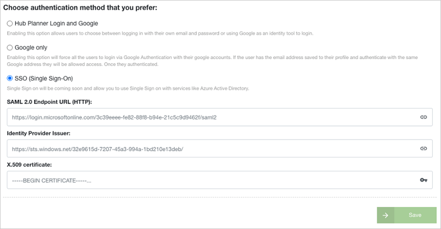

# Tutorial: Azure AD SSO integration with Hub Planner

In this tutorial, you'll learn how to integrate Hub Planner with Azure Active Directory (Azure AD). When you integrate Hub Planner with Azure AD, you can:

* Control in Azure AD who has access to Hub Planner.
* Enable your users to be automatically signed-in to Hub Planner with their Azure AD accounts.
* Manage your accounts in one central location - the Azure portal.

## Prerequisites

To get started, you need the following items:

* An Azure AD subscription. If you don't have a subscription, you can get a [free account](https://azure.microsoft.com/free/).
* Hub Planner single sign-on (SSO) enabled subscription.

## Scenario description

In this tutorial, you configure and test Azure AD SSO in a test environment.

* Hub Planner supports **SP** initiated SSO.

> [!NOTE]
> Identifier of this application is a fixed string value so only one instance can be configured in one tenant.

## Add Hub Planner from the gallery

To configure the integration of Hub Planner into Azure AD, you need to add Hub Planner from the gallery to your list of managed SaaS apps.

1. Sign in to the Azure portal using either a work or school account, or a personal Microsoft account.
1. On the left navigation pane, select the **Azure Active Directory** service.
1. Navigate to **Enterprise Applications** and then select **All Applications**.
1. To add new application, select **New application**.
1. In the **Add from the gallery** section, type **Hub Planner** in the search box.
1. Select **Hub Planner** from results panel and then add the app. Wait a few seconds while the app is added to your tenant.

 Alternatively, you can also use the [Enterprise App Configuration Wizard](https://portal.office.com/AdminPortal/home?Q=Docs#/azureadappintegration). In this wizard, you can add an application to your tenant, add users/groups to the app, assign roles, as well as walk through the SSO configuration as well. [Learn more about Microsoft 365 wizards.](/microsoft-365/admin/misc/azure-ad-setup-guides)

## Configure and test Azure AD SSO for Hub Planner

Configure and test Azure AD SSO with Hub Planner using a test user called **B.Simon**. For SSO to work, you need to establish a link relationship between an Azure AD user and the related user in Hub Planner.

To configure and test Azure AD SSO with Hub Planner, perform the following steps:

1. **[Configure Azure AD SSO](#configure-azure-ad-sso)** - to enable your users to use this feature.
    1. **[Create an Azure AD test user](#create-an-azure-ad-test-user)** - to test Azure AD single sign-on with B.Simon.
    1. **[Assign the Azure AD test user](#assign-the-azure-ad-test-user)** - to enable B.Simon to use Azure AD single sign-on.
1. **[Configure Hub Planner SSO](#configure-hub-planner-sso)** - to configure the single sign-on settings on application side.
    1. **[Create Hub Planner test user](#create-hub-planner-test-user)** - to have a counterpart of B.Simon in Hub Planner that is linked to the Azure AD representation of user.
1. **[Test SSO](#test-sso)** - to verify whether the configuration works.

## Configure Azure AD SSO

Follow these steps to enable Azure AD SSO in the Azure portal.

1. In the Azure portal, on the **Hub Planner** application integration page, find the **Manage** section and select **single sign-on**.
1. On the **Select a single sign-on method** page, select **SAML**.
1. On the **Set up single sign-on with SAML** page, click the pencil icon for **Basic SAML Configuration** to edit the settings.

   

1. On the **Basic SAML Configuration** section, perform the following steps:

    a. In the **Identifier** box, type a URL using the following pattern:
    `https://app.hubplanner.com/sso/metadata`

    b. In the **Reply URL** text box, type a URL using the following pattern:
    `https://app.hubplanner.com/sso/callback`

    c. In the **Sign-on URL** text box, type a URL using the following pattern:
    `https://<SUBDOMAIN>.hubplanner.com`

	> [!NOTE]
	> These values are the ones you will use. The only change you need to make is to replace \<SUBDOMAIN\> in the **Sign-on URL** with the subdomain you received when you signed up for Hub Planner. You can also refer to the patterns shown in the **Basic SAML Configuration** section in the Azure portal.

1. On the **Set up single sign-on with SAML** page, in the **SAML Signing Certificate** section,  find **Certificate (Base64)** and select **Download** to download the certificate and save it on your computer.

	

1. On the **Set up Hub Planner** section, copy the appropriate URL(s) based on your requirement.

	

### Create an Azure AD test user

In this section, you'll create a test user in the Azure portal called B.Simon.

1. From the left pane in the Azure portal, select **Azure Active Directory**, select **Users**, and then select **All users**.
1. Select **New user** at the top of the screen.
1. In the **User** properties, follow these steps:
   1. In the **Name** field, enter `B.Simon`.  
   1. In the **User name** field, enter the username@companydomain.extension. For example, `B.Simon@contoso.com`.
   1. Select the **Show password** check box, and then write down the value that's displayed in the **Password** box.
   1. Click **Create**.

### Assign the Azure AD test user

In this section, you'll enable B.Simon to use Azure single sign-on by granting access to Hub Planner.

1. In the Azure portal, select **Enterprise Applications**, and then select **All applications**.
1. In the applications list, select **Hub Planner**.
1. In the app's overview page, find the **Manage** section and select **Users and groups**.
1. Select **Add user**, then select **Users and groups** in the **Add Assignment** dialog.
1. In the **Users and groups** dialog, select **B.Simon** from the Users list, then click the **Select** button at the bottom of the screen.
1. If you're expecting any role value in the SAML assertion, in the **Select Role** dialog, select the appropriate role for the user from the list and then click the **Select** button at the bottom of the screen.
1. In the **Add Assignment** dialog, click the **Assign** button.

## Configure Hub Planner SSO

To configure single sign-on on **Hub Planner** side, you need to sign in to your Hub Planner account and complete the following tasks. 

### Install the extension in Hub Planner

To enable SSO functionality, you must first enable the extension. As the account owner or with equivalent permissions, complete these steps:

1. Go to **Settings**.
1. In the side menu, select **Manage Extensions** > **Add/Remove Extensions**.
1. Find the extension for Single Sign On and Add or Try Free.
1. When prompted, agree to the terms and conditions, and then select **Add Now**.

### Enable SSO

After the extension is enabled, you must enable SSO for your account. 

1. Go to **Settings**.
1. In the side menu, select **Authentication**.
1. Select **SSO (Single Sign-On)**.
1. Enter additional authentication information as shown in the following image, and then select **Save**.

### Create Hub Planner test user

If you want to add other users go to **Settings** > **Manage resources** and add users from here. Make sure to add their email address and invite them. Once invited, they will receive an email and be able to enter via SSO. 

## Test SSO 

In this section, you test your Azure AD single sign-on configuration with following options. 

* Click on **Test this application** in Azure portal. This will redirect to Hub Planner Sign-on URL where you can initiate the login flow. 

* Go to Hub Planner Sign-on URL directly and initiate the login flow from there.

* You can use Microsoft My Apps. When you click the Hub Planner tile in the My Apps, this will redirect to Hub Planner Sign-on URL. For more information about the My Apps, see [Introduction to the My Apps](../user-help/my-apps-portal-end-user-access.md).

## Next steps

Once you configure Hub Planner you can enforce session control, which protects exfiltration and infiltration of your organization’s sensitive data in real time. Session control extends from Conditional Access. [Learn how to enforce session control with Microsoft Defender for Cloud Apps](/cloud-app-security/proxy-deployment-aad).
