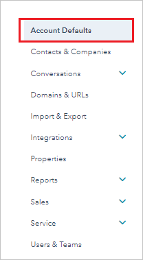
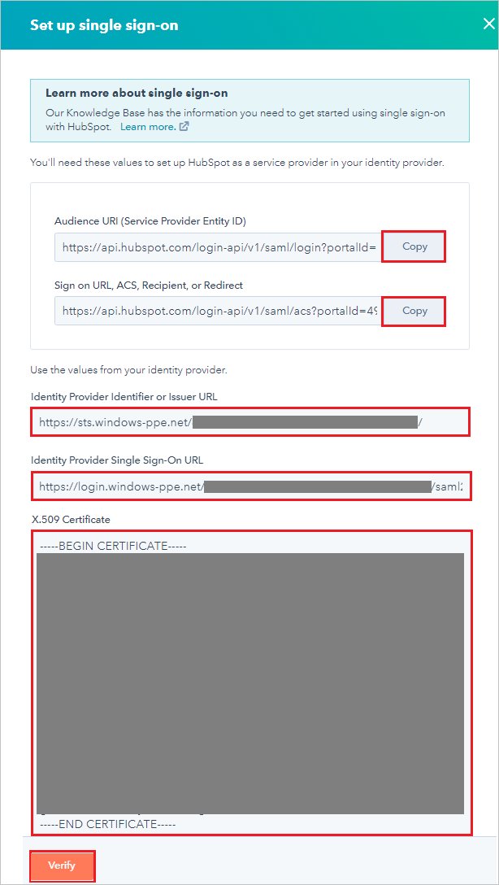
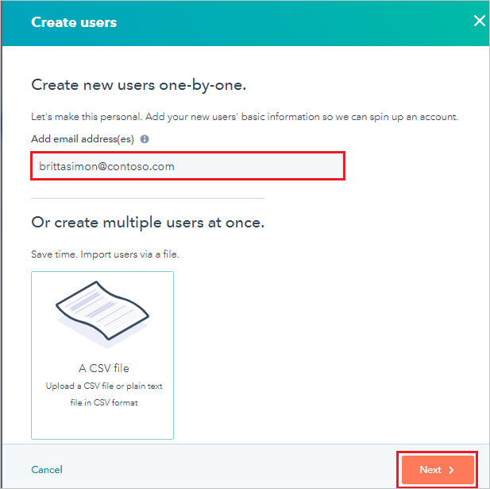

# Tutorial: Azure Active Directory integration with HubSpot

In this tutorial, you learn how to integrate HubSpot with Azure Active Directory (Azure AD).

Integrating HubSpot with Azure AD gives you the following benefits:

* You can use Azure AD to control who has access to HubSpot.
* Users can be automatically signed in to HubSpot with their Azure AD accounts (single sign-on).
* You can manage your accounts in one central location, the Azure portal.

For more information about software as a service (SaaS) app integration with Azure AD, see [Single sign-on to applications in Azure Active Directory](https://docs.microsoft.com/azure/active-directory/active-directory-appssoaccess-whatis).

## Prerequisites

To configure Azure AD integration with HubSpot, you need the following items:

* An Azure AD subscription. If you don't have an Azure AD subscription, create a [free account](https://azure.microsoft.com/free/) before you begin.
* A HubSpot subscription with single sign-on enabled.

## Scenario description

In this tutorial, you configure and test Azure AD single sign-on in a test environment and integrate HubSpot with Azure AD.

HubSpot supports the following features:

* **SP-initiated single sign-on**
* **IDP-initiated single sign-on**

## Add HubSpot in the Azure portal

To integrate HubSpot with Azure AD, you must add HubSpot to your list of managed SaaS apps.

1. Sign in to the [Azure portal](https://portal.azure.com).

1. In the left menu, select **Azure Active Directory**.

	

1. Select **Enterprise applications** > **All applications**.

	

1. To add an application, select **New application**.

	

1. In the search box, enter **HubSpot**. In the search results, select **HubSpot**, and then select **Add**.

	

## Configure and test Azure AD single sign-on

In this section, you configure and test Azure AD single sign-on with HubSpot based on a test user named **Britta Simon**. For single sign-on to work, you must establish a linked relationship between an Azure AD user and the related user in HubSpot.

To configure and test Azure AD single sign-on with HubSpot, you must complete the following building blocks:

| Task | Description |
| --- | --- |
| **[Configure Azure AD single sign-on](#configure-azure-ad-single-sign-on)** | Enables your users to use this feature. |
| **[Configure HubSpot single sign-on](#configure-hubspot-single-sign-on)** | Configures the single sign-on settings in the application. |
| **[Create an Azure AD test user](#create-an-azure-ad-test-user)** | Tests Azure AD single sign-on for a user named Britta Simon. |
| **[Assign the Azure AD test user](#assign-the-azure-ad-test-user)** | Enables Britta Simon to use Azure AD single sign-on. |
| **[Create a HubSpot test user](#create-a-hubspot-test-user)** | Creates a counterpart of Britta Simon in HubSpot that is linked to the Azure AD representation of the user. |
| **[Test single sign-on](#test-single-sign-on)** | Verifies that the configuration works. |

### Configure Azure AD single sign-on

In this section, you configure Azure AD single sign-on with HubSpot in the Azure portal.

1. In the [Azure portal](https://portal.azure.com/), in the **HubSpot** application integration pane, select **Single sign-on**.

    

1. In the **Select a single sign-on method** pane, select **SAML** or **SAML/WS-Fed** mode to enable single sign-on.

    

1. In the **Set up Single Sign-On with SAML** pane, select **Edit** (the pencil icon) to open the **Basic SAML Configuration** pane.

	

1. In the **Basic SAML Configuration** pane, to configure *IDP-initiated mode*, complete the following steps:

    1. In the **Identifier** box, enter a URL that has the following pattern: https:\//api.hubspot.com/login-api/v1/saml/login?portalId=\<CUSTOMER ID\>.

    1. In the **Reply URL** box, enter a URL that has the following pattern: https:\//api.hubspot.com/login-api/v1/saml/acs?portalId=\<CUSTOMER ID\>.

	

    > [!NOTE]
	> To format the URLs, you can also refer to the patterns shown in the **Basic SAML Configuration** pane in the Azure portal.

1. To configure the application in *SP-initiated* mode:

    1. Select **Set additional URLs**.

	1. In the **Sign on URL** box, enter **https:\//app.hubspot.com/login**.

    

1. In the **Set up Single Sign-On with SAML** pane, in the **SAML Signing Certificate** section, select **Download** next to **Certificate (Base64)**. Select a download option based on your requirements. Save the certificate on your computer.

	

1. In the **Set up HubSpot** section, copy the following URLs based on your requirements:

	* Login URL
	* Azure AD Identifier
	* Logout URL

	

### Configure HubSpot single sign-on

1. Open a new tab in your browser and sign in to your HubSpot administrator account.

1. Select the **Settings** icon in the upper-right corner of the page.

	

1. Select **Account Defaults**.

	

1. Scroll down to the **Security** section, and then select **Set up**.

	

1. In the **Set up single sign-on** section, complete the following steps:

	1. In the **Audience URl (Service Provider Entity ID)** box, select **Copy** to copy the value. In the Azure portal, in the **Basic SAML Configuration** pane, paste the value in the **Identifier** box.

	1. In the **Sign on URl, ACS, Recipient, or Redirect** box, select **Copy** to copy the value. In the Azure portal, in the **Basic SAML Configuration** pane, paste the value in the **Reply URL** box.

	1. In HubSpot, in the **Identity Provider Identifier or Issuer URL** box, paste the value for **Azure AD Identifier** that you copied in the Azure portal.

	1. In HubSpot, in the **Identity Provider Single Sign-On URL** box, paste the value for **Login URL** that you copied in the Azure portal.

	1. In Windows Notepad, open the Certificate(Base64) file that you downloaded. Select and copy the contents of the file. Then, in HubSpot, paste it in the **X.509 Certificate** box.

	1. Select **Verify**.

		

### Create an Azure AD test user

In this section, you create a test user named Britta Simon in the Azure portal.

1. In the Azure portal, select **Azure Active Directory** > **Users** > **All users**.

    

1. Select **New user**.

    

1. In the **User** pane, complete the following steps:

    1. In the **Name** box, enter **BrittaSimon**.
  
    1. In the **User name** box, enter **brittasimon\@\<your-company-domain>.\<extension\>**. For example, **brittasimon\@contoso.com**.

    1. Select the **Show password** check box. Write down the value that's displayed in the **Password** box.

    1. Select **Create**.

	

### Assign the Azure AD test user

In this section, you grant Britta Simon access to HubSpot so she can use Azure single sign-on.

1. In the Azure portal, select **Enterprise applications** > **All applications** > **HubSpot**.

	

1. In the applications list, select **HubSpot**.

	

1. In the menu, select **Users and groups**.

    

1. Select **Add user**. Then, in the **Add assignment** pane, select **Users and groups**.

    

1. In the **Users and groups** pane, select **Britta Simon** in the list of users. Choose **Select**.

1. If you are expecting a role value in the SAML assertion, in the **Select role** pane, select the relevant role for the user from the list. Choose **Select**.

1. In the **Add Assignment** pane, select **Assign**.

### Create a HubSpot test user

To enable Azure AD a user to sign in to HubSpot, the user must be provisioned in HubSpot. In HubSpot, provisioning is a manual task.

To provision a user account in HubSpot:

1. Sign in to your HubSpot company site as administrator.

1. Select the **Settings** icon in the upper-right corner of the page.

	

1. Select **Users & Teams**.

	

1. Select **Create user**.

	

1. In the **Add email addess(es)** box, enter the email address of the user in the format brittasimon\@contoso.com, and then select **Next**.

	

1. In the **Create users** section, select each tab. On each tab, set the relevant options and permissions for the user. Then, select **Next**.

	

1. To send the invitation to the user, select **Send**.

	

	> [!NOTE]
	> The user is activated after the user accepts the invitation.

### Test single sign-on

In this section, you test your Azure AD single sign-on configuration by using the My Apps portal.

After you set up single sign-on, when you select **HubSpot** in the My Apps portal, you are automatically signed in to HubSpot. For more information about the My Apps portal, see [Access and use apps in the My Apps portal](../user-help/my-apps-portal-end-user-access.md).

## Next steps

To learn more, review these articles:

- [List of tutorials for integrating SaaS apps with Azure Active Directory](https://docs.microsoft.com/azure/active-directory/active-directory-saas-tutorial-list)
- [Single sign-on to applications in Azure Active Directory](https://docs.microsoft.com/azure/active-directory/active-directory-appssoaccess-whatis)
- [What is Conditional Access in Azure Active Directory?](https://docs.microsoft.com/azure/active-directory/conditional-access/overview)
