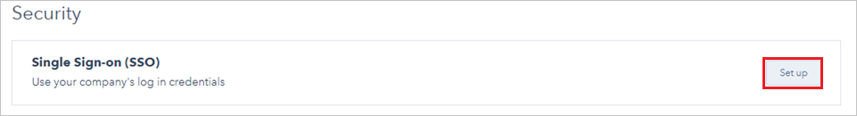
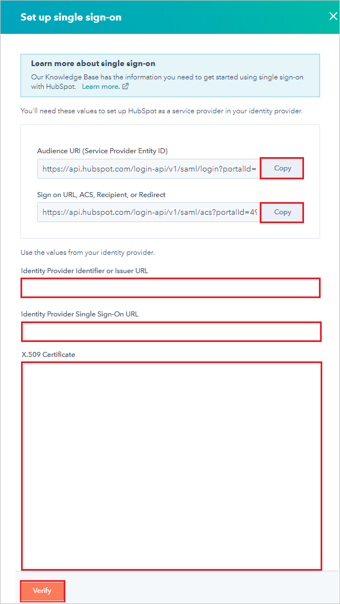
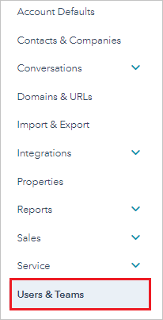
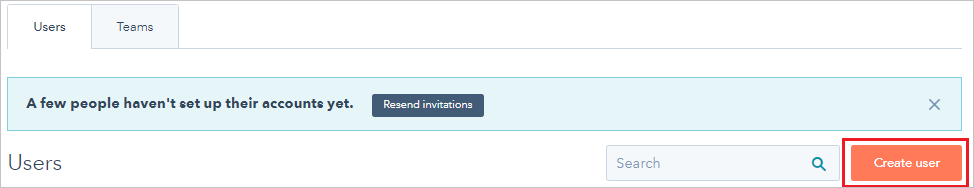
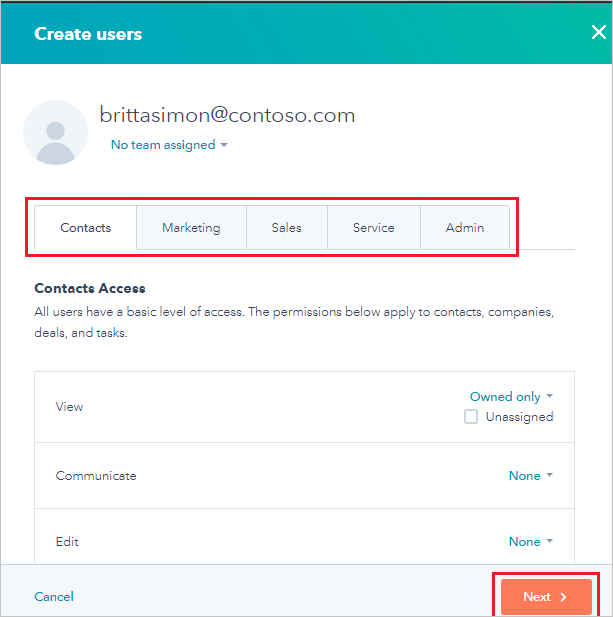

# Tutorial: Azure AD SSO integration with HubSpot

In this tutorial, you'll learn how to integrate HubSpot with Azure Active Directory (Azure AD). When you integrate HubSpot with Azure AD, you can:

* Control in Azure AD who has access to HubSpot.
* Enable your users to be automatically signed-in to HubSpot with their Azure AD accounts.
* Manage your accounts in one central location - the Azure portal.

## Prerequisites

To configure Azure AD integration with HubSpot, you need the following items:

* An Azure AD subscription. If you don't have an Azure AD subscription, create a [free account](https://azure.microsoft.com/free/) before you begin.
* A HubSpot subscription with single sign-on enabled.

## Scenario description

In this tutorial, you configure and test Azure AD single sign-on in a test environment and integrate HubSpot with Azure AD.

HubSpot supports the following features:

* **SP-initiated single sign-on**.
* **IDP-initiated single sign-on**.

## Add HubSpot from the gallery

To configure the integration of HubSpot into Azure AD, you need to add HubSpot from the gallery to your list of managed SaaS apps.

1. Sign in to the Azure portal using either a work or school account, or a personal Microsoft account.
1. On the left navigation pane, select the **Azure Active Directory** service.
1. Navigate to **Enterprise Applications** and then select **All Applications**.
1. To add new application, select **New application**.
1. In the **Add from the gallery** section, type **HubSpot** in the search box.
1. Select **HubSpot** from results panel and then add the app. Wait a few seconds while the app is added to your tenant.

 Alternatively, you can also use the [Enterprise App Configuration Wizard](https://portal.office.com/AdminPortal/home?Q=Docs#/azureadappintegration). In this wizard, you can add an application to your tenant, add users/groups to the app, assign roles, as well as walk through the SSO configuration as well. [Learn more about Microsoft 365 wizards.](/microsoft-365/admin/misc/azure-ad-setup-guides)

## Configure and test Azure AD SSO for HubSpot

Configure and test Azure AD SSO with HubSpot using a test user called **B.Simon**. For SSO to work, you need to establish a link relationship between an Azure AD user and the related user in HubSpot.

To configure and test Azure AD SSO with HubSpot, perform the following steps:

1. **[Configure Azure AD SSO](#configure-azure-ad-sso)** - to enable your users to use this feature.
    1. **[Create an Azure AD test user](#create-an-azure-ad-test-user)** - to test Azure AD single sign-on with B.Simon.
    1. **[Assign the Azure AD test user](#assign-the-azure-ad-test-user)** - to enable B.Simon to use Azure AD single sign-on.
1. **[Configure HubSpot SSO](#configure-hubspot-sso)** - to configure the single sign-on settings on application side.
    1. **[Create HubSpot test user](#create-hubspot-test-user)** - to have a counterpart of B.Simon in HubSpot that is linked to the Azure AD representation of user.
1. **[Test SSO](#test-sso)** - to verify whether the configuration works.

## Configure Azure AD SSO

1. In the Azure portal, on the **HubSpot** application integration page, find the **Manage** section and select **Single sign-on**.
1. On the **Select a Single sign-on method** page, select **SAML**.
1. On the **Set up Single Sign-On with SAML** page, click the pencil icon for **Basic SAML Configuration** to edit the settings.

   

1. In the **Basic SAML Configuration** pane, to configure **IDP-initiated mode**, perform the following steps:

    1. In the **Identifier** box, enter a URL that has the following pattern: https:\//api.hubspot.com/login-api/v1/saml/login?portalId=\<CUSTOMER ID\>.

    1. In the **Reply URL** box, enter a URL that has the following pattern: https:\//api.hubspot.com/login-api/v1/saml/acs?portalId=\<CUSTOMER ID\>.

    > [!NOTE]
	> To format the URLs, you can also refer to the patterns shown in the **Basic SAML Configuration** pane in the Azure portal.

1. To configure the application in *SP-initiated* mode:

    1. Select **Set additional URLs**.

	1. In the **Sign on URL** box, enter **https:\//app.hubspot.com/login**.

1. In the **Set up Single Sign-On with SAML** pane, in the **SAML Signing Certificate** section, select **Download** next to **Certificate (Base64)**. Select a download option based on your requirements. Save the certificate on your computer.

	

1. In the **Set up HubSpot** section, copy the following URLs based on your requirements:

	

### Create an Azure AD test user

In this section, you'll create a test user in the Azure portal called B.Simon.

1. From the left pane in the Azure portal, select **Azure Active Directory**, select **Users**, and then select **All users**.
1. Select **New user** at the top of the screen.
1. In the **User** properties, follow these steps:
    1. In the **Name** field, enter `B.Simon`.  
    1. In the **User name** field, enter the username@companydomain.extension. For example, `B.Simon@contoso.com`.
    1. Select the **Show password** check box, and then write down the value that's displayed in the **Password** box.
    1. Click **Create**.

### Assign the Azure AD test user

In this section, you'll enable B.Simon to use Azure single sign-on by granting access to HubSpot.

1. In the Azure portal, select **Enterprise Applications**, and then select **All applications**.
1. In the applications list, select **HubSpot**.
1. In the app's overview page, find the **Manage** section and select **Users and groups**.
1. Select **Add user**, then select **Users and groups** in the **Add Assignment** dialog.
1. In the **Users and groups** dialog, select **B.Simon** from the Users list, then click the **Select** button at the bottom of the screen.
1. If you are expecting a role to be assigned to the users, you can select it from the **Select a role** dropdown. If no role has been set up for this app, you see "Default Access" role selected.
1. In the **Add Assignment** dialog, click the **Assign** button.

## Configure HubSpot SSO

1. Open a new tab in your browser and sign in to your HubSpot administrator account.

1. Select the **Settings** icon in the upper-right corner of the page.

	

1. Select **Account Defaults**.

	

1. Scroll down to the **Security** section, and then select **Set up**.

	

1. In the **Set up single sign-on** section, perform the following steps:

	1. In the **Audience URl (Service Provider Entity ID)** box, select **Copy** to copy the value. In the Azure portal, in the **Basic SAML Configuration** pane, paste the value in the **Identifier** box.

	1. In the **Sign on URL, ACS, Recipient, or Redirect** box, select **Copy** to copy the value. In the Azure portal, in the **Basic SAML Configuration** pane, paste the value in the **Reply URL** box.

	1. In HubSpot, in the **Identity Provider Identifier or Issuer URL** box, paste the value for **Azure AD Identifier** that you copied in the Azure portal.

	1. In HubSpot, in the **Identity Provider Single Sign-On URL** box, paste the value for **Login URL** that you copied in the Azure portal.

	1. In Windows Notepad, open the **Certificate(Base64)** file that you downloaded. Select and copy the contents of the file. Then, in HubSpot, paste it in the **X.509 Certificate** box.

	1. Select **Verify**.

		

### Create HubSpot test user

To enable Azure AD a user to sign in to HubSpot, the user must be provisioned in HubSpot. In HubSpot, provisioning is a manual task.

To provision a user account in HubSpot:

1. Sign in to your HubSpot company site as administrator.

1. Select the **Settings** icon in the upper-right corner of the page.

	

1. Select **Users & Teams**.

	

1. Select **Create user**.

	

1. In the **Add email address(es)** box, enter the email address of the user in the format brittasimon\@contoso.com, and then select **Next**.

	

1. In the **Create users** section, select each tab. On each tab, set the relevant options and permissions for the user. Then, select **Next**.

	

1. To send the invitation to the user, select **Send**.

	

	> [!NOTE]
	> The user is activated after the user accepts the invitation.

## Test SSO

In this section, you test your Azure AD single sign-on configuration with following options. 

#### SP initiated:

* Click on **Test this application** in Azure portal. This will redirect to HubSpot Sign on URL where you can initiate the login flow.  

* Go to HubSpot Sign-on URL directly and initiate the login flow from there.

#### IDP initiated:

* Click on **Test this application** in Azure portal and you should be automatically signed in to the HubSpot for which you set up the SSO. 

You can also use Microsoft My Apps to test the application in any mode. When you click the HubSpot tile in the My Apps, if configured in SP mode you would be redirected to the application sign on page for initiating the login flow and if configured in IDP mode, you should be automatically signed in to the HubSpot for which you set up the SSO. For more information about the My Apps, see [Introduction to the My Apps](https://support.microsoft.com/account-billing/sign-in-and-start-apps-from-the-my-apps-portal-2f3b1bae-0e5a-4a86-a33e-876fbd2a4510).

## Next steps

Once you configure HubSpot you can enforce Session control, which protects exfiltration and infiltration of your organization’s sensitive data in real time. Session control extends from Conditional Access. [Learn how to enforce session control with Microsoft Defender for Cloud Apps](/cloud-app-security/proxy-deployment-aad).
