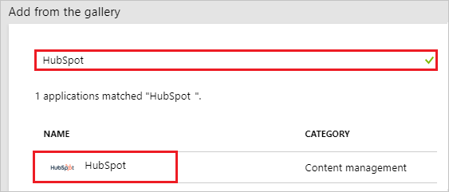
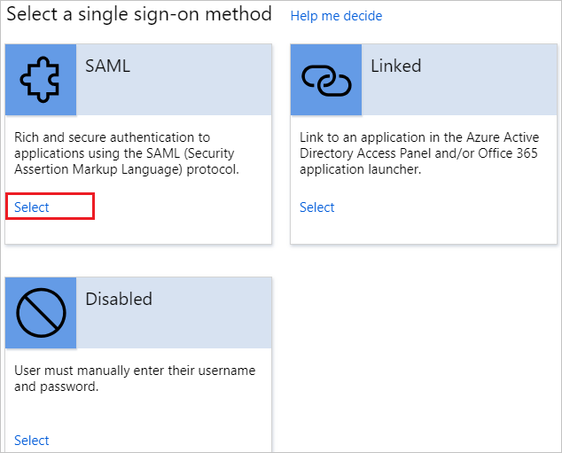
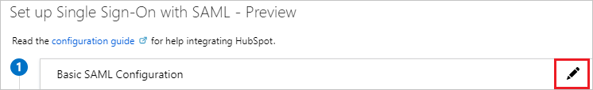
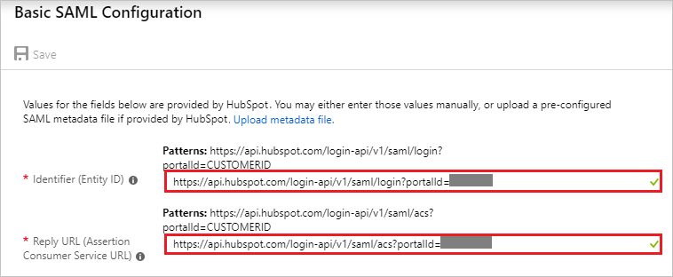
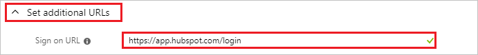
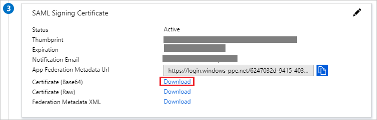
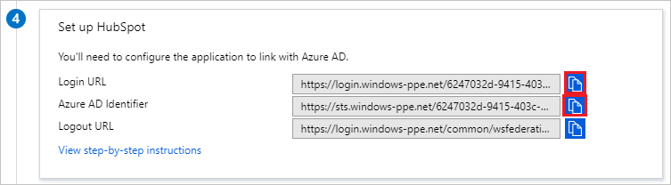
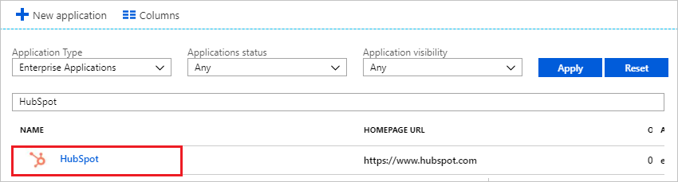

# Tutorial: Azure Active Directory integration with HubSpot

In this tutorial, you learn how to integrate HubSpot with Azure Active Directory (Azure AD).

Integrating HubSpot with Azure AD provides you with the following benefits:

- You can control in Azure AD who has access to HubSpot
- You can enable your users to automatically get signed-on to HubSpot (Single Sign-On) with their Azure AD accounts
- You can manage your accounts in one central location - the Azure portal

If you want to know more details about SaaS app integration with Azure AD, see [what is application access and single sign-on with Azure Active Directory](../manage-apps/what-is-single-sign-on.md).

## Prerequisites

To configure Azure AD integration with HubSpot, you need the following items:

- An Azure AD subscription
- A HubSpot single sign-on enabled subscription

> [!NOTE]
> To test the steps in this tutorial, we do not recommend using a production environment.

To test the steps in this tutorial, you should follow these recommendations:

- Do not use your production environment, unless it is necessary.
- If you don't have an Azure AD trial environment, you can get a one-month trial [here](https://azure.microsoft.com/pricing/free-trial/).

## Scenario description

In this tutorial, you test Azure AD single sign-on in a test environment. 
The scenario outlined in this tutorial consists of two main building blocks:

1. Adding HubSpot from the gallery
2. Configuring and testing Azure AD single sign-on

## Adding HubSpot from the gallery

To configure the integration of HubSpot into Azure AD, you need to add HubSpot from the gallery to your list of managed SaaS apps.

**To add HubSpot from the gallery, perform the following steps:**

1. In the **[Azure portal](https://portal.azure.com)**, on the left navigation panel, click **Azure Active Directory** icon.

	![Active Directory][1]

2. Navigate to **Enterprise applications**. Then go to **All applications**.

	![Applications][2]

3. To add new application, click **New application** button on the top of dialog.

	![Applications][3]

4. In the search box, type **HubSpot**. Select **HubSpot** from the results panel, and then click the **Add** button to add the application.

	

## Configuring and testing Azure AD single sign-on

In this section, you configure and test Azure AD single sign-on with HubSpot based on a test user called "Britta Simon."

For single sign-on to work, Azure AD needs to know what the counterpart user in HubSpot is to a user in Azure AD. In other words, a link relationship between an Azure AD user and the related user in HubSpot needs to be established.

To configure and test Azure AD single sign-on with HubSpot, you need to complete the following building blocks:

1. **[Configuring Azure AD Single Sign-On](#configuring-azure-ad-single-sign-on)** - to enable your users to use this feature.
2. **[Creating an Azure AD test user](#creating-an-azure-ad-test-user)** - to test Azure AD single sign-on with Britta Simon.
3. **[Creating a HubSpot test user](#creating-a-hubspot-saml-test-user)** - to have a counterpart of Britta Simon in HubSpot that is linked to the Azure AD representation of user.
4. **[Assigning the Azure AD test user](#assigning-the-azure-ad-test-user)** - to enable Britta Simon to use Azure AD single sign-on.
5. **[Testing Single Sign-On](#testing-single-sign-on)** - to verify whether the configuration works.

### Configuring Azure AD single sign-on

In this section, you enable Azure AD single sign-on in the Azure portal and configure single sign-on in your HubSpot application.

**To configure Azure AD single sign-on with HubSpot, perform the following steps:**

1. In the Azure portal, on the **HubSpot** application integration page, click **Single sign-on**.

	![Configure Single Sign-On][4]

2. On the **Select a Single sign-on method** dialog, Click **Select** for **SAML** mode to enable single sign-on.

    

3. If you need to change to **SAML** mode from any another mode, click **Change single sign-on mode** on top of the screen.

	

4. On the **Set up Single Sign-On with SAML** page, click **Edit** icon to open **Basic SAML Configuration** dialog.

	

5. On the **Basic SAML Configuration** section perform the following steps, if you wish to configure the application in **IDP** initiated mode:

	

    a. In the **Identifier** textbox, type the URL using the following pattern: `https://api.hubspot.com/login-api/v1/saml/login?portalId=<CUSTOMER ID>`

	b. In the **Reply URL** textbox, type the URL using the following pattern: `https://api.hubspot.com/login-api/v1/saml/acs?portalId=<CUSTOMER ID>`

	> [!NOTE]
	> These values are not real. Update these values with the actual Identifier and Reply URL which is explained later in this tutorial. Contact [HubSpot Client support team](https://help.hubspot.com/) to get these values.

	c. Click **Set additional URLs** and perform the following step if you wish to configure the application in **SP** initiated mode:

	

	In the **Sign-on URL** textbox, type the URL: `https://app.hubspot.com/login`

6. On the **SAML Signing Certificate** page, in the **SAML Signing Certificate** section, click **Download** to download **Certificate (Base64)** and then save certificate file on your computer.

	

7. On the **Set up HubSpot** section, click on copy button to copy the **Login URL** and **Azure AD Identifier** values.

	

8. Open a new tab in your browser and log in to your HubSpot administrator account.

9. Click on **settings icon** on the top right corner of the page.

	

10. Click on **Account Defaults**.

	

11. Scroll down to the **Security** section and click on **Set up**.

	

12. On the **Set up single sign-on** section, perform the following steps:

	

	a. Click **copy** button to copy the **Audience URl(Service Provider Entity ID)** value and paste it into the **Identifier** textbox in the **Basic SAML Configuration** section in Azure portal.

	b. Click **copy** button to copy the **Sign on URl,ACS,Recipient, or Redirect** value and paste it into the **Reply URL** textbox in the **Basic SAML Configuration** section in Azure portal.

	c. In the **Identity Provider Identifier or Issuer URL** textbox, paste the **Azure AD Identifier** value which you have copied from the Azure portal.

	d. In the **Identity Provider Single Sign-On URL** textbox, paste the **Login URL** value which you have copied from the Azure portal.

	e. Open your downloaded **Certificate(Base64)** file in Notepad. Copy the content of it into your clipboard, and then paste it to the **X.509 Certificate** box.

	f. Click **Verify**.

### Creating an Azure AD test user

The objective of this section is to create a test user in the Azure portal called Britta Simon.

1. In the Azure portal, in the left pane, select **Azure Active Directory**, select **Users**, and then select **All users**.

	![Create Azure AD User][100]

2. Select **New user** at the top of the screen.

	 

3. In the User properties, perform the following steps.

	

    a. In the **Name** field enter **BrittaSimon**.
  
    b. In the **User name** field type **brittasimon@yourcompanydomain.extension**  
    For example, BrittaSimon@contoso.com

    c. Select **Properties**, select the **Show password** check box, and then write down the value that's displayed in the Password box.

    d. Select **Create**.

### Creating a HubSpot test user

To enable Azure AD users to log in to HubSpot, they must be provisioned into HubSpot.
In the case of HubSpot, provisioning is a manual task.

**To provision a user account, perform the following steps:**

1. Log in to your **HubSpot** company site as administrator.

2. Click on **settings icon** on the top right corner of the page.

	

3. Click on **Users & Teams**.

	

4. Click **Create user**.

	

5. Enter the email address of the user like **brittasimon@contoso.com** in the **Add email addess(es)** textbox and click **Next**.

	

6. On the **Create users** section, please go through the every individual tab and select appropriate options and permissions for the user and click **Next**.

	

7. Click **Send** to send the invitation to the user.

	

	> [!NOTE]
	> User will get activated after accepting the invitation.

### Assigning the Azure AD test user

In this section, you enable Britta Simon to use Azure single sign-on by granting access to HubSpot.

1. In the Azure portal, select **Enterprise Applications**, select **All applications**.

	![Assign User][201]

2. In the applications list, select **HubSpot**.

	 

3. In the menu on the left, click **Users and groups**.

	![Assign User][202]

4. Click **Add** button. Then select **Users and groups** on **Add Assignment** dialog.

	![Assign User][203]

5. In the **Users and groups** dialog select **Britta Simon** in the Users list, then click the **Select** button at the bottom of the screen.

6. In the **Add Assignment** dialog select the **Assign** button.

### Testing single sign-on

In this section, you test your Azure AD single sign-on configuration using the Access Panel.

When you click the HubSpot tile in the Access Panel, you should get automatically login page of HubSpot application.
For more information about the Access Panel, see [Introduction to the Access Panel](../user-help/active-directory-saas-access-panel-introduction.md).

## Additional resources

* [List of Tutorials on How to Integrate SaaS Apps with Azure Active Directory](tutorial-list.md)
* [What is application access and single sign-on with Azure Active Directory?](../manage-apps/what-is-single-sign-on.md)

<!--Image references-->

[1]: ./media/hubspot-tutorial/tutorial_general_01.png
[2]: ./media/hubspot-tutorial/tutorial_general_02.png
[3]: ./media/hubspot-tutorial/tutorial_general_03.png
[4]: ./media/hubspot-tutorial/tutorial_general_04.png
[100]: ./media/hubspot-tutorial/tutorial_general_100.png
[200]: ./media/hubspot-tutorial/tutorial_general_200.png
[201]: ./media/hubspot-tutorial/tutorial_general_201.png
[202]: ./media/hubspot-tutorial/tutorial_general_202.png
[203]: ./media/hubspot-tutorial/tutorial_general_203.png