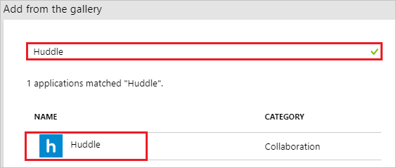
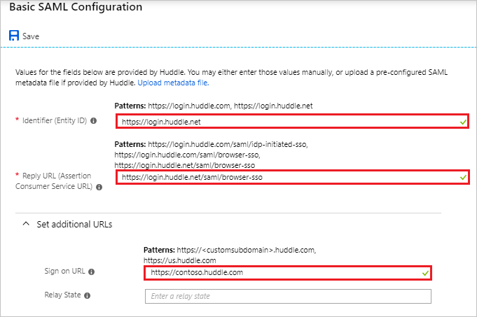
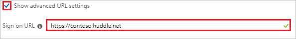
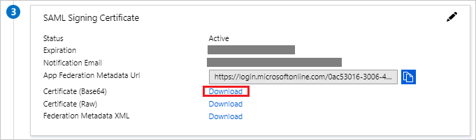
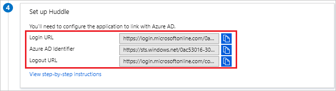

# Tutorial: Azure Active Directory integration with Huddle

In this tutorial, you learn how to integrate Huddle with Azure Active Directory (Azure AD).

Integrating Huddle with Azure AD provides you with the following benefits:

- You can control in Azure AD who has access to Huddle
- You can enable your users to automatically get signed-on to Huddle (Single Sign-On) with their Azure AD accounts
- You can manage your accounts in one central location - the Azure portal

If you want to know more details about SaaS app integration with Azure AD, see [what is application access and single sign-on with Azure Active Directory](../manage-apps/what-is-single-sign-on.md).

## Prerequisites

To configure Azure AD integration with Huddle, you need the following items:

- An Azure AD subscription
- A Huddle single sign-on enabled subscription

> [!NOTE]
> To test the steps in this tutorial, we do not recommend using a production environment.

To test the steps in this tutorial, you should follow these recommendations:

- Do not use your production environment, unless it is necessary.
- If you don't have an Azure AD trial environment, you can get a one-month trial [here](https://azure.microsoft.com/pricing/free-trial/).

## Scenario description

In this tutorial, you test Azure AD single sign-on in a test environment. 
The scenario outlined in this tutorial consists of two main building blocks:

1. Adding Huddle from the gallery
2. Configuring and testing Azure AD single sign-on

## Adding Huddle from the gallery

To configure the integration of Huddle into Azure AD, you need to add Huddle from the gallery to your list of managed SaaS apps.

**To add Huddle from the gallery, perform the following steps:**

1. In the **[Azure portal](https://portal.azure.com)**, on the left navigation panel, click **Azure Active Directory** icon.

	![Active Directory][1]

2. Navigate to **Enterprise applications**. Then go to **All applications**.

	![Applications][2]

3. To add new application, click **New application** button on the top of dialog.

	![Applications][3]

4. In the search box, type **Huddle**. Select **Huddle** from the results panel, and then click the **Add** button to add the application.

	

## Configuring and testing Azure AD single sign-on

In this section, you configure and test Azure AD single sign-on with Huddle based on a test user called "Britta Simon."

For single sign-on to work, Azure AD needs to know what the counterpart user in Huddle is to a user in Azure AD. In other words, a link relationship between an Azure AD user and the related user in Huddle needs to be established.

To configure and test Azure AD single sign-on with Huddle, you need to complete the following building blocks:

1. **[Configuring Azure AD Single Sign-On](#configuring-azure-ad-single-sign-on)** - to enable your users to use this feature.
2. **[Creating an Azure AD test user](#creating-an-azure-ad-test-user)** - to test Azure AD single sign-on with Britta Simon.
3. **[Creating a Huddle test user](#creating-a-huddle-test-user)** - to have a counterpart of Britta Simon in Huddle that is linked to the Azure AD representation of user.
4. **[Assigning the Azure AD test user](#assigning-the-azure-ad-test-user)** - to enable Britta Simon to use Azure AD single sign-on.
5. **[Testing Single Sign-On](#testing-single-sign-on)** - to verify whether the configuration works.

### Configuring Azure AD single sign-on

In this section, you enable Azure AD single sign-on in the Azure portal and configure single sign-on in your Huddle application.

**To configure Azure AD single sign-on with Huddle, perform the following steps:**

1. In the Azure portal, on the **Huddle** application integration page, click **Single sign-on**.

	![Configure Single Sign-On][4]

2. Click **Change Single sign-on mode** on top of the screen to select the **SAML** mode.

	

3. On the **Select a Single sign-on method** dialog, Click **Select** for **SAML** mode to enable single sign-on.

    

4. On the **Set up Single Sign-On with SAML** page, click **Edit** icon to open **Basic SAML Configuration** dialog.

	

5. On the **Basic SAML Configuration** section perform the following steps, if you wish to configure the application in **IDP** intiated mode:

	> [!NOTE]
	> Your huddle instance will be automatically detected from the domain you enter below.

	

    a. In the **Identifier** textbox, type a URL:

	| | |
	|--|--|
	| `https://login.huddle.net`|
	| `https://login.huddle.com`|
	| |

	b. In the **Reply URL** textbox, type a URL:

	| | |
	|--|--|
	| `https://login.huddle.net/saml/browser-sso`|
	| `https://login.huddle.com/saml/browser-sso`|
	| `https://login.huddle.com/saml/idp-initiated-sso`|
	| |

	c. Click **Set additional URLs** and perform the following step if you wish to configure the application in **SP** initiated mode:

	

	In the **Sign-on URL** textbox, type any one of the URL using the following pattern:

	| | |
	|--|--|
	| `https://<customsubdomain>.huddle.com`|
	| `https://us.huddle.com`|
	| |

	> [!NOTE]
	> The Sign-on URL value is not real. Update this value with the actual Sign-On URL. Contact [Huddle Client support team](https://huddle.zendesk.com) to get this value.

6. On the **Set up Single Sign-On with SAML** page, in the **SAML Signing Certificate** section, click **Download** to download the appropriate certificate as per your requirement and save it on your computer.

	

7. On the **Set up Huddle** section, copy the appropriate URL(s) as per your requirement.

	

8. To configure single sign-on on **Huddle** side, you need to send the certificate which you have downloaded and the URLs which you have copied from **Set up** **Huddle** section from Azure portal to [Huddle Client support team](https://huddle.zendesk.com). They set this setting to have the SAML SSO connection set properly on both sides.

	>[!NOTE]
	> Single sign-on needs to be enabled by the Huddle support team. You get a notification when the configuration has been completed.

### Creating an Azure AD test user

The objective of this section is to create a test user in the Azure portal called Britta Simon.

1. In the Azure portal, in the left pane, select **Azure Active Directory**, select **Users**, and then select **All users**.

	![Create Azure AD User][100]

2. Select **New user** at the top of the screen.

	 

3. In the User properties, perform the following steps.

	

    a. In the **Name** field enter **BrittaSimon**.
  
    b. In the **User name** field type **brittasimon@yourcompanydomain.extension**  
    For example, BrittaSimon@contoso.com

    c. Select **Properties**, select the **Show password** check box, and then write down the value that's displayed in the Password box.

    d. Select **Create**.

### Creating a Huddle test user

To enable Azure AD users to log in to Huddle, they must be provisioned into Huddle. In the case of Huddle, provisioning is a manual task.

**To configure user provisioning, perform the following steps:**

1. Log in to your **Huddle** company site as administrator.

2. Click **Workspace**.

3. Click **People \> Invite People**.

	

4. In the **Create a new invitation** section, perform the following steps:
  
	
  
	a. In the **Choose a team to invite people to join** list, select **team**.

	b. Type the **Email Address** of a valid Azure AD account you want to provision in to **Enter email address for people you'd like to invite** textbox.

	c. Click **Invite**.

	>[!NOTE]
	> The Azure AD account holder will receive an email including a link to confirm the account before it becomes active.

>[!NOTE]
>You can use any other Huddle user account creation tools or APIs provided by Huddle to provision Azure AD user accounts.

### Assigning the Azure AD test user

In this section, you enable Britta Simon to use Azure single sign-on by granting access to Huddle.

1. In the Azure portal, select **Enterprise Applications**, select **All applications**.

	![Assign User][201]

2. In the applications list, select **Huddle**.

	 

3. In the menu on the left, click **Users and groups**.

	![Assign User][202]

4. Click **Add** button. Then select **Users and groups** on **Add Assignment** dialog.

	![Assign User][203]

5. In the **Users and groups** dialog select **Britta Simon** in the Users list, then click the **Select** button at the bottom of the screen.

6. In the **Add Assignment** dialog select the **Assign** button.

### Testing single sign-on

In this section, you test your Azure AD single sign-on configuration using the Access Panel.

When you click the Huddle tile in the Access Panel, you should get automatically login page of Huddle application.
For more information about the Access Panel, see [Introduction to the Access Panel](../user-help/active-directory-saas-access-panel-introduction.md).

## Additional resources

* [List of Tutorials on How to Integrate SaaS Apps with Azure Active Directory](tutorial-list.md)
* [What is application access and single sign-on with Azure Active Directory?](../manage-apps/what-is-single-sign-on.md)

<!--Image references-->

[1]: ./media/huddle-tutorial/tutorial_general_01.png
[2]: ./media/huddle-tutorial/tutorial_general_02.png
[3]: ./media/huddle-tutorial/tutorial_general_03.png
[4]: ./media/huddle-tutorial/tutorial_general_04.png
[100]: ./media/huddle-tutorial/tutorial_general_100.png
[200]: ./media/huddle-tutorial/tutorial_general_200.png
[201]: ./media/huddle-tutorial/tutorial_general_201.png
[202]: ./media/huddle-tutorial/tutorial_general_202.png
[203]: ./media/huddle-tutorial/tutorial_general_203.png
