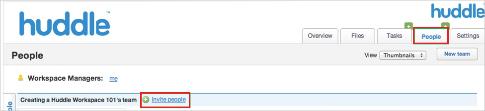
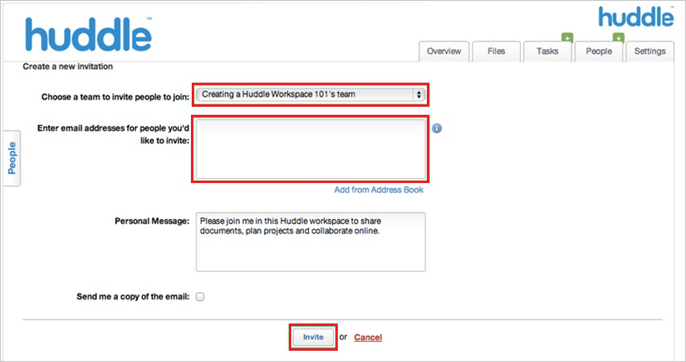

# Tutorial: Microsoft Entra SSO integration with Huddle

In this tutorial, you'll learn how to integrate Huddle with Microsoft Entra ID. When you integrate Huddle with Microsoft Entra ID, you can:

* Control in Microsoft Entra ID who has access to Huddle.
* Enable your users to be automatically signed-in to Huddle with their Microsoft Entra accounts.
* Manage your accounts in one central location.

## Prerequisites

To get started, you need the following items:

* A Microsoft Entra subscription. If you don't have a subscription, you can get a [free account](https://azure.microsoft.com/free/).
* Huddle single sign-on (SSO) enabled subscription.

## Scenario description

In this tutorial, you configure and test Microsoft Entra single sign-on in a test environment.

* Huddle supports **SP and IDP** initiated SSO.

> [!NOTE]
> Identifier of this application is a fixed string value so only one instance can be configured in one tenant.

## Add Huddle from the gallery

To configure the integration of Huddle into Microsoft Entra ID, you need to add Huddle from the gallery to your list of managed SaaS apps.

1. Sign in to the [Microsoft Entra admin center](https://entra.microsoft.com) as at least a [Cloud Application Administrator](../roles/permissions-reference.md#cloud-application-administrator).
1. Browse to **Identity** > **Applications** > **Enterprise applications** > **New application**.
1. In the **Add from the gallery** section, type **Huddle** in the search box.
1. Select **Huddle** from results panel and then add the app. Wait a few seconds while the app is added to your tenant.

 Alternatively, you can also use the [Enterprise App Configuration Wizard](https://portal.office.com/AdminPortal/home?Q=Docs#/azureadappintegration). In this wizard, you can add an application to your tenant, add users/groups to the app, assign roles, as well as walk through the SSO configuration as well. [Learn more about Microsoft 365 wizards.](/microsoft-365/admin/misc/azure-ad-setup-guides)

## Configure and test Microsoft Entra SSO for Huddle

Configure and test Microsoft Entra SSO with Huddle using a test user called **B. Simon**. For SSO to work, you need to establish a link relationship between a Microsoft Entra user and the related user in Huddle.

To configure and test Microsoft Entra SSO with Huddle, perform the following steps:

1. **[Configure Microsoft Entra SSO](#configure-azure-ad-sso)** to enable your users to use this feature.
	1. **[Create a Microsoft Entra test user](#create-an-azure-ad-test-user)** to test Microsoft Entra single sign-on with B. Simon.
	1. **[Assign the Microsoft Entra test user](#assign-the-azure-ad-test-user)** to enable B. Simon to use Microsoft Entra single sign-on.
1. **[Configure Huddle SSO](#configure-huddle-sso)** to configure the SSO settings on application side.
	1. **[Create Huddle test user](#create-huddle-test-user)** to have a counterpart of B. Simon in Huddle that is linked to the Microsoft Entra representation of user.
1. **[Test SSO](#test-sso)** to verify whether the configuration works.

## Configure Microsoft Entra SSO

Follow these steps to enable Microsoft Entra SSO.

1. Sign in to the [Microsoft Entra admin center](https://entra.microsoft.com) as at least a [Cloud Application Administrator](../roles/permissions-reference.md#cloud-application-administrator).
1. Browse to **Identity** > **Applications** > **Enterprise applications** > **Huddle** application integration page, find the **Manage** section and select **Single sign-on**.
1. On the **Select a Single sign-on method** page, select **SAML**.
1. On the **Set up Single Sign-On with SAML** page, click the pencil icon for **Basic SAML Configuration** to edit the settings.

   

1. On the **Basic SAML Configuration** section, If you wish to configure the application in **IDP** initiated mode, perform the following steps:

	> [!NOTE]
	> Your huddle instance will be automatically detected from the domain you enter below.

    a. In the **Identifier** text box,type one of the following URLs:

    | **Identifier** |
    |------|
    | `https://login.huddle.net` |
    | `https://login.huddle.com` |

    b. In the **Reply URL** text box, type one of the following URLs:

    | **Reply URL** |
    |----|
    | `https://login.huddle.net/saml/browser-sso` |
    | `https://login.huddle.com/saml/browser-sso` |
    | `https://login.huddle.com/saml/idp-initiated-sso` |

5. Click **Set additional URLs** and perform the following step if you wish to configure the application in **SP** initiated mode:

    In the **Sign-on URL** text box, type a URL using the following patterns:

    | **Sign-on URL** |
    |----|
    | `https://<customsubdomain>.huddle.com` |
    | `https://us.huddle.com` |
      
	> [!NOTE]
	> The Sign-on URL value is not real. Update this value with the actual Sign-On URL. Contact [Huddle Client support team](https://huddle.zendesk.com) to get this value.

6. On the **Set up Single Sign-On with SAML** page, in the **SAML Signing Certificate** section, click **Download** to download the **Certificate (Base64)** from the given options as per your requirement and save it on your computer.

	

7. On the **Set up Huddle** section, copy the appropriate URL(s) as per your requirement.

	

### Create a Microsoft Entra test user

In this section, you'll create a test user called B. Simon.

1. Sign in to the [Microsoft Entra admin center](https://entra.microsoft.com) as at least a [User Administrator](../roles/permissions-reference.md#user-administrator).
1. Browse to **Identity** > **Users** > **All users**.
1. Select **New user** > **Create new user**, at the top of the screen.
1. In the **User** properties, follow these steps:
   1. In the **Display name** field, enter `B.Simon`.  
   1. In the **User principal name** field, enter the username@companydomain.extension. For example, `B.Simon@contoso.com`.
   1. Select the **Show password** check box, and then write down the value that's displayed in the **Password** box.
   1. Select **Review + create**.
1. Select **Create**.

### Assign the Microsoft Entra test user

In this section, you'll enable B. Simon to use Azure single sign-on by granting access to Huddle.

1. Sign in to the [Microsoft Entra admin center](https://entra.microsoft.com) as at least a [Cloud Application Administrator](../roles/permissions-reference.md#cloud-application-administrator).
1. Browse to **Identity** > **Applications** > **Enterprise applications** > **Huddle**.
1. In the app's overview page, find the **Manage** section and select **Users and groups**.
1. Select **Add user**, then select **Users and groups** in the **Add Assignment** dialog.
1. In the **Users and groups** dialog, select **B. Simon** from the Users list, then click the **Select** button at the bottom of the screen.
1. If you're expecting any role value in the SAML assertion, in the **Select Role** dialog, select the appropriate role for the user from the list and then click the **Select** button at the bottom of the screen.
1. In the **Add Assignment** dialog, click the **Assign** button.

## Configure Huddle SSO

To configure single sign-on on **Huddle** side, you need to send the downloaded **Certificate (Base64)** and appropriate copied URLs from the application configuration to [Huddle support team](https://huddle.zendesk.com/). They set this setting to have the SAML SSO connection set properly on both sides.

> [!NOTE]
> Single sign-on needs to be enabled by the Huddle support team. You get a notification when the configuration has been completed.

### Create Huddle test user

To enable Microsoft Entra users to log in to Huddle, they must be provisioned into Huddle. In the case of Huddle, provisioning is a manual task.

**To configure user provisioning, perform the following steps:**

1. Log in to your **Huddle** company site as administrator.

2. Click **Workspace**.

3. Click **People \> Invite People**.

	

4. In the **Create a new invitation** section, perform the following steps:
  
	
  
	a. In the **Choose a team to invite people to join** list, select **team**.

	b. Type the **Email Address** of a valid Microsoft Entra account you want to provision in to **Enter email address for people you'd like to invite** textbox.

	c. Click **Invite**.

	> [!NOTE]
	> The Microsoft Entra account holder will receive an email including a link to confirm the account before it becomes active.

> [!NOTE]
> You can use any other Huddle user account creation tools or APIs provided by Huddle to provision Microsoft Entra user accounts.

## Test SSO

In this section, you test your Microsoft Entra single sign-on configuration with following options. 

#### SP initiated:

* Click on **Test this application**, this will redirect to Huddle Sign on URL where you can initiate the login flow.  

* Go to Huddle Sign-on URL directly and initiate the login flow from there.

#### IDP initiated:

* Click on **Test this application**, and you should be automatically signed in to the Huddle for which you set up the SSO. 

You can also use Microsoft My Apps to test the application in any mode. When you click the Huddle tile in the My Apps, if configured in SP mode you would be redirected to the application sign on page for initiating the login flow and if configured in IDP mode, you should be automatically signed in to the Huddle for which you set up the SSO. For more information, see [Microsoft Entra My Apps](/azure/active-directory/manage-apps/end-user-experiences#azure-ad-my-apps).

## Next steps

Once you configure Huddle you can enforce session control, which protects exfiltration and infiltration of your organization’s sensitive data in real time. Session control extends from Conditional Access. [Learn how to enforce session control with Microsoft Defender for Cloud Apps](/cloud-app-security/proxy-deployment-aad).
