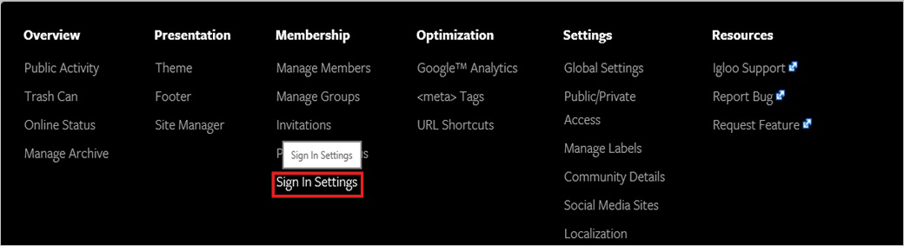
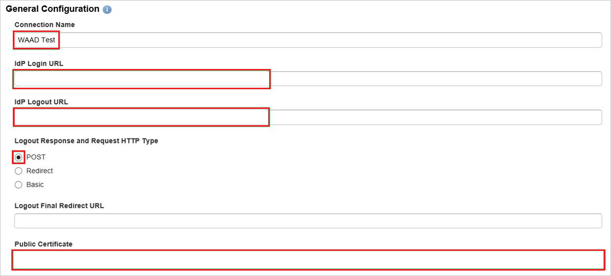
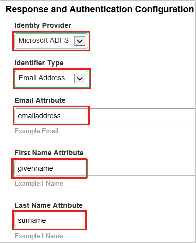
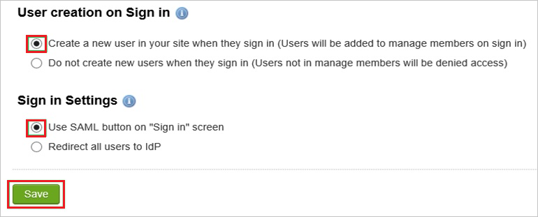

# Tutorial: Microsoft Entra SSO integration with Igloo Software

In this tutorial, you'll learn how to integrate Igloo Software with Microsoft Entra ID. When you integrate Igloo Software with Microsoft Entra ID, you can:

* Control in Microsoft Entra ID who has access to Igloo Software.
* Enable your users to be automatically signed-in to Igloo Software with their Microsoft Entra accounts.
* Manage your accounts in one central location.

## Prerequisites

To get started, you need the following items:

* A Microsoft Entra subscription. If you don't have a subscription, you can get a [free account](https://azure.microsoft.com/free/).
* Igloo Software single sign-on (SSO) enabled subscription.

## Scenario description

In this tutorial, you configure and test Microsoft Entra single sign-on in a test environment.

* Igloo Software supports **SP** initiated SSO.
* Igloo Software supports **Just In Time** user provisioning.

## Add Igloo Software from the gallery

To configure the integration of Igloo Software into Microsoft Entra ID, you need to add Igloo Software from the gallery to your list of managed SaaS apps.

1. Sign in to the [Microsoft Entra admin center](https://entra.microsoft.com) as at least a [Cloud Application Administrator](../roles/permissions-reference.md#cloud-application-administrator).
1. Browse to **Identity** > **Applications** > **Enterprise applications** > **New application**.
1. In the **Add from the gallery** section, type **Igloo Software** in the search box.
1. Select **Igloo Software** from results panel and then add the app. Wait a few seconds while the app is added to your tenant.

 Alternatively, you can also use the [Enterprise App Configuration Wizard](https://portal.office.com/AdminPortal/home?Q=Docs#/azureadappintegration). In this wizard, you can add an application to your tenant, add users/groups to the app, assign roles, as well as walk through the SSO configuration as well. [Learn more about Microsoft 365 wizards.](/microsoft-365/admin/misc/azure-ad-setup-guides)

## Configure and test Microsoft Entra SSO for Igloo Software

Configure and test Microsoft Entra SSO with Igloo Software using a test user called **B.Simon**. For SSO to work, you need to establish a link relationship between a Microsoft Entra user and the related user in Igloo Software.

To configure and test Microsoft Entra SSO with Igloo Software, perform the following steps:

1. **[Configure Microsoft Entra SSO](#configure-azure-ad-sso)** - to enable your users to use this feature.
    1. **[Create a Microsoft Entra test user](#create-an-azure-ad-test-user)** - to test Microsoft Entra single sign-on with B.Simon.
    1. **[Assign the Microsoft Entra test user](#assign-the-azure-ad-test-user)** - to enable B.Simon to use Microsoft Entra single sign-on.
1. **[Configure Igloo Software SSO](#configure-igloo-software-sso)** - to configure the single sign-on settings on application side.
    1. **[Create Igloo Software test user](#create-igloo-software-test-user)** - to have a counterpart of B.Simon in Igloo Software that is linked to the Microsoft Entra representation of user.
1. **[Test SSO](#test-sso)** - to verify whether the configuration works.

## Configure Microsoft Entra SSO

Follow these steps to enable Microsoft Entra SSO.

1. Sign in to the [Microsoft Entra admin center](https://entra.microsoft.com) as at least a [Cloud Application Administrator](../roles/permissions-reference.md#cloud-application-administrator).
1. Browse to **Identity** > **Applications** > **Enterprise applications** > **Igloo Software** > **Single sign-on**.
1. On the **Select a single sign-on method** page, select **SAML**.
1. On the **Set up single sign-on with SAML** page, click the pencil icon for **Basic SAML Configuration** to edit the settings.

   

1. On the **Basic SAML Configuration** section, perform the following steps:

    a. In the **Identifier** box, type a URL using the following pattern:
    `https://<company name>.igloocommmunities.com/saml.digest`

    b. In the **Reply URL** text box, type a URL using the following pattern:
    `https://<company name>.igloocommmunities.com/saml.digest`
    
    c. In the **Sign-on URL** text box, type a URL using the following pattern:
    `https://<company name>.igloocommmunities.com`

	> [!NOTE]
	> These values are not real. Update these values with the actual Identifier, Reply URL and Sign on URL. Contact [Igloo Software Client support team](https://customercare.igloosoftware.com/) to get these values. You can also refer to the patterns shown in the **Basic SAML Configuration** section.

1. On the **Set up Single Sign-On with SAML** page, in the **SAML Signing Certificate** section, click **Download** to download the **Certificate (Base64)** from the given options as per your requirement and save it on your computer.

	

1. On the **Set up Igloo Software** section, copy the appropriate URL(s) as per your requirement.

	

### Create a Microsoft Entra test user

In this section, you'll create a test user called B.Simon.

1. Sign in to the [Microsoft Entra admin center](https://entra.microsoft.com) as at least a [User Administrator](../roles/permissions-reference.md#user-administrator).
1. Browse to **Identity** > **Users** > **All users**.
1. Select **New user** > **Create new user**, at the top of the screen.
1. In the **User** properties, follow these steps:
   1. In the **Display name** field, enter `B.Simon`.  
   1. In the **User principal name** field, enter the username@companydomain.extension. For example, `B.Simon@contoso.com`.
   1. Select the **Show password** check box, and then write down the value that's displayed in the **Password** box.
   1. Select **Review + create**.
1. Select **Create**.

### Assign the Microsoft Entra test user

In this section, you'll enable B.Simon to use single sign-on by granting access to Igloo Software.

1. Sign in to the [Microsoft Entra admin center](https://entra.microsoft.com) as at least a [Cloud Application Administrator](../roles/permissions-reference.md#cloud-application-administrator).
1. Browse to **Identity** > **Applications** > **Enterprise applications** > **Igloo Software**.
1. In the app's overview page, select **Users and groups**.
1. Select **Add user/group**, then select **Users and groups** in the **Add Assignment** dialog.
   1. In the **Users and groups** dialog, select **B.Simon** from the Users list, then click the **Select** button at the bottom of the screen.
   1. If you are expecting a role to be assigned to the users, you can select it from the **Select a role** dropdown. If no role has been set up for this app, you see "Default Access" role selected.
   1. In the **Add Assignment** dialog, click the **Assign** button.

## Configure Igloo Software SSO

1. In a different web browser window, log in to your Igloo Software company site as an administrator.

2. Go to the **Control Panel**.

     

3. In the **Membership** tab, click **Sign In Settings**.

    

4. In the SAML Configuration section, click **Configure SAML Authentication**.

    

5. In the **General Configuration** section, perform the following steps:

    

    a. In the **Connection Name** textbox, type a custom name for your configuration.

    b. In the **IdP Login URL** textbox, paste the value of **Login URL**..

    c. In the **IdP Logout URL** textbox, paste the value of **Logout URL**..

    d. Select **Logout Response and Request HTTP Type** as **POST**.

    e. Open your **base-64** encoded certificate in notepad downloaded from Azure portal, copy the content of it into your clipboard, and then paste it to the **Public Certificate** textbox.

6. In the **Response and Authentication Configuration**, perform the following steps:

    
  
    a. As **Identity Provider**, select **Microsoft ADFS**.

    b. As **Identifier Type**, select **Email Address**. 

    c. In the **Email Attribute** textbox, type **emailaddress**.

    d. In the **First Name Attribute** textbox, type **givenname**.

    e. In the **Last Name Attribute** textbox, type **surname**.

7. Perform the following steps to complete the configuration:

     

    a. As **User creation on Sign in**, select **Create a new user in your site when they sign in**.

    b. As **Sign in Settings**, select **Use SAML button on “Sign in” screen**.

    c. Click **Save**.

### Create Igloo Software test user

There is no action item for you to configure user provisioning to Igloo Software.  

When an assigned user tries to log in to Igloo Software using the access panel, Igloo Software checks whether the user exists.  If there is no user account available yet, it is automatically created by Igloo Software.

## Test SSO

In this section, you test your Microsoft Entra single sign-on configuration with following options. 

* Click on **Test this application**, this will redirect to Igloo Software Sign-on URL where you can initiate the login flow. 

* Go to Igloo Software Sign-on URL directly and initiate the login flow from there.

* You can use Microsoft My Apps. When you click the Igloo Software tile in the My Apps, this will redirect to Igloo Software Sign-on URL. For more information, see [Microsoft Entra My Apps](/azure/active-directory/manage-apps/end-user-experiences#azure-ad-my-apps).

## Next steps

Once you configure Igloo Software you can enforce session control, which protects exfiltration and infiltration of your organization’s sensitive data in real time. Session control extends from Conditional Access. [Learn how to enforce session control with Microsoft Defender for Cloud Apps](/cloud-app-security/proxy-deployment-aad).
