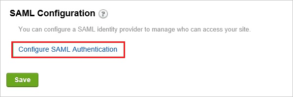
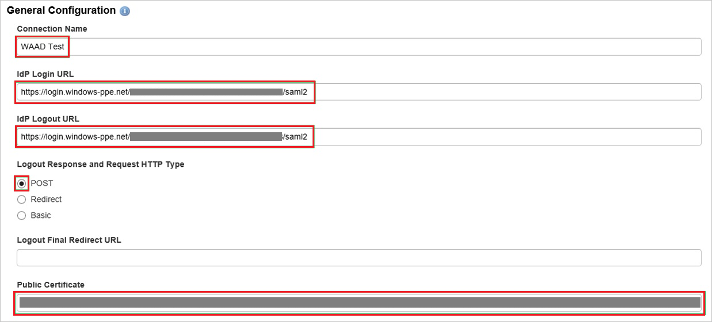

# Tutorial: Azure Active Directory integration with Igloo Software

In this tutorial, you learn how to integrate Igloo Software with Azure Active Directory (Azure AD).
Integrating Igloo Software with Azure AD provides you with the following benefits:

* You can control in Azure AD who has access to Igloo Software.
* You can enable your users to be automatically signed-in to Igloo Software (Single Sign-On) with their Azure AD accounts.
* You can manage your accounts in one central location - the Azure portal.

If you want to know more details about SaaS app integration with Azure AD, see [What is application access and single sign-on with Azure Active Directory](https://docs.microsoft.com/azure/active-directory/active-directory-appssoaccess-whatis).
If you don't have an Azure subscription, [create a free account](https://azure.microsoft.com/free/) before you begin.

## Prerequisites

To configure Azure AD integration with Igloo Software, you need the following items:

* An Azure AD subscription. If you don't have an Azure AD environment, you can get one-month trial [here](https://azure.microsoft.com/pricing/free-trial/)
* Igloo Software single sign-on enabled subscription

## Scenario description

In this tutorial, you configure and test Azure AD single sign-on in a test environment.

* Igloo Software supports **SP** initiated SSO
* Igloo Software supports **Just In Time** user provisioning

## Adding Igloo Software from the gallery

To configure the integration of Igloo Software into Azure AD, you need to add Igloo Software from the gallery to your list of managed SaaS apps.

**To add Igloo Software from the gallery, perform the following steps:**

1. In the **[Azure portal](https://portal.azure.com)**, on the left navigation panel, click **Azure Active Directory** icon.

	

2. Navigate to **Enterprise Applications** and then select the **All Applications** option.

	

3. To add new application, click **New application** button on the top of dialog.

	

4. In the search box, type **Igloo Software**, select **Igloo Software** from result panel then click **Add** button to add the application.

	 

## Configure and test Azure AD single sign-on

In this section, you configure and test Azure AD single sign-on with Igloo Software based on a test user called **Britta Simon**.
For single sign-on to work, a link relationship between an Azure AD user and the related user in Igloo Software needs to be established.

To configure and test Azure AD single sign-on with Igloo Software, you need to complete the following building blocks:

1. **[Configure Azure AD Single Sign-On](#configure-azure-ad-single-sign-on)** - to enable your users to use this feature.
2. **[Configure Igloo Software Single Sign-On](#configure-igloo-software-single-sign-on)** - to configure the Single Sign-On settings on application side.
3. **[Create an Azure AD test user](#create-an-azure-ad-test-user)** - to test Azure AD single sign-on with Britta Simon.
4. **[Assign the Azure AD test user](#assign-the-azure-ad-test-user)** - to enable Britta Simon to use Azure AD single sign-on.
5. **[Create Igloo Software test user](#create-igloo-software-test-user)** - to have a counterpart of Britta Simon in Igloo Software that is linked to the Azure AD representation of user.
6. **[Test single sign-on](#test-single-sign-on)** - to verify whether the configuration works.

### Configure Azure AD single sign-on

In this section, you enable Azure AD single sign-on in the Azure portal.

To configure Azure AD single sign-on with Igloo Software, perform the following steps:

1. In the [Azure portal](https://portal.azure.com/), on the **Igloo Software** application integration page, select **Single sign-on**.

    

2. On the **Select a Single sign-on method** dialog, select **SAML/WS-Fed** mode to enable single sign-on.

    

3. On the **Set up Single Sign-On with SAML** page, click **Edit** icon to open **Basic SAML Configuration** dialog.

	

4. On the **Basic SAML Configuration** section, perform the following steps:

    

    a. In the **Sign-on URL** text box, type a URL using the following pattern:
    `https://<company name>.igloocommmunities.com`

    b. In the **Identifier** box, type a URL using the following pattern:
    `https://<company name>.igloocommmunities.com/saml.digest`

    c. In the **Reply URL** text box, type a URL using the following pattern:
    `https://<company name>.igloocommmunities.com/saml.digest`

	> [!NOTE]
	> These values are not real. Update these values with the actual Sign-On URL, Identifier and Reply URL. Contact [Igloo Software Client support team](https://www.igloosoftware.com/services/support) to get these values. You can also refer to the patterns shown in the **Basic SAML Configuration** section in the Azure portal.

5. On the **Set up Single Sign-On with SAML** page, in the **SAML Signing Certificate** section, click **Download** to download the **Certificate (Base64)** from the given options as per your requirement and save it on your computer.

	

6. On the **Set up Igloo Software** section, copy the appropriate URL(s) as per your requirement.

	

	a. Login URL

	b. Azure AD Identifier

	c. Logout URL

### Configure Igloo Software Single Sign-On

1. In a different web browser window, log in to your Igloo Software company site as an administrator.

2. Go to the **Control Panel**.

     

3. In the **Membership** tab, click **Sign In Settings**.

    

4. In the SAML Configuration section, click **Configure SAML Authentication**.

    

5. In the **General Configuration** section, perform the following steps:

    

    a. In the **Connection Name** textbox, type a custom name for your configuration.

    b. In the **IdP Login URL** textbox, paste the value of **Login URL** which you have copied from Azure portal.

    c. In the **IdP Logout URL** textbox, paste the value of **Logout URL** which you have copied from Azure portal.

    d. Select **Logout Response and Request HTTP Type** as **POST**.

    e. Open your **base-64** encoded certificate in notepad downloaded from Azure portal, copy the content of it into your clipboard, and then paste it to the **Public Certificate** textbox.

6. In the **Response and Authentication Configuration**, perform the following steps:

    
  
    a. As **Identity Provider**, select **Microsoft ADFS**.

    b. As **Identifier Type**, select **Email Address**. 

    c. In the **Email Attribute** textbox, type **emailaddress**.

    d. In the **First Name Attribute** textbox, type **givenname**.

    e. In the **Last Name Attribute** textbox, type **surname**.

7. Perform the following steps to complete the configuration:

     

    a. As **User creation on Sign in**, select **Create a new user in your site when they sign in**.

    b. As **Sign in Settings**, select **Use SAML button on “Sign in” screen**.

    c. Click **Save**.

### Create an Azure AD test user

The objective of this section is to create a test user in the Azure portal called Britta Simon.

1. In the Azure portal, in the left pane, select **Azure Active Directory**, select **Users**, and then select **All users**.

    

2. Select **New user** at the top of the screen.

    

3. In the User properties, perform the following steps.

    

    a. In the **Name** field enter **BrittaSimon**.
  
    b. In the **User name** field type **brittasimon@yourcompanydomain.extension**  
    For example, BrittaSimon@contoso.com

    c. Select **Show password** check box, and then write down the value that's displayed in the Password box.

    d. Click **Create**.

### Assign the Azure AD test user

In this section, you enable Britta Simon to use Azure single sign-on by granting access to Igloo Software.

1. In the Azure portal, select **Enterprise Applications**, select **All applications**, then select **Igloo Software**.

	

2. In the applications list, select **Igloo Software**.

	

3. In the menu on the left, select **Users and groups**.

    

4. Click the **Add user** button, then select **Users and groups** in the **Add Assignment** dialog.

    

5. In the **Users and groups** dialog select **Britta Simon** in the Users list, then click the **Select** button at the bottom of the screen.

6. If you are expecting any role value in the SAML assertion then in the **Select Role** dialog select the appropriate role for the user from the list, then click the **Select** button at the bottom of the screen.

7. In the **Add Assignment** dialog click the **Assign** button.

### Create Igloo Software test user

There is no action item for you to configure user provisioning to Igloo Software.  

When an assigned user tries to log in to Igloo Software using the access panel, Igloo Software checks whether the user exists.  If there is no user account available yet, it is automatically created by Igloo Software.

### Test single sign-on

In this section, you test your Azure AD single sign-on configuration using the Access Panel.

When you click the Igloo Software tile in the Access Panel, you should be automatically signed in to the Igloo Software for which you set up SSO. For more information about the Access Panel, see [Introduction to the Access Panel](https://docs.microsoft.com/azure/active-directory/active-directory-saas-access-panel-introduction).

## Additional Resources

- [List of Tutorials on How to Integrate SaaS Apps with Azure Active Directory](https://docs.microsoft.com/azure/active-directory/active-directory-saas-tutorial-list)

- [What is application access and single sign-on with Azure Active Directory?](https://docs.microsoft.com/azure/active-directory/active-directory-appssoaccess-whatis)

- [What is Conditional Access in Azure Active Directory?](https://docs.microsoft.com/azure/active-directory/conditional-access/overview)