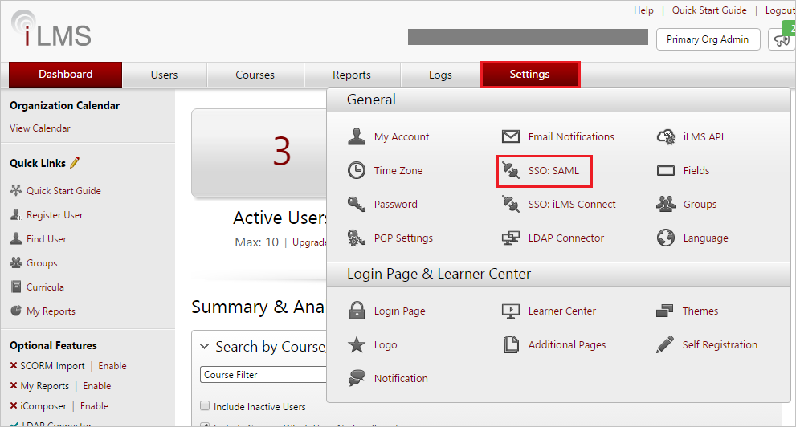
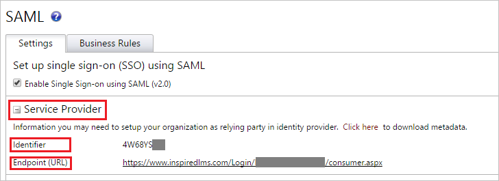
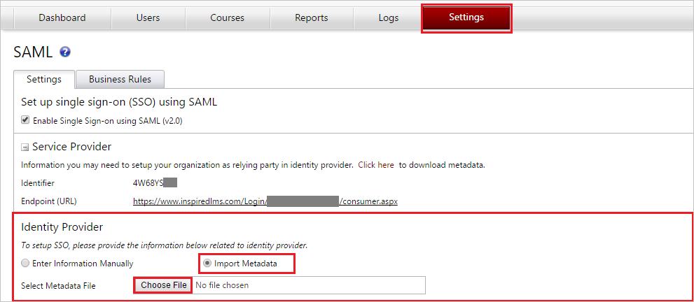
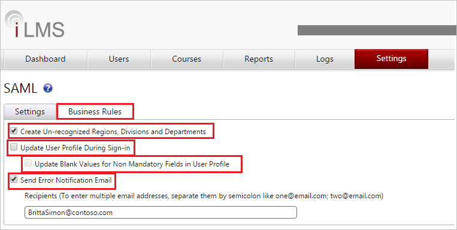
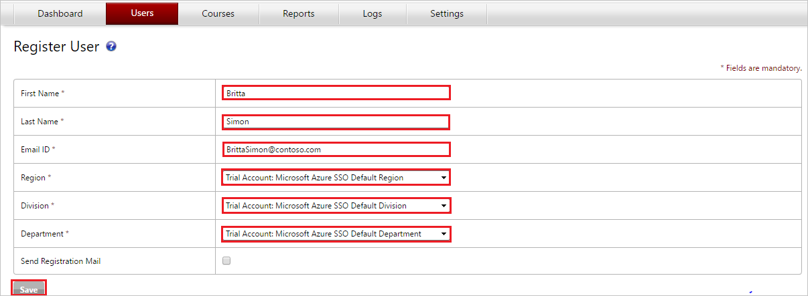

# Tutorial: Integrate iLMS with Azure Active Directory

In this tutorial, you'll learn how to integrate iLMS with Azure Active Directory (Azure AD). When you integrate iLMS with Azure AD, you can:

* Control in Azure AD who has access to iLMS.
* Enable your users to be automatically signed-in to iLMS with their Azure AD accounts.
* Manage your accounts in one central location - the Azure portal.

To learn more about SaaS app integration with Azure AD, see [What is application access and single sign-on with Azure Active Directory](https://docs.microsoft.com/azure/active-directory/active-directory-appssoaccess-whatis).

## Prerequisites

To get started, you need the following items:

* An Azure AD subscription. If you don't have a subscription, you can get one-month free trial [here](https://azure.microsoft.com/pricing/free-trial/).
* iLMS single sign-on (SSO) enabled subscription.

## Scenario description

In this tutorial, you configure and test Azure AD SSO in a test environment. iLMS supports **SP and IDP** initiated SSO

## Adding iLMS from the gallery

To configure the integration of iLMS into Azure AD, you need to add iLMS from the gallery to your list of managed SaaS apps.

1. Sign in to the [Azure portal](https://portal.azure.com) using either a work or school account, or a personal Microsoft account.
1. On the left navigation pane, select the **Azure Active Directory** service.
1. Navigate to **Enterprise Applications** and then select **All Applications**.
1. To add new application, select **New application**.
1. In the **Add from the gallery** section, type **iLMS** in the search box.
1. Select **iLMS** from results panel and then add the app. Wait a few seconds while the app is added to your tenant.

## Configure and test Azure AD single sign-on

Configure and test Azure AD SSO with iLMS using a test user called **Britta Simon**. For SSO to work, you need to establish a link relationship between an Azure AD user and the related user in iLMS.

To configure and test Azure AD SSO with iLMS, complete the following building blocks:

1. **[Configure Azure AD SSO](#configure-azure-ad-sso)** - to enable your users to use this feature.
2. **[Configure iLMS SSO](#configure-ilms-sso)** - to configure the Single Sign-On settings on application side.
3. **[Create an Azure AD test user](#create-an-azure-ad-test-user)** - to test Azure AD single sign-on with Britta Simon.
4. **[Assign the Azure AD test user](#assign-the-azure-ad-test-user)** - to enable Britta Simon to use Azure AD single sign-on.
5. **[Create iLMS test user](#create-ilms-test-user)** - to have a counterpart of Britta Simon in iLMS that is linked to the Azure AD representation of user.
6. **[Test SSO](#test-sso)** - to verify whether the configuration works.

### Configure Azure AD SSO

Follow these steps to enable Azure AD SSO in the Azure portal.

1. In the [Azure portal](https://portal.azure.com/), on the **iLMS** application integration page, find the **Manage** section and select **Single sign-on**.
1. On the **Select a Single sign-on method** page, select **SAML**.
1. On the **Set up Single Sign-On with SAML** page, click the edit/pen icon for **Basic SAML Configuration** to edit the settings.

   

1. On the **Basic SAML Configuration** page, if you wish to configure the application in **IDP** initiated mode, enter the values for the following fields:

    a. In the **Identifier** text box, paste the **Identifier** value you copy from **Service Provider** section of SAML settings in iLMS admin portal.

    b. In the **Reply URL** text box, paste the **Endpoint (URL)** value you copy from **Service Provider** section of SAML settings in iLMS admin portal having the following pattern `https://www.inspiredlms.com/Login/<instanceName>/consumer.aspx`

1. Click **Set additional URLs** and perform the following step if you wish to configure the application in **SP** initiated mode:

    In the **Sign-on URL** text box, paste the **Endpoint (URL)** value you copy from **Service Provider** section of SAML settings in iLMS admin portal as `https://www.inspiredlms.com/Login/<instanceName>/consumer.aspx`

1. To enable JIT provisioning, your iLMS application expects the SAML assertions in a specific format, which requires you to add custom attribute mappings to your SAML token attributes configuration. The following screenshot shows the list of default attributes. Click **Edit** icon to open User Attributes dialog.

	> [!NOTE]
	> You have to enable **Create Un-recognized User Account** in iLMS to map these attributes. Follow the instructions [here](https://support.inspiredelearning.com/help/adding-updating-and-managing-users#just-in-time-provisioning-with-saml-single-signon) to get an idea on the attributes configuration.

1. In addition to above, iLMS application expects few more attributes to be passed back in SAML response. In the **User Claims** section on the **User Attributes** dialog, perform the following steps to add SAML token attribute as shown in the below table:

	| Name | Source Attribute|
	| --------|------------- |
	| division | user.department |
	| region | user.state |
	| department | user.jobtitle |

	a. Click **Add new claim** to open the **Manage user claims** dialog.

	b. In the **Name** textbox, type the attribute name shown for that row.

	c. Leave the **Namespace** blank.

	d. Select Source as **Attribute**.

	e. From the **Source attribute** list, type the attribute value shown for that row.

	f. Click **Ok**

	g. Click **Save**.

1. On the **Set up Single Sign-On with SAML** page, in the **SAML Signing Certificate** section, click **Download** to download the **Federation Metadata XML** from the given options as per your requirement and save it on your computer.

	

1. On the **Set up iLMS** section, copy the appropriate URL(s) as per your requirement.

	

	a. Login URL

	b. Azure AD Identifier

	c. Logout URL

### Configure iLMS SSO

1. In a different web browser window, sign in to your **iLMS admin portal** as an administrator.

2. Click **SSO:SAML** under **Settings** tab to open SAML settings and perform the following steps:

	

3. Expand the **Service Provider** section and copy the **Identifier** and **Endpoint (URL)** value.

	 

4. Under **Identity Provider** section, click **Import Metadata**.

5. Select the **Federation Metadata** file downloaded from the Azure portal from the **SAML Signing Certificate** section.

    

6. If you want to enable JIT provisioning to create iLMS accounts for un-recognize users, follow below steps:

	a. Check **Create Un-recognized User Account**.

	

	b. Map the attributes in Azure AD with the attributes in iLMS. In the attribute column, specify the attributes name or the default value.

	c. Go to **Business Rules** tab and perform the following steps:

	

	d. Check **Create Un-recognized Regions, Divisions and Departments** to create Regions, Divisions, and Departments that do not already exist at the time of Single Sign-on.

	e. Check **Update User Profile During Sign-in** to specify whether the user’s profile is updated with each Single Sign-on.

	f. If the **Update Blank Values for Non Mandatory Fields in User Profile** option is checked, optional profile fields that are blank upon sign in will also cause the user’s iLMS profile to contain blank values for those fields.

	g. Check **Send Error Notification Email** and enter the email of the user where you want to receive the error notification email.

7. Click **Save** button to save the settings.

	

### Create an Azure AD test user

In this section, you'll create a test user in the Azure portal called Britta Simon.

1. From the left pane in the Azure portal, select **Azure Active Directory**, select **Users**, and then select **All users**.
1. Select **New user** at the top of the screen.
1. In the **User** properties, follow these steps:
   1. In the **Name** field, enter `Britta Simon`.  
   1. In the **User name** field, enter the username@companydomain.extension. For example, `BrittaSimon@contoso.com`.
   1. Select the **Show password** check box, and then write down the value that's displayed in the **Password** box.
   1. Click **Create**.

### Assign the Azure AD test user

In this section, you'll enable Britta Simon to use Azure single sign-on by granting access to iLMS.

1. In the Azure portal, select **Enterprise Applications**, and then select **All applications**.
1. In the applications list, select **iLMS**.
1. In the app's overview page, find the **Manage** section and select **Users and groups**.

   

1. Select **Add user**, then select **Users and groups** in the **Add Assignment** dialog.

	

1. In the **Users and groups** dialog, select **Britta Simon** from the Users list, then click the **Select** button at the bottom of the screen.
1. If you're expecting any role value in the SAML assertion, in the **Select Role** dialog, select the appropriate role for the user from the list and then click the **Select** button at the bottom of the screen.
1. In the **Add Assignment** dialog, click the **Assign** button.

### Create iLMS test user

Application supports Just in time user provisioning and after authentication users are created in the application automatically. JIT will work, if you have clicked the **Create Un-recognized User Account** checkbox during SAML configuration setting at iLMS admin portal.

If you need to create an user manually, then follow below steps:

1. Sign in to your iLMS company site as an administrator.

2. Click **Register User** under **Users** tab to open **Register User** page.

   

3. On the **Register User** page, perform the following steps.

	

	a. In the **First Name** textbox, type the first name like Britta.

    b. In the **Last Name** textbox, type the last name like Simon.

	c. In the **Email ID** textbox, type the email address of the user like BrittaSimon@contoso.com.

	d. In the **Region** dropdown, select the value for region.

	e. In the **Division** dropdown, select the value for division.

	f. In the **Department** dropdown, select the value for department.

    g. Click **Save**.

    > [!NOTE]
	> You can send registration mail to user by selecting **Send Registration Mail** checkbox.

### Test SSO

When you select the iLMS tile in the Access Panel, you should be automatically signed in to the iLMS for which you set up SSO. For more information about the Access Panel, see [Introduction to the Access Panel](https://docs.microsoft.com/azure/active-directory/active-directory-saas-access-panel-introduction).

## Additional Resources

- [List of Tutorials on How to Integrate SaaS Apps with Azure Active Directory](https://docs.microsoft.com/azure/active-directory/active-directory-saas-tutorial-list)

- [What is application access and single sign-on with Azure Active Directory?](https://docs.microsoft.com/azure/active-directory/active-directory-appssoaccess-whatis)

- [What is Conditional Access in Azure Active Directory?](https://docs.microsoft.com/azure/active-directory/conditional-access/overview)
