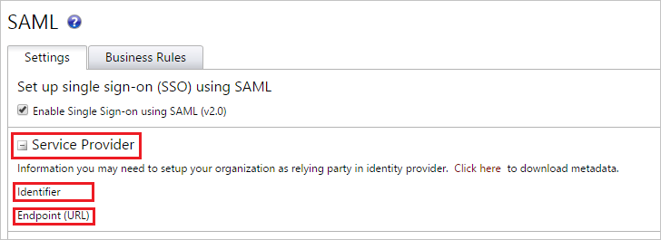
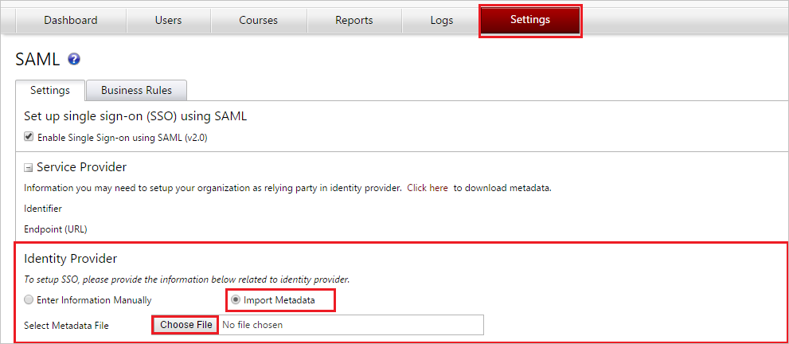
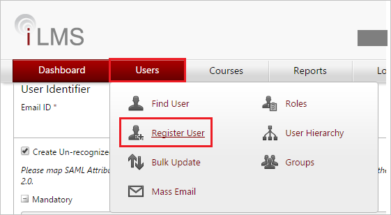

# Tutorial: Integrate iLMS with Microsoft Entra ID

In this tutorial, you'll learn how to integrate iLMS with Microsoft Entra ID. When you integrate iLMS with Microsoft Entra ID, you can:

* Control in Microsoft Entra ID who has access to iLMS.
* Enable your users to be automatically signed-in to iLMS with their Microsoft Entra accounts.
* Manage your accounts in one central location.

## Prerequisites

To get started, you need the following items:

* A Microsoft Entra subscription. If you don't have a subscription, you can get a [free account](https://azure.microsoft.com/free/).
* iLMS single sign-on (SSO) enabled subscription.

## Scenario description

In this tutorial, you configure and test Microsoft Entra SSO in a test environment.

* iLMS supports **SP and IDP** initiated SSO.

> [!NOTE]
> Identifier of this application is a fixed string value so only one instance can be configured in one tenant.

## Add iLMS from the gallery

To configure the integration of iLMS into Microsoft Entra ID, you need to add iLMS from the gallery to your list of managed SaaS apps.

1. Sign in to the [Microsoft Entra admin center](https://entra.microsoft.com) as at least a [Cloud Application Administrator](../roles/permissions-reference.md#cloud-application-administrator).
1. Browse to **Identity** > **Applications** > **Enterprise applications** > **New application**.
1. In the **Add from the gallery** section, type **iLMS** in the search box.
1. Select **iLMS** from results panel and then add the app. Wait a few seconds while the app is added to your tenant.

 Alternatively, you can also use the [Enterprise App Configuration Wizard](https://portal.office.com/AdminPortal/home?Q=Docs#/azureadappintegration). In this wizard, you can add an application to your tenant, add users/groups to the app, assign roles, as well as walk through the SSO configuration as well. [Learn more about Microsoft 365 wizards.](/microsoft-365/admin/misc/azure-ad-setup-guides)

## Configure and test Microsoft Entra SSO for iLMS

Configure and test Microsoft Entra SSO with iLMS using a test user called **B.Simon**. For SSO to work, you need to establish a link relationship between a Microsoft Entra user and the related user in iLMS.

To configure and test Microsoft Entra SSO with iLMS, perform the following steps:

1. **[Configure Microsoft Entra SSO](#configure-azure-ad-sso)** - to enable your users to use this feature.
    1. **[Create a Microsoft Entra test user](#create-an-azure-ad-test-user)** - to test Microsoft Entra single sign-on with B.Simon.
    1. **[Assign the Microsoft Entra test user](#assign-the-azure-ad-test-user)** - to enable B.Simon to use Microsoft Entra single sign-on.
1. **[Configure iLMS SSO](#configure-ilms-sso)** - to configure the single sign-on settings on application side.
    1. **[Create iLMS test user](#create-ilms-test-user)** - to have a counterpart of B.Simon in iLMS that is linked to the Microsoft Entra representation of user.
1. **[Test SSO](#test-sso)** - to verify whether the configuration works.

## Configure Microsoft Entra SSO

Follow these steps to enable Microsoft Entra SSO.

1. Sign in to the [Microsoft Entra admin center](https://entra.microsoft.com) as at least a [Cloud Application Administrator](../roles/permissions-reference.md#cloud-application-administrator).
1. Browse to **Identity** > **Applications** > **Enterprise applications** > **iLMS** application integration page, find the **Manage** section and select **Single sign-on**.
1. On the **Select a Single sign-on method** page, select **SAML**.
1. On the **Set up Single Sign-On with SAML** page, click the pencil icon for **Basic SAML Configuration** to edit the settings.

   

1. On the **Basic SAML Configuration** page, if you wish to configure the application in **IDP** initiated mode, perform the following steps:

    a. In the **Identifier** text box, paste the **Identifier** value you copy from **Service Provider** section of SAML settings in iLMS admin portal.

    b. In the **Reply URL** text box, paste the **Endpoint (URL)** value you copy from **Service Provider** section of SAML settings in iLMS admin portal having the following pattern: `https://www.inspiredlms.com/Login/<INSTANCE_NAME>/consumer.aspx`.

1. Click **Set additional URLs** and perform the following step if you wish to configure the application in **SP** initiated mode:

    In the **Sign-on URL** text box, paste the **Endpoint (URL)** value you copy from **Service Provider** section of SAML settings in iLMS admin portal as `https://www.inspiredlms.com/Login/<INSTANCE_NAME>/consumer.aspx`.

1. To enable JIT provisioning, your iLMS application expects the SAML assertions in a specific format, which requires you to add custom attribute mappings to your SAML token attributes configuration. The following screenshot shows the list of default attributes. Click **Edit** icon to open User Attributes dialog.

	> [!NOTE]
	> You have to enable **Create Un-recognized User Account** in iLMS to map these attributes. Follow the instructions [here](https://support.inspiredelearning.com/help/adding-updating-and-managing-users#just-in-time-provisioning-with-saml-single-signon) to get an idea on the attributes configuration.

1. In addition to above, iLMS application expects few more attributes to be passed back in SAML response. In the **User Claims** section on the **User Attributes** dialog, perform the following steps to add SAML token attribute as shown in the below table:

	| Name | Source Attribute|
	| --------|------------- |
	| division | user.department |
	| region | user.state |
	| department | user.jobtitle |

	a. Click **Add new claim** to open the **Manage user claims** dialog.

	b. In the **Name** textbox, type the attribute name shown for that row.

	c. Leave the **Namespace** blank.

	d. Select Source as **Attribute**.

	e. From the **Source attribute** list, type the attribute value shown for that row.

	f. Click **Ok**

	g. Click **Save**.

1. On the **Set up Single Sign-On with SAML** page, in the **SAML Signing Certificate** section, click **Download** to download the **Federation Metadata XML** from the given options as per your requirement and save it on your computer.

	

1. On the **Set up iLMS** section, copy the appropriate URL(s) as per your requirement.

	

### Create a Microsoft Entra test user

In this section, you'll create a test user called Britta Simon.

1. Sign in to the [Microsoft Entra admin center](https://entra.microsoft.com) as at least a [User Administrator](../roles/permissions-reference.md#user-administrator).
1. Browse to **Identity** > **Users** > **All users**.
1. Select **New user** > **Create new user**, at the top of the screen.
1. In the **User** properties, follow these steps:
   1. In the **Display name** field, enter `B.Simon`.  
   1. In the **User principal name** field, enter the username@companydomain.extension. For example, `B.Simon@contoso.com`.
   1. Select the **Show password** check box, and then write down the value that's displayed in the **Password** box.
   1. Select **Review + create**.
1. Select **Create**.

### Assign the Microsoft Entra test user

In this section, you'll enable B.Simon to use single sign-on by granting access to iLMS.

1. Sign in to the [Microsoft Entra admin center](https://entra.microsoft.com) as at least a [Cloud Application Administrator](../roles/permissions-reference.md#cloud-application-administrator).
1. Browse to **Identity** > **Applications** > **Enterprise applications** > **iLMS**.
1. In the app's overview page, select **Users and groups**.
1. Select **Add user/group**, then select **Users and groups** in the **Add Assignment** dialog.
   1. In the **Users and groups** dialog, select **B.Simon** from the Users list, then click the **Select** button at the bottom of the screen.
   1. If you are expecting a role to be assigned to the users, you can select it from the **Select a role** dropdown. If no role has been set up for this app, you see "Default Access" role selected.
   1. In the **Add Assignment** dialog, click the **Assign** button.

## Configure iLMS SSO

1. In a different web browser window, sign in to your **iLMS admin portal** as an administrator.

2. Click **SSO:SAML** under **Settings** tab to open SAML settings and perform the following steps:

	

3. Expand the **Service Provider** section and copy the **Identifier** and **Endpoint (URL)** value.

	 

4. Under **Identity Provider** section, click **Import Metadata**.

5. Select the **Federation Metadata** file downloaded from the **SAML Signing Certificate** section.

    

6. If you want to enable JIT provisioning to create iLMS accounts for un-recognize users, follow below steps:

	a. Check **Create Un-recognized User Account**.

	

	b. Map the attributes in Microsoft Entra ID with the attributes in iLMS. In the attribute column, specify the attributes name or the default value.

	c. Go to **Business Rules** tab and perform the following steps:

	

	d. Check **Create Un-recognized Regions, Divisions and Departments** to create Regions, Divisions, and Departments that do not already exist at the time of Single Sign-on.

	e. Check **Update User Profile During Sign-in** to specify whether the user’s profile is updated with each Single Sign-on.

	f. If the **Update Blank Values for Non Mandatory Fields in User Profile** option is checked, optional profile fields that are blank upon sign in will also cause the user’s iLMS profile to contain blank values for those fields.

	g. Check **Send Error Notification Email** and enter the email of the user where you want to receive the error notification email.

7. Click **Save** button to save the settings.

	

### Create iLMS test user

Application supports Just in time user provisioning and after authentication users are created in the application automatically. JIT will work, if you have clicked the **Create Un-recognized User Account** checkbox during SAML configuration setting at iLMS admin portal.

If you need to create a user manually, then follow below steps:

1. Sign in to your iLMS company site as an administrator.

2. Click **Register User** under **Users** tab to open **Register User** page.

   

3. On the **Register User** page, perform the following steps.

	

	a. In the **First Name** textbox, type the first name like Britta.

    b. In the **Last Name** textbox, type the last name like Simon.

	c. In the **Email ID** textbox, type the email address of the user like BrittaSimon@contoso.com.

	d. In the **Region** dropdown, select the value for region.

	e. In the **Division** dropdown, select the value for division.

	f. In the **Department** dropdown, select the value for department.

    g. Click **Save**.

    > [!NOTE]
	> You can send registration mail to user by selecting **Send Registration Mail** checkbox.

## Test SSO

In this section, you test your Microsoft Entra single sign-on configuration with following options. 

#### SP initiated:

* Click on **Test this application**, this will redirect to iLMS Sign on URL where you can initiate the login flow.  

* Go to iLMS Sign-on URL directly and initiate the login flow from there.

#### IDP initiated:

* Click on **Test this application**, and you should be automatically signed in to the iLMS for which you set up the SSO. 

You can also use Microsoft My Apps to test the application in any mode. When you click the iLMS tile in the My Apps, if configured in SP mode you would be redirected to the application sign on page for initiating the login flow and if configured in IDP mode, you should be automatically signed in to the iLMS for which you set up the SSO. For more information about the My Apps, see [Introduction to the My Apps](https://support.microsoft.com/account-billing/sign-in-and-start-apps-from-the-my-apps-portal-2f3b1bae-0e5a-4a86-a33e-876fbd2a4510).

## Next steps

Once you configure iLMS you can enforce session control, which protects exfiltration and infiltration of your organization’s sensitive data in real time. Session control extends from Conditional Access. [Learn how to enforce session control with Microsoft Defender for Cloud Apps](/cloud-app-security/proxy-deployment-aad).
