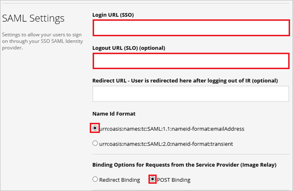
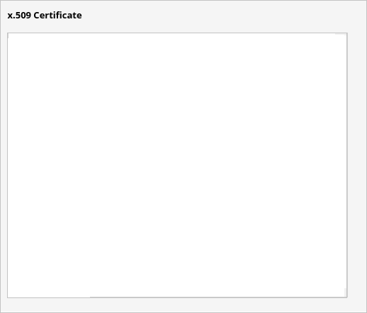
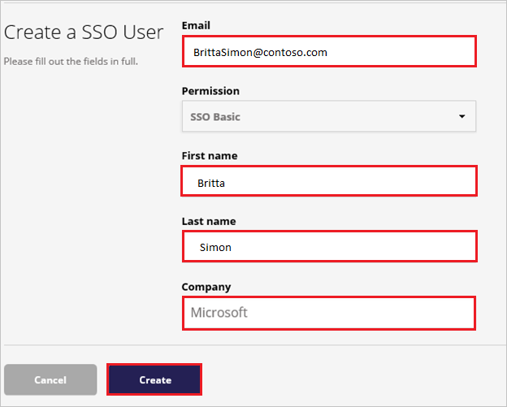

# Tutorial: Microsoft Entra integration with Image Relay

In this tutorial, you'll learn how to integrate Image Relay with Microsoft Entra ID. When you integrate Image Relay with Microsoft Entra ID, you can:

* Control in Microsoft Entra ID who has access to Image Relay.
* Enable your users to be automatically signed-in to Image Relay with their Microsoft Entra accounts.
* Manage your accounts in one central location.

## Prerequisites

To get started, you need the following items:

* A Microsoft Entra subscription. If you don't have a subscription, you can get a [free account](https://azure.microsoft.com/free/).
* Image Relay single sign-on (SSO) enabled subscription.

## Scenario description

In this tutorial, you configure and test Microsoft Entra single sign-on in a test environment.

* Image Relay supports **SP** initiated SSO.

## Add Image Relay from the gallery

To configure the integration of Image Relay into Microsoft Entra ID, you need to add Image Relay from the gallery to your list of managed SaaS apps.

1. Sign in to the [Microsoft Entra admin center](https://entra.microsoft.com) as at least a [Cloud Application Administrator](../roles/permissions-reference.md#cloud-application-administrator).
1. Browse to **Identity** > **Applications** > **Enterprise applications** > **New application**.
1. In the **Add from the gallery** section, type **Image Relay** in the search box.
1. Select **Image Relay** from results panel and then add the app. Wait a few seconds while the app is added to your tenant.

 Alternatively, you can also use the [Enterprise App Configuration Wizard](https://portal.office.com/AdminPortal/home?Q=Docs#/azureadappintegration). In this wizard, you can add an application to your tenant, add users/groups to the app, assign roles, as well as walk through the SSO configuration as well. [Learn more about Microsoft 365 wizards.](/microsoft-365/admin/misc/azure-ad-setup-guides)

## Configure and test Microsoft Entra SSO for Image Relay

Configure and test Microsoft Entra SSO with Image Relay using a test user called **B.Simon**. For SSO to work, you need to establish a link relationship between a Microsoft Entra user and the related user in Image Relay.

To configure and test Microsoft Entra SSO with Image Relay, perform the following steps:

1. **[Configure Microsoft Entra SSO](#configure-azure-ad-sso)** - to enable your users to use this feature.
    1. **[Create a Microsoft Entra test user](#create-an-azure-ad-test-user)** - to test Microsoft Entra single sign-on with B.Simon.
    1. **[Assign the Microsoft Entra test user](#assign-the-azure-ad-test-user)** - to enable B.Simon to use Microsoft Entra single sign-on.
1. **[Configure Image Relay SSO](#configure-image-relay-sso)** - to configure the single sign-on settings on application side.
    1. **[Create Image Relay test user](#create-image-relay-test-user)** - to have a counterpart of B.Simon in Image Relay that is linked to the Microsoft Entra representation of user.
1. **[Test SSO](#test-sso)** - to verify whether the configuration works.

## Configure Microsoft Entra SSO

Follow these steps to enable Microsoft Entra SSO.

1. Sign in to the [Microsoft Entra admin center](https://entra.microsoft.com) as at least a [Cloud Application Administrator](../roles/permissions-reference.md#cloud-application-administrator).
1. Browse to **Identity** > **Applications** > **Enterprise applications** > **Image Relay** > **Single sign-on**.
1. On the **Select a single sign-on method** page, select **SAML**.
1. On the **Set up single sign-on with SAML** page, click the pencil icon for **Basic SAML Configuration** to edit the settings.

   

1. On the **Basic SAML Configuration** section, perform the following steps:

    a. In the **Identifier (Entity ID)** text box, type a URL using the following pattern:
    `https://<COMPANYNAME>.imagerelay.com/sso/metadata`

	b. In the **Sign on URL** text box, type a URL using the following pattern:
    `https://<COMPANYNAME>.imagerelay.com/`

	> [!NOTE]
	> These values are not real. Update these values with the actual Identifier and Sign on URL. Contact [Image Relay Client support team](http://support.imagerelay.com/) to get these values. You can also refer to the patterns shown in the **Basic SAML Configuration** section.

4. On the **Set up Single Sign-On with SAML** page, in the **SAML Signing Certificate** section, click **Download** to download the **Certificate (Base64)** from the given options as per your requirement and save it on your computer.

	

1. On the **Set up Image Relay** section, copy the appropriate URL(s) as per your requirement.

	

### Create a Microsoft Entra test user

In this section, you'll create a test user called B.Simon.

1. Sign in to the [Microsoft Entra admin center](https://entra.microsoft.com) as at least a [User Administrator](../roles/permissions-reference.md#user-administrator).
1. Browse to **Identity** > **Users** > **All users**.
1. Select **New user** > **Create new user**, at the top of the screen.
1. In the **User** properties, follow these steps:
   1. In the **Display name** field, enter `B.Simon`.  
   1. In the **User principal name** field, enter the username@companydomain.extension. For example, `B.Simon@contoso.com`.
   1. Select the **Show password** check box, and then write down the value that's displayed in the **Password** box.
   1. Select **Review + create**.
1. Select **Create**.

### Assign the Microsoft Entra test user

In this section, you'll enable B.Simon to use single sign-on by granting access to Image Relay.

1. Sign in to the [Microsoft Entra admin center](https://entra.microsoft.com) as at least a [Cloud Application Administrator](../roles/permissions-reference.md#cloud-application-administrator).
1. Browse to **Identity** > **Applications** > **Enterprise applications** > **Image Relay**.
1. In the app's overview page, select **Users and groups**.
1. Select **Add user/group**, then select **Users and groups** in the **Add Assignment** dialog.
   1. In the **Users and groups** dialog, select **B.Simon** from the Users list, then click the **Select** button at the bottom of the screen.
   1. If you are expecting a role to be assigned to the users, you can select it from the **Select a role** dropdown. If no role has been set up for this app, you see "Default Access" role selected.
   1. In the **Add Assignment** dialog, click the **Assign** button.

## Configure Image Relay SSO

1. In another browser window, sign in to your Image Relay company site as an administrator.

2. In the toolbar on the top, click the **Users & Permissions** workload.

     

3. Click **Create New Permission**.

    

4. In the **Single Sign On Settings** workload, select the **This Group can only sign-in via Single Sign On** check box, and then click **Save**.

     

5. Go to **Account Settings**.

     

6. Go to the **Single Sign On Settings** workload.

    

7. On the **SAML Settings** dialog, perform the following steps:

	

    a. In **Login URL** textbox, paste the value of **Login URL**..

    b. In **Logout URL**  textbox, paste the value of **Logout URL**..

    c. As **Name Id Format**, select **urn:oasis:names:tc:SAML:1.1:nameid-format:emailAddress**.

    d. As **Binding Options for Requests from the Service Provider (Image Relay)**, select **POST Binding**.

    e. Under **x.509 Certificate**, click **Update Certificate**.

    

    f. Open the downloaded certificate in notepad, copy the content, and then paste it into the **x.509 Certificate** textbox.

    

    g. In **Just-In-Time User Provisioning** section, select the **Enable Just-In-Time User Provisioning**.

    

    h. Select the permission group (for example, **SSO Basic**) which is allowed to sign in only through single sign-on.

    

    i. Click **Save**.

### Create Image Relay test user

The objective of this section is to create a user called Britta Simon in Image Relay.

**To create a user called Britta Simon in Image Relay, perform the following steps:**

1. Sign-on to your Image Relay company site as an administrator.

2. Go to **Users & Permissions** and select **Create SSO User**.

     

3. Enter the **Email**, **First Name**, **Last Name**, and **Company** of the user you want to provision and select the permission group (for example, SSO Basic) which is the group that can sign in only through single sign-on.

    

4. Click **Create**.

## Test SSO

In this section, you test your Microsoft Entra single sign-on configuration with following options. 

* Click on **Test this application**, this will redirect to Image Relay Sign-on URL where you can initiate the login flow. 

* Go to Image Relay Sign-on URL directly and initiate the login flow from there.

* You can use Microsoft My Apps. When you click the Image Relay tile in the My Apps, this will redirect to Image Relay Sign-on URL. For more information about the My Apps, see [Introduction to the My Apps](https://support.microsoft.com/account-billing/sign-in-and-start-apps-from-the-my-apps-portal-2f3b1bae-0e5a-4a86-a33e-876fbd2a4510).

## Next steps

Once you configure Image Relay you can enforce session control, which protects exfiltration and infiltration of your organization’s sensitive data in real time. Session control extends from Conditional Access. [Learn how to enforce session control with Microsoft Defender for Cloud Apps](/cloud-app-security/proxy-deployment-aad).
