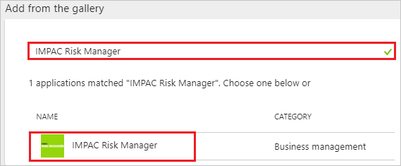
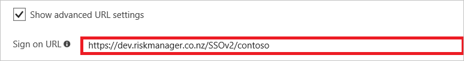
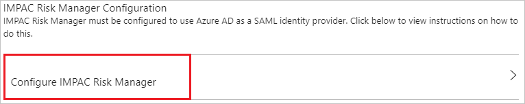

---
title: 'Tutorial: Azure Active Directory integration with IMPAC Risk Manager | Microsoft Docs'
description: Learn how to configure single sign-on between Azure Active Directory and IMPAC Risk Manager.
services: active-directory
documentationCenter: na
author: jeevansd
manager: mtillman
ms.reviewer: joflore

ms.assetid: 4d77390e-898c-4258-a562-a1181dfe2880
ms.service: active-directory
ms.component: saas-app-tutorial
ms.workload: identity
ms.tgt_pltfrm: na
ms.devlang: na
ms.topic: article
ms.date: 11/01/2017
ms.author: jeedes

---
# Tutorial: Azure Active Directory integration with IMPAC Risk Manager

In this tutorial, you learn how to integrate IMPAC Risk Manager with Azure Active Directory (Azure AD).

Integrating IMPAC Risk Manager with Azure AD provides you with the following benefits:

- You can control in Azure AD who has access to IMPAC Risk Manager.
- You can enable your users to automatically get signed-on to IMPAC Risk Manager (Single Sign-On) with their Azure AD accounts.
- You can manage your accounts in one central location - the Azure portal.

If you want to know more details about SaaS app integration with Azure AD, see [what is application access and single sign-on with Azure Active Directory](../manage-apps/what-is-single-sign-on.md).

## Prerequisites

To configure Azure AD integration with IMPAC Risk Manager, you need the following items:

- An Azure AD subscription
- A IMPAC Risk Manager single-sign on enabled subscription

> [!NOTE]
> To test the steps in this tutorial, we do not recommend using a production environment.

To test the steps in this tutorial, you should follow these recommendations:

- Do not use your production environment, unless it is necessary.
- If you don't have an Azure AD trial environment, you can [get a one-month trial](https://azure.microsoft.com/pricing/free-trial/).

## Scenario description
In this tutorial, you test Azure AD single sign-on in a test environment. 
The scenario outlined in this tutorial consists of two main building blocks:

1. Adding IMPAC Risk Manager from the gallery
1. Configuring and testing Azure AD single sign-on

## Adding IMPAC Risk Manager from the gallery
To configure the integration of IMPAC Risk Manager into Azure AD, you need to add IMPAC Risk Manager from the gallery to your list of managed SaaS apps.

**To add IMPAC Risk Manager from the gallery, perform the following steps:**

1. In the **[Azure portal](https://portal.azure.com)**, on the left navigation panel, click **Azure Active Directory** icon. 

	![The Azure Active Directory button][1]

1. Navigate to **Enterprise applications**. Then go to **All applications**.

	![The Enterprise applications blade][2]
	
1. To add new application, click **New application** button on the top of dialog.

	![The New application button][3]

1. In the search box, type **IMPAC Risk Manager**, select **IMPAC Risk Manager** from result panel then click **Add** button to add the application.

	

## Configure and test Azure AD single sign-on

In this section, you configure and test Azure AD single sign-on with IMPAC Risk Manager based on a test user called "Britta Simon".

For single sign-on to work, Azure AD needs to know what the counterpart user in IMPAC Risk Manager is to a user in Azure AD. In other words, a link relationship between an Azure AD user and the related user in IMPAC Risk Manager needs to be established.

In IMPAC Risk Manager, assign the value of the **user name** in Azure AD as the value of the **Username** to establish the link relationship.

To configure and test Azure AD single sign-on with IMPAC Risk Manager, you need to complete the following building blocks:

1. **[Configure Azure AD Single Sign-On](#configure-azure-ad-single-sign-on)** - to enable your users to use this feature.
1. **[Create an Azure AD test user](#create-an-azure-ad-test-user)** - to test Azure AD single sign-on with Britta Simon.
1. **[Create a IMPAC Risk Manager test user](#create-a-impac-risk-manager-test-user)** - to have a counterpart of Britta Simon in IMPAC Risk Manager that is linked to the Azure AD representation of user.
1. **[Assign the Azure AD test user](#assign-the-azure-ad-test-user)** - to enable Britta Simon to use Azure AD single sign-on.
1. **[Test single sign-on](#test-single-sign-on)** - to verify whether the configuration works.

### Configure Azure AD single sign-on

In this section, you enable Azure AD single sign-on in the Azure portal and configure single sign-on in your IMPAC Risk Manager application.

**To configure Azure AD single sign-on with IMPAC Risk Manager, perform the following steps:**

1. In the Azure portal, on the **IMPAC Risk Manager** application integration page, click **Single sign-on**.

	![Configure single sign-on link][4]

1. On the **Single sign-on** dialog, select **Mode** as	**SAML-based Sign-on** to enable single sign-on.
 
	

1. On the **IMPAC Risk Manager Domain and URLs** section, perform the following steps if you wish to configure the application in IDP initiated mode:

	

    a. In the **Identifier** textbox, type a value provided by IMPAC

	b. In the **Reply URL** textbox, type a URL using the following pattern:
	| Environment | URL Pattern |
	| ---------------|--------------- |    
	| For Production |`https://www.riskmanager.co.nz/DotNet/SSOv2/AssertionConsumerService.aspx?client=<ClientSuffix>`|
	| For Staging and Training  |`https://staging.riskmanager.co.nz/DotNet/SSOv2/AssertionConsumerService.aspx?client=<ClientSuffix>`|
	| For Development  |`https://dev.riskmanager.co.nz/DotNet/SSOv2/AssertionConsumerService.aspx?client=<ClientSuffix>`|
	| For QA |`https://QA.riskmanager.co.nz/DotNet/SSOv2/AssertionConsumerService.aspx?client=<ClientSuffix>`|
	| For Test |`https://test.riskmanager.co.nz/DotNet/SSOv2/AssertionConsumerService.aspx?client=<ClientSuffix>`|

1. Check **Show advanced URL settings** and perform the following step if you wish to configure the application in **SP** initiated mode:

	

    In the **Sign-on URL** textbox, type a URL using the following pattern:
	| Environment | URL Pattern |
	| ---------------|--------------- |    
	| For Production |`https://www.riskmanager.co.nz/SSOv2/<ClientSuffix>`|
	| For Staging and Training  |`https://staging.riskmanager.co.nz/SSOv2/<ClientSuffix>`|
	| For Development  |`https://dev.riskmanager.co.nz/SSOv2/<ClientSuffix>`|
	| For QA |`https://QA.riskmanager.co.nz/SSOv2/<ClientSuffix>`|
	| For Test |`https://test.riskmanager.co.nz/SSOv2/<ClientSuffix>`|

	> [!NOTE] 
	> These values are not real. Update these values with the actual Identifier, Reply URL, and Sign-On URL. Contact [IMPAC Risk Manager Client support team](mailto:rmsupport@Impac.co.nz) to get these values.

1. On the **SAML Signing Certificate** section, click **Certificate(Base64)** and then save the certificate file on your computer.

	 

1. Click **Save** button.

	
	
1. On the **IMPAC Risk Manager Configuration** section, click **Configure IMPAC Risk Manager** to open **Configure sign-on** window. Copy the **SAML Single Sign-On Service URL, SAML Entity ID** and **Sign-Out URL** from the **Quick Reference section.**

	

1. To configure single sign-on on **IMPAC Risk Manager** side, you need to send the downloaded **Certificate(Base64)**, **Sign-Out URL, SAML Entity ID,** and **SAML Single Sign-On Service URL** to [IMPAC Risk Manager support team](mailto:rmsupport@Impac.co.nz). They set this setting to have the SAML SSO connection set properly on both sides.

> [!TIP]
> You can now read a concise version of these instructions inside the [Azure portal](https://portal.azure.com), while you are setting up the app!  After adding this app from the **Active Directory > Enterprise Applications** section, simply click the **Single Sign-On** tab and access the embedded documentation through the **Configuration** section at the bottom. You can read more about the embedded documentation feature here: [Azure AD embedded documentation]( https://go.microsoft.com/fwlink/?linkid=845985)

### Create an Azure AD test user

The objective of this section is to create a test user in the Azure portal called Britta Simon.

   ![Create an Azure AD test user][100]

**To create a test user in Azure AD, perform the following steps:**

1. In the Azure portal, in the left pane, click the **Azure Active Directory** button.

    

1. To display the list of users, go to **Users and groups**, and then click **All users**.

    

1. To open the **User** dialog box, click **Add** at the top of the **All Users** dialog box.

    

1. In the **User** dialog box, perform the following steps:

    

    a. In the **Name** box, type **BrittaSimon**.

    b. In the **User name** box, type the email address of user Britta Simon.

    c. Select the **Show Password** check box, and then write down the value that's displayed in the **Password** box.

    d. Click **Create**.
 
### Create a IMPAC Risk Manager test user

In this section, you create a user called Britta Simon in IMPAC Risk Manager. Work with [IMPAC Risk Manager support team](mailto:rmsupport@Impac.co.nz) to add the users in the IMPAC Risk Manager platform. Users must be created and activated before you use single sign-on. 

### Assign the Azure AD test user

In this section, you enable Britta Simon to use Azure single sign-on by granting access to IMPAC Risk Manager.

![Assign the user role][200] 

**To assign Britta Simon to IMPAC Risk Manager, perform the following steps:**

1. In the Azure portal, open the applications view, and then navigate to the directory view and go to **Enterprise applications** then click **All applications**.

	![Assign User][201] 

1. In the applications list, select **IMPAC Risk Manager**.

	  

1. In the menu on the left, click **Users and groups**.

	![The "Users and groups" link][202]

1. Click **Add** button. Then select **Users and groups** on **Add Assignment** dialog.

	![The Add Assignment pane][203]

1. On **Users and groups** dialog, select **Britta Simon** in the Users list.

1. Click **Select** button on **Users and groups** dialog.

1. Click **Assign** button on **Add Assignment** dialog.
	
### Test single sign-on

In this section, you test your Azure AD single sign-on configuration using the Access Panel.

When you click the IMPAC Risk Manager tile in the Access Panel, you should get automatically signed-on to your IMPAC Risk Manager application.
For more information about the Access Panel, see [Introduction to the Access Panel](../user-help/active-directory-saas-access-panel-introduction.md). 

## Additional resources

* [List of Tutorials on How to Integrate SaaS Apps with Azure Active Directory](tutorial-list.md)
* [What is application access and single sign-on with Azure Active Directory?](../manage-apps/what-is-single-sign-on.md)

<!--Image references-->

[1]: ./media/impacriskmanager-tutorial/tutorial_general_01.png
[2]: ./media/impacriskmanager-tutorial/tutorial_general_02.png
[3]: ./media/impacriskmanager-tutorial/tutorial_general_03.png
[4]: ./media/impacriskmanager-tutorial/tutorial_general_04.png

[100]: ./media/impacriskmanager-tutorial/tutorial_general_100.png

[200]: ./media/impacriskmanager-tutorial/tutorial_general_200.png
[201]: ./media/impacriskmanager-tutorial/tutorial_general_201.png
[202]: ./media/impacriskmanager-tutorial/tutorial_general_202.png
[203]: ./media/impacriskmanager-tutorial/tutorial_general_203.png

