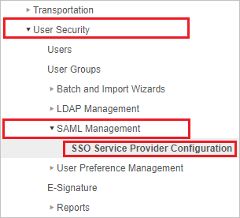
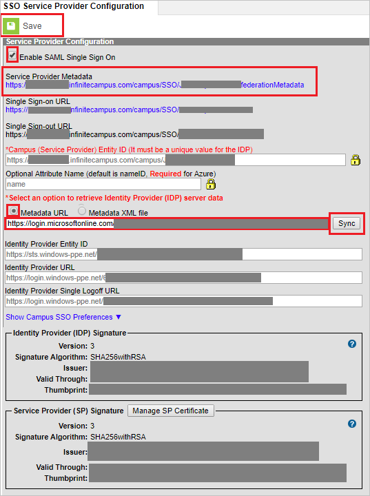

# Tutorial: Azure Active Directory integration with Infinite Campus

In this tutorial, you learn how to integrate Infinite Campus with Azure Active Directory (Azure AD).
Integrating Infinite Campus with Azure AD provides you with the following benefits:

* You can control in Azure AD who has access to Infinite Campus.
* You can enable your users to be automatically signed-in to Infinite Campus (Single Sign-On) with their Azure AD accounts.
* You can manage your accounts in one central location - the Azure portal.

If you want to know more details about SaaS app integration with Azure AD, see [What is application access and single sign-on with Azure Active Directory](https://docs.microsoft.com/azure/active-directory/active-directory-appssoaccess-whatis).
If you don't have an Azure subscription, [create a free account](https://azure.microsoft.com/free/) before you begin.

## Prerequisites

To configure Azure AD integration with Infinite Campus, you need the following items:

* An Azure AD subscription. If you don't have an Azure AD environment, you can get a [free account](https://azure.microsoft.com/free/)
* Infinite Campus single sign-on enabled subscription
* At minimum, you need to be an Azure Active Directory administrator, and have a Campus Product Security Role of "Student Information System (SIS)" to complete the configuration.

## Scenario description

In this tutorial, you configure and test Azure AD single sign-on in a test environment.

* Infinite Campus supports **SP** initiated SSO

## Adding Infinite Campus from the gallery

To configure the integration of Infinite Campus into Azure AD, you need to add Infinite Campus from the gallery to your list of managed SaaS apps.

**To add Infinite Campus from the gallery, perform the following steps:**

1. In the **[Azure portal](https://portal.azure.com)**, on the left navigation panel, click **Azure Active Directory** icon.

	

2. Navigate to **Enterprise Applications** and then select the **All Applications** option.

	

3. To add a new application, click the **New application** button at the top of the dialog.

	

4. In the search box, type **Infinite Campus**, select **Infinite Campus** from the result panel then click the **Add** button to add the application.

	

## Configure and test Azure AD single sign-on

In this section, you configure and test Azure AD single sign-on with Infinite Campus based on a test user called **Britta Simon**.
For single sign-on to work, a link relationship between an Azure AD user and the related user in Infinite Campus needs to be established.

To configure and test Azure AD single sign-on with Infinite Campus, you need to complete the following building blocks:

1. **[Configure Azure AD Single Sign-On](#configure-azure-ad-single-sign-on)** - to enable your users to use this feature.
2. **[Configure Infinite Campus Single Sign-On](#configure-infinite-campus-single-sign-on)** - to configure the Single Sign-On settings on application side.
3. **[Create an Azure AD test user](#create-an-azure-ad-test-user)** - to test Azure AD single sign-on with Britta Simon.
4. **[Assign the Azure AD test user](#assign-the-azure-ad-test-user)** - to enable Britta Simon to use Azure AD single sign-on.
5. **[Create Infinite Campus test user](#create-infinite-campus-test-user)** - to have a counterpart of Britta Simon in Infinite Campus that is linked to the Azure AD representation of user.
6. **[Test single sign-on](#test-single-sign-on)** - to verify whether the configuration works.

### Configure Azure AD single sign-on

In this section, you enable Azure AD single sign-on in the Azure portal.

To configure Azure AD single sign-on with Infinite Campus, perform the following steps:

1. In the [Azure portal](https://portal.azure.com/), on the **Infinite Campus** application integration page, select **Single sign-on**.

    

2. On the **Select a Single sign-on method** dialog, select **SAML/WS-Fed** mode to enable single sign-on.

    

3. On the **Set up Single Sign-On with SAML** page, click **Edit** icon to open **Basic SAML Configuration** dialog.

	

4. On the Basic SAML Configuration section, perform the following steps (note that the domain will vary with Hosting Model, but the **FULLY-QUALIFIED-DOMAIN** value must match your Infinite Campus installation):

	a. In the **Sign-on URL** textbox, type a URL using the following pattern: `https://<DOMAIN>.infinitecampus.com/campus/SSO/<DISTRICTNAME>/SIS`

	b. In the **Identifier** textbox, type a URL using the following pattern: `https://<DOMAIN>.infinitecampus.com/campus/<DISTRICTNAME>`

	c. In the **Reply URL** textbox, type a URL using the following pattern: `https://<DOMAIN>.infinitecampus.com/campus/SSO/<DISTRICTNAME>`

	

5. On the **Set up Single Sign-On with SAML** page, In the **SAML Signing Certificate** section, click copy button to copy **App Federation Metadata Url** and save it on your computer.

	

### Configure Infinite Campus Single Sign-On

1. In a different web browser window, sign in to Infinite Campus as a Security Administrator.

2. On the left side of menu, click **System Administration**.

	

3. Navigate to **User Security** > **SAML Management** > **SSO Service Provider Configuration**.

	

4. On the **SSO Service Provider Configuration** page, perform the following steps:

	

	a. Select **Enable SAML Single Sign On**.

	b. Edit the **Optional Attribute Name** to contain **name**

	c. On the **Select an option to retrieve Identity Provider (IDP) server data** section, select **Metadata URL**, paste the **App Federation Metadata Url** value, which you have copied from the Azure portal in the box, and then click **Sync**.

	d. After clicking **Sync** the values get auto-populated in **SSO Service Provider Configuration** page. These values can be verified to match the values seen in Step 4 above.

	e. Click **Save**.

### Create an Azure AD test user

The objective of this section is to create a test user in the Azure portal called Britta Simon.

1. In the Azure portal, in the left pane, select **Azure Active Directory**, select **Users**, and then select **All users**.

    

2. Select **New user** at the top of the screen.

    

3. In the User properties, perform the following steps.

    

    a. In the **Name** field enter **BrittaSimon**.
  
    b. In the **User name** field type `brittasimon@yourcompanydomain.extension`. For example, BrittaSimon@contoso.com.

    c. Select **Show password** check box, and then write down the value that's displayed in the Password box.

    d. Click **Create**.

### Assign the Azure AD test user

> [!NOTE]
> If you want all of your Azure users to have single sign-on access to Infinite Campus and rely on Infinite Campus internal permissions system to control access, you can set the **User Assignment Required** property of the application to No and skip the following steps.

In this section, you enable Britta Simon to use Azure single sign-on by granting access to Infinite Campus.

1. In the Azure portal, select **Enterprise Applications**, select **All applications**, then select **Infinite Campus**.

	

2. In the applications list, select **Infinite Campus**.

	

3. In the menu on the left, select **Users and groups**.

    

4. Click the **Add user** button, then select **Users and groups** in the **Add Assignment** dialog.

    

5. In the **Users and groups** dialog select **Britta Simon** in the Users list, then click the **Select** button at the bottom of the screen.

6. If you are expecting any role value in the SAML assertion then in the **Select Role** dialog select the appropriate role for the user from the list, then click the **Select** button at the bottom of the screen.

7. In the **Add Assignment** dialog click the **Assign** button.

### Create Infinite Campus test user

Infinite Campus has a demographics centered architecture. Please contact [Infinite Campus support team](mailto:sales@infinitecampus.com) to add the users in the Infinite Campus platform.

### Test single sign-on

In this section, you test your Azure AD single sign-on configuration using the Access Panel.

When you click the Infinite Campus tile in the Access Panel, you should be automatically signed in to the Infinite Campus for which you set up SSO. For more information about the Access Panel, see [Introduction to the Access Panel](https://docs.microsoft.com/azure/active-directory/active-directory-saas-access-panel-introduction).

## Additional resources

- [List of Tutorials on How to Integrate SaaS Apps with Azure Active Directory](https://docs.microsoft.com/azure/active-directory/active-directory-saas-tutorial-list)

- [What is application access and single sign-on with Azure Active Directory?](https://docs.microsoft.com/azure/active-directory/active-directory-appssoaccess-whatis)

- [What is Conditional Access in Azure Active Directory?](https://docs.microsoft.com/azure/active-directory/conditional-access/overview)
