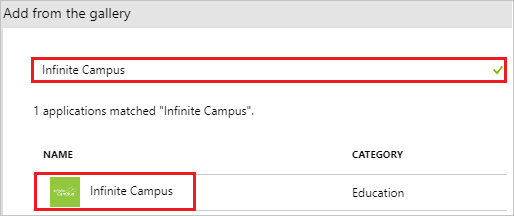
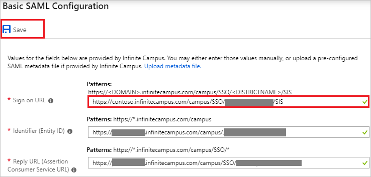
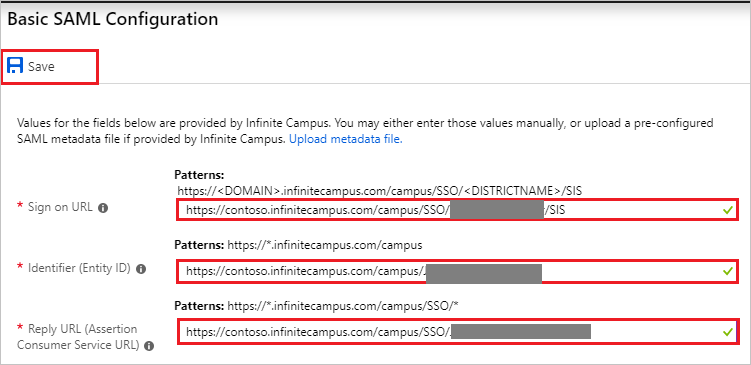
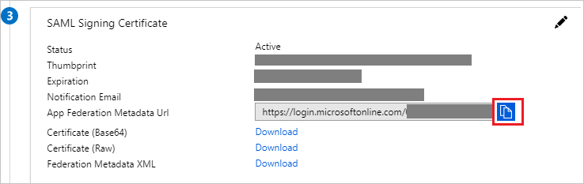
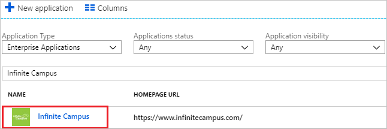

# Tutorial: Azure Active Directory integration with Infinite Campus

In this tutorial, you learn how to integrate Infinite Campus with Azure Active Directory (Azure AD).

Integrating Infinite Campus with Azure AD provides you with the following benefits:

- You can control in Azure AD who has access to Infinite Campus.
- You can enable your users to automatically get signed-on to Infinite Campus (Single Sign-On) with their Azure AD accounts.
- You can manage your accounts in one central location - the Azure portal.

If you want to know more details about SaaS app integration with Azure AD, see [what is application access and single sign-on with Azure Active Directory](../manage-apps/what-is-single-sign-on.md)

## Prerequisites

To configure Azure AD integration with Infinite Campus, you need the following items:

- An Azure AD subscription
- A Infinite Campus single sign-on enabled subscription

> [!NOTE]
> To test the steps in this tutorial, we do not recommend using a production environment.

To test the steps in this tutorial, you should follow these recommendations:

- Do not use your production environment, unless it is necessary.
- If you don't have an Azure AD trial environment, you can [get a one-month trial](https://azure.microsoft.com/pricing/free-trial/).
- At minimum, you need to be an Azure Active Directory administrator to complete the configuration.

## Scenario description

In this tutorial, you test Azure AD single sign-on in a test environment. 
The scenario outlined in this tutorial consists of two main building blocks:

1. Adding Infinite Campus from the gallery
2. Configuring and testing Azure AD single sign-on

## Adding Infinite Campus from the gallery

To configure the integration of Infinite Campus into Azure AD, you need to add Infinite Campus from the gallery to your list of managed SaaS apps.

**To add Infinite Campus from the gallery, perform the following steps:**

1. In the **[Azure portal](https://portal.azure.com)**, on the left navigation panel, click **Azure Active Directory** icon. 

	![The Azure Active Directory button][1]

2. Navigate to **Enterprise applications**. Then go to **All applications**.

	![The Enterprise applications blade][2]

3. To add new application, click **New application** button on the top of dialog.

	![The New application button][3]

4. In the search box, type **Infinite Campus**, select **Infinite Campus** from result panel then click **Add** button to add the application.

	

## Configure and test Azure AD single sign-on

In this section, you configure and test Azure AD single sign-on with Infinite Campus based on a test user called "Britta Simon".

For single sign-on to work, Azure AD needs to know what the counterpart user in Infinite Campus is to a user in Azure AD. In other words, a link relationship between an Azure AD user and the related user in Infinite Campus needs to be established.

To configure and test Azure AD single sign-on with Infinite Campus, you need to complete the following building blocks:

1. **[Configuring Azure AD Single Sign-On](#configuring-azure-ad-single-sign-on)** - to enable your users to use this feature.
2. **[Creating an Azure AD test user](#creating-an-azure-ad-test-user)** - to test Azure AD single sign-on with Britta Simon.
3. **[Creating a Infinite Campus test user](#creating-a-infinite-campus-test-user)** - to have a counterpart of Britta Simon in Infinite Campus that is linked to the Azure AD representation of user.
4. **[Assigning the Azure AD test user](#assigning-the-azure-ad-test-user)** - to enable Britta Simon to use Azure AD single sign-on.
5. **[Testing single sign-on](#testing-single-sign-on)** - to verify whether the configuration works.

### Configuring Azure AD single sign-on

In this section, you enable Azure AD single sign-on in the Azure portal and configure single sign-on in your Infinite Campus application.

**To configure Azure AD single sign-on with Infinite Campus, perform the following steps:**

1. In the Azure portal, on the **Infinite Campus** application integration page, click **Single sign-on**.

	![Configure single sign-on link][4]

2. On the **Select a Single sign-on method** dialog, Click **Select** for **SAML** mode to enable single sign-on.

    

3. On the **Set up Single Sign-On with SAML** page, click **Edit** icon to open **Basic SAML Configuration** dialog.

	

5. On the **Basic SAML Configuration** section, if you have **Service Provider metadata file** (step **11.b**), perform the following steps:

	a. Click **Upload metadata file**.

    

	b. Click on **folder logo** to select the metadata file and click **Upload**.

	_saml.png)

	c. Once the metadata file is successfully uploaded, the **Identifier** and **Reply URL** values get auto populated in **Basic SAML Configuration** section textbox as shown below:

	

	d. In the **Sign-on URL** textbox, type a URL using the following pattern (the domain will vary with Hosting Model): `https://<DOMAIN>.infinitecampus.com/campus/SSO/<DISTRICTNAME>/SIS`

	> [!NOTE]
	> You get the **Service Provider metadata file** on the Infinite Campus SSO Service Provider Configuration page which is explained later in the tutorial.

6. If you dont have **Service Provider metadata file**, perform the following steps:

	a. In the **Sign-on URL** textbox, type a URL using the following pattern: `https://<DOMAIN>.infinitecampus.com/campus/SSO/<DISTRICTNAME>/SIS`

	b. In the **Identifier** textbox, type a URL using the following pattern: `https://<DOMAIN>.infinitecampus.com/campus/<DISTRICTNAME>`

	c. In the **Reply URL** textbox, type a URL using the following pattern: `https://<DOMAIN>.infinitecampus.com/campus/SSO/<DISTRICTNAME>`

	

6. On the **SAML Signing Certificate** page, in the **SAML Signing Certificate** section, click the copy **icon** to copy **App Federation Metadata Url** and paste it into notepad.

	 

7. On the **Set up Infinite Campus** section, use the following values to validate when uploading or utilizing the Azure metadata file/URL.

	a. Login URL

	b. Azure AD Identifier

	c. Logout URL

	

8. In a different web browser window, login to Infinite Campus as a Security Administrator.

9. On the left side of menu, click **System Administration**.

	

10. Navigate to **User Security** > **SAML Management** > **SSO Service Provider Configuration**.

	

11. On the **SSO Service Provider Configuration** page, perform the following steps:

	

	a. Select **Enable SAML Single Sign On**.

	b. Click on **Service Provider Metadata** link  to save the **Service Provider metadata file** on your computer and upload it in **Basic SAML Configuration** section to auto polulate the **Identifier** and **Reply URL** values in Azure portal (refer to step 5).

	c. On the **Select an option to retrieve Identity Provider (IDP) server data** section, select **Metadata URL** and paste the **App Federation Metadata Url** in the textbox and then click on **Sync**.

	d. After clicking **Sync** the values get auto-populated in **SSO Service Provider Configuration** page.

	e. Click **Save**.

### Creating an Azure AD test user

The objective of this section is to create a _single_ test user in the Azure portal called Britta Simon.

1. In the Azure portal, in the left pane, select **Azure Active Directory**, select **Users**, and then select **All users**.

	![Create Azure AD User][100]

2. Select **New user** at the top of the screen.

	 

3. In the User properties, perform the following steps.

	

    a. In the **Name** field, enter **BrittaSimon**.
  
    b. In the **User name** field, type **brittasimon@yourcompanydomain.extension**  
    For example, BrittaSimon@contoso.com

    c. Select **Properties**, select the **Show password** check box, and then write down the value that's displayed in the Password box.

    d. Select **Create**.

### Creating a Infinite Campus test user

Infinite Campus has a demographics centered architecture. Please contact [Infinite Campus support team](mailto:sales@infinitecampus.com) to add the users in the Infinite Campus platform.

### Assigning the Azure AD test user

In this section, you enable Britta Simon to use Azure single sign-on by granting access to Infinite Campus.

1. In the Azure portal, select **Enterprise Applications**, select **All applications**.

	![Assign User][201]

2. In the applications list, select **Infinite Campus**.

	 

3. In the menu on the left, click **Users and groups**.

	![Assign User][202]

4. Click **Add** button. Then select **Users and groups** on **Add Assignment** dialog.

	![Assign User][203]

5. In the **Users and groups** dialog select **Britta Simon** in the Users list, then click the **Select** button at the bottom of the screen.

6. In the **Add Assignment** dialog select the **Assign** button.

### Testing single sign-on

In this section, you test your Azure AD single sign-on configuration using the Access Panel.

When you click the Infinite Campus tile in the Access Panel, you should get automatically signed-on to your Infinite Campus application. If you are logging into the Infinite Camnpus application in the same browser you are administering Azure AD, ensure you are logged into Azure AD as the test user. For more information about the Access Panel, see [Introduction to the Access Panel](../user-help/active-directory-saas-access-panel-introduction.md).

## Additional resources

* [List of Tutorials on How to Integrate SaaS Apps with Azure Active Directory](tutorial-list.md)
* [What is application access and single sign-on with Azure Active Directory?](../manage-apps/what-is-single-sign-on.md)

<!--Image references-->

[1]: common/tutorial_general_01.png
[2]: common/tutorial_general_02.png
[3]: common/tutorial_general_03.png
[4]: common/tutorial_general_04.png

[100]: common/tutorial_general_100.png

[201]: common/tutorial_general_201.png
[202]: common/tutorial_general_202.png
[203]: common/tutorial_general_203.png
