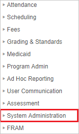
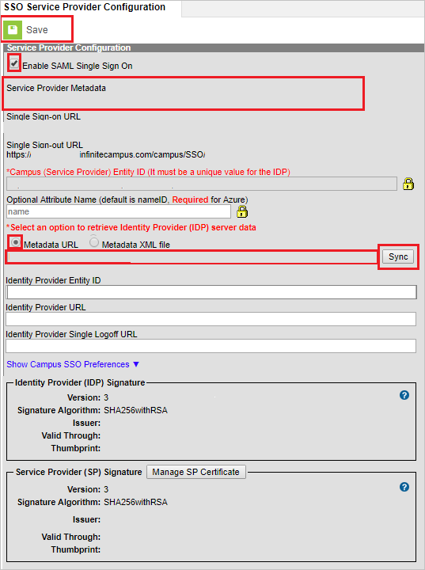

# Tutorial: Azure Active Directory integration with Infinite Campus

In this tutorial, you'll learn how to integrate Infinite Campus with Azure Active Directory (Azure AD). When you integrate Infinite Campus with Azure AD, you can:

* Control in Azure AD who has access to Infinite Campus.
* Enable your users to be automatically signed-in to Infinite Campus with their Azure AD accounts.
* Manage your accounts in one central location - the Azure portal.

## Prerequisites

To configure Azure AD integration with Infinite Campus, you need the following items:

* An Azure AD subscription. If you don't have an Azure AD environment, you can get a [free account](https://azure.microsoft.com/free/).
* Infinite Campus single sign-on enabled subscription.
* At minimum, you need to be an Azure Active Directory administrator, and have a Campus Product Security Role of "Student Information System (SIS)" to complete the configuration.

## Scenario description

In this tutorial, you configure and test Azure AD single sign-on in a test environment.

* Infinite Campus supports **SP** initiated SSO.

## Add Infinite Campus from the gallery

To configure the integration of Infinite Campus into Azure AD, you need to add Infinite Campus from the gallery to your list of managed SaaS apps.

1. Sign in to the Azure portal using either a work or school account, or a personal Microsoft account.
1. On the left navigation pane, select the **Azure Active Directory** service.
1. Navigate to **Enterprise Applications** and then select **All Applications**.
1. To add new application, select **New application**.
1. In the **Add from the gallery** section, type **Infinite Campus** in the search box.
1. Select **Infinite Campus** from results panel and then add the app. Wait a few seconds while the app is added to your tenant.

## Configure and test Azure AD SSO for Infinite Campus

Configure and test Azure AD SSO with Infinite Campus using a test user called **B.Simon**. For SSO to work, you need to establish a link relationship between an Azure AD user and the related user in Infinite Campus.

To configure and test Azure AD SSO with Infinite Campus, perform the following steps:

1. **[Configure Azure AD SSO](#configure-azure-ad-sso)** - to enable your users to use this feature.
    1. **[Create an Azure AD test user](#create-an-azure-ad-test-user)** - to test Azure AD single sign-on with B.Simon.
    1. **[Assign the Azure AD test user](#assign-the-azure-ad-test-user)** - to enable B.Simon to use Azure AD single sign-on.
1. **[Configure Infinite Campus SSO](#configure-infinite-campus-sso)** - to configure the single sign-on settings on application side.
    1. **[Create Infinite Campus test user](#create-infinite-campus-test-user)** - to have a counterpart of B.Simon in Infinite Campus that is linked to the Azure AD representation of user.
1. **[Test SSO](#test-sso)** - to verify whether the configuration works.

## Configure Azure AD SSO

Follow these steps to enable Azure AD SSO in the Azure portal.

1. In the Azure portal, on the **Infinite Campus** application integration page, find the **Manage** section and select **single sign-on**.
1. On the **Select a single sign-on method** page, select **SAML**.
1. On the **Set up single sign-on with SAML** page, click the pencil icon for **Basic SAML Configuration** to edit the settings.

   

4. On the Basic SAML Configuration section, perform the following steps (note that the domain will vary with Hosting Model, but the **FULLY-QUALIFIED-DOMAIN** value must match your Infinite Campus installation):

	a. In the **Sign-on URL** textbox, type a URL using the following pattern: `https://<DOMAIN>.infinitecampus.com/campus/SSO/<DISTRICTNAME>/SIS`

	b. In the **Identifier** textbox, type a URL using the following pattern: `https://<DOMAIN>.infinitecampus.com/campus/<DISTRICTNAME>`

	c. In the **Reply URL** textbox, type a URL using the following pattern: `https://<DOMAIN>.infinitecampus.com/campus/SSO/<DISTRICTNAME>`

5. On the **Set up Single Sign-On with SAML** page, In the **SAML Signing Certificate** section, click copy button to copy **App Federation Metadata Url** and save it on your computer.

	

### Create an Azure AD test user

In this section, you'll create a test user in the Azure portal called B.Simon.

1. From the left pane in the Azure portal, select **Azure Active Directory**, select **Users**, and then select **All users**.
1. Select **New user** at the top of the screen.
1. In the **User** properties, follow these steps:
   1. In the **Name** field, enter `B.Simon`.  
   1. In the **User name** field, enter the username@companydomain.extension. For example, `B.Simon@contoso.com`.
   1. Select the **Show password** check box, and then write down the value that's displayed in the **Password** box.
   1. Click **Create**.

### Assign the Azure AD test user

In this section, you'll enable B.Simon to use Azure single sign-on by granting access to Infinite Campus.

1. In the Azure portal, select **Enterprise Applications**, and then select **All applications**.
1. In the applications list, select **Infinite Campus**.
1. In the app's overview page, find the **Manage** section and select **Users and groups**.
1. Select **Add user**, then select **Users and groups** in the **Add Assignment** dialog.
1. In the **Users and groups** dialog, select **B.Simon** from the Users list, then click the **Select** button at the bottom of the screen.
1. If you are expecting a role to be assigned to the users, you can select it from the **Select a role** dropdown. If no role has been set up for this app, you see "Default Access" role selected.
1. In the **Add Assignment** dialog, click the **Assign** button.

## Configure Infinite Campus SSO

1. In a different web browser window, sign in to Infinite Campus as a Security Administrator.

2. On the left side of menu, click **System Administration**.

	

3. Navigate to **User Security** > **SAML Management** > **SSO Service Provider Configuration**.

	

4. On the **SSO Service Provider Configuration** page, perform the following steps:

	

	a. Select **Enable SAML Single Sign On**.

	b. Edit the **Optional Attribute Name** to contain **name**.

	c. On the **Select an option to retrieve Identity Provider (IDP) server data** section, select **Metadata URL**, paste the **App Federation Metadata Url** value, which you have copied from the Azure portal in the box, and then click **Sync**.

	d. After clicking **Sync** the values get auto-populated in **SSO Service Provider Configuration** page. These values can be verified to match the values seen in Step 4 above.

	e. Click **Save**.

### Create Infinite Campus test user

Infinite Campus has a demographics centered architecture. Please contact [Infinite Campus support team](mailto:sales@infinitecampus.com) to add the users in the Infinite Campus platform.

## Test SSO

In this section, you test your Azure AD single sign-on configuration with following options. 

* Click on **Test this application** in Azure portal. This will redirect to Infinite Campus Sign-on URL where you can initiate the login flow. 

* Go to Infinite Campus Sign-on URL directly and initiate the login flow from there.

* You can use Microsoft My Apps. When you click the Infinite Campus tile in the My Apps, this will redirect to Infinite Campus Sign-on URL. For more information about the My Apps, see [Introduction to the My Apps](../user-help/my-apps-portal-end-user-access.md).

## Next steps

Once you configure Infinite Campus you can enforce session control, which protects exfiltration and infiltration of your organization’s sensitive data in real time. Session control extends from Conditional Access. [Learn how to enforce session control with Microsoft Cloud App Security](/cloud-app-security/proxy-deployment-aad).
