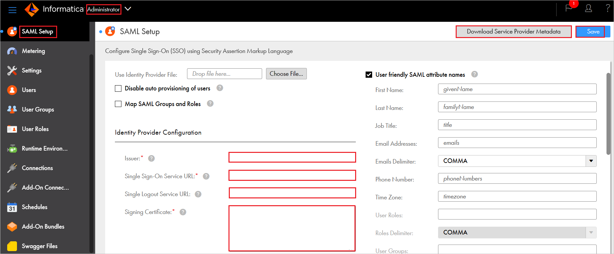

# Azure Active Directory SSO integration with Informatica Intelligent Data Management Cloud

In this article, you'll learn how to integrate Informatica Intelligent Data Management Cloud with Azure Active Directory (Azure AD). It is a SAML SSO Auth application to enable Informatica Intelligent Data Management Cloud on Azure Native Services. When you integrate Informatica Intelligent Data Management Cloud with Azure AD, you can:

* Control in Azure AD who has access to Informatica Intelligent Data Management Cloud.
* Enable your users to be automatically signed-in to Informatica Intelligent Data Management Cloud with their Azure AD accounts.
* Manage your accounts in one central location - the Azure portal.

You'll configure and test Azure AD single sign-on for Informatica Intelligent Data Management Cloud in a test environment. Informatica Intelligent Data Management Cloud supports both **SP** and **IDP** initiated single sign-on and **Just In Time** user provisioning.

## Prerequisites

To integrate Azure Active Directory with Informatica Intelligent Data Management Cloud, you need:

* An Azure AD user account. If you don't already have one, you can [Create an account for free](https://azure.microsoft.com/free/?WT.mc_id=A261C142F).
* One of the following roles: Global Administrator, Cloud Application Administrator, Application Administrator, or owner of the service principal.
* An Azure AD subscription. If you don't have a subscription, you can get a [free account](https://azure.microsoft.com/free/).
* Informatica Intelligent Data Management Cloud single sign-on (SSO) enabled subscription.

## Add application and assign a test user

Before you begin the process of configuring single sign-on, you need to add the Informatica Intelligent Data Management Cloud application from the Azure AD gallery. You need a test user account to assign to the application and test the single sign-on configuration.

### Add Informatica Intelligent Data Management Cloud from the Azure AD gallery

Add Informatica Intelligent Data Management Cloud from the Azure AD application gallery to configure single sign-on with Informatica Intelligent Data Management Cloud. For more information on how to add application from the gallery, see the [Quickstart: Add application from the gallery](../manage-apps/add-application-portal.md).

### Create and assign Azure AD test user

Follow the guidelines in the [create and assign a user account](../manage-apps/add-application-portal-assign-users.md) article to create a test user account in the Azure portal called B.Simon.

Alternatively, you can also use the [Enterprise App Configuration Wizard](https://portal.office.com/AdminPortal/home?Q=Docs#/azureadappintegration). In this wizard, you can add an application to your tenant, add users/groups to the app, and assign roles. The wizard also provides a link to the single sign-on configuration pane in the Azure portal. [Learn more about Microsoft 365 wizards.](/microsoft-365/admin/misc/azure-ad-setup-guides). 

## Configure Azure AD SSO

Complete the following steps to enable Azure AD single sign-on in the Azure portal.

1. In the Azure portal, on the **Informatica Intelligent Data Management Cloud** application integration page, find the **Manage** section and select **single sign-on**.
1. On the **Select a single sign-on method** page, select **SAML**.
1. On the **Set up single sign-on with SAML** page, select the pencil icon for **Basic SAML Configuration** to edit the settings.

   

1. On the **Basic SAML Configuration** section, perform the following steps:

    1. In the **Identifier** textbox, type a URL using the following pattern:
    `https://<ORG_ID>.<REGION>.informaticacloud.com`

    1. In the **Reply URL** textbox, type a URL using the following pattern:
    `https://<REGION>.informaticacloud.com/identity-service/acs/<ORG_ID>`

1. If you wish to configure the application in **SP** initiated mode, then perform the following step:

    In the **Sign on URL** textbox, type a URL using the following pattern:
    `https://<REGION>.informaticacloud.com/ma/sso/<ORG_ID>`

    > [!NOTE]
    > These values are not real. Update these values with the actual Identifier, Reply URL and Sign on URL. Contact [Informatica Intelligent Data Management Cloud support team](mailto:support@informatica.com) to get these values. You can also refer to the patterns shown in the **Basic SAML Configuration** section in the Azure portal.

1. On the **Set-up single sign-on with SAML** page, in the **SAML Signing Certificate** section, find **Certificate (Base64)** and select **Download** to download the certificate and save it on your computer.

    

1. On the **Set up Informatica Intelligent Data Management Cloud** section, copy the appropriate URL(s) based on your requirement.

	

## Configure Informatica Intelligent Data Management Cloud SSO

1. Log in to your Informatica Intelligent Data Management Cloud company site as an administrator.

1. Go to **Administrator** > **SAML Setup** and perform the following steps:

    

    1. In the **Issuer** textbox, paste the **Azure AD Identifier** value, which you have copied from the Azure portal.

    1. In the **Single Sign-On Service URL** textbox, paste the **Login URL**, which you have copied from the Azure portal.

    1. In the **Single Logout Service URL** textbox, paste the **Logout URL**, which you have copied from the Azure portal.

    1. Open the downloaded **Certificate (Base64)** from the Azure portal into Notepad and paste the content into the **Signing Certificate** textbox.

    1. Click **Save** to save the details.

### Create Informatica Intelligent Data Management Cloud test user

In this section, a user called B.Simon is created in Informatica Intelligent Data Management Cloud. Informatica Intelligent Data Management Cloud supports just-in-time user provisioning, which is enabled by default. There's no action item for you in this section. If a user doesn't already exist in Informatica Intelligent Data Management Cloud, a new one is commonly created after authentication.

## Test SSO 

In this section, you test your Azure AD single sign-on configuration with following options. 

#### SP initiated:

* Click on **Test this application** in Azure portal. This will redirect to Informatica Intelligent Data Management Cloud Sign-on URL where you can initiate the login flow.  

* Go to Informatica Intelligent Data Management Cloud Sign-on URL directly and initiate the login flow from there.

#### IDP initiated:

* Click on **Test this application** in Azure portal and you should be automatically signed in to the Informatica Intelligent Data Management Cloud for which you set up the SSO. 

You can also use Microsoft My Apps to test the application in any mode. When you click the Informatica Intelligent Data Management Cloud tile in the My Apps, if configured in SP mode you would be redirected to the application sign-on page for initiating the login flow and if configured in IDP mode, you should be automatically signed in to the Informatica Intelligent Data Management Cloud for which you set up the SSO. For more information about the My Apps, see [Introduction to the My Apps](../user-help/my-apps-portal-end-user-access.md).

## Additional resources

* [What is single sign-on with Azure Active Directory?](../manage-apps/what-is-single-sign-on.md)
* [Plan a single sign-on deployment](../manage-apps/plan-sso-deployment.md).

## Next steps

Once you configure Informatica Intelligent Data Management Cloud you can enforce session control, which protects exfiltration and infiltration of your organization’s sensitive data in real time. Session control extends from Conditional Access. [Learn how to enforce session control with Microsoft Cloud App Security](/cloud-app-security/proxy-deployment-aad).