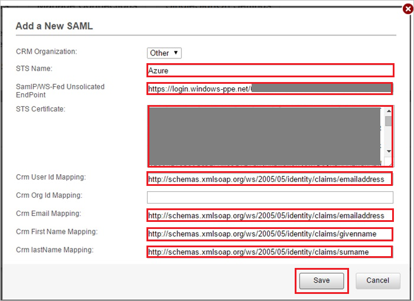

# Tutorial: Azure Active Directory integration with InsideView

In this tutorial, you'll learn how to integrate InsideView with Azure Active Directory (Azure AD).
This integration provides these benefits:

* You can use Azure AD to control who has access to InsideView.
* You can enable your users to be automatically signed in to InsideView (single sign-on) with their Azure AD accounts.
* You can manage your accounts in one central location: the Azure portal.

To learn more about SaaS app integration with Azure AD, see [Single sign-on to applications in Azure Active Directory](https://docs.microsoft.com/azure/active-directory/active-directory-appssoaccess-whatis).

If you don't have an Azure subscription, [create a free account](https://azure.microsoft.com/free/) before you begin.

## Prerequisites

To configure Azure AD integration with InsideView, you need to have:

* An Azure AD subscription. If you don't have an Azure AD environment, you can get a [free account](https://azure.microsoft.com/free/).
* An InsideView subscription that has single sign-on enabled.

## Scenario description

In this tutorial, you'll configure and test Azure AD single sign-on in a test environment.

* InsideView supports IdP-initiated SSO.

## Add InsideView from the gallery

To set up the integration of InsideView into Azure AD, you need to add InsideView from the gallery to your list of managed SaaS apps.

1. In the [Azure portal](https://portal.azure.com), in the left pane, select **Azure Active Directory**:

	

2. Go to **Enterprise applications** > **All applications**:

	

3. To add an application, select **New application** at the top of the window:

	

4. In the search box, enter **InsideView**. Select **InsideView** in the search results and then select **Add**.

	

## Configure and test Azure AD single sign-on

In this section, you'll configure and test Azure AD single sign-on with InsideView by using a test user named Britta Simon.
To enable single sign-on, you need to establish a relationship between an Azure AD user and the corresponding user in InsideView.

To configure and test Azure AD single sign-on with InsideView, you need to complete these steps:

1. **[Configure Azure AD single sign-on](#configure-azure-ad-single-sign-on)** to enable the feature for your users.
2. **[Configure InsideView single sign-on](#configure-insideview-single-sign-on)** on the application side.
3. **[Create an Azure AD test user](#create-an-azure-ad-test-user)** to test Azure AD single sign-on.
4. **[Assign the Azure AD test user](#assign-the-azure-ad-test-user)** to enable Azure AD single sign-on for the user.
5. **[Create an InsideView test user](#create-an-insideview-test-user)** that's linked to the Azure AD representation of the user.
6. **[Test single sign-on](#test-single-sign-on)** to verify that the configuration works.

### Configure Azure AD single sign-on

In this section, you'll enable Azure AD single sign-on in the Azure portal.

To configure Azure AD single sign-on with InsideView, take these steps:

1. In the [Azure portal](https://portal.azure.com/), on the InsideView application integration page, select **Single sign-on**:

    

2. In the **Select a single sign-on method** dialog box, select **SAML/WS-Fed** mode to enable single sign-on:

    

3. On the **Set up Single Sign-On with SAML** page, select the **Edit** icon to open the **Basic SAML Configuration** dialog box:

	

4. In the **Basic SAML Configuration** dialog box, take the following steps.

    

    In the **Reply URL** box, enter a URL in this pattern:

    `https://my.insideview.com/iv/<STS Name>/login.iv`

	> [!NOTE]
	> This value is a placeholder. You need to use the actual reply URL. Contact the [InsideView support team](mailto:support@insideview.com) to get the value. You can also refer to the patterns shown in the **Basic SAML Configuration** dialog box in the Azure portal.

5. On the **Set up Single Sign-On with SAML** page, in the **SAML Signing Certificate** section, select the **Download** link next to **Certificate (Raw)**, per your requirements, and save the certificate on your computer:

	

6. In the **Set up InsideView** section, copy the appropriate URLs, based on your requirements:

	

	1. **Login URL**.

    1. **Azure AD Identifier**.

    1. **Logout URL**.

### Configure InsideView single sign-on

1. In a new web browser window, sign in to your InsideView company site as an admin.

1. At the top of the window, select **Admin**, **SingleSignOn Settings**, and then **Add SAML**.
   
   

1. In the **Add a New SAML** section, take the following steps.

	

	1. In the **STS Name** box, enter a name for your configuration.

	1. In the **SamlP/WS-Fed Unsolicited EndPoint** box, paste the **Login URL** value that you copied from the Azure portal.

	1. Open the Raw certificate that you downloaded from the Azure portal. Copy the contents of the certificate to the clipboard, and then paste the contents into the **STS Certificate** box.

	1. In the **Crm User Id Mapping** box, enter **`http://schemas.xmlsoap.org/ws/2005/05/identity/claims/emailaddress`**.

	1. In the **Crm Email Mapping** box, enter **`http://schemas.xmlsoap.org/ws/2005/05/identity/claims/emailaddress`**.

	1. In the **Crm First Name Mapping** box, enter **`http://schemas.xmlsoap.org/ws/2005/05/identity/claims/givenname`**.

	1. In the **Crm lastName Mapping** box, enter **`http://schemas.xmlsoap.org/ws/2005/05/identity/claims/surname`**.  

	1. Select **Save**.

### Create an Azure AD test user

In this section, you'll create a test user named Britta Simon in the Azure portal.

1. In the Azure portal, select **Azure Active Directory** in the left pane, select **Users**, and then select **All users**:

    

2. Select **New user** at the top of the window:

    

3. In the **User** dialog box, take the following steps.

    

    1. In the **Name** box, enter **BrittaSimon**.
  
    1. In the **User name** box, enter **BrittaSimon@\<yourcompanydomain>.\<extension>**. (For example, BrittaSimon@contoso.com.)

    1. Select **Show Password**, and then write down the value that's in the **Password** box.

    1. Select **Create**.

### Assign the Azure AD test user

In this section, you'll enable Britta Simon to use Azure single sign-on by granting her access to InsideView.

1. In the Azure portal, select **Enterprise applications**, select **All applications**, and then select **InsideView**.

	

2. In the list of applications, select **InsideView**.

	

3. In the left pane, select **Users and groups**:

    

4. Select **Add user**, and then select **Users and groups** in the **Add Assignment** dialog box.

    

5. In the **Users and groups** dialog box, select **Britta Simon** in the users list, and then click the **Select** button at the bottom of the window.

6. If you expect a role value in the SAML assertion, in the **Select Role** dialog box, select the appropriate role for the user from the list. Click the **Select** button at the bottom of the window.

7. In the **Add Assignment** dialog box, select **Assign**.

### Create an InsideView test user

To enable Azure AD users to sign in to InsideView, you need to add them to InsideView. You need to add them manually.

To create users or contacts in InsideView, contact the [InsideView support team](mailto:support@insideview.com).

> [!NOTE]
> You can use any user account creation tool or API provided by InsideView to provision Azure AD user accounts.

### Test single sign-on

Now you need to test your Azure AD single sign-on configuration by using the Access Panel.

When you select the InsideView tile in the Access Panel, you should be automatically signed in to the InsideView instance for which you set up SSO. For more information about the Access Panel, see [Access and use apps on the My Apps portal](https://docs.microsoft.com/azure/active-directory/active-directory-saas-access-panel-introduction).

## Additional resources

- [Tutorials for integrating SaaS applications with Azure Active Directory](https://docs.microsoft.com/azure/active-directory/active-directory-saas-tutorial-list)

- [What is application access and single sign-on with Azure Active Directory?](https://docs.microsoft.com/azure/active-directory/active-directory-appssoaccess-whatis)

- [What is Conditional Access in Azure Active Directory?](https://docs.microsoft.com/azure/active-directory/conditional-access/overview)
