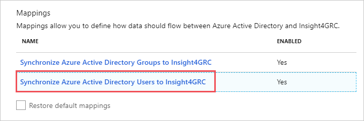
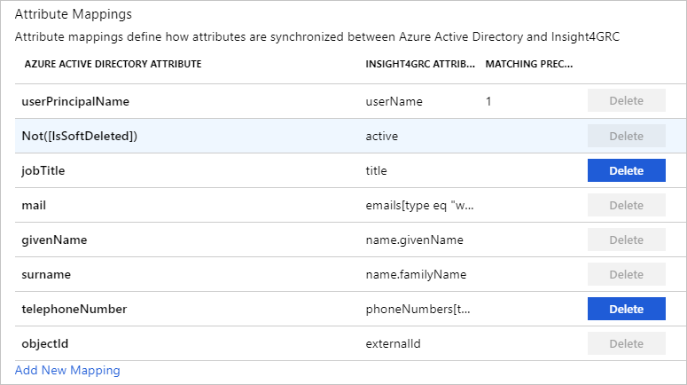
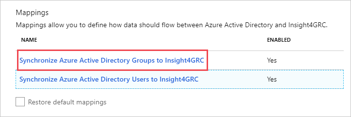
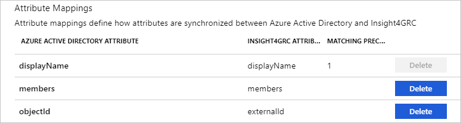

# Tutorial: Configure Insight4GRC  for automatic user provisioning

The objective of this tutorial is to demonstrate the steps to be performed in Insight4GRC  and Azure Active Directory (Azure AD) to configure Azure AD to automatically provision and de-provision users and/or groups to Insight4GRC.

> [!NOTE]
> This tutorial describes a connector built on top of the Azure AD User Provisioning Service. For important details on what this service does, how it works, and frequently asked questions, see [Automate user provisioning and deprovisioning to SaaS applications with Azure Active Directory](../manage-apps/user-provisioning.md).
>
> This connector is currently in Public Preview. For more information on the general Microsoft Azure terms of use for Preview features, see [Supplemental Terms of Use for Microsoft Azure Previews](https://azure.microsoft.com/support/legal/preview-supplemental-terms/).

## Prerequisites

The scenario outlined in this tutorial assumes that you already have the following prerequisites:

* An Azure AD tenant.
* [A Insight4GRC  tenant](https://www.rsmuk.com/).
* A user account in Insight4GRC with Admin permissions.

## Assigning users to Insight4GRC 

Azure Active Directory uses a concept called *assignments* to determine which users should receive access to selected apps. In the context of automatic user provisioning, only the users and/or groups that have been assigned to an application in Azure AD are synchronized.

Before configuring and enabling automatic user provisioning, you should decide which users and/or groups in Azure AD need access to Insight4GRC. Once decided, you can assign these users and/or groups to Insight4GRC  by following the instructions here:

* [Assign a user or group to an enterprise app](../manage-apps/assign-user-or-group-access-portal.md)

## Important tips for assigning users to Insight4GRC 

* It is recommended that a single Azure AD user is assigned to Insight4GRC  to test the automatic user provisioning configuration. Additional users and/or groups may be assigned later.

* When assigning a user to Insight4GRC, you must select any valid application-specific role (if available) in the assignment dialog. Users with the **Default Access** role are excluded from provisioning.

## Setup Insight4GRC for provisioning

Before configuring Insight4GRC for automatic user provisioning with Azure AD, you will need to enable SCIM provisioning on Insight4GRC.

1. To obtain the bearer token, end-customer needs to contact [support team](mailto:support.ss@rsmuk.com) and they will provide the bearer token to the customers.

2. To obtain the SCIM endpoint URL, you will need to have your Insight4GRC domain name ready as it will be used to construct your SCIM endpoint URL. You can retrieve your Insight4GRC domain name as part of the initial software purchase with Insight4GRC.

## Add Insight4GRC  from the gallery

To configure Insight4GRC for automatic user provisioning with Azure AD, you need to add Insight4GRC from the Azure AD application gallery to your list of managed SaaS applications.

**To add Insight4GRC  from the Azure AD application gallery, perform the following steps:**

1. In the **[Azure portal](https://portal.azure.com)**, in the left navigation panel, select **Azure Active Directory**.

	

2. Go to **Enterprise applications**, and then select **All applications**.

	

3. To add a new application, select the **New application** button at the top of the pane.

	

4. In the search box, enter **Insight4GRC**, select **Insight4GRC** in the results panel, and then click the **Add** button to add the application.

	

## Configuring automatic user provisioning to Insight4GRC  

This section guides you through the steps to configure the Azure AD provisioning service to create, update, and disable users and/or groups in Insight4GRC  based on user and/or group assignments in Azure AD.

> [!TIP]
> You may also choose to enable SAML-based single sign-on for Insight4GRC  , following the instructions provided in the [Insight4GRC-Single sign-on tutorial](insight4grc-tutorial.md). Single sign-on can be configured independently of automatic user provisioning, though these two features compliment each other.

### To configure automatic user provisioning for Insight4GRC  in Azure AD:

1. Sign in to the [Azure portal](https://portal.azure.com). Select **Enterprise Applications**, then select **All applications**.

	

2. In the applications list, select **Insight4GRC**.

	

3. Select the **Provisioning** tab.

	

4. Set the **Provisioning Mode** to **Automatic**.

	

5.	Under the Admin Credentials section, input `https://{Insight4GRC Domain Name}.insight4grc.com/public/api/scim/v2` in **Tenant URL** using the {Insight4GRC Domain Name} value that was retrieved earlier. Enter the **Token value** retrieved earlier into **Secret Token**. Click **Test Connection** to ensure Azure AD can connect to Insight4GRC. If the connection fails, ensure your Insight4GRC account has Admin permissions and try again.

	

6. In the **Notification Email** field, enter the email address of a person or group who should receive the provisioning error notifications and check the checkbox - **Send an email notification when a failure occurs**.

	

7. Click **Save**.

8. Under the **Mappings** section, select **Synchronize Azure Active Directory Users to Insight4GRC**.

	

9. Review the user attributes that are synchronized from Azure AD to Insight4GRC  in the **Attribute Mapping** section. The attributes selected as **Matching** properties are used to match the user accounts in Insight4GRC  for update operations. Select the **Save** button to commit any changes.

	

10. Under the **Mappings** section, select **Synchronize Azure Active Directory Group to Insight4GRC**

	

11. Review the group attributes that are synchronized from Azure AD to Insight4GRC in the **Attribute Mapping** section. The attributes selected as **Matching** properties are used to match the group accounts in Insight4GRC for update operations. Select the **Save** button to commit any changes.

	

10. To configure scoping filters, refer to the following instructions provided in the [Scoping filter tutorial](../manage-apps/define-conditional-rules-for-provisioning-user-accounts.md).

11. To enable the Azure AD provisioning service for Insight4GRC, change the **Provisioning Status** to **On** in the **Settings** section.

	

12. Define the users and/or groups that you would like to provision to Insight4GRC  by choosing the desired values in **Scope** in the **Settings** section.

	

15. When you are ready to provision, click **Save**.

	

This operation starts the initial synchronization of all users and/or groups defined in **Scope** in the **Settings** section. The initial sync takes longer to perform than subsequent syncs, which occur approximately every 40 minutes as long as the Azure AD provisioning service is running. You can use the **Synchronization Details** section to monitor progress and follow links to provisioning activity report, which describes all actions performed by the Azure AD provisioning service on Insight4GRC .

For more information on how to read the Azure AD provisioning logs, see [Reporting on automatic user account provisioning](../manage-apps/check-status-user-account-provisioning.md).

## Additional resources

* [Managing user account provisioning for Enterprise Apps](../manage-apps/configure-automatic-user-provisioning-portal.md).
* [What is application access and single sign-on with Azure Active Directory?](../manage-apps/what-is-single-sign-on.md)

## Next steps

* [Learn how to review logs and get reports on provisioning activity](../manage-apps/check-status-user-account-provisioning.md).