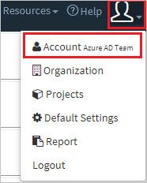
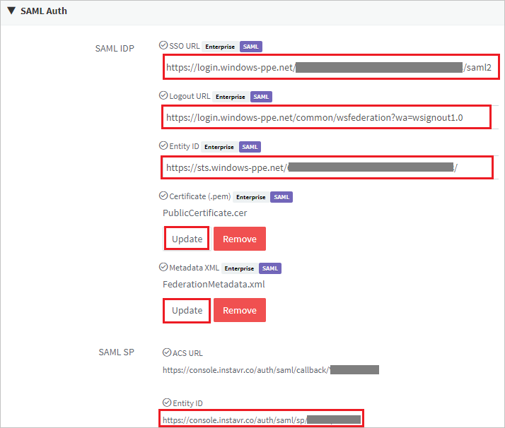
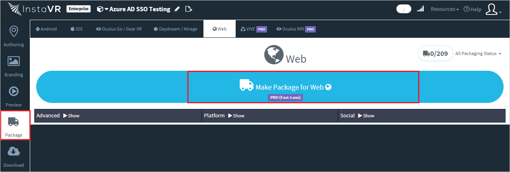

# Tutorial: Microsoft Entra integration with InstaVR Viewer

In this tutorial, you learn how to integrate InstaVR Viewer with Microsoft Entra ID.
Integrating InstaVR Viewer with Microsoft Entra ID provides you with the following benefits:

* You can control in Microsoft Entra ID who has access to InstaVR Viewer.
* You can enable your users to be automatically signed-in to InstaVR Viewer (Single Sign-On) with their Microsoft Entra accounts.
* You can manage your accounts in one central location.

If you want to know more details about SaaS app integration with Microsoft Entra ID, see [What is application access and single sign-on with Microsoft Entra ID](../manage-apps/what-is-single-sign-on.md).
If you don't have an Azure subscription, [create a free account](https://azure.microsoft.com/free/) before you begin.

## Prerequisites

To configure Microsoft Entra integration with InstaVR Viewer, you need the following items:

* A Microsoft Entra subscription. If you don't have a Microsoft Entra environment, you can get one-month trial [here](https://azure.microsoft.com/pricing/free-trial/)
* InstaVR Viewer single sign-on enabled subscription

## Scenario description

In this tutorial, you configure and test Microsoft Entra single sign-on in a test environment.

* InstaVR Viewer supports **SP** initiated SSO
* InstaVR Viewer supports **Just In Time** user provisioning

## Adding InstaVR Viewer from the gallery

To configure the integration of InstaVR Viewer into Microsoft Entra ID, you need to add InstaVR Viewer from the gallery to your list of managed SaaS apps.

**To add InstaVR Viewer from the gallery, perform the following steps:**

1. Sign in to the [Microsoft Entra admin center](https://entra.microsoft.com) as at least a [Cloud Application Administrator](../roles/permissions-reference.md#cloud-application-administrator).
1. Browse to **Identity** > **Applications** > **Enterprise applications** > **New application**.
1. In the search box, type **InstaVR Viewer**, select **InstaVR Viewer** from result panel then click **Add** button to add the application.

	 

## Configure and test Microsoft Entra single sign-on

In this section, you configure and test Microsoft Entra single sign-on with InstaVR Viewer based on a test user called **Britta Simon**.
For single sign-on to work, a link relationship between a Microsoft Entra user and the related user in InstaVR Viewer needs to be established.

To configure and test Microsoft Entra single sign-on with InstaVR Viewer, you need to complete the following building blocks:

1. **[Configure Microsoft Entra Single Sign-On](#configure-azure-ad-single-sign-on)** - to enable your users to use this feature.
2. **[Configure InstaVR Viewer Single Sign-On](#configure-instavr-viewer-single-sign-on)** - to configure the Single Sign-On settings on application side.
3. **[Create a Microsoft Entra test user](#create-an-azure-ad-test-user)** - to test Microsoft Entra single sign-on with Britta Simon.
4. **[Assign the Microsoft Entra test user](#assign-the-azure-ad-test-user)** - to enable Britta Simon to use Microsoft Entra single sign-on.
5. **[Create InstaVR Viewer test user](#create-instavr-viewer-test-user)** - to have a counterpart of Britta Simon in InstaVR Viewer that is linked to the Microsoft Entra representation of user.
6. **[Test single sign-on](#test-single-sign-on)** - to verify whether the configuration works.

### Configure Microsoft Entra single sign-on

In this section, you enable Microsoft Entra single sign-on.

To configure Microsoft Entra single sign-on with InstaVR Viewer, perform the following steps:

1. Sign in to the [Microsoft Entra admin center](https://entra.microsoft.com) as at least a [Cloud Application Administrator](../roles/permissions-reference.md#cloud-application-administrator).
1. Browse to **Identity** > **Applications** > **Enterprise applications** > **InstaVR Viewer** application integration page, select **Single sign-on**.

    

1. On the **Select a Single sign-on method** dialog, select **SAML/WS-Fed** mode to enable single sign-on.

    

1. On the **Set up Single Sign-On with SAML** page, click **Edit** icon to open **Basic SAML Configuration** dialog.

	

1. On the **Basic SAML Configuration** section, perform the following steps:

    

	a. In the **Sign on URL** text box, type a URL using the following pattern:
    `https://console.instavr.co/auth/saml/login/<WEBPackagedURL>`

	> [!NOTE]
	> There is no fixed pattern for Sign on URL. It is generated when the InstaVR Viewer customer does web packaging. It is unique for every customer and package. For getting the exact Sign on URL you need to login to your InstaVR Viewer instance and do web packaging.

    b. In the **Identifier (Entity ID)** text box, type a URL using the following pattern:
	`https://console.instavr.co/auth/saml/sp/<WEBPackagedURL>`

	> [!NOTE]
	> The Identifier value is not real. Update this value with the actual Identifier value which is explained later in this tutorial.

1. On the **Set up Single Sign-On with SAML** page, in the **SAML Signing Certificate** section, click **Download** to download the **Certificate (Base64)** and **Federation Metadata File** from the given options as per your requirement and save it on your computer.

	

6. On the **Set up InstaVR Viewer** section, copy the appropriate URL(s) as per your requirement.

	

	a. Login URL

	b. Microsoft Entra Identifier

	c. Logout URL

### Configure InstaVR Viewer Single Sign-On

1. Open a new web browser window and log into your InstaVR Viewer company site as an administrator.

2. Click on **User Icon** and select **Account**.

	

3. Scroll down to the **SAML Auth** and perform the following steps:

	

	a. In the **SSO URL** textbox, paste the **Login URL** value, which you copied previously.

	b. In the **Logout URL** textbox, paste the **Logout URL** value, which you copied previously.

	c. In the **Entity ID** textbox, paste the **Microsoft Entra Identifier** value, which you copied previously.

	d. To upload your downloaded Certificate file, click **Update**.

	e. To upload your downloaded Federation Metadata file, click **Update**.

	f. Copy the **Entity ID** value and paste into the **Identifier (Entity ID)** text box on the **Basic SAML Configuration** section.

### Create a Microsoft Entra test user

The objective of this section is to create a test user called Britta Simon.

1. Sign in to the [Microsoft Entra admin center](https://entra.microsoft.com) as at least a [User Administrator](../roles/permissions-reference.md#user-administrator).
1. Browse to **Identity** > **Users** > **All users**.
1. Select **New user** > **Create new user**, at the top of the screen.
1. In the **User** properties, follow these steps:
   1. In the **Display name** field, enter `B.Simon`.  
   1. In the **User principal name** field, enter the username@companydomain.extension. For example, `B.Simon@contoso.com`.
   1. Select the **Show password** check box, and then write down the value that's displayed in the **Password** box.
   1. Select **Review + create**.
1. Select **Create**.

### Assign the Microsoft Entra test user

In this section, you enable Britta Simon to use Azure single sign-on by granting access to InstaVR Viewer.

1. Sign in to the [Microsoft Entra admin center](https://entra.microsoft.com) as at least a [Cloud Application Administrator](../roles/permissions-reference.md#cloud-application-administrator).
1. Browse to **Identity** > **Applications** > **Enterprise applications** > **InstaVR Viewer**.

	

2. In the applications list, type and select **InstaVR Viewer**.

	

1. In the app's overview page, select **Users and groups**.
1. Select **Add user/group**, then select **Users and groups** in the **Add Assignment** dialog.
   1. In the **Users and groups** dialog, select **B.Simon** from the Users list, then click the **Select** button at the bottom of the screen.
   1. If you are expecting a role to be assigned to the users, you can select it from the **Select a role** dropdown. If no role has been set up for this app, you see "Default Access" role selected.
   1. In the **Add Assignment** dialog, click the **Assign** button.

### Create InstaVR Viewer test user

In this section, a user called Britta Simon is created in InstaVR Viewer. InstaVR Viewer supports just-in-time user provisioning, which is enabled by default. There is no action item for you in this section. If a user doesn't already exist in InstaVR Viewer, a new one is created after authentication. If you face any problems, please contact to [InstaVR Viewer support team](mailto:contact@instavr.co).

### Test single sign-on

1. Open a new web browser window and log into your InstaVR Viewer company site as an administrator.

2. Select **Package** from the left navigation panel and select **Make package for Web**.

	

3. Select **Download**.

	

4. Select **Open Hosted Page** after that it will be redirected to Microsoft Entra ID for login.

	

5. Enter your Microsoft Entra credentials to successfully login to the Microsoft Entra ID via SSO.

## Additional Resources

- [List of Tutorials on How to Integrate SaaS Apps with Microsoft Entra ID](./tutorial-list.md)

- [What is application access and single sign-on with Microsoft Entra ID?](../manage-apps/what-is-single-sign-on.md)

- [What is Conditional Access in Microsoft Entra ID?](../conditional-access/overview.md)
