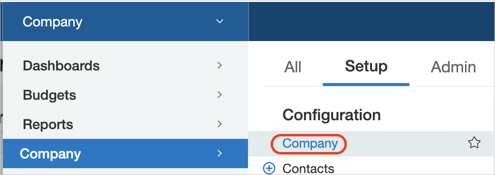
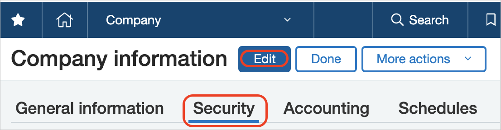
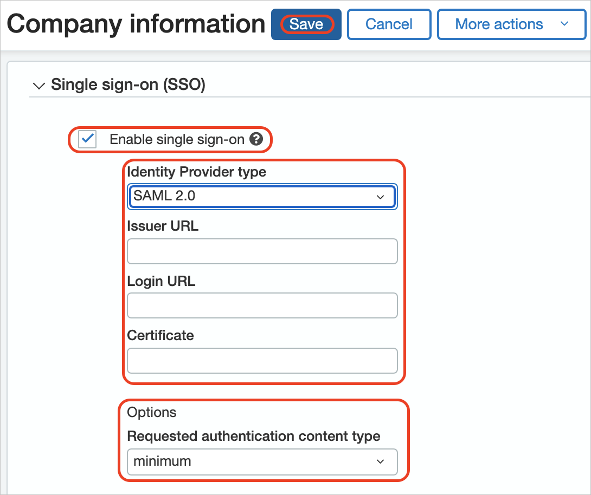
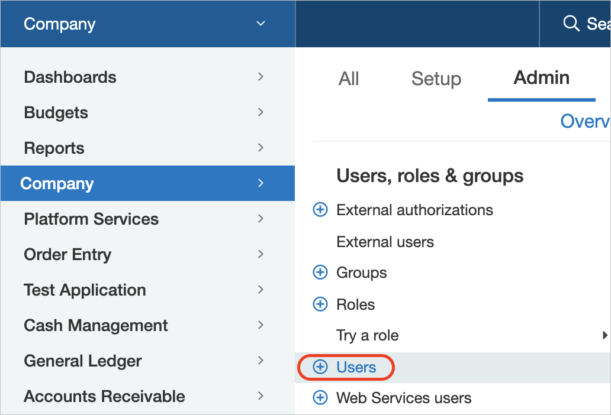
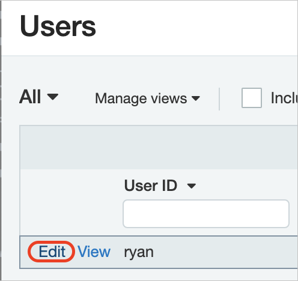
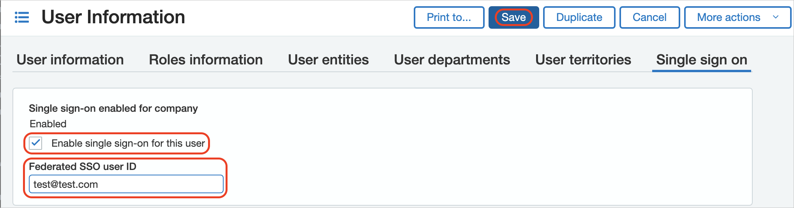

# Tutorial: Azure AD SSO integration with Sage Intacct

In this tutorial, you'll learn how to integrate Sage Intacct with Azure Active Directory (Azure AD). When you integrate Sage Intacct with Azure AD, you can:

* Control in Azure AD who has access to Sage Intacct.
* Enable your users to be automatically signed-in to Sage Intacct with their Azure AD accounts.
* Manage your accounts in one central location - the Azure portal.

## Prerequisites

To get started, you need the following items:

* An Azure AD subscription. If you don't have a subscription, you can get a [free account](https://azure.microsoft.com/free/).
* Sage Intacct single sign-on (SSO) enabled subscription.

## Scenario description

In this tutorial, you configure and test Azure AD SSO in a test environment.

* Sage Intacct supports **IDP** initiated SSO.

> [!NOTE]
> Identifier of this application is a fixed string value so only one instance can be configured in one tenant.

## Add Sage Intacct from the gallery

To configure the integration of Sage Intacct into Azure AD, you need to add Sage Intacct from the gallery to your list of managed SaaS apps.

1. Sign in to the Azure portal using either a work or school account, or a personal Microsoft account.
1. On the left navigation pane, select the **Azure Active Directory** service.
1. Navigate to **Enterprise Applications** and then select **All Applications**.
1. To add new application, select **New application**.
1. In the **Add from the gallery** section, type **Sage Intacct** in the search box.
1. Select **Sage Intacct** from results panel and then add the app. Wait a few seconds while the app is added to your tenant.

 Alternatively, you can also use the [Enterprise App Configuration Wizard](https://portal.office.com/AdminPortal/home?Q=Docs#/azureadappintegration). In this wizard, you can add an application to your tenant, add users/groups to the app, assign roles, as well as walk through the SSO configuration as well. [Learn more about Microsoft 365 wizards.](/microsoft-365/admin/misc/azure-ad-setup-guides)

## Configure and test Azure AD SSO for Sage Intacct

Configure and test Azure AD SSO with Sage Intacct using a test user called **B.Simon**. For SSO to work, you need to establish a link relationship between an Azure AD user and the related user in Sage Intacct.

To configure and test Azure AD SSO with Sage Intacct, perform the following steps:

1. **[Configure Azure AD SSO](#configure-azure-ad-sso)** - to enable your users to use this feature.
    1. **[Assign the Azure AD test user](#assign-the-azure-ad-test-user)** - to enable B.Simon to use Azure AD single sign-on.
    1. **[Create an Azure AD test user](#create-an-azure-ad-test-user)** - to test Azure AD single sign-on with B.Simon.
2. **[Configure Sage Intacct SSO](#configure-sage-intacct-sso)** - to configure the single sign-on settings on application side.
    1. **[Set up individual users in Intacct](#set-up-individual-users-in-intacct)** - to have a counterpart of B.Simon in Sage Intacct that is linked to the Azure AD representation of user.
6. **[Test SSO](#test-sso)** - to verify whether the configuration works.

## Configure Azure AD SSO

Follow these steps to enable Azure AD SSO in the Azure portal.

1. In the Azure portal, on the **Sage Intacct** application integration page, find the **Manage** section and select **Single sign-on**.
1. On the **Select a Single sign-on method** page, select **SAML**.
1. On the **Set up Single Sign-On with SAML** page, click the pencil icon for **Basic SAML Configuration** to edit the settings.

   

1. On the **Basic SAML Configuration** section, perform the following steps:

	a. In the **Identifier (Entity ID)** text box, type a unique identifier for your Sage Intacct company, such as `https://saml.intacct.com`.

	b. In the **Reply URL** text box, add the following URLs:  

	| Reply URL |
	| ------------- |
	| `https://www.intacct.com/ia/acct/sso_response.phtml` (Select as the default.) |
	| `https://www-p02.intacct.com/ia/acct/sso_response.phtml` |  
	| `https://www-p03.intacct.com/ia/acct/sso_response.phtml` | 
	| `https://www-p04.intacct.com/ia/acct/sso_response.phtml` |  
	| `https://www-p05.intacct.com/ia/acct/sso_response.phtml` |
	

1. The Sage Intacct application expects the SAML assertions in a specific format, which requires you to add custom attribute mappings to your SAML token attributes configuration. The following screenshot shows the list of default attributes. Click **Edit** icon to open User Attributes dialog.

	

1. In the **Attributes & Claims** dialog, perform the following steps:

	a. Edit **Unique User Identifier (Name ID)** and set source attribute to user.mail and verify Name identifier format is set to Email address and click **Save**
	
	b. Remove all default Additional claims attributes by clicking ***...*** and Delete.
    
	| Attribute Name  |  Source Attribute|
	| ---------------| --------------- |
	| Company Name | **Sage Intacct Company ID** |
	| name | `<User ID>`|

    > [!NOTE]
    > Enter the `<User ID>` value should be same as the Sage Intacct **User ID**, which you enter in the **[Set up individual users in Intacct](#set-up-individual-users-in-intacct)**, which is explained later in the tutorial. Usually, this is the prefix of the email address. In this case, you can set the source as a transformation and use ExtractMailPrefix() on user.mail parameter.

	c. Click **Add new claim** to open the **Manage user claims** dialog.

	d. In the **Name** textbox, type the attribute name shown for that row.

	e. Leave the **Namespace** blank.

	f. Select Source as **Attribute**.

	g. From the **Source attribute** list, type or select the attribute value shown for that row.

	h. Click **Ok**

	i. Click **Save**.
	
    > Repeat steps c-i to add both custom attributes.
	

1. On the **Set up Single Sign-On with SAML** page, in the **SAML Signing Certificate** section, click **Edit** to open the dialog. Click **...** next to the Active certificate and select **PEM certificate download** to download the certificate and save it to your local drive.

	

1. On the **Set up Sage Intacct** section, copy the Login URL as you will use it within Sage Intacct configuration.

	

### Create an Azure AD test user

In this section, you'll create a test user in the Azure portal called B.Simon.

1. From the left pane in the Azure portal, select **Azure Active Directory**, select **Users**, and then select **All users**.
1. Select **New user** at the top of the screen.
1. In the **User** properties, follow these steps:
   1. In the **Name** field, enter `B.Simon`.  
   1. In the **User name** field, enter the username@companydomain.extension. For example, `B.Simon@contoso.com`.
   1. Select the **Show password** check box, and then write down the value that's displayed in the **Password** box.
   1. Click **Create**.

### Assign the Azure AD test user

In this section, you'll enable B.Simon to use Azure single sign-on by granting access to Sage Intacct.

1. In the Azure portal, select **Enterprise Applications**, and then select **All applications**.
1. In the applications list, select **Sage Intacct**.
1. In the app's overview page, find the **Manage** section and select **Users and groups**.
1. Select **Add user**, then select **Users and groups** in the **Add Assignment** dialog.
1. In the **Users and groups** dialog, select **B.Simon** from the Users list, then click the **Select** button at the bottom of the screen.
1. If you are expecting a role to be assigned to the users, you can select it from the **Select a role** dropdown. If no role has been set up for this app, you see "Default Access" role selected.
1. In the **Add Assignment** dialog, click the **Assign** button.

## Configure Sage Intacct SSO

1. In a different web browser window, sign in to your Sage Intacct company site as an administrator.

1. Go to **Company**, click the **Setup** tab, and click **Company** under the Configuration section.

    

1. Click the **Security** tab, and then click **Edit**.

    

1. In the **Single sign on (SSO)** section, perform the following steps:

    

    a. Select **Enable single sign on**.

    b. As **Identity provider type**, select **SAML 2.0**.

    c. In **Issuer URL** textbox, paste the value of **Identifier (Entity ID)**, which you created in the Basic SAML Configuration dialog.

    d. In **Login URL** textbox, paste the value of **Login URL**, which you have copied from Azure portal.

    e. Open your **PEM** encoded certificate in notepad, copy the content of it into your clipboard, and then paste it to the **Certificate** box.
    
    f. Set **Requested authentication content type** to **Exact**.

    g. Click **Save**.

### Set up individual users in Intacct

When SSO is enabled for your company, you can individually require users to use SSO when logging in to your company. After you set up a user for SSO, the user will no longer be able to use a password to log in to your company directly. Instead, that user will need to use single sign-on and be authenticated by your SSO identity provider as an authorized user. Any users who are not set up for SSO can continue to log in to your company using the basic sign-in page.

**To enable SSO for a user, perform the following steps:**

1. Sign in to your **Sage Intacct** company.

1. Go to **Company**, click the **Admin** tab, then click **Users**.

    

1. Locate the desired user and click **Edit** next to it.

    

1. Click the **Single sign-on** tab and type the **Federated SSO user ID**. 

> [!NOTE] 
> This value is mapped with the Unique User Identifier found in Azure's Attributes & Claims dialog.

> [!NOTE]
> To provision Azure AD user accounts, you can use other Sage Intacct user account creation tools or APIs that are provided by Sage Intacct.

## Test SSO

In this section, you test your Azure AD single sign-on configuration with following options.

* Click on Test this application in Azure portal and you should be automatically signed in to the Sage Intacct for which you set up the SSO.

* You can use Microsoft My Apps. When you click the Sage Intacct tile in the My Apps, you should be automatically signed in to the Sage Intacct for which you set up the SSO. For more information about the My Apps, see [Introduction to the My Apps](https://support.microsoft.com/account-billing/sign-in-and-start-apps-from-the-my-apps-portal-2f3b1bae-0e5a-4a86-a33e-876fbd2a4510).

## Next steps

Once you configure Sage Intacct you can enforce session control, which protects exfiltration and infiltration of your organization’s sensitive data in real time. Session control extends from Conditional Access. [Learn how to enforce session control with Microsoft Defender for Cloud Apps](/cloud-app-security/proxy-deployment-any-app).
