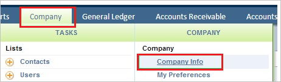
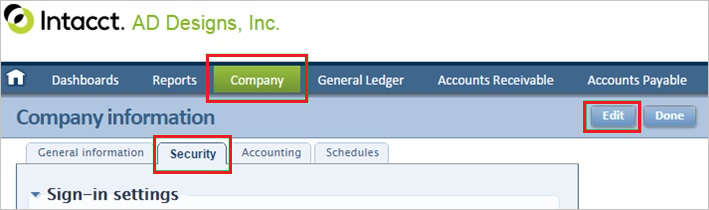
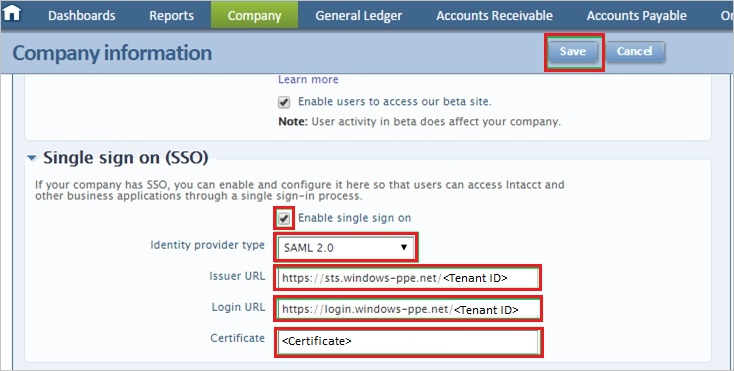
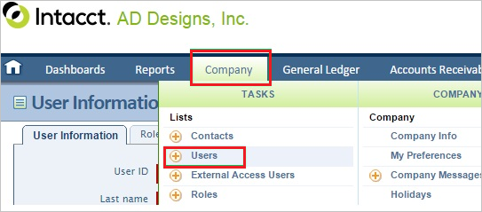
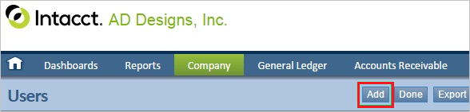
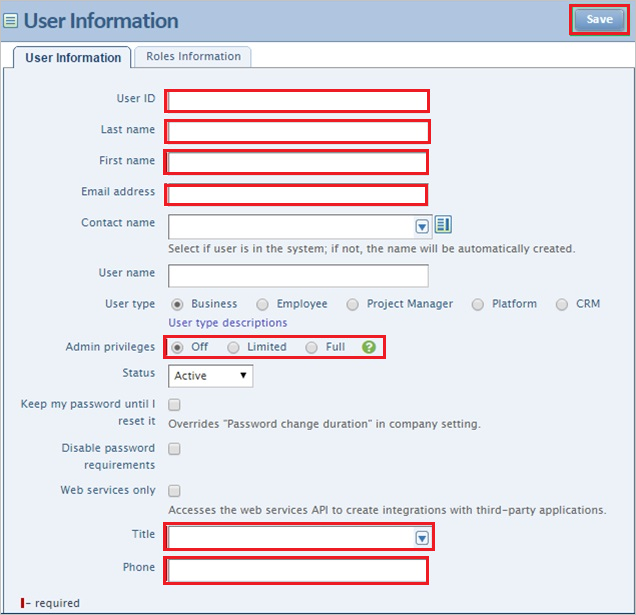
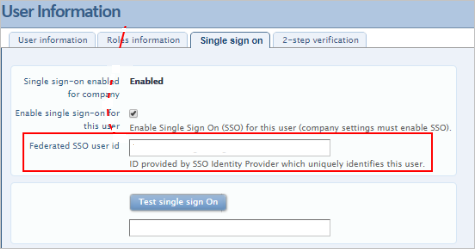

# Tutorial: Integrate Sage Intacct with Azure Active Directory

In this tutorial, you'll learn how to integrate Sage Intacct with Azure Active Directory (Azure AD). When you integrate Sage Intacct with Azure AD, you can:

* Control in Azure AD who has access to Sage Intacct.
* Enable your users to be automatically signed-in to Sage Intacct with their Azure AD accounts.
* Manage your accounts in one central location - the Azure portal.

To learn more about SaaS app integration with Azure AD, see [What is application access and single sign-on with Azure Active Directory](https://docs.microsoft.com/azure/active-directory/active-directory-appssoaccess-whatis).

## Prerequisites

To get started, you need the following items:

* An Azure AD subscription. If you don't have a subscription, you can get a [free account](https://azure.microsoft.com/free/).
* Sage Intacct single sign-on (SSO) enabled subscription.

## Scenario description

In this tutorial, you configure and test Azure AD SSO in a test environment.

* Sage Intacct supports **IDP** initiated SSO

## Adding Sage Intacct from the gallery

To configure the integration of Sage Intacct into Azure AD, you need to add Sage Intacct from the gallery to your list of managed SaaS apps.

1. Sign in to the [Azure portal](https://portal.azure.com) using either a work or school account, or a personal Microsoft account.
1. On the left navigation pane, select the **Azure Active Directory** service.
1. Navigate to **Enterprise Applications** and then select **All Applications**.
1. To add new application, select **New application**.
1. In the **Add from the gallery** section, type **Sage Intacct** in the search box.
1. Select **Sage Intacct** from results panel and then add the app. Wait a few seconds while the app is added to your tenant.

## Configure and test Azure AD single sign-on for Sage Intacct

Configure and test Azure AD SSO with Sage Intacct using a test user called **B.Simon**. For SSO to work, you need to establish a link relationship between an Azure AD user and the related user in Sage Intacct.

To configure and test Azure AD SSO with Sage Intacct, complete the following building blocks:

1. **[Configure Azure AD SSO](#configure-azure-ad-sso)** - to enable your users to use this feature.
    1. **[Assign the Azure AD test user](#assign-the-azure-ad-test-user)** - to enable B.Simon to use Azure AD single sign-on.
    1. **[Create an Azure AD test user](#create-an-azure-ad-test-user)** - to test Azure AD single sign-on with B.Simon.
2. **[Configure Sage Intacct SSO](#configure-sage-intacct-sso)** - to configure the Single Sign-On settings on application side.
    1. **[Create Sage Intacct test user](#create-sage-intacct-test-user)** - to have a counterpart of B.Simon in Sage Intacct that is linked to the Azure AD representation of user.
6. **[Test SSO](#test-sso)** - to verify whether the configuration works.

### Configure Azure AD SSO

Follow these steps to enable Azure AD SSO in the Azure portal.

1. In the [Azure portal](https://portal.azure.com/), on the **Sage Intacct** application integration page, find the **Manage** section and select **Single sign-on**.
1. On the **Select a Single sign-on method** page, select **SAML**.
1. On the **Set up Single Sign-On with SAML** page, click the edit/pen icon for **Basic SAML Configuration** to edit the settings.

   

1. On the **Basic SAML Configuration** section, enter the values for the following fields:

    In the **Reply URL** text box, type a URL:
    `https://www.intacct.com/ia/acct/sso_response.phtml`

1. Sage Intacct application expects the SAML assertions in a specific format, which requires you to add custom attribute mappings to your SAML token attributes configuration. The following screenshot shows the list of default attributes. Click **Edit** icon to open User Attributes dialog..

	

1. In addition to above, Sage Intacct application expects few more attributes to be passed back in SAML response. In the **User Attributes & Claims** dialog, perform the following steps to add SAML token attribute as shown in the below table:

	| Attribute Name  |  Source Attribute|
	| ---------------| --------------- |
	| Company Name | **Sage Intacct Company ID** |
	| name | Value should be same as the Sage Intacct **User ID**, which you enter in the **Create Sage Intacct test user section**, which is explained later in the tutorial |

	a. Click **Add new claim** to open the **Manage user claims** dialog.

	b. In the **Name** textbox, type the attribute name shown for that row.

	c. Leave the **Namespace** blank.

	d. Select Source as **Attribute**.

	e. From the **Source attribute** list, type or select the attribute value shown for that row.

	f. Click **Ok**

	g. Click **Save**.

1. On the **Set up Single Sign-On with SAML** page, in the **SAML Signing Certificate** section,  find **Certificate (Base64)** and select **Download** to download the certificate and save it on your computer.

	

1. On the **Set up Sage Intacct** section, copy the appropriate URL(s) based on your requirement.

	

### Create an Azure AD test user

In this section, you'll create a test user in the Azure portal called B.Simon.

1. From the left pane in the Azure portal, select **Azure Active Directory**, select **Users**, and then select **All users**.
1. Select **New user** at the top of the screen.
1. In the **User** properties, follow these steps:
   1. In the **Name** field, enter `B.Simon`.  
   1. In the **User name** field, enter the username@companydomain.extension. For example, `B.Simon@contoso.com`.
   1. Select the **Show password** check box, and then write down the value that's displayed in the **Password** box.
   1. Click **Create**.

### Assign the Azure AD test user

In this section, you'll enable B.Simon to use Azure single sign-on by granting access to Sage Intacct.

1. In the Azure portal, select **Enterprise Applications**, and then select **All applications**.
1. In the applications list, select **Sage Intacct**.
1. In the app's overview page, find the **Manage** section and select **Users and groups**.

   

1. Select **Add user**, then select **Users and groups** in the **Add Assignment** dialog.

	

1. In the **Users and groups** dialog, select **B.Simon** from the Users list, then click the **Select** button at the bottom of the screen.
1. If you're expecting any role value in the SAML assertion, in the **Select Role** dialog, select the appropriate role for the user from the list and then click the **Select** button at the bottom of the screen.
1. In the **Add Assignment** dialog, click the **Assign** button.

## Configure Sage Intacct SSO

1. In a different web browser window, sign in to your Sage Intacct company site as an administrator.

1. Click the **Company** tab, and then click **Company Info**.

    

1. Click the **Security** tab, and then click **Edit**.

    

1. In the **Single sign on (SSO)** section, perform the following steps:

    

    a. Select **Enable single sign on**.

    b. As **Identity provider type**, select **SAML 2.0**.

    c. In **Issuer URL** textbox, paste the value of **Azure AD Identifier**, which you have copied from Azure portal.

    d. In **Login URL** textbox, paste the value of **Login URL**, which you have copied from Azure portal.

    e. Open your **base-64** encoded certificate in notepad, copy the content of it into your clipboard, and then paste it to the **Certificate** box.

    f. Click **Save**.

### Create Sage Intacct test user

To set up Azure AD users so they can sign in to Sage Intacct, they must be provisioned into Sage Intacct. For Sage Intacct, provisioning is a manual task.

**To provision user accounts, perform the following steps:**

1. Sign in to your **Sage Intacct** tenant.

1. Click the **Company** tab, and then click **Users**.

    

1. Click the **Add** tab.

    

1. In the **User Information** section, perform the following steps:

    

    a. Enter the **User ID**, the **Last name**, **First name**, the **Email address**, the **Title**, and the **Phone** of an Azure AD account that you want to provision into the **User Information** section.

	> [!NOTE]
	> Make sure that the **User ID** in above screenshot and the **Source Attribute** value which is mapped with the **name** attribute in the **User Attributes** section in the Azure portal should be same.

    b. Select the **Admin privileges** of an Azure AD account that you want to provision.

    c. Click **Save**. 
    
    d. The Azure AD account holder receives an email and follows a link to confirm their account before it becomes active.

1. Click **Single sign-on** tab and make sure that the **Federated SSO user ID** in below screenshot and the **Source Attribute** value which is mapped with the `http://schemas.xmlsoap.org/ws/2005/05/identity/claims/nameidentifier` in the **User Attributes** section in the Azure portal should be same.

	

> [!NOTE]
> To provision Azure AD user accounts, you can use other Sage Intacct user account creation tools or APIs that are provided by Sage Intacct.

## Test SSO

In this section, you test your Azure AD single sign-on configuration using the Access Panel.

When you click the Sage Intacct tile in the Access Panel, you should be automatically signed in to the Sage Intacct for which you set up SSO. For more information about the Access Panel, see [Introduction to the Access Panel](https://docs.microsoft.com/azure/active-directory/active-directory-saas-access-panel-introduction).

## Additional Resources

- [ List of Tutorials on How to Integrate SaaS Apps with Azure Active Directory ](https://docs.microsoft.com/azure/active-directory/active-directory-saas-tutorial-list)

- [What is application access and single sign-on with Azure Active Directory? ](https://docs.microsoft.com/azure/active-directory/active-directory-appssoaccess-whatis)

- [What is conditional access in Azure Active Directory?](https://docs.microsoft.com/azure/active-directory/conditional-access/overview)

