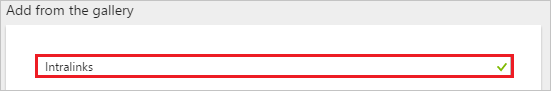
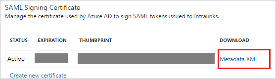
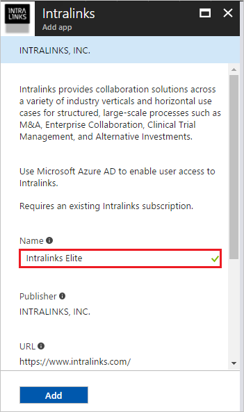
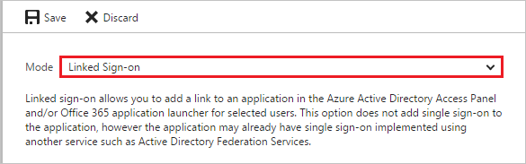
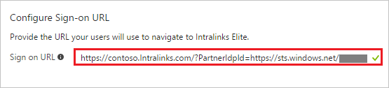

# Tutorial: Azure Active Directory integration with Intralinks

In this tutorial, you learn how to integrate Intralinks with Azure Active Directory (Azure AD).

Integrating Intralinks with Azure AD provides you with the following benefits:

- You can control in Azure AD who has access to Intralinks
- You can enable your users to automatically get signed-on to Intralinks (Single Sign-On) with their Azure AD accounts
- You can manage your accounts in one central location - the Azure portal

If you want to know more details about SaaS app integration with Azure AD, see [what is application access and single sign-on with Azure Active Directory](../manage-apps/what-is-single-sign-on.md).

## Prerequisites

To configure Azure AD integration with Intralinks, you need the following items:

- An Azure AD subscription
- An Intralinks single sign-on enabled subscription

> [!NOTE]
> To test the steps in this tutorial, we do not recommend using a production environment.

To test the steps in this tutorial, you should follow these recommendations:

- Do not use your production environment, unless it is necessary.
- If you don't have an Azure AD trial environment, you can get a one-month trial [here](https://azure.microsoft.com/pricing/free-trial/).

## Scenario description
In this tutorial, you test Azure AD single sign-on in a test environment. 
The scenario outlined in this tutorial consists of two main building blocks:

1. Adding Intralinks from the gallery
1. Configuring and testing Azure AD single sign-on

## Adding Intralinks from the gallery
To configure the integration of Intralinks into Azure AD, you need to add Intralinks from the gallery to your list of managed SaaS apps.

**To add Intralinks from the gallery, perform the following steps:**

1. In the **[Azure portal](https://portal.azure.com)**, on the left navigation panel, click **Azure Active Directory** icon. 

	![Active Directory][1]

1. Navigate to **Enterprise applications**. Then go to **All applications**.

	![Applications][2]
	
1. To add new application, click **New application** button on the top of dialog.

	![Applications][3]

1. In the search box, type **Intralinks**.

	

1. In the results panel, select **Intralinks**, and then click **Add** button to add the application.

	

##  Configuring and testing Azure AD single sign-on
In this section, you configure and test Azure AD single sign-on with Intralinks based on a test user called "Britta Simon".

For single sign-on to work, Azure AD needs to know what the counterpart user in Intralinks is to a user in Azure AD. In other words, a link relationship between an Azure AD user and the related user in Intralinks needs to be established.

In Intralinks, assign the value of the **user name** in Azure AD as the value of the **Username** to establish the link relationship.

To configure and test Azure AD single sign-on with Intralinks, you need to complete the following building blocks:

1. **[Configuring Azure AD Single Sign-On](#configuring-azure-ad-single-sign-on)** - to enable your users to use this feature.
1. **[Creating an Azure AD test user](#creating-an-azure-ad-test-user)** - to test Azure AD single sign-on with Britta Simon.
1. **[Creating an Intralinks test user](#creating-an-intralinks-test-user)** - to have a counterpart of Britta Simon in Intralinks that is linked to the Azure AD representation of user.
1. **[Assigning the Azure AD test user](#assigning-the-azure-ad-test-user)** - to enable Britta Simon to use Azure AD single sign-on.
1. **[Testing Single Sign-On](#testing-single-sign-on)** - to verify whether the configuration works.

### Configuring Azure AD single sign-on

In this section, you enable Azure AD single sign-on in the Azure portal and configure single sign-on in your Intralinks application.

**To configure Azure AD single sign-on with Intralinks, perform the following steps:**

1. In the Azure portal, on the **Intralinks** application integration page, click **Single sign-on**.

	![Configure Single Sign-On][4]

1. On the **Single sign-on** dialog, select **Mode** as	**SAML-based Sign-on** to enable single sign-on.
 
	

1. On the **Intralinks Domain and URLs** section, perform the following steps:

	

    In the **Sign-on URL** textbox, type a URL using the following pattern: 
	`https://<company name>.Intralinks.com/?PartnerIdpId=https://sts.windows.net/<AzureADTenantID>`

	> [!NOTE] 
	> This value is not real. Update this value with the actual Sign-On URL. Contact [Intralinks Client support team](https://www.intralinks.com/contact) to get this value. 
 
1. On the **SAML Signing Certificate** section, click **Metadata XML** and then save the metadata file on your computer.

	 

1. Click **Save** button.

	

1. To configure single sign-on on **Intralinks** side, you need to send the downloaded **Metadata XML** [Intralinks support team](https://www.intralinks.com/contact). They set this setting to have the SAML SSO connection set properly on both sides.

> [!TIP]
> You can now read a concise version of these instructions inside the [Azure portal](https://portal.azure.com), while you are setting up the app!  After adding this app from the **Active Directory > Enterprise Applications** section, simply click the **Single Sign-On** tab and access the embedded documentation through the **Configuration** section at the bottom. You can read more about the embedded documentation feature here: [Azure AD embedded documentation]( https://go.microsoft.com/fwlink/?linkid=845985)

### Creating an Azure AD test user
The objective of this section is to create a test user in the Azure portal called Britta Simon.

![Create Azure AD User][100]

**To create a test user in Azure AD, perform the following steps:**

1. In the **Azure portal**, on the left navigation pane, click **Azure Active Directory** icon.

	 

1. To display the list of users, go to **Users and groups** and click **All users**.
	
	 

1. To open the **User** dialog, click **Add** on the top of the dialog.
 
	 

1. On the **User** dialog page, perform the following steps:
 
	 

    a. In the **Name** textbox, type **BrittaSimon**.

    b. In the **User name** textbox, type the **email address** of BrittaSimon.

	c. Select **Show Password** and write down the value of the **Password**.

    d. Click **Create**.
 
### Creating an Intralinks test user

In this section, you create a user called Britta Simon in Intralinks. Please work with [Intralinks support team](https://www.intralinks.com/contact) to add the users in the Intralinks platform.

### Assigning the Azure AD test user

In this section, you enable Britta Simon to use Azure single sign-on by granting access to Intralinks.

![Assign User][200] 

**To assign Britta Simon to Intralinks, perform the following steps:**

1. In the Azure portal, open the applications view, and then navigate to the directory view and go to **Enterprise applications** then click **All applications**.

	![Assign User][201] 

1. In the applications list, select **Intralinks**.

	 

1. In the menu on the left, click **Users and groups**.

	![Assign User][202] 

1. Click **Add** button. Then select **Users and groups** on **Add Assignment** dialog.

	![Assign User][203]

1. On **Users and groups** dialog, select **Britta Simon** in the Users list.

1. Click **Select** button on **Users and groups** dialog.

1. Click **Assign** button on **Add Assignment** dialog.

### Add Intralinks VIA or Elite application

Intralinks uses the same SSO identity platform for all other Intralinks applications excluding Deal Nexus application. So if you plan to use any other Intralinks application then first you have to configure SSO for one Primary Intralinks application using the procedure described above.

After that you can follow the below procedure to add another Intralinks application in your tenant which can leverage this primary application for SSO. 

>[!NOTE]
>This feature is available only to Azure AD Premium SKU Customers and not available for Free or Basic SKU customers.

1. In the **[Azure portal](https://portal.azure.com)**, on the left navigation panel, click **Azure Active Directory** icon. 

	![Active Directory][1]

1. Navigate to **Enterprise applications**. Then go to **All applications**.

	![Applications][2]
	
1. To add new application, click **New application** button on the top of dialog.

	![Applications][3]

1. In the search box, type **Intralinks**.

	

1. On **Intralinks Add app** perform the following steps:

    

    a. In **Name** textbox, enter appropriate name of the application e.g. **Intralinks Elite**.

    b. Click **Add** button.

1.  In the Azure portal, on the **Intralinks** application integration page, click **Single sign-on**.

    ![Configure Single Sign-On][4]

1. On the **Single sign-on** dialog, select **Mode** as	**Linked Sign-on**.
 
	

1. Get the SP Initiated SSO URL from [Intralinks team](https://www.intralinks.com/contact) for the other Intralinks application and enter it in **Configure Sign-on URL** as shown below. 
    
     
    
     In the Sign On URL textbox, type the URL used by your users to sign-on to your Intralinks application using the following pattern:
   
    `https://<company name>.Intralinks.com/?PartnerIdpId=https://sts.windows.net/<AzureADTenantID>`

1. Click **Save** button.

	

1. Assign the application to user or groups as shown in the section **[Assigning the Azure AD test user](#assigning-the-azure-ad-test-user)**.

### Testing single sign-on

In this section, you test your Azure AD single sign-on configuration using the Access Panel.

When you click the Intralinks tile in the Access Panel, you should get automatically signed-on to your Intralinks application.
For more information about the Access Panel, see [Introduction to the Access Panel](../user-help/active-directory-saas-access-panel-introduction.md).

## Additional resources

* [List of Tutorials on How to Integrate SaaS Apps with Azure Active Directory](tutorial-list.md)
* [What is application access and single sign-on with Azure Active Directory?](../manage-apps/what-is-single-sign-on.md)

<!--Image references-->

[1]: ./media/intralinks-tutorial/tutorial_general_01.png
[2]: ./media/intralinks-tutorial/tutorial_general_02.png
[3]: ./media/intralinks-tutorial/tutorial_general_03.png
[4]: ./media/intralinks-tutorial/tutorial_general_04.png

[100]: ./media/intralinks-tutorial/tutorial_general_100.png

[200]: ./media/intralinks-tutorial/tutorial_general_200.png
[201]: ./media/intralinks-tutorial/tutorial_general_201.png
[202]: ./media/intralinks-tutorial/tutorial_general_202.png
[203]: ./media/intralinks-tutorial/tutorial_general_203.png

