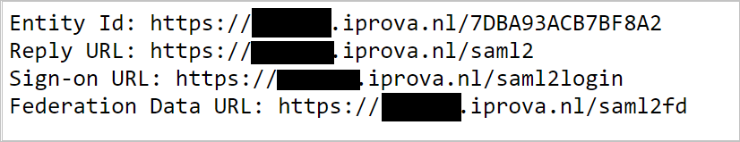
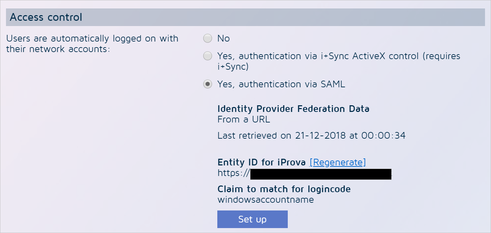

# Tutorial: Azure Active Directory single sign-on (SSO) integration with iProva

In this tutorial, you'll learn how to integrate iProva with Azure Active Directory (Azure AD). When you integrate iProva with Azure AD, you can:

* Control in Azure AD who has access to iProva.
* Enable your users to be automatically signed-in to iProva with their Azure AD accounts.
* Manage your accounts in one central location - the Azure portal.

To learn more about SaaS app integration with Azure AD, see [What is application access and single sign-on with Azure Active Directory](https://docs.microsoft.com/azure/active-directory/manage-apps/what-is-single-sign-on).

## Prerequisites

To get started, you need the following items:

* An Azure AD subscription. If you don't have a subscription, you can get a [free account](https://azure.microsoft.com/free/).
* iProva single sign-on (SSO) enabled subscription.

## Scenario description

In this tutorial, you configure and test Azure AD SSO in a test environment.

* iProva supports **SP** initiated SSO

* Once you configure iProva you can enforce session control, which protect exfiltration and infiltration of your organization’s sensitive data in real-time. Session control extend from Conditional Access. [Learn how to enforce session control with Microsoft Cloud App Security](https://docs.microsoft.com/cloud-app-security/proxy-deployment-any-app).

## Adding iProva from the gallery

To configure the integration of iProva into Azure AD, you need to add iProva from the gallery to your list of managed SaaS apps.

1. Sign in to the [Azure portal](https://portal.azure.com) using either a work or school account, or a personal Microsoft account.
1. On the left navigation pane, select the **Azure Active Directory** service.
1. Navigate to **Enterprise Applications** and then select **All Applications**.
1. To add new application, select **New application**.
1. In the **Add from the gallery** section, type **iProva** in the search box.
1. Select **iProva** from results panel and then add the app. Wait a few seconds while the app is added to your tenant.

## Configure and test Azure AD single sign-on for iProva

Configure and test Azure AD SSO with iProva using a test user called **B.Simon**. For SSO to work, you need to establish a link relationship between an Azure AD user and the related user in iProva.

To configure and test Azure AD SSO with iProva, complete the following building blocks:

1. **[Retrieve configuration information from iProva](#retrieve-configuration-information-from-iprova)** - as a preparation for the next steps.
1. **[Configure Azure AD SSO](#configure-azure-ad-sso)** - to enable your users to use this feature.
1. **[Create an Azure AD test user](#create-an-azure-ad-test-user)** - to test Azure AD single sign-on with B.Simon.
1. **[Assign the Azure AD test user](#assign-the-azure-ad-test-user)** - to enable B.Simon to use Azure AD single sign-on.
1. **[Create iProva test user](#create-iprova-test-user)** - to have a counterpart of B.Simon in iProva that is linked to the Azure AD representation of user.
1. **[Configure iProva SSO](#configure-iprova-sso)** - to configure the Single Sign-On settings on application side.
1. **[Test SSO](#test-sso)** - to verify whether the configuration works.

## Retrieve configuration information from iProva

In this section, you retrieve information from iProva to configure Azure AD single sign-on.

1. Open a web browser, and go to the **SAML2 info** page in iProva by using the following URL pattern:

    ```https
    https://SUBDOMAIN.iprova.nl/saml2info
    https://SUBDOMAIN.iprova.be/saml2info
    ```

	

1. Leave the browser tab open while you proceed with the next steps in another browser tab.

## Configure Azure AD SSO

Follow these steps to enable Azure AD SSO in the Azure portal.

1. In the [Azure portal](https://portal.azure.com/), on the **iProva** application integration page, find the **Manage** section and select **single sign-on**.
1. On the **Select a single sign-on method** page, select **SAML**.
1. On the **Set up single sign-on with SAML** page, click the edit/pen icon for **Basic SAML Configuration** to edit the settings.

   

1. On the **Basic SAML Configuration** section, perform the following steps:

	a. Fill the **Sign-on URL** box with the value that's displayed behind the label **Sign-on URL** on the **iProva SAML2 info** page. This page is still open in your other browser tab.

	b. Fill the **Identifier** box with the value that's displayed behind the label **EntityID** on the **iProva SAML2 info** page. This page is still open in your other browser tab.

	c. Fill the **Reply-URL** box with the value that's displayed behind the label **Reply URL** on the **iProva SAML2 info** page. This page is still open in your other browser tab.

1. iProva application expects the SAML assertions in a specific format, which requires you to add custom attribute mappings to your SAML token attributes configuration. The following screenshot shows the list of default attributes.

	

1. In addition to above, iProva application expects few more attributes to be passed back in SAML response which are shown below. These attributes are also pre populated but you can review them as per your requirements.

	| Name | Source Attribute| Namespace  |
	| ---------------| -------- | -----|
	| `samaccountname` | `user.onpremisessamaccountname`| `http://schemas.xmlsoap.org/ws/2005/05/identity/claims`|

1. On the **Set up single sign-on with SAML** page, In the **SAML Signing Certificate** section, click copy button to copy **App Federation Metadata Url** and save it on your computer.

	

## Create an Azure AD test user

In this section, you'll create a test user in the Azure portal called B.Simon.

1. From the left pane in the Azure portal, select **Azure Active Directory**, select **Users**, and then select **All users**.
1. Select **New user** at the top of the screen.
1. In the **User** properties, follow these steps:
   1. In the **Name** field, enter `B.Simon`.  
   1. In the **User name** field, enter the username@companydomain.extension. For example, `B.Simon@contoso.com`.
   1. Select the **Show password** check box, and then write down the value that's displayed in the **Password** box.
   1. Click **Create**.

## Assign the Azure AD test user

In this section, you'll enable B.Simon to use Azure single sign-on by granting access to iProva.

1. In the Azure portal, select **Enterprise Applications**, and then select **All applications**.
1. In the applications list, select **iProva**.
1. In the app's overview page, find the **Manage** section and select **Users and groups**.

   

1. Select **Add user**, then select **Users and groups** in the **Add Assignment** dialog.

	

1. In the **Users and groups** dialog, select **B.Simon** from the Users list, then click the **Select** button at the bottom of the screen.
1. If you're expecting any role value in the SAML assertion, in the **Select Role** dialog, select the appropriate role for the user from the list and then click the **Select** button at the bottom of the screen.
1. In the **Add Assignment** dialog, click the **Assign** button.

## Create iProva test user

1. Sign in to iProva by using the **Administrator** account.

2. Open the **Go to** menu.

3. Select **Application management**.

4. Select **Users** in the **Users and user groups** panel.

5. Select **Add**.

6. In the **Username** box, enter the username of user like `B.Simon@contoso.com`.

7. In the **Full name** box, enter a full name of user like **B.Simon**.

8. Select the **No password (use single sign-on)** option.

9. In the **E-mail address** box, enter the email address of user like `B.Simon@contoso.com`.

10. Scroll down to the end of the page, and select **Finish**.

## Configure iProva SSO

1. Sign in to iProva by using the **Administrator** account.

2. Open the **Go to** menu.

3. Select **Application management**.

4. Select **General** in the **System settings** panel.

5. Select **Edit**.

6. Scroll down to **Access control**.

	

7. Find the setting **Users are automatically logged on with their network accounts**, and change it to **Yes, authentication via SAML**. Additional options now appear.

8. Select **Set up**.

9. Select **Next**.

10. iProva asks if you want to download federation data from a URL or upload it from a file. Select the **From URL** option.

	

11. Paste the metadata URL you saved in the last step of the "Configure Azure AD single sign-on" section.

12. Select the arrow-shaped button to download the metadata from Azure AD.

13. When the download is complete, the confirmation message **Valid Federation Data file downloaded** appears.

14. Select **Next**.

15. Skip the **Test login** option for now, and select **Next**.

16. In the **Claim to use** drop-down box, select **windowsaccountname**.

17. Select **Finish**.

18. You now return to the **Edit general settings** screen. Scroll down to the bottom of the page, and select **OK** to save your configuration.

## Test SSO

In this section, you test your Azure AD single sign-on configuration using the Access Panel.

When you click the iProva tile in the Access Panel, you should be automatically signed in to the iProva for which you set up SSO. For more information about the Access Panel, see [Introduction to the Access Panel](https://docs.microsoft.com/azure/active-directory/active-directory-saas-access-panel-introduction).

## Additional resources

- [ List of Tutorials on How to Integrate SaaS Apps with Azure Active Directory ](https://docs.microsoft.com/azure/active-directory/active-directory-saas-tutorial-list)

- [What is application access and single sign-on with Azure Active Directory? ](https://docs.microsoft.com/azure/active-directory/manage-apps/what-is-single-sign-on)

- [What is conditional access in Azure Active Directory?](https://docs.microsoft.com/azure/active-directory/conditional-access/overview)

- [Try iProva with Azure AD](https://aad.portal.azure.com/)

- [What is session control in Microsoft Cloud App Security?](https://docs.microsoft.com/cloud-app-security/proxy-intro-aad)

- [How to protect iProva with advanced visibility and controls](https://docs.microsoft.com/cloud-app-security/proxy-intro-aad)