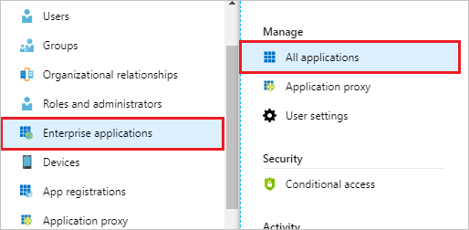
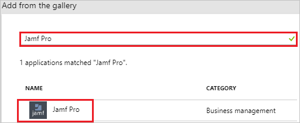
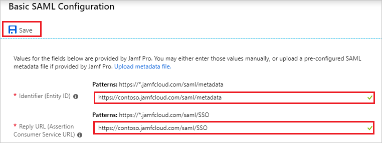
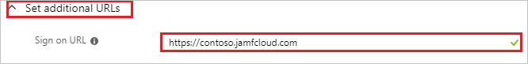
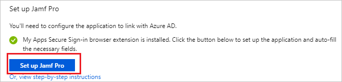
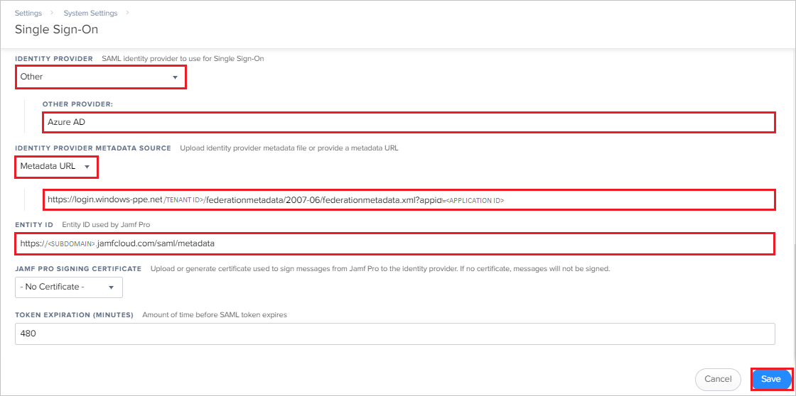
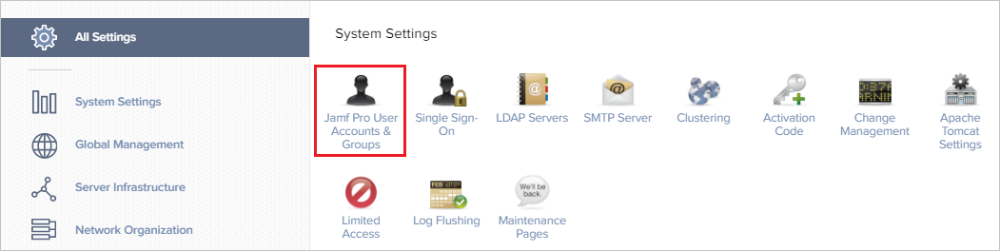
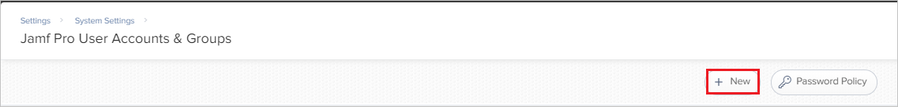
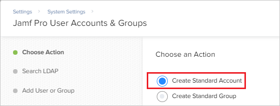
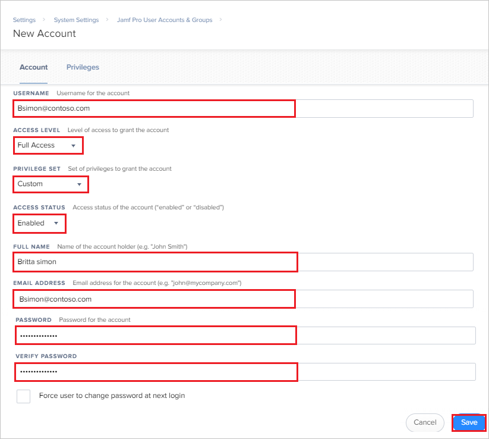

# Tutorial: Azure Active Directory integration with Jamf Pro

In this tutorial, you learn how to integrate Jamf Pro with Azure Active Directory (Azure AD).

Integrating Jamf Pro with Azure AD provides you with the following benefits:

- You can control in Azure AD who has access to Jamf Pro.
- You can enable your users to automatically get signed-on to Jamf Pro (Single Sign-On) with their Azure AD accounts.
- You can manage your accounts in one central location - the Azure portal.

If you want to know more details about SaaS app integration with Azure AD, see [what is application access and single sign-on with Azure Active Directory](../manage-apps/what-is-single-sign-on.md).

## Prerequisites

To configure Azure AD integration with Jamf Pro, you need the following items:

- An Azure AD subscription
- A Jamf Pro single sign-on enabled subscription

> [!NOTE]
> To test the steps in this tutorial, we do not recommend using a production environment.

To test the steps in this tutorial, you should follow these recommendations:

- Do not use your production environment, unless it is necessary.
- If you don't have an Azure AD trial environment, you can [get a one-month trial](https://azure.microsoft.com/pricing/free-trial/).

## Scenario description

In this tutorial, you test Azure AD single sign-on in a test environment.
The scenario outlined in this tutorial consists of two main building blocks:

1. Adding Jamf Pro from the gallery
2. Configuring and testing Azure AD single sign-on

## Adding Jamf Pro from the gallery

To configure the integration of Jamf Pro into Azure AD, you need to add Jamf Pro from the gallery to your list of managed SaaS apps.

**To add Jamf Pro from the gallery, perform the following steps:**

1. In the **[Azure portal](https://portal.azure.com)**, on the left navigation panel, click **Azure Active Directory** icon. 

	

2. Navigate to **Enterprise applications**. Then go to **All applications**.

	
	
3. To add new application, click **New application** button on the top of dialog.

	

4. In the search box, type **Jamf Pro**, select **Jamf Pro** from result panel then click **Add** button to add the application.

	 

## Configure and test Azure AD single sign-on

In this section, you configure and test Azure AD single sign-on with Jamf Pro based on a test user called "Britta Simon".

For single sign-on to work, Azure AD needs to know what the counterpart user in Jamf Pro is to a user in Azure AD. In other words, a link relationship between an Azure AD user and the related user in Jamf Pro needs to be established.

To configure and test Azure AD single sign-on with Jamf Pro, you need to complete the following building blocks:

1. **[Configure Azure AD Single Sign-On](#configure-azure-ad-single-sign-on)** - to enable your users to use this feature.
2. **[Create an Azure AD test user](#create-an-azure-ad-test-user)** - to test Azure AD single sign-on with Britta Simon.
3. **[Create a Jamf Pro test user](#create-a-jamf-pro-test-user)** - to have a counterpart of Britta Simon in Jamf Pro that is linked to the Azure AD representation of user.
4. **[Assign the Azure AD test user](#assign-the-azure-ad-test-user)** - to enable Britta Simon to use Azure AD single sign-on.
5. **[Test single sign-on](#test-single-sign-on)** - to verify whether the configuration works.

### Configure Azure AD single sign-on

In this section, you enable Azure AD single sign-on in the Azure portal and configure single sign-on in your Jamf Pro application.

**To configure Azure AD single sign-on with Jamf Pro, perform the following steps:**

1. In the [Azure portal](https://portal.azure.com/), on the **Jamf Pro** application integration page, select **Single sign-on**.

    

2. Click **Change Single sign-on mode** on top of the screen to select the **SAML** mode.

	  

3. On the **Select a Single sign-on method** dialog, Click **Select** for **SAML** mode to enable single sign-on.

    

4. On the **Set up Single Sign-On with SAML** page, click **Edit** button to open **Basic SAML Configuration** dialog.

	

5. On the **Basic SAML Configuration** section, perform the following steps:

    a. In the **Identifier** text box, type a URL using the following pattern:
    `https://<subdomain>.jamfcloud.com/saml/metadata`.

    b. In the **Reply URL** text box, type a URL using the following pattern:
    `https://<subdomain>.jamfcloud.com/saml/SSO`.

    

    c. Click **set additional URLs**.

    d. In the **Sign-on URL** text box, type a URL using the following pattern:
    `https://<subdomain>.jamfcloud.com`.

    

	> [!NOTE]
	> These values are not real. Update these values with the actual Identifier, Reply URL, and Sign-On URL. You will get the actual Identifier value from **Single Sign-On** section in Jamf Pro portal, which is explained later in the tutorial. You can extract the actual **subdomain** value from the identifier value and use that **subdomain** information in Sign-on URL and Reply URL.

6. On the **Set up Single Sign-On with SAML** page, In the **SAML Signing Certificate** section, click copy button to copy **App Federation Metadata Url** and save it on your computer.

    

7. To automate the configuration within Jamf Pro, you need to install **My Apps Secure Sign-in browser extension** by clicking **Install the extension**.

	
 
8. After adding extension to the browser, click on **setup Jamf Pro** will direct you to the Jamf Pro application. From there, provide the admin credentials to sign into Jamf Pro. The browser extension will automatically configure the application for you and automate steps 9-12.

	

9. If you want to setup Jamf Pro manually, open a new web browser window and log into your Jamf Pro company site as an administrator and perform the following steps:

10. Click on the **Settings icon** from the top right corner of the page.

	

11. Click on **Single Sign On**.

	

12. On the **Single Sign-On** page perform the following steps:

	

	a. Select **Jamf Pro Server** to enable Single Sign-On access.

	b. By selecting **Allow bypass for all users** users will not be redirected to the Identity Provider login page for authentication, but can log in to Jamf Pro directly instead. When a user tries to access Jamf Pro via the Identity Provider, IdP-initiated SSO authentication and authorization occurs.

	c. Select the **NameID** option for **USER MAPPING: SAML**. By default, this setting is set to **NameID** but you may define a custom attribute.

	d. Select **Email** for **USER MAPPING: JAMF PRO**. Jamf Pro maps SAML attributes sent by the IdP in the following ways: by users and by groups. When a user tries to access Jamf Pro, by default Jamf Pro gets information about the user from the Identity Provider and matches it against Jamf Pro user accounts. If the incoming user account does not exist in Jamf Pro, then group name matching occurs.

	e. Paste the value `http://schemas.microsoft.com/ws/2008/06/identity/claims/groups` in the **GROUP ATTRIBUTE NAME** textbox.

13. On the same page scroll down upto **IDENTITY PROVIDER** under the **Single Sign-On** section and perform the following steps:

	

	a. Select **Other** as a option from the **IDENTITY PROVIDER** dropdown.

	b. In the **OTHER PROVIDER** textbox, enter **Azure AD**.

	c. Select **Metadata URL** as a option from the **IDENTITY PROVIDER METADATA SOURCE** dropdown and in the following textbox, paste the **App Federation Metadata Url** value which you have copied from the Azure portal.

	d. Copy the **Entity ID** value and paste it into the **Identifier (Entity ID)** textbox in **Jamf Pro Domain and URLs** section on Azure portal.

	>[!NOTE]
	> Here blurred value is the subdomain part .Use this value to complete the Sign-on URL and Reply URL in the **Jamf Pro Domain and URLs** section on Azure portal.

	e. Click **Save**.

### Create an Azure AD test user 

The objective of this section is to create a test user in the Azure portal called Britta Simon.

1. In the Azure portal, in the left pane, select **Azure Active Directory**, select **Users**, and then select **All users**.

    

2. Select **New user** at the top of the screen.

    

3. In the User properties, perform the following steps.

    

    a. In the **Name** field enter **BrittaSimon**.
  
    b. In the **User name** field type **brittasimon@yourcompanydomain.extension**  
    For example, BrittaSimon@contoso.com

    c. Select **Properties**, select the **Show password** check box, and then write down the value that's displayed in the Password box.

    d. Select **Create**.

### Create a Jamf Pro test user

To enable Azure AD users to log in to Jamf Pro, they must be provisioned into Jamf Pro. In the case of Jamf Pro, provisioning is a manual task.

**To provision a user account, perform the following steps:**

1. Log in to your Jamf Pro company site as an administrator.

2. Click on the **Settings icon** from the top right corner of the page.

	

3. Click on **Jamf Pro User Accounts & Groups**.

	

4. Click **New**.

	

5. Select **Create Standard Account**.

	

6. On the **New Account** dailog, perform the following steps:

	

	a. In the **USERNAME** textbox, type the full name of BrittaSimon.

	b. Select appropriate options as per your organization for **ACCESS LEVEL**, **PRIVILEGE SET**, and for **ACCESS STATUS**.

	c. In the **FULL NAME** textbox, type the full name of Britta Simon.

	d. In the **EMAIL ADDRESS** textbox, type the email address of Britta Simon account.

	e. In the **PASSWORD** textbox, type the password of the user.

	f. In the **VERIFY PASSWORD** textbox, type the password of the user.

	g. Click **Save**.

### Assign the Azure AD test user

In this section, you enable Britta Simon to use Azure single sign-on by granting access to Jamf Pro.

1. In the Azure portal, select **Enterprise Applications**, select **All applications**, then select **Jamf Pro**.

	

2. In the applications list, select **Jamf Pro**.

	

3. In the menu on the left, select **Users and groups**.

    

4. Select the **Add** button, then select **Users and groups** in the **Add Assignment** dialog.

    

4. In the **Users and groups** dialog select **Britta Simon** in the Users list, then click the **Select** button at the bottom of the screen.

5. In the **Add Assignment** dialog select the **Assign** button.

### Test single sign-on

In this section, you test your Azure AD single sign-on configuration using the Access Panel.

When you click the Jamf Pro tile in the Access Panel, you should get automatically signed-on to your Jamf Pro application.
For more information about the Access Panel, see [Introduction to the Access Panel](../user-help/active-directory-saas-access-panel-introduction.md).

## Additional resources

* [List of Tutorials on How to Integrate SaaS Apps with Azure Active Directory](tutorial-list.md)
* [What is application access and single sign-on with Azure Active Directory?](../manage-apps/what-is-single-sign-on.md)
