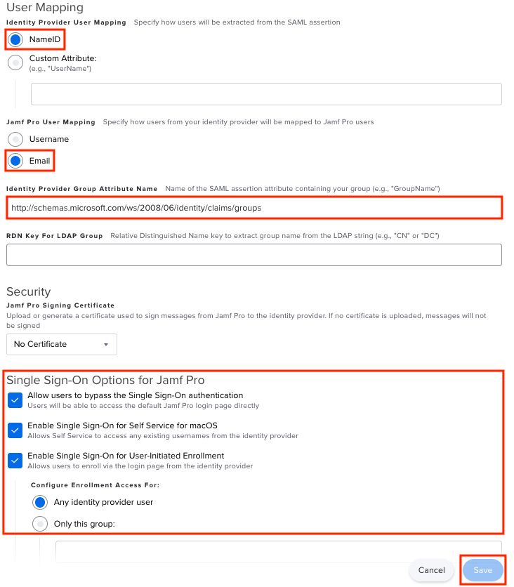

# Tutorial: Azure Active Directory SSO integration with Jamf Pro

In this tutorial, you'll learn how to integrate Jamf Pro with Azure Active Directory (Azure AD). When you integrate Jamf Pro with Azure AD, you can:

* Use Azure AD to control who has access to Jamf Pro.
* Automatically sign in your users to Jamf Pro with their Azure AD accounts.
* Manage your accounts in one central location: the Azure portal.

To learn more about SaaS app integration with Azure AD, see [Single sign-on with Azure Active Directory](https://docs.microsoft.com/azure/active-directory/manage-apps/what-is-single-sign-on).

## Prerequisites

To get started, you need the following items:

* An Azure AD subscription. If you don't have a subscription, you can get a [free account](https://azure.microsoft.com/free/).
* A Jamf Pro subscription that's single sign-on (SSO) enabled.

## Scenario description

In this tutorial, you configure and test Azure AD SSO in a test environment. 

* Jamf Pro supports **SP-initiated** and **IdP-initiated** SSO.
* Once you configure Jamf Pro you can enforce Session Control, which protect exfiltration and infiltration of your organization’s sensitive data in real-time. Session Control extend from Conditional Access. [Learn how to enforce session control with Microsoft Cloud App Security](https://docs.microsoft.com/cloud-app-security/proxy-deployment-aad)

## Add Jamf Pro from the gallery

To configure the integration of Jamf Pro into Azure AD, you need to add Jamf Pro from the gallery to your list of managed SaaS apps.

1. Sign in to the [Azure portal](https://portal.azure.com) by using either a work or school account or your personal Microsoft account.
1. In the left pane, select the **Azure Active Directory** service.
1. Go to **Enterprise Applications**, and then select **All Applications**.
1. To add a new application, select **New application**.
1. In the **Add from the gallery** section, enter *Jamf Pro* in the search box.
1. Select **Jamf Pro** from results panel, and then add the app. Wait a few seconds while the app is added to your tenant.

## Configure and test SSO in Azure AD for Jamf Pro

Configure and test Azure AD SSO with Jamf Pro by using a test user called B.Simon. For SSO to work, you need to establish a link relationship between an Azure AD user and the related user in Jamf Pro.

In this section, you configure and test Azure AD SSO with Jamf Pro.

1. [Configure SSO in Azure AD](#configure-sso-in-azure-ad) so that your users can use this feature.
    1. [Create an Azure AD test user](#create-an-azure-ad-test-user) to test Azure AD SSO with the B.Simon account.
    1. [Assign the Azure AD test user](#assign-the-azure-ad-test-user) so that B.Simon can use SSO in Azure AD.
1. [Configure SSO in Jamf Pro](#configure-sso-in-jamf-pro) to configure the SSO settings on the application side.
    1. [Create a Jamf Pro test user](#create-a-jamf-pro-test-user) to have a counterpart of B.Simon in Jamf Pro that's linked to the Azure AD representation of the user.
1. [Test the SSO configuration](#test-the-sso-configuration) to verify that the configuration works.

## Configure SSO in Azure AD

In this section, you enable Azure AD SSO in the Azure portal.

1. In the [Azure portal](https://portal.azure.com/), on the **Jamf Pro** application integration page, find the **Manage** section and select **Single Sign-On**.
1. On the **Select a Single Sign-On Method** page, select **SAML**.
1. On the **Set up Single Sign-On with SAML** page, select the pen icon for **Basic SAML Configuration** to edit the settings.

   

1. On the **Basic SAML Configuration** section, if you want to configure the application in **IdP-initiated** mode, enter the values for the following fields:

    a. In the **Identifier** text box, enter a URL that uses the following formula:
    `https://<subdomain>.jamfcloud.com/saml/metadata`

    b. In the **Reply URL** text box, enter a URL that uses the following formula:
    `https://<subdomain>.jamfcloud.com/saml/SSO`

1. Select **Set additional URLs**. If you want to configure the application in **SP-initiated** mode, in the **Sign-on URL** text box, enter a URL that uses the following formula:
    `https://<subdomain>.jamfcloud.com`

	> [!NOTE]
	> These values aren't real. Update these values with the actual identifier, reply URL, and sign-on URL. You'll get the actual identifier value from the **Single Sign-On** section in Jamf Pro portal, which is explained later in the tutorial. You can extract the actual subdomain value from the identifier value and use that subdomain information as your sign-on URL and reply URL. You can also refer to the formulas shown in the **Basic SAML Configuration** section in the Azure portal.

1. On the **Set up Single Sign-On with SAML** page, go to the **SAML Signing Certificate** section, select the **copy** button to copy **App Federation Metadata URL**, and then save it to your computer.

	

### Create an Azure AD test user

In this section, you create a test user in the Azure portal called B.Simon.

1. In the left pane in the Azure portal, select **Azure Active Directory**, select **Users**, and then select **All users**.
1. Select **New user** at the top of the screen.
1. In the **User** properties, follow these steps:
   1. In the **Name** field, enter `B.Simon`.
   1. In the **User name** field, enter [name]@[companydomain].[extension]. For example, `B.Simon@contoso.com`.
   1. Select the **Show password** check box, and then write down the value that's displayed in the **Password** box.
   1. Select **Create**.

### Assign the Azure AD test user

In this section, you grant B.Simon access to Jamf Pro.

1. In the Azure portal, select **Enterprise Applications**, and then select **All applications**.
1. In the applications list, select **Jamf Pro**.
1. In the app's overview page, find the **Manage** section and select **Users and groups**.

   

1. Select **Add user**, then select **Users and groups** in the **Add Assignment** dialog box.

	

1. In the **Users and groups** dialog box, select **B.Simon** from the Users list, and then select the **Select** button at the bottom of the screen.
1. If you're expecting any role value in the SAML assertion, in the **Select Role** dialog box, select the appropriate role for the user. Then, select the **Select** button at the bottom of the screen.
1. In the **Add Assignment** dialog box, select the **Assign** button.

## Configure SSO in Jamf Pro

1. To automate the configuration within Jamf Pro, install the **My Apps Secure Sign-in browser extension** by selecting **Install the extension**.

	

2. After adding the extension to the browser, select **Set up Jamf Pro**. When the Jamf Pro application opens, provide the administrator credentials to sign in. The browser extension will automatically configure the application and automate steps 3 through 7.

	

3. To set up Jamf Pro manually, open a new web browser window and sign in to your Jamf Pro company site as an administrator. Then, take the following steps.

4. Select the **Settings icon** from the upper-right corner of the page.

	

5. Select **Single Sign-On**.

	

6. On the **Single Sign-On** page, take the following steps.

	

	a. Select **Edit**.

	b. Select the **Enable Single Sign-On Authentication** check box.

  c. Select **Azure** as an option from the **Identity Provider** drop-down menu.

  d. Copy the **ENTITY ID** value and paste it into the **Identifier (Entity ID)** field in the **Basic SAML Configuration** section in the Azure portal.

> [!NOTE]
> Use the value in the `<SUBDOMAIN>` field to complete the sign-on URL and reply URL in the **Basic SAML Configuration** section in the Azure portal.

  e. Select **Metadata URL** from the **Identity Provider Metadata Source** drop-down menu. In the field that appears, paste the **App Federation Metadata Url** value that you've copied from the Azure portal.

  f. (Optional) Edit the token expiration value or select "Disable SAML token expiration".

7. On the same page, scroll down to the **User Mapping** section. Then, take the following steps.

	

	a. Select the **NameID** option for **Identity Provider User Mapping**. By default, this option is set to **NameID**, but you can define a custom attribute.

	b. Select **Email** for **Jamf Pro User Mapping**. Jamf Pro maps SAML attributes sent by the IdP first by users and then by groups. When a user tries to access Jamf Pro, Jamf Pro gets information about the user from the Identity Provider and matches it against all Jamf Pro user accounts. If the incoming user account isn't found, then Jamf Pro attempts to match it by group name.

	c. Paste the value `http://schemas.microsoft.com/ws/2008/06/identity/claims/groups` in the **IDENTITY PROVIDER GROUP ATTRIBUTE NAME** field.

	d. On the same page, scroll down to the **Security** section and select **Allow users to bypass the Single Sign-On authentication**. As a result, users won't be redirected to the Identity Provider sign-in page for authentication and can sign in to Jamf Pro directly instead. When a user tries to access Jamf Pro via the Identity Provider, IdP-initiated SSO authentication and authorization occurs.

	e. Select **Save**.

### Create a Jamf Pro test user

In order for Azure AD users to sign in to Jamf Pro, they must be provisioned in to Jamf Pro. Provisioning in Jamf Pro is a manual task.

To provision a user account, take the following steps:

1. Sign in to your Jamf Pro company site as an administrator.

2. Select the **Settings** icon in the upper-right corner of the page.

	

3. Select **Jamf Pro User Accounts & Groups**.

	

4. Select **New**.

	

5. Select **Create Standard Account**.

	

6. On the **New Account** dialog box, perform the following steps:

	

	a. In the **USERNAME** field, enter `Britta Simon`, the full name of the test user.

	b. Select the options for **ACCESS LEVEL**, **PRIVILEGE SET**, and **ACCESS STATUS** that are in accordance with your organization.

	c. In the **FULL NAME** field, enter `Britta Simon`.

	d. In the **EMAIL ADDRESS** field, enter the email address of Britta Simon's account.

	e. In the **PASSWORD** field, enter the user's password.

	f. In the **VERIFY PASSWORD** field, enter the user's password again.

	g. Select **Save**.

## Test the SSO configuration

In this section, you test your Azure AD single sign-on configuration by using the Access Panel.

When you select the Jamf Pro tile in the Access Panel, you should be automatically signed in to the Jamf Pro account for which you configured SSO. For more information about the Access Panel, see [Introduction to the Access Panel](https://docs.microsoft.com/azure/active-directory/active-directory-saas-access-panel-introduction).

## Additional resources

- [Tutorials for integrating SaaS applications with Azure Active Directory ](https://docs.microsoft.com/azure/active-directory/active-directory-saas-tutorial-list)

- [Single sign-on to applications in Azure Active Directory](https://docs.microsoft.com/azure/active-directory/manage-apps/what-is-single-sign-on)

- [What is Conditional Access in Azure Active Directory?](https://docs.microsoft.com/azure/active-directory/conditional-access/overview)
- [What is session control in Microsoft Cloud App Security?](https://docs.microsoft.com/cloud-app-security/proxy-intro-aad)
- [Try Jamf Pro with Azure AD](https://aad.portal.azure.com/)